<!--
author:   Anuradha Mathur; Vandita Shukla; Vineeta Rajpal; Yashu Chhabra

email:    LiaScript@web.de

version:  0.0.1

language: en

narrator: US English Female

comment:  This physics text was created using CK-12 resources to be seed content for a complete Physics Class 11 course for CBSE students.

logo:     ../cover.jpg

tags:      physics, science

-->

# CK-12 CBSE Physics Class 11

> This document was automatically translated to LiaScript from
>
> https://www.ck12.org/book/cbse_physics_book_class_xi/

## 1.0 Physical World

<article>

</article>

### 1.1 What is Physics?

<article>

### Definition of Physics

What is **physics**? Physics is the branch of science that studies the physical world, including objects as small as subatomic particles and as large as galaxies. It studies the nature of matter and energy and how they interact. Physicists are inquisitive people who want to know the causes of what they see. How does the moon move? Why does the moon move? Why do the stars shine? Why do your hands get warm when you rub them together? Physicists, like all scientists, hope to find explanations that describe more than one phenomenon and offer a better understanding of how the universe works.

#### Common Misconceptions

People commonly believe that physics is all about solving word problems and memorizing equations. While it is true that many physics classes focus on the equations, it is important to remember that the purpose of physics is less about the problems and more about using equations, laws, and theories to understand the world we live in.

#### Summary

* Physics is the branch of science that studies matter and energy and how they interact.

### Real World Example - What Causes Friction?

---

#### How It Works

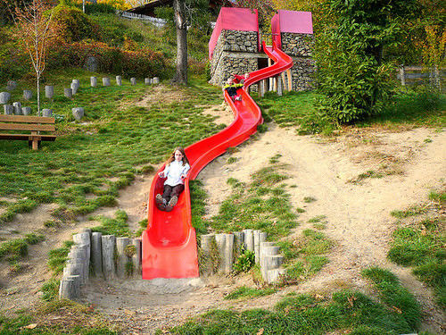

Even today, friction is actually a bit of a mystery! When two rough surfaces are rubbed against each other, the friction between the two surfaces can be experienced as heat.  We also know that there is a similar process between two smooth surfaces caused by the surface molecules attracting each other.  Even soft or squishy surfaces generate friction, as the surfaces bend around each other in tiny curves and get in the way of each other.

When surfaces resist sliding past each other, they move more slowly than they would otherwise.  Energy is equal to mass times velocity, and when the velocity (the speed of the surfaces sliding past each other) is reduced without changing the mass of the objects, some energy must be released to keep the balance. The released energy is what we feel as heat!

</article>

### 1.2 Scope and Excitement of Physics

<article>

### The Scope of Physics

**Physics** is the study of energy, matter, and their interactions. It’s a very broad field because it is concerned with matter and energy at all levels—from the most fundamental particles of matter to the entire universe. Some people would even argue that physics is the study of everything! Important concepts in physics include motion, forces such as magnetism and gravity, and forms of energy such as light, sound, and electrical energy.

**Q:** How do you think physics explains the distorted images formed by a funhouse mirror?

**A:** Physics explains how energy interacts with matter. In this case, for example, physics explains how visible light reflects from mirrors to form images. Most mirrors, such as bathroom mirrors, have a flat surface. Light reflected from a flat mirror forms an image that looks the same as the object in front of it. Funhouse mirrors, like the one pictured above, are different. They have a curved surface that reflects light at different angles. This explains why the images they form are distorted.

#### Physics in the World Around You

Physics can help you understand just about everything in the world around you. That’s because everything around you consists of matter and energy. Several examples of matter and energy interacting are pictured in the **Figure** [below](#x-ck12-UFMtMDEtMDEtMTAtMDItQ29tcG9zaXRl). Read how physics explains each example.

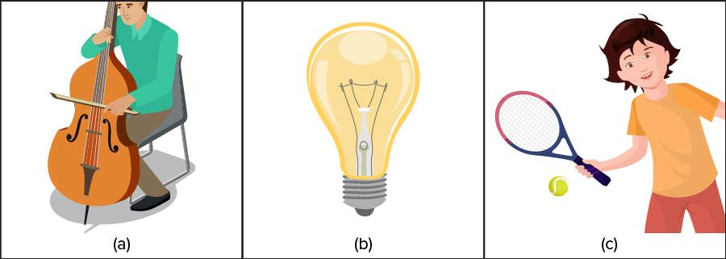

**Q:** Based on the examples in **Figure** [above](#x-ck12-UFMtMDEtMDEtMTAtMDItQ29tcG9zaXRl), what might be other examples of energy and matter interacting?

**A:** Like the strings of cello, anything that vibrates produces waves of energy that travel through matter. For example, when you throw a pebble into a pond, waves of energy travel from the pebble through the water in all directions. Like an incandescent light bulb, anything that glows consists of matter that produces light energy. For example, fireflies use chemicals to produce light energy. Like a moving tennis racket, anything that moves has energy because it is moving, including your eyes as they read this sentence.

#### Summary

* Physics is the study of energy, matter, and their interactions. It is concerned with matter and energy at all levels—from the most fundamental particles of matter to the entire universe.
* Physics can help you understand just about everything in the world around you. That’s because everything around you is matter and has energy.

#### Explore More

Watch the video at this URL, and answer the questions at the end.

!?[0](https://www.youtube.com/watch?v=VCVTK5yzo0g)

Watch the video at: http://www.youtube.com/watch?v=VCVTK5yzo0g

#### Review

1. Outline the scope of physics.

2. Describe three examples of interacting matter and energy in the world around you.

</article>

### 1.3 Physics, Technology and Society

<article>

### How Technology Affects Society

Important new technologies such as the wheel have had a big impact on human society. Major advances in technology have influenced every aspect of life, including transportation, food production, manufacturing, communication, medicine, and the arts. That’s because technology has the goal of solving human problems, so new technologies usually make life better. They may make work easier, for example, or make people healthier. Sometimes, however, new technologies affect people in negative ways. For example, using a new product or process might cause human health problems or pollute the environment.

**Q:** Can you think of a modern technology that has both positive and negative effects on people?

**A:** Modern methods of transportation have both positive and negative effects on people. They help people and goods move quickly all over the world. However, most of them pollute the environment. For example, petrol-powered cars and trucks add many pollutants to the atmosphere. The pollutants harm people’s health and contribute to global climate change.

#### Industrial Revolution

Few technologies have impacted society as greatly as the powerful steam engine developed by Scottish inventor James Watt in 1775 (see **Figure** [below](#x-ck12-Qy1NUy1QUy0wMS0xNi0wMS1Nb2RlbC1zdGVhbS1lbmdpbmU.)). Watt’s steam engine was soon being used to power all kinds of machines. It started a revolution in industry. For the first time in history, people did not have to rely on human or animal muscle, wind, or water for power. With the steam engine to power machines, new factories sprang up all over Britain.

---

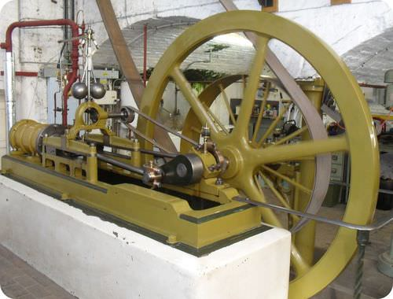

The Industrial Revolution began in Britain the late 1700s. It eventually spread throughout Western Europe, North America, Japan, and many other countries. It marked a major turning point in human history. Almost every aspect of daily life was influenced by it in some way. Average income and population both began to grow faster than ever before. People flocked to the new factories for jobs, and densely populated towns and cities grew up around the factories. The new towns and cities were crowded, and soot from the factories polluted the air. You can see an example of this in the **Figure** [below](#x-ck12-Qy1NUy1QUy0wMS0xNi0wMi1Db3R0b25vcG9saXM.). This made living conditions very poor. Working conditions in the factories were also bad, with long hours and the pace set by machines. Even young children worked in the factories, damaging their health and giving them little opportunity for education or play.

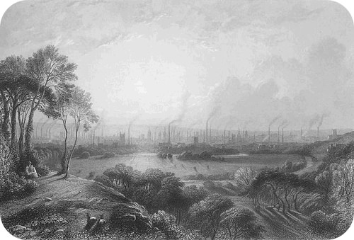

**Q:** In addition to factory machines, the steam engine was used to power farm machinery, trains, and ships. What effects might this have had on people’s lives?

---

**A:** Farm machinery replaced human labor and allowed fewer people to produce more food. This is why many rural people migrated to the new towns and cities to look for work in factories. Steam-powered trains and ships made it easier for people to migrate. Food and factory goods could also be transported on steam-powered trains and ships, making them available to far more people.

#### Summary

* Major advances in technology have influenced every aspect of human society, usually in good ways but sometimes in bad ways as well.
* Almost every aspect of people’s lives was influenced by the Industrial Revolution that followed James Watt’s invention of a powerful steam engine in 1775.

#### Explore More

Over the past several decades, computer technology has revolutionized human society. Watch this video interview about ways computers have changed people’s lives. Then answer the questions below.

!?[0](https://www.youtube.com/watch?v=_T-0iEbsxmQ)

Watch the video at: http://www.youtube.com/watch?v=_T-0iEbsxmQ

1. According to Professor Foster, what are some ways that computer technology has influenced human society?

2. Can you imagine a world without computers? How might your life be different if computers didn’t exist?

#### Review

1. In general, how do major advances in technology usually affect society?

2. What was the Industrial Revolution?

3. What are some ways the Industrial Revolution changed people’s lives?

</article>

### 1.4 Fundamental Forces in Nature

<article>

### Four fundamental forces

#### Strong Nuclear

Watch these videos explaining **Strong Nuclear Force**

!?[0](https://www.youtube.com/watch?v=Yv3EMq2Dgq8)

Watch the video at: https://www.youtube.com/watch?v=Yv3EMq2Dgq8

!?[0](https://www.youtube.com/watch?v=BNDOSMqGLlg)

Watch the video at: https://www.youtube.com/watch?v=BNDOSMqGLlg

#### Weak Nuclear

Watch this video explaining **Weak Nuclear Forces**

!?[0](https://www.youtube.com/watch?v=cnL_nwmCLpY)

Watch the video at: https://www.youtube.com/watch?v=cnL_nwmCLpY

---

#### Gravitation

Watch this video explaining **Gravitation**.

!?[0](https://www.youtube.com/watch?v=yhG_ArxmwRM)

Watch the video at: https://www.youtube.com/watch?v=yhG_ArxmwRM

#### Electromagnetism

Watch these video explaining **Electromagnetism**.

!?[0](https://www.youtube.com/watch?v=GMnsZuEE_m8)

Watch the video at: https://www.youtube.com/watch?v=GMnsZuEE_m8

!?[0](https://www.youtube.com/watch?v=cy6kba3A8vY)

Watch the video at: https://www.youtube.com/watch?v=cy6kba3A8vY

</article>

### 1.5 Self Assessments

<article>

#### Assessment 1

##### What is Physics?

http://www.ck12.org/physics/Definition-of-Physics/quiz/Definition-of-Physics-Quiz/?referrer=concept_details

#### Assessment 2

##### Scope of Physics

http://www.ck12.org/physical-science/Scope-of-Physics-in-Physical-Science/quiz/Scope-of-Physics-Quiz-MS-PS/?referrer=concept_details

#### Assessment 3

##### Physics, Technology and Society

http://www.ck12.org/physical-science/Technology-and-Society-in-Physical-Science/quiz/Technology-and-Society-Quiz-MS-PS/?referrer=concept_details

</article>

### 1.6 Home Assignments

<article>

#### Assignment 1

##### Physics, Technology and Society

NCERT QUESTION NO. 1.11, 1.12

</article>

## 2.0 Units and Measurements

<article>

</article>

### 2.1 The International System of Units

<article>

\[Figure 1\]

Measurements are a basic necessity in science. Scientists have designed thousands of different tools to help in the vital process of measuring. In this image of the control panel of the space shuttle Atlantis, we see dozens of readouts from measuring systems.

### Measurement

We already know that observations are an important part of the scientific method. Hypotheses are accepted or rejected based on how well they explain observations. Some observations, such as “the plant turned brown” are **qualitative**; these observations have no associated numbers. A **quantitative** observation includes numbers, and is also called a **measurement.** A measurement is obtained by comparing an object to some standard. Any observation is useful to a scientist, but quantitative observations are commonly considered more useful. Even if the measurement is an estimate, scientists usually make quantitative measurements in every experiment.

Consider the following pair of observations.

1. When the volume of a gas is decreased, its pressure is increased.

2. When the volume of a gas is reduced from 2.0 liters to 1.0 liter, the pressure increases from 3.0 atm to 6.0 atm.

A great deal more information, and more useful information, is available in the second observation.

Since accurate measurement is a vital tool for doing science, a consistent set of units for measurement is necessary. Physicists throughout the world use the **International System of Units** (also called the SI system). The SI system is basically the metric system, which is convenient because units of different size are related by powers of 10. The system has physical standards for length, mass, and time. These are called **fundamental** units because they have an actual physical standard.

The standard SI unit for length is the **meter**, and is denoted by “m”. Originally, the meter was defined as the length between two scratches on a piece of metal which was stored in a secure vault under controlled conditions. The meter's definition has changed over time, but it is now accepted to be the distance light travels in a vacuum over 1/299792458 of a second.

The standard unit of time, the **second**, was once defined as a fraction of the time it takes the earth to complete an orbit around the sun, but has now been redefined in terms of the frequency of one type of radiation emitted by a cesium-133 atom. Seconds are denoted by “s” or, less commonly, “sec.”

The standard unit for mass is the **kilogram**. The kilogram's standard is a block of platinum-iridium metal kept near Paris, France. Other countries, of course, keep copies. A kilogram is denoted “kg” and is a multiple of the smaller unit of mass, the gram (“g”).

Meters, seconds, and kilograms are not the only unit entities. Take, for example, speed. Speed is a **derived** unit, measured in meters per second (m/s). Derived units are units that are expressed using combinations of the fundamental units.

#### Summary

* Measurements (quantitative observations) are often more useful than qualitative observations.
* The system of units for measurements in physics is the SI system.
* The fundamental quantities in the SI system are length, mass, and time.
* The SI unit for length is the meter, for time is the second, and for mass is the kilogram.

### Real World Example - Devil is in the details

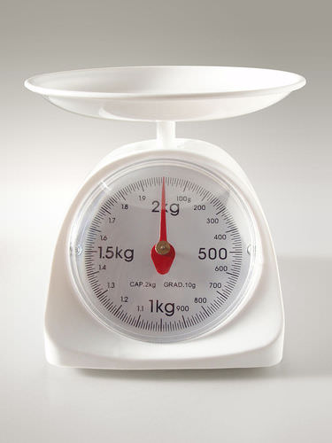

#### Why It Matters

* In response to the question above, this is due to the fact that the kilogram helps define many of the SI units in the SI system. From a Newton (the measure of force) to amperes (the measure of current), a precise standard must be used otherwise any uncertainty in measurement and in application would be unknown.
* Currently, the kilogram is the only SI unit that is still defined by an actual physical object. Recent propositions are being considered to redefine the kilogram in terms of the Planch constant, $h$.
* You can read more about the importance of the SI system and the kilogram unit of measurement with the links below:
    * International System of Units: http://en.wikipedia.org/wiki/International_System_of_Units#Base_units
    * Kilogram standard: http://en.wikipedia.org/wiki/Kilogram

#### Can You Apply It?

Using the information provided above, answer the following questions.

1. The stability of the kilogram is extremely important because the kilogram defines many units of measurement in the SI system. Since a force is defined in terms of Newtons, where a newton is $1 \ kilogram \times meter/sec^2$, how would the weight of an object be dependent upon knowing the precise value of a kilogram?

2. What are the seven base units that are considered the building blocks of the SI system?

</article>

### 2.2 Measurement of Length, Mass and Time

<article>

Students are advised to follow this link for quality reading material.

* http://www.sciencehq.com/physics/standards-of-measurement-length-mass-and-time.html

This video shows the journey of standardization of units of measurement over a period of time. It also explains how the concept of comparison is used for measurement purposes.

!?[0](https://www.youtube.com/watch?v=pE5sNDtfpVk)

Watch the video at: https://www.youtube.com/watch?v=pE5sNDtfpVk

International Prototype Kilogram or IPK won’t stay same forever, just a matter of time till it changes be it corrosion, etc. So it was felt to eliminate the kilogram's dependence on a physical object. Here’s how.

!?[0](https://www.youtube.com/watch?v=ZMByI4s-D-Y)

Watch the video at: https://www.youtube.com/watch?v=ZMByI4s-D-Y

</article>

### 2.3 Errors in Measurement

<article>

A complicated piece of electronics equipment may contain several resistors whose role is to control the voltage and current in the electrical circuit. Too much current and the apparatus malfunctions. Too little current and the system simply does not perform. The resistors values are always given with an error range. A resistor may have a stated value of 200 ohms, but a 10% error range, meaning the resistance could be anywhere between 195-205 ohms. By knowing these values, an electronics person can design and service the equipment to make sure it functions properly.

### Percent Error

An individual measurement may be accurate or inaccurate, depending on how close it is to the true value. Suppose that you are doing an experiment to determine the density of a sample of aluminum metal. The **accepted value** of a measurement is the true or correct value based on general agreement with a reliable reference. For aluminum the accepted density is 2.70 g/cm_3_. The **experimental value** of a measurement is the value that is measured during the experiment. Suppose that in your experiment you determine an experimental value for the aluminum density to be 2.42 g/cm_3_. The **error** of an experiment is the difference between the experimental and accepted values.

$$
\text{Error}=\text{experimental value}-\text{accepted value}
$$

If the experimental value is less than the accepted value, the error is negative. If the experimental value is larger than the accepted value, the error is positive. Often, error is reported as the absolute value of the difference in order to avoid the confusion of a negative error. The **percent error** is the absolute value of the error divided by the accepted value and multiplied by 100%.

$$
\% \ \text{Error}=\frac{|\text{experimental value}-\text{accepted value}|}{\text{accepted value}} \times 100 \%
$$

To calculate the percent error for the aluminum density measurement, we can substitute the given values of 2.45 g/cm_3_ for the experimental value and 2.70 g/cm_3_ for the accepted value.

$$
\% \ \text{Error}=\frac{|2.45 \ \text{g}/\text{cm}^3-2.70 \ \text{g}/\text{cm}^3|}{2.70 \ \text{g}/\text{cm}^3} \times 100 \% = 9.26 \%
$$

If the experimental value is equal to the accepted value, the percent error is equal to 0. As the accuracy of a measurement decreases, the percent error of that measurement rises.

#### Summary

* Definitions of accepted value and experimental value are given.
* Calculations of error and percent error are demonstrated.

#### Practice

Read the material at the link below and then do “Your Turn” questions to see how well you did.

* http://www.mathsisfun.com/numbers/percentage-error.html

#### Review

1. Define accepted value.

2. Define experimental value

3. What happens as the accuracy of the measurement decreases?

</article>

### 2.4 Significant Figures

<article>

### Mathematics Tools for Physics

, Australia's first digital computer, first run in November 1949. A modern laptop has more computing power than this room-filling computer did.")

#### Mathematics Tool Kit

#### What Is the Place of Mathematics in Physics?

There is certainly a lot of math in physics, but the concepts and theories of physics cannot be derived from only mathematics. If you wish to build a complex mechanical structure, it is pointless to begin without wrenches and screwdrivers. To build mechanical structures, you must have tools. One of the primary tools for working in physics is mathematics. This particular physics resource requires algebra, geometry, and trigonometry, but higher-level physics courses also require calculus. In fact, calculus was invented by Isaac Newton specifically to solve physics problems; most advanced calculus problems are actually physics problems.

#### Scientific Notation

In the “Definition of Physics,” it was noted that physics deals with objects as small as sub-atomic particles and as large as galaxies. It should be clear that physicists deal with extremely small numbers - like the mass of a lead atom: 0.00000000000000000000034 g - and extremely large numbers - like the distance from our galaxy to the Andromeda galaxy: 2.5 million light years, which is approximately 25,000,000,000,000,000,000 km!

These numbers are difficult to write and even more difficult to calculate with. It is much more convenient to write and calculate with such extreme numbers if they are written in **scientific notation**. In scientific notation, the mass of a lead atom is $3.4 \times 10^{-34} \ g$, and the distance from our galaxy to the Andromeda galaxy is $2.5 \times 10^{19} \ km$.

A number is expressed in scientific notation by moving the decimal so that exactly one non-zero digit is on the left of the decimal and the exponent of 10 will be the number of places the decimal was moved. If the decimal is moved to the left, the exponent is positive and if the decimal was moved to the right, the exponent is negative. All **significant figures** are maintained in scientific notation. Significant figures are explained below.

#### Example 1

Express 13,700,000,000 in scientific notation.

**Solution:**

Since the decimal will be moved to the left 10 places, the exponent will be 10. So, the correct notation is $1.37 \times 10^{10}$.

#### Example 2

Express 0.000000000000000074 in scientific notation.

**Solution:**

Since the decimal will be moved to the right 17 places, the exponent will be -17. So the correct scientific notation is $7.4 \times 10^{-17}$.

#### Example 3

Express the number $8.43 \times 10^5$ in expanded form.

**Solution:**

10_5_ is 100,000 so $8.43 \times 10^5$ is $8.43 \times 100,000$ or 843,000.

#### Operations with Exponential Numbers

In order to add or subtract numbers in scientific notation, the exponents must be the same. If the exponents are not the same, one of the numbers must be changed so that the exponents are the same. Once the exponents are the same, the numbers are added and the same exponents are carried through to the answer.

#### Example 4

Add $5.0 \times 10^5$ and $4.0 \times 10^4$.

**Solution:**

In order to add these numbers, we can change $4.0 \times 10^4$ to $0.40 \times 10^5$ and then add $0.40 \times 10^5$ to $5.0 \times 10^5$ which yields $5.4 \times 10^5$.

When you multiply exponential numbers, the numbers multiply and the exponents add.

#### Example 5

Multiply $5.0 \times 10^5$ and $4.0 \times 10^4$.

**Solution:**

$(5.0 \times 10^5)(4.0 \times 10^4) = (5.0)(4.0) \times 10^{5+4} = 20 \times 10^9 = 2 \times 10^{10}$

#### Example 6

Multiply $6.0 \times 10^3$ and $2.0 \times 10^{-5}$.

**Solution:**

$(6.0 \times 10^3)(2.0 \times 10^{-5}) = 12 \times 10^{3-5} = 12 \times 10^{-2} = 1.2 \times 10^{-1} = 0.12$

When you divide exponential numbers, the numbers are divided and the exponent of the divisor is subtracted from the exponent of the dividend.

#### Example 7

Divide $6.0 \times 10^3$ by $2.0 \times 10^{-5}$.

**Solution:**

$\frac{6.0 \times 10^3}{2.0 \times 10^{-5}}=3.0 \times 10^{3-(-5)}=3.0 \times 10^8$

#### Significant Figures

The numbers you use in math class are considered to be exact numbers. These numbers are defined, not measured. Measured numbers cannot be exact - the specificity with which we can make a measurement depends on how precise our measuring instrument is. In the case of measurements, we can only read our measuring instruments to a limited number of subdivisions. We are limited by our ability to see smaller and smaller subdivisions, and we are limited by our ability to construct smaller and smaller subdivisions on our measuring devices. Even with the use of powerful microscopes to construct and read our measuring devices, we eventually reach a limit. Therefore, although the actual measurement of an object may be a perfect 12 inches, we cannot prove it to be so. Measurements do not produce perfect numbers; the only perfect numbers in science are defined numbers, such as conversion factors.

It is very important to recognize and report the limitations of a measurement along with the magnitude and unit of the measurement. Many times, the measurements made in an experiment are analyzed for regularities. Since the reported numbers show the limits of the measurements (how specific these measurements really are), it is possible to determine how regular these measurements are.

Consider the **Table** [below](#x-ck12-l3n) of the pressures (P) and volumes (V) of a gas sample and the calculated PV product.

|     |     |     |
| --- | --- | --- |
| Pressure | Volume | $\text{Pressure} \times \text{Volume} (P \times V)$ |
| 4.01 atm | 6.03 L | 24.1803 L-atm |
| 3.02 atm | 7.99 L | 24.1298 L-atm |
| 6.04 atm | 3.98 L | 24.0392 L-atm |
| 11.98 atm | 1.99 L | 23.8402 L-atm |

Now, in the **Table** [below](#x-ck12-YjdkYTk4YTdiYWM3NWZhM2NkZWNiYzM1YTY4YzA1NDg.-anm),  look at this same set of data when we are told that all the measurements have only two significant figures and all the numbers must be rounded to two places.

|     |     |     |
| --- | --- | --- |
| Pressure | Volume | $\text{Pressure} \times \text{Volume} (P \times V)$ |
| 4.0 atm | 6.0 L | 24 L-atm |
| 3.0 atm | 8.0 L | 24 L-atm |
| 6.0 atm | 4.0 L | 24 L-atm |
| 12 atm | 2.0 L | 24 L-atm |

When the numbers are expressed with proper number of significant figures, a regularity appears that was not apparent before.

#### Rules for Determining Significant Figures

Significant figures are all of the digits that can be known with certainty in a measurement plus an estimated last digit. Significant figures provide a system to keep track of the limits of the original measurement. To record a measurement, you must write down all the digits actually measured, including measurements of zero, and you must _not_ write down any digit not measured. The only real difficulty with this system is that zeros are sometimes used as measured digits, while other times they are used to locate the decimal point.

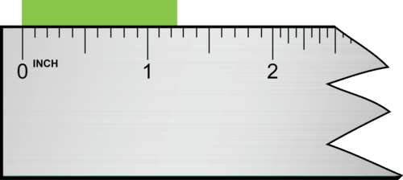

, it is apparent that the object is, as nearly as we can read, 1 inch. Since we know the tenths place is zero and can estimate the hundredths place to be zero, the measurement should be reported as 1.00 inch. It is vital that you include the zeros in your reported measurement because these are measured places and are significant figures.")

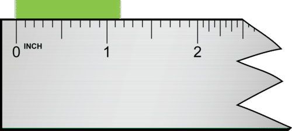

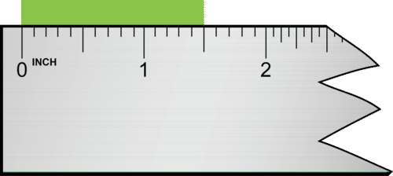

In all of these examples, the measurements indicate that the measuring instrument had subdivisions of a tenth of an inch and that the hundredths place is estimated. There is some uncertainty about the last, and only the last, digit.

In our system of writing measurements to show significant figures, we must distinguish between measured zeros and place-holding zeros. Here are the rules for determining the number of significant figures in a measurement.

#### Rules for Determining the Number of Significant Figures:

1. All non-zero digits are significant.

2. All zeros between non-zero digits are significant.

3. All beginning zeros are _not_ significant.

4. Ending zeros are significant if the decimal point is written in but _not_ significant if the decimal point is an understood decimal (the decimal point is not written in).

#### Examples of the Significant Figure Rules:

1. All non-zero digits are significant.

543 has 3 significant figures.

22.437 has 5 significant figures.

1.321754 has 7 significant figures.

2. All zeros between non-zero digits are significant.

7,004 has 4 significant figures.

10.3002 has 6 significant figures.

103 has 3 significant figures.

3. All beginning zeros are _not_ significant.

0.00000075 has 2 significant figures.

0.02 has 1 significant figure.

0.003003 has 4 significant figures.

4. Ending zeros are significant if the decimal point is actually written in but _not_ significant if the decimal point is an understood decimal.

37.300 has 5 significant figures.

33.00000 has 7 significant figures.

100. has 3 significant figures.

100 has 1 significant figure.

302,000 has 3 significant figures.

1,050 has 3 significant figures.

#### Addition and Subtraction

The answer to an addition or subtraction operation must not have any digits further to the right than the shortest addend. In other words, the answer should have as many decimal places as the addend with the smallest number of decimal places.

#### Example 8

**

$$
\begin{align*}
& \quad 13.3843 \ \text{cm}\\
& \quad \ 1.012 \ \text{cm}\\
& \underline{+ \;\; 3.22 \ \text{cm} \;\;\;\;\;\;\;\;\;\;\;\;\;\;\;\;\;\;\;\;\;}\\
& \ \ 17.6163 \ \text{cm}=17.62 \ \text{cm}
\end{align*}
$$

**

Notice that the top addend has a 3 in the last column on the right, but neither of the other two addends have a number in that column. In elementary math classes, you were taught that these blank spaces can be filled in with zeros and the answer would be 17.6163 cm. In the sciences, however, these blank spaces are unknown numbers, _not_ zeros. Since they are unknown numbers, you cannot substitute any numbers into the blank spaces. As a result, you cannot know the sum of adding (or subtracting) any column of numbers that contain an unknown number. When you add the columns of numbers in the example above, you can only be certain of the sums for the columns with known numbers in each space in the column. In science, the process is to add the numbers in the normal mathematical process and then round off all columns that contain an unknown number (a blank space). Therefore, the correct answer for the example above is 17.62 cm and has only four significant figures.

#### Multiplication and Division

The answer for a multiplication or division operation must have the same number of significant figures as the factor with the least number of significant figures.

#### Example 9

$(3.556 \ \text{cm})(2.4 \ \text{cm}) = 8.5344 \ \text{cm}^2 = 8.5 \ \text{cm}^2$

The factor 3.556 cm has four significant figures, and the factor 2.4 cm has two significant figures. Therefore the answer must have two significant figures. The mathematical answer of 8.5344 cm_2_ must be rounded back to 8.5 cm_2_ in order for the answer to have two significant figures.

#### Example 10

$(20.0 \ \text{cm})(5.0000 \ \text{cm}) = 100.00000 \ \text{cm}^2 = 100. \ \text{cm}^2$

The factor 20.0 cm has three significant figures, and the factor 5.0000 cm has five significant figures. The answer must be rounded to three significant figures. Therefore, the decimal must be written in to show that the two ending zeros are significant. If the decimal is omitted (left as an understood decimal), the two zeros will not be significant and the answer will be wrong.

#### Example 11

$(5.444 \ \text{cm})(22 \ \text{cm}) = 119.768 \ \text{cm}^2 = 120 \ \text{cm}^2$

In this case, the answer must be rounded back to two significant figures. We cannot have a decimal after the zero in 120 cm_2_ because that would indicate the zero is significant, whereas this answer must have exactly two significant figures.

#### Summary

* Mathematics is a major tool for doing physics.
* The very large and very small measurements in physics make it useful to express numbers in scientific notation.
* There is uncertainty in all measurements.
* The use of significant figures is one way to keep track of uncertainty.
* Measurements must be written with the proper number of significant figures and the results of calculations must show the proper number of significant figures.
* Rules for Determining the Number of Significant Figures:
    * All non-zero digits are significant.
    * All zeros between non-zero digits are significant.
    * All beginning zeros are _not_ significant.
    * Ending zeros are significant if the decimal point is actually written in but _not_ significant if the decimal point is an understood decimal (the decimal point is not written in).

#### Practice

This resource is very helpful in explaining units, scientific notation, and significant figures. Use it to answer the questions below:

Watch the video at: https://www.youtube.com/watch?v=hQpQ0hxVNTg

1. How many base units are there?

2. Why do we want the hours on top in the first conversion factor?

3. What do measured numbers tell you?

4. What is the purpose of significant figures?

#### Review

1. Write the following numbers in proper scientific notation.

a) 3,120

b) 0.00000341

2. Write the following numbers in expanded form.

a) $4.35 \times 10^6$

b) $6.1 \times 10^{-4}$

3. How many significant figures are in the following numbers?

a) 2.3

b) 17.95

c) $9.89 \times 10^3$

d) 170

e) 1.02

4. Perform the following calculations and give your answer with the correct number of significant figures:

a) $10.5 + 11.62$

b) $0.01223 + 1.01$

c) $19.85 - 0.0113$

5. Perform the following calculations and give your answer with the correct number of significant figures:

a) $0.1886 \times 12$

b) $2.995 \div 0.16685$

c) $910 \times 0.18945$

</article>

### 2.5 Dimensions of Physical Quantities

<article>

Students are advised to visit this link for reading material on this topic.

* https://www.physics.uoguelph.ca/tutorials/dimanaly/

</article>

### 2.6 Dimensional Formulae and Dimensional Equations

<article>

Students should visit this link and read the topic.

* http://www.tutorvista.com/content/physics/physics-iii/physics-and-measurement/dimensional-formulae.php

#### Watch this video on Dimensional Formula and Dimensional Equations

!?[0](https://www.youtube.com/watch?v=DYC_nlo0qe4)

Watch the video at: https://www.youtube.com/watch?v=DYC_nlo0qe4

</article>

### 2.7 Dimensional Analysis and its Applications

<article>

### Watch this video on Application of Dimensional Analysis

!?[0](https://www.youtube.com/watch?v=PQ8EDm6g-GU)

Watch the video at: https://www.youtube.com/watch?v=PQ8EDm6g-GU

</article>

### 2.8 Self Assessments

<article>

#### Assessment 1

##### The International System of Units

http://www.ck12.org/physics/Scientific-Measurement/quiz/Measurement-Quiz/?referrer=concept_details

#### Assessment 2

##### Significant Figures

http://www.ck12.org/physics/Mathematics-Tools-for-Physics/quiz/Mathematics-Tools-for-Physics-Quiz/?referrer=concept_details

</article>

## 3.0 Kinematics

<article>

Note - That this chapter includes 2 chapters of the NCERT book namely - MOTION IN A STRAIGHT LINE and MOTION IN A PLANE

</article>

### 3.1 Frame of Reference and Relative Velocity

<article>

#### Objectives

The student will:

* understand meaning of rest and motion.
* classify frames of reference and inertial frames.
* solve problems involving relative motion in one dimension.
* solve problems involving relative motion in two dimensions.

#### Vocabulary

* **inertial frame:** A reference frame in which the observers are not subject to any accelerating force.
* **reference frame:** A coordinate system or set of axes within which to measure the position, orientation, and other properties of objects in it. It may also refer to an observational reference frame tied to the state of motion of an observer.
* **relative velocity:** The vector difference between the velocities of two bodies, or the velocity of a body with respect to another body which is at rest.

#### Equations

$\vec{V} _{ba} = \vec{V}_b - \vec{V}_a$ (velocity of $b$ relative to $a$)

$\vec{V} _{ab} = \vec{V}_a - \vec{V}_b$ (velocity of $a$ relative to $b$)

#### Introduction

Velocity is always measured relative to something. We measure how fast a person runs or how fast a car drives relative to the ground. However, we know from astronomy that the Earth itself is both turning around its axis and going around the Sun. A **reference frame** is a fixed point and we measure directions relative to it.

If you are on a bus going north at 60 Km/h, then the person seated across the aisle from you has velocity 60 Km/h north relative to the ground and velocity zero relative to you. If the bus is going at a steady speed, you can toss a coin across to them, and it works the same as if you were standing on solid ground. In the bus frame of reference, you and the other passenger have velocity zero, and the coin has a slight velocity east (say 20 Km/h). In this frame of reference, someone standing to the side of the road would have a velocity 60 Km/h south. 

With the ground as your frame of reference, you and the other passenger are both moving 60 Km/h north, while the coin is moving diagonally northeast. The coin's velocity vector is 60 Km/h north and 20 Km/h east added together. 

Both of these frames of reference are correct. You can solve any problem using either one, as long as you use it consistently. Some problems, though, are easier in one frame of reference than in another. If you wanted to solve how long it would take for the coin to go across the aisle, for example, then the bus frame of reference is much simpler.

#### Inertial Frames

There are endless examples of relative motion. Suppose that you’re in an elevator that is rising with a constant speed of 2 m/s relative to the ground. If you release a ball while in this reference frame, how will the motion of the ball differ than had you dropped the ball while standing on the ground? 

Had you been asleep in this reference frame and woke after the compartment was in motion, you would have no idea you were in motion. There is no experiment that can be performed to detect constant velocity motion. If you’ve ever traveled in a jet moving 1000 km/h with no air turbulence, then you know from firsthand experience that you felt motionless. After the brief acceleration period, you can no longer sense the motion of the elevator. The ball will move as if it has been released in the reference frame of Earth.

As a general statement, we consider all constant velocity reference frames to be equivalent. This idea is known as The Galilean Principle of Relativity. Constant-velocity reference frames are called **inertial frames** of reference. An “at-rest” reference frame is an arbitrary construct. If you’re traveling with a constant velocity in your car, the reference frame of the car is an at-rest frame. The elevator compartment moving 2 m/s is an at-rest frame with respect to the compartment. You- who are sitting and reading this firmly placed on the earth- consider yourself to be in an at-rest reference frame. But you know the Earth itself is in motion. It rotates about its axis with a speed of about 1600 km/h at the equator, and it orbits the sun with an average speed of 108,000 km/h. In fact, the Earth isn’t even an inertial frame of reference, since it rotates about its axis and its orbital speed varies. (Remember, velocity is constant only if its magnitude and direction do not change—objects in circular motion do not qualify!) We usually approximate the Earth as an inertial frame of reference since we do not readily sense the earth’s acceleration. Objects on Earth's surface have a maximum acceleration due to its rotation of about $0.03~\text{m/s}^2$—which we don’t typically concern ourselves with since the acceleration due to gravity is $10~\text{m/s}^2$.

#### Relative Motion: Part 1

The **Figure** [below](#x-ck12-OTgwNDUtMTM1NjczODYyOS02Mi0yMi1QaHktSW50LUhvbm9ycy0wMy0wOA..), a moving walkway, provides us with our first example of relative motion. Let us consider two Cartesian coordinate systems. One is attached to the “stationary” Earth. The other is attached to a walkway moving with a constant horizontal velocity of 1 m/s with respect to the earth. If a ball is thrown with an initial horizontal velocity of 3 m/s in the direction the walkway is moving by a person standing on the walkway, what horizontal velocity does a person standing on the ground measure for the ball? The person in the Earth frame sees the ball having a combined velocity of 4 m/s. The person in the “moving frame” will measure it as 3 m/s. According to The Principle of Galilean Relativity, the velocity, $V$, seen from the at-rest frame is additive, that is, $V = 1 \ m/s + 3 \ m/s$. See **Figure** [below](#x-ck12-MjAxMjEyMDYxMzU0ODE0Nzk0NjcyNzAxXzI4ZDdhN2VlZDJiODUxYmE3MzNjNWMwMmM3OGZmOGU3LTIwMTIxMjA2MTM1NDgxNTIzOTg2OTcxNg..).

---

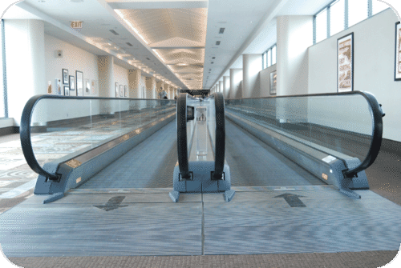

.")

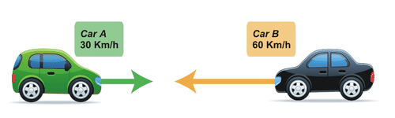

a) What is the velocity of car $B$ relative to the velocity of car $A$?

We define motion to the east as positive (+30 Km/h), and motion to the west as negative (-60 Km/h).

From our previous statements regarding **relative velocity** we can “feel” that the relative velocity is greater than either speed: If we define the relative velocity (the velocity of car $B$ relative to the velocity of car $A$) as: $\vec{V}_{ba} = \vec{V}_b - \vec{V}_a$, then $-60-30=-90 \ Km/h$, a person in car $A$ sees car $B$ moving west at 90 Km/h. The person in car $A$ sees himself as “motionless” while car $B$ is moving toward him with car $B$’s speed and his own speed which he does not perceive.

b) What is the velocity of car $A$ relative to the velocity of car $B$? This means we are assuming car $B$ is our “at rest” coordinate system.

$\vec{V}_{ab} = \vec{V}_a - \vec{V}_b = 30 \ Km/h - (-60 \ Km/h) = + 90 \ Km/h$. A person in car $B$ sees car $A$ moving east at 90 Km/h.

The person in car $B$ sees himself as motionless, while car $A$ is moving toward him with car $A$’s speed and his own speed, which he does not perceive.

Note: The “at-rest” frame sees its motion reversed in the “moving frame.”

Car $A$ is moving due east with a speed of 30 Km/h and Car $B$ is moving due north with a speed of 30 Km/h.

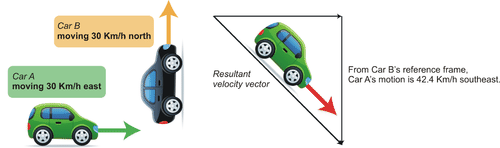

a) What is the velocity of car $A$ relative to car $B$?

$\vec{V} _{ab} = \vec{V}_a - \vec{V}_b$ The two vectors are not along the same line so we’ll use their components

$\vec{V}_a = ( +30 , 0)$ and $\vec{V}_b = (0, +30)$, where east is $+x$ and north is $+y$

$-\vec{V}_b = (0 , -30)$, therefore, $\vec{V}_a - \vec{V}_b = (30+0 , 0-30) = (30 , -30)$. The components are directed east and south, so the direction is southeast. Since both components have the same magnitude, the angle must be $45^{\circ}$. But since the vector is in the southeast direction it is in the $4^{th}$ quadrant so the angle is $315^{\circ}$, and the magnitude is the Pythagorean sum $\left ( 30^2+30^2 \right )\frac{1}{2} = 42.4 \ Km/h$

Thus: $\vec{V}_{ab} = 43.4 \ Km/h$ in direction $315^\circ$

b) What is the velocity of car $B$ relative to car $A$?

The magnitude of the relative speed is the same, but the direction is reversed.

Thus: $\vec{V}_{ba}=42.4 \ Km/h$ in direction $135^\circ$

---

#### Relative Motion: Part 2

http://demonstrations.wolfram.com/ResultantOfAVector/

We begin Part 2 with a boat trip!

A boat moving at 4.0 m/s crosses a still lake, leaving from Point $A$ and arriving at Point $B$. The distance between points $A$ and $B$ is 100 m.

The path of the boat is directly from $A$ to $B$ and the time of travel is quickly found: $\frac{100}{4} = 25 \ s$. (See **Figure** [below](#x-ck12-MjAxMjEyMDYxMzU0ODE0Nzk0NzU0OTIxXzM4NzZiODk1ZjhiOGRhM2JkZjkxNDNhYTYxMTAwOGEyLTIwMTIxMjA2MTM1NDgxNTI0MDg2MTUyOA..).)

).")

---

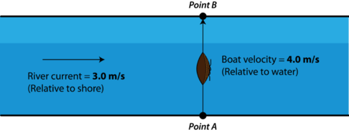

1. How much time is required for the boat to reach the opposite bank of the river?

2. What distance downstream of Point $B$ is the boat when it arrives at the opposite bank of the river?

3. What is the speed of the boat with respect to an observer at Point $A$?

4. What is the direction of the boat’s motion with respect to an observer at Point $A$?

In order to answer the first question we must decide if the presence of the current increases or decreases the northerly speed of the boat.

What do you think?

Let’s think this through.

If the current were flowing northeast or northwest, the boat’s northerly speed would increase (think of a tail wind adding speed to an airplane’s motion). We already agree that the eastern (or western) component will cause the boat to veer off course.

If the current, however, were flowing southeast or southwest, then the boat’s northerly speed would decrease (think of a headwind, subtracting speed from an airplane’s motion). Again, the eastern (or western) component of the current’s motion will cause the boat to veer off course. (See **Figure** [below](#x-ck12-MjAxMjEyMDYxMzU0ODE0Nzk0Nzc5NzMwXzQxMmYxNzM3MzEzZDczY2E4NzYzY2ZmZTkwMjlkZWNmLTIwMTIxMjA2MTM1NDgxNTI0MTMxMTgzOQ..).)

 current cannot affect the forward (northward) motion of the boat. True, it can change the overall velocity of the boat. In **Figure** [below](#x-ck12-MjAxMjEyMDYxMzU0ODE0Nzk0NzkzMDczX2EwZGZiODlhOTdiNGQyNDZmNWVhMTRlN2FlNDE5NmI2LTIwMTIxMjA2MTM1NDgxNTI0MTUzMzUwNw..) the boat is moving both east, due to the current, _and_ north under its own power. So, as seen from Point $A$ or Point $B$, the boat is moving northeast. Since its velocity due north has not been affected by the current, the boat’s northern component of speed in still 4.0 m/s, and since the boat moves east with the current, it now has an eastward velocity of 3.0 m/s.")

---

**Answers to questions 1 – 4**:

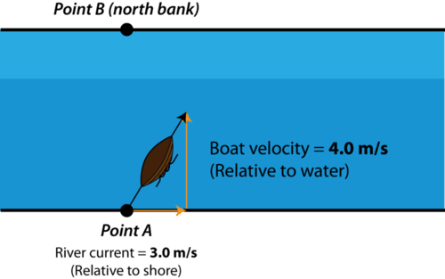

2. The boat has the same speed as the current so it travels 3.0 m/s for 25 s eastward. The boat therefore is $(3.0)(25) = 75 \ m$ downstream from point $B$.

3. The boat is moving 4.0 m/s north and 3.0 m/s east. Its resultant speed can be found using the Pythagorean formula: square root of $\sqrt{3^2+4^2} = 5 \ m/s$.

4. The angle as measured from a north-south line (line $AB$) can be determined using any of the trigonometric functions, sine, cosine, or tangent, since all three sides of the right triangle are known. For example, using the tangent function we have: $\tan^{-1} \left(\frac{3}{4}\right)=36.87^{\circ}$.

A final consideration is the interesting case of determining how to steer the boat such that it follows a straight course from point $A$ to point $B$, in spite of the current. Recall that if there were no current the boat could just be aimed due north and it would easily move from point $A$ to point $B$. We can intuit that the only hope of having the boat go from point $A$ to point $B$ is to aim the boat, somewhat, “into the current”, or upstream. In other words, we can effectively travel straight across as we did in the “no-current” situation by aiming the boat some amount into the current. Why does this work?

First, consider what happens if a boat is aimed directly upstream with a speed equal to that of the current. The boat has a velocity of 3.0 m/s west and the water current has a velocity of 3.0 m/s east. What would someone positioned at point $A$ see the boat do? If you think of the motions as two vectors for a moment: +3.0 m/s (current) + -3.0 m/s (boat), the vector sum is zero. In other words, the boat appears to be motionless to the observer at point $A$. So if the boat in our problem is aimed into the current such that its westward component is 3.0 m/s, we effectively have a situation equivalent to no current. The boat has a velocity of 4.0 m/s relative to the water and its westward component must be 3.0 m/s relative to the water if it is to cross directly from $A$ to $B$. Using the Pythagorean formula we find the boat’s northern component of motion to be the square root of 7.0 m/s or about 2.65 m/s. The boat will move due north at 2.65 m/s and arrive at the point $B$ in $\frac{100}{2.65} = 37.7 \ seconds$. With no current, the trip took 25 seconds. Some of the boat’s forward motion had to be sacrificed in order to maintain the correct direction of travel. We can also enquire about the direction the boat was aimed in order to make the trip directly to point $B$. Since the components of the vector triangle are known, any trigonometric function will do. Let’s use the sine and find the angle as measured from the north-south line.

$\sin^{-1} (\frac{3}{4}) = 48.59^{\circ}$ 

Note, this was not the same angle that resulted when the boat was aimed due north and the current carried it downstream of $B$.

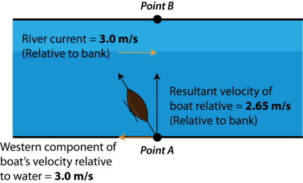

</article>

### 3.2 Motion in a Straight Line

<article>

### One-Dimensional Motion

One dimensional motion describes objects moving in straight lines. Speed is a scalar measure of how quickly an object is moving along this line Velocity is speed with a direction, making it a vector. If an object’s velocity changes with time, the object is said to be accelerating. When restricted to one dimension, there are only two possible directions for the velocity and acceleration vectors to point in. As we’ll see in the next chapters, understanding an object's acceleration is the key to understanding its motion.

#### Key Definitions

$$
\begin{align*}
\text{Symbols}\begin{cases}
\Delta \text{(anything)} & \text{Final value - initial value}\\
\text{anything}_0 & \text{Value at time 0}
\end{cases}
\end{align*}
$$

$$
\begin{align*}
\text{Scalars}\begin{cases}
t & \text{Time in seconds, s}\\
d = |{\Delta x_1}| + |{\Delta x_2}| & \text{Distance (in meters, m}\text{)}\\
v = |{v}| & \text{Speed (in meters per second,}\ \text{m}/\text{s}\text{)}
\end{cases}
\end{align*}
$$

$$
\begin{align*}
\text{Vectors}\begin{cases}
x = x(t) & \text{Position} \\
\Delta x = x_f-x_i  & \text{Displacement}\\
v_i & \text{Initial velocity}\\
v_f & \text{Final velocity}\\
\Delta v = v_f - v_i & \text{Change in velocity}\\
a & \text{Instantaneous acceleration} 
\end{cases}
\end{align*}
$$

Watch the video at: https://www.youtube.com/watch?v=UhxAkYtLfQo

---

#### Key Equations

**Averages**

$$
\begin{align*}
v_{avg} & = \frac{\boldsymbol{\Delta} x}{\Delta t} \\
a_{avg} & = \frac{\boldsymbol{\Delta} v}{\Delta t}
\end{align*}
$$

**The Big Three**

$$
\begin{align*}
x(t) & = x_0 +v_0 t + \tfrac{1}{2} a t^2 \\
v(t) & = v_0 +at \\
{v_f}^2 & = {v_0}^2 + 2a \Delta x
\end{align*}
$$

#### Key Concepts

* When beginning a one dimensional problem, define a positive direction. The other direction is then taken to be negative. Traditionally, “positive” is taken to mean “to the right”; however, any definition of direction used consistency throughout the problem will yield the right answer.
* Be sure you understand the difference between average velocity (measured over a period of time) and instantaneous velocity (measured at a single moment in time).

Watch the video at: https://www.youtube.com/watch?v=YPJAoi9bIaA

* Gravity near the Earth pulls an object toward the surface of the Earth with an acceleration of $9.8 \;\mathrm{m/s}^2$$(\approx10 \;\mathrm{m/s}^2)$. In the absence of air resistance, all objects will fall with the same acceleration. Air resistance can cause low-mass, large area objects to accelerate more slowly.

Watch the video at: https://www.youtube.com/watch?v=0YXUK4g4JHk

* _Deceleration_ is the term used when an object’s _speed_ is decreasing due to an acceleration in the opposite direction of its velocity.
* The Big Three equations define the graphs of position and velocity as a function of time. When there is no acceleration (constant velocity), position increases linearly with time -- distance equals rate times time. Under constant acceleration, velocity increases linearly with time but distance does so at a quadratic rate. The slopes of the position and velocity graphs will give instantaneous velocity and acceleration, respectively.

!?[0](https://www.youtube.com/watch?v=8_n_XEVN2X4)

Watch the video at: https://www.youtube.com/watch?v=8_n_XEVN2X4

!?[0](https://www.youtube.com/watch?v=2Nm_9Rh7ah8)

Watch the video at: https://www.youtube.com/watch?v=2Nm_9Rh7ah8

!?[0](https://www.youtube.com/watch?v=kFGfBCDr75Y)

Watch the video at: https://www.youtube.com/watch?v=kFGfBCDr75Y

!?[0](https://www.youtube.com/watch?v=b_p0ZG_9w0M)

Watch the video at: https://www.youtube.com/watch?v=b_p0ZG_9w0M

!?[0](https://www.youtube.com/watch?v=TXeL9bPkRwI)

Watch the video at: https://www.youtube.com/watch?v=TXeL9bPkRwI

* At first, you might get frustrated trying to figure out which of the Big Three equations to use for a certain problem, but don’t worry, this comes with practice. Making a table that identifies the variables given in the problem and the variables you are looking for can sometimes help.

!?[0](https://www.youtube.com/watch?v=_3qyj9gR8R0)

Watch the video at: https://www.youtube.com/watch?v=_3qyj9gR8R0

!?[0](https://www.youtube.com/watch?v=KujTxuwJ0Pk)

Watch the video at: https://www.youtube.com/watch?v=KujTxuwJ0Pk

#### Investigation

??[failed](http://www.siminsights.com/SimMotion5/SimMotion5embed.jsp?model_id=6143a047-4a06-44b8-964c-abada3ea54b7&hash=2ac306b23a5bc9f531f786d62ced75a0)

Watch the video at: http://www.ck12.org/flx/render/embeddedobject/7970

---
!?[undefined](media/7971.mp4 "video")

Watch the video at: http://www.ck12.org/flx/render/embeddedobject/7971

!?[undefined](media/7972.mp4 "video")

Watch the video at: http://www.ck12.org/flx/render/embeddedobject/7972

#### Practice

1. Answer the following questions about one-dimensional motion.

a) What is the difference between distance $d$ and displacement $\triangle x$ Write a few sentences explaining this.

b) Does the odometer reading in a car measure distance or displacement?

c) Imagine a fox darting around in the woods for several hours. Can the displacement $\triangle x$ of the fox from his initial position ever be larger than the total distance d he traveled? Explain.

d) What is the difference between acceleration and velocity? Write a paragraph that would make sense to a $5^{th}$ grader.

e) Give an example of a situation where an object has an upward velocity, but a downward acceleration.

f) What is the difference between average and instantaneous velocity? Make up an example involving a trip in a car that demonstrates your point.

g) If the position of an object is increasing linearly with time (i.e., $\triangle x$ is proportional to $t$), what can we say about its acceleration? Explain your thinking.

h) If the position of an object is increasing non-linearly with time (i.e., $\triangle x$ is not proportional to $t$), what can we say about its velocity? Explain your thinking.

2. A cop passes you on the highway. Which of the following statements must be true at the instant he is passing you? You may choose more than one answer.

a) Your speed and his speed are the same.

b) Your position $x$ along the highway is the same as his position $x$ along the highway.

c) Your acceleration and his acceleration are the same.

3. If a car is slowing down from 50 Km/h to 40 Km/h, but then $x$ position is increasing, which of the following statements is true? You may choose more than one.

a) The velocity of the car is in the $+ x$ direction.

b) The acceleration of the car is in the same direction as the velocity.

c) The acceleration of the car is in the opposite direction of the velocity.

d) The acceleration of the car is in the $- x$ direction.

4. A horse is galloping forward with an acceleration of $3 \;\mathrm{m/s}^2$. Which of the following statements is necessarily true? You may choose more than one.

a) The horse is increasing its speed by 3 m/s every second, from 0 m/s to 3 m/s to 6 m/s to 9 m/s.

b) The speed of the horse will triple every second, from 0 m/s to 3 m/s to 9 m/s to 27 m/s.

c) Starting from rest, the horse will cover 3 m of ground in the first second.

d) Starting from rest, the horse will cover 1.5 m of ground in the first second.

5. Below are images from a race between Abhishek (above) and Ashutosh (below), two daring racecar drivers. High speed cameras took four pictures in rapid succession. The first picture shows the positions of the cars at $t = 0.0$. Each car image to the right represents times 0.1, 0.2, and 0.3 seconds later.

 Who is ahead at $t = 0.2 \;\mathrm{s}$ ? Explain.")

b) Who is accelerating? Explain.

c) Who is going faster at $t = 0.3 \;\mathrm{s}$? Explain.

d) Which car has a constant velocity throughout? Explain.

e) Graph $x$ vs. $t$ and $v$ vs. $t$. Put both cars on same graph; label which line is which car.

f) Which car is going faster at $t = 0.2 \;\mathrm{s}$ (Hint: Assume they travel the same distance between 0.1 and 0.2 seconds)?

Watch the video at: https://www.youtube.com/watch?v=muDS2Cgl5vA

6. Draw the position vs. time graph that corresponds to the velocity vs. time graph below. You may assume a starting position $x_0 = 0$. Label both axes of your graph with appropriate values.

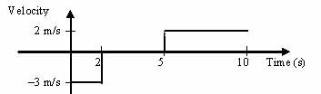

8. The following data represent the first 30 seconds of actor Crispin Glover’s drive to work.

| Time (s) | Position (m) | Distance (m) |
| --- | --- | --- |
| 0   | 0   | 0   |
| 5   | 10  | 10  |
| 10  | 30  | 30  |
| 15  | 30  | 30  |
| 20  | 20  | 40  |
| 25  | 50  | 70  |
| 30  | 80  | 120 |

a) Sketch the graphs of position vs. time and distance vs. time. Label your $x$ and $y$ axes appropriately.

b) Why is there a discrepancy between the distance covered and the change in position during the time period between $t = 25 \;\mathrm{s}$ and $t = 30 \;\mathrm{s}$?

c) What do you think is going on between $t = 10 \;\mathrm{s}$ and $t = 15 \;\mathrm{s}$?

d) What is the displacement between $t = 10 \;\mathrm{s}$ and $t = 25 \;\mathrm{s}$?

e) What is the distance covered between $t = 10 \;\mathrm{s}$ and $t = 25 \;\mathrm{s}$?

f) What is the average velocity during the first $30$ seconds of the trip?

g) What is the average velocity between the times $t = 20 \;\mathrm{s}$ and $t = 30 \;\mathrm{s}$?

h) During which time interval(s) was the velocity negative?

i) Sketch the velocity vs. time and speed vs. time graphs. Label your $x$ and $y$ axes appropriately.

9. Shyam, a used car salesman, claims his car is able to go from 0 to 96 Km/h in 3.5 seconds.

a) What is the average acceleration of this car? Give your answer in $\;\mathrm{m/s}^2$. (Hint: you will have to perform a conversion.)

b) How much distance does this car cover in these 3.5 seconds? Express your answer : in meters .

c) What is the speed of the car in after 2 seconds?

10. Michael Jordan had a vertical jump of about 1.2 m.

a) Assuming no air resistance, at what speed did he leave the ground?

b) What is his speed 3/4 of the way up?

c) What is his speed just before he hits the ground on the way down?

!?[0](https://www.youtube.com/watch?v=GVYkfgeP48U)

Watch the video at: https://www.youtube.com/watch?v=GVYkfgeP48U

11. You are sitting on your bike at rest. Your brother comes running at you from behind at a speed of 2 m/s. At the exact moment he passes you, you start up on your bike with an acceleration of $2 \;\mathrm{m/s}^2$.

a) Draw a picture of the situation, defining the starting positions, speeds, etc.

b) At what time $t$ do you have the same speed as your brother?

c) At what time $t$ do you pass your brother?

d) Draw another picture of the exact moment you catch your brother. Label the drawing with the positions and speeds at that moment.

e) Sketch a position vs. time graph for both you and your brother, labeling the important points (_i.e.,_ starting point, when you catch him, etc.)

f) Sketch a speed vs. time graph for both you and your brother, labeling the important points (_i.e.,_ starting point, when you catch him, etc.)

")

a) How high up does the ball go?

b) How fast is the ball going right before it hits the top of the building?

c) For how many seconds total is the ball in the air?

13. Measure how high you can jump vertically on Earth. Then, figure out how high you would be able to jump on the Moon, where acceleration due to gravity is $1/6^{th}$ that of Earth. Assume you launch upwards with the same speed on the Moon as you do on the Earth.

14. A car is smashed into a wall. The car is going 25 m/s just before it strikes the wall. It comes to a stop 0.8 seconds later. What is the average acceleration of the car during the collision?

a) What is the speed of the man just before he lands on the pillow?

b) How long is he in the air after he lets go?

c) What is the greatest height reached by the man above the ground? (Hint: this should be greater than 20 m. Why?)

d) What is the distance between the helicopter and the man three seconds after he lets go of the rope?

16. You are speeding towards a brick wall at a speed of 88 Km/h. The brick wall is only 30.4 m away.

a) What is the distance to the wall in meters?

b) What is the minimum acceleration you should use to avoid hitting the wall?

17. What acceleration should you use to increase your speed from 10 m/s to 18 m/s over a distance of 55 m?

18. You drop a rock from the top of a cliff. The rock takes 3.5 seconds to reach the bottom.

a) What is the initial speed of the rock?

b) What is the magnitude (i.e., _numerical value_) of the acceleration of the rock at the moment it is dropped?

c) What is the magnitude of the acceleration of the rock when it is half-way down the cliff?

d) What is the height of the cliff?

**Use the following tables for use with the next problem.**

|     |     |     |
| --- | --- | --- |A
| $t$ | $x$ | $v$ |
| --- | --- | --- |
| 0.0 s | 5 m | .5 m/s |
| 1.0 s | 5.65 m | .8 m/s |
| 2.0 s | 6.6 m | 1.1 m/s |
| 3.0 s |     |     |
| 4.0 s |     |     |
| 5.0 s |     |     |
| 6.0 s |     |     |
| 7.0 s |     |     |
| 8.0 s |     |     |
| 9.0 s |     |     |
| 10.0 s |     |     |

|     |     |     |
| --- | --- | --- |B
| $t$ | $x$ | $v$ |
| --- | --- | --- |
|     |     | 2.6 m/s |
|     | 17.1 m |     |
|     |     | 3.14 m/s |
|     | 31.4 m |     |
|     |     | 5.41 m/s |

---

19. An owl is flying along above your farm with positions and velocities given by the formulas

$$
x(t) = 5.0 + 0.5t + (1/2)(0.3)t^2;
$$

where $t$ is in seconds and $x$ is in meters from the barn;

$$
v(t) = 0.5 + (0.3)t \qquad  \text{where } v \text{ is m/s}
$$

a) What is the acceleration of the owl?

b) What is the speed of the owl at $t = 0$?

c) Fill in the missing elements of table A.

d) Plot the $x$ and $t$ points on the following graph. Then, connect your points with a smoothly curving line. Be careful and neat and use pencil.

 Use the formula to calculate the speed of the owl in m/s at $t = 5$ seconds.")

f) Lightly draw in a tangent to your curve at the $t = 5 \;\mathrm{s}$ point. Then, measure the slope of this tangent by measuring the _rise_ (in meters) and the _run_ (in seconds). What is the slope in m/s?

g) Were your answers to the last two parts the same? If so, why? If not, why not?

h) Fill in table B. This is going to be harder to do, because you are given $x$ or $v$ and are expected to find $t$. You may have to use the quadratic formula!

20. For each of the following graphs, write a few sentences about what kind of motions were made. Try to use the words we have defined in class (speed, velocity, position, acceleration) in your description.

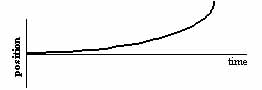

\[Figure 6\]a)

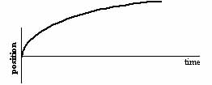

\[Figure 7\]b)

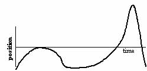

\[Figure 8\]c)

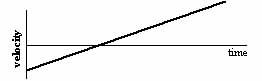

\[Figure 9\]d)

#### Answers to Selected Problems

1. .

2. .

3. .

4. .

5. a) Ashutosh

b) Abhishek is accelerating because the distance he travels every 0.1 seconds is increasing, so the speed must be increasing

c) Abhishek

d) Ashutosh

e) Abhishek

6. .

7. 6 minutes

8. d) 20 meters

e) 40 meters

f) 2.67 m/s

g) 6 m/s

h) Between $t = 15 \;\mathrm{s}$ and $t = 20$ sec because your position goes from $x = 30 \;\mathrm{m}$ to .

i) You made some sort of turn

9. a) $7.7 \;\mathrm{m/s}^2$

b) 47 m

c) 34 m/s

10. a) 1.22 m

b) 4.9 m/s

c) 2.46 m/s

d) -4.9 m/s

11. b) 1 second

c) at 2 seconds

d) 4 m

12. a) 250 m

b) 13 m/s, -13 m/s

c) 14 s for round trip

13. Let’s say we can jump 20 feet (6.1 m) in the air. ☺ Then, on the moon, we can jump 36.5 m straight up.

14. $-31\mathrm{m/s}^2$

15. a) 23 m/s

b) 3.6 seconds (3.5 seconds if using $10 \;\mathrm{m/s}^2$)

c) 28 m (27 m if using $10 \;\mathrm{m/s}^2$)

d) 45 m

!?[0](https://www.youtube.com/watch?v=a8h_6ZvWZUM)

Watch the video at: http://www.youtube.com/watch?v=a8h_6ZvWZUM

16. a) 25 m/s

b) 30 m

c) $2.5 \;\mathrm{m/s}^2$

17. $2 \;\mathrm{m/s}^2$

18. a) $v_0 = 0$

b) $10 \;\mathrm{m/s}^2$

c) $- 10 \;\mathrm{m/s}^2$

d) 60 m

19. a) $0.3 \;\mathrm{m/s}^2$

b) 0.5 m/s

### Motion in a Straight Line

#### Position and Displacement

In order to study how something moves, we must know where it is. This location is an object's **position.** To visualize position for objects moving in a straight line, you can imagine the object is on a number line. It may be placed at any point on the number line in the positive numbers or the negative numbers.  It is common to choose the original position of the object to be on the zero mark.  In making the zero mark the reference point, you have chosen a frame of reference.  The exact position of an object is the separation between the object and the reference point.

When an object moves, we often refer to the amount it moves as the **distance**. Distance does not need a reference point and does not need a direction. If an automobile moves 50 kilometers, the distance traveled is 50 kilometers regardless of the starting point or the direction of movement. If we wish to find the final position of the automobile, however, just having the distance traveled will not allow us to determine the final position. We need to know the starting point and the direction of the motion. The change in the position of the object is called its **displacement**. The displacement must include a direction because the final position may be either in the positive or negative direction along the number line from the initial position.  The displacement is a vector quantity and vectors are discussed in the chapter “Vectors”.

To return to the first image, these cars travel a distance of 805 km over the course of the race. However, they are traveling in a circle, and the start and finish line are the same. Therefore, when the car finishes the race, it is in essentially the same position it was when it started. The car's total displacement is only a few feet.

#### Summary

* The length traveled by an object moving in any direction or even changing direction is called distance.
* The location of an object in a frame of reference is called position.
* For straight line motion, positions can be shown using a number line.
* The separation between original and final position is called displacement.

#### Practice

Watch these two short videos to understand position, distance, and displacement, and answer the questions below:

!?[0](https://www.youtube.com/watch?v=Ar1akEU0nYA)

Watch the video at: https://www.youtube.com/watch?v=Ar1akEU0nYA

!?[0](https://www.youtube.com/watch?v=lG_6M-xIyqc)

Watch the video at: https://www.youtube.com/watch?v=lG_6M-xIyqc

1. What is position?

2. Can two objects be the same distance from a single point but be in different positions? Why or why not?

3. What is the difference between distance and displacement?

4. Does distance have direction? Does displacement have direction?

---

#### Review

1. Explain the difference between distance and displacement in your own words.

2. Suppose that John lives on a square block that is 164.6 m per side, and in the evenings, he walks with his dog around the block for a little exercise.

a) If John walks once around the block, what distance does he travel?

b) If John walks once around the block, what is his final displacement?

3. Joanna's house is 8000 meters due west of her school. If her house is assigned the position of zero and her school is assigned the position of +8000, what would be Joanna's position if she walked 100 meters west of her house?

</article>

### 3.3 Rate of Change of Position, Speed and Velocity

<article>

 is seen here next to the X-15 ship after a research flight. The servo-actuated ball nose, seen at Armstrong's right hand, provided accurate measurement of air speed at hypersonic speeds. The X-15 was flown over a period of nearly 10 years, and set the world's unofficial speed record convert 4250 in Km/h as its a fact of 6840 Km/h.")

### Average Velocity

In ordinary language, the words _speed_ and _velocity_ both refer to how fast an object is moving, and are often used interchangeably. In physics, however, they are fundamentally different. **Speed** is the magnitude of an object's motion, with no regard for the direction. **Velocity**, on the other hand, includes direction. It is a vector, and thus must have a magnitude and a direction.

Average speed is calculated by dividing the total distance travelled by the time interval. For example, someone who takes 40 minutes to drive 20 km north and then 20 km south (to end up at the same place), has an average speed of 40 km divided by 40 minutes, or 1 km per minute (60 Km/h). Average velocity, however, involves total displacement, instead of distance. It is calculated by dividing the total displacement by the time interval. In this example, the driver's displacement is zero, which makes the average velocity zero Km/h. 

Neither average speed nor average velocity implies a constant rate of motion. That is to say, an object might travel at 10 m/s for 10 s and then travel at 20 m/s for 5 s and then travel at 100 m/s for 5 s. This motion would cover a distance of 700 m in 20 s and the average speed would be 35 m/s. We would report the average speed during this 20 s interval to be 35 m/s and yet at no time during the interval was the speed necessarily 35 m/s.

---

Constant velocity is very different from average velocity. If an object traveled at 35 m/s for 20 s, it would travel the same distance in the same time as the previous example but in the second case, the object's velocity would always be 35 m/s.

**Example:** The position of a runner as a function of time is plotted as moving along the $x$\-axis of a coordinate system. During a 3.00 s time interval, the runner’s position changes from $x_1 = 50.0 \ \text{m}$ to $x_2 = 30.5 \ \text{m}$. What was the runner’s average velocity?

**Solution:**

$\text{Displacement} = 30.5 \ \text{m} - 50.0 \ \text{m} = -19.5 \ \text{m}$ (the object was traveling back toward zero)

$\Delta t = 3.00 \ \text{s}$

$v_{\text{ave}}=\frac{\Delta x}{\Delta t}=\frac{-19.5 \ \text{m}}{3.00 \ \text{s}}=-6.50 \ \text{m/s}$

#### Summary

* Average speed is distance divided by time.
* Average velocity is displacement divided by time.

#### Practice

The url below is a physics classroom discussion of speed versus velocity with a short animation.

http://www.physicsclassroom.com/Class/1DKin/U1L1d.cfm

Use this resource to answer the questions that follow.

Watch the video at: http://www.youtube.com/watch?v=BWP1tN7PZps

!?[0](https://www.youtube.com/watch?v=BWP1tN7PZps)

1. The velocity versus time graph in the video is divided into six sections. In how many of these sections is the velocity constant?

2. In how many sections of the graph is the velocity zero?

3. What does the area under the curve of a velocity versus time graph represent?

#### Review

1. On a one day vacation, Abhinav traveled 340 km in 8.0 hours. What was her average speed?

2. An object on a number line moved from $x = 12 \ m$ to $x = 124 \ m$ and moved back to $x = 98 \ m$. The time interval for all the motion was 10 s. What was the average velocity of the object?

3. An object on a number line moved from $x = 15 \ cm$ to $x = 165 \ cm$ and then moved back to $x = 25 \ cm$, all in a time of 100 seconds.

a) What was the average velocity of the object?

b) What was the average speed of the object?

</article>

### 3.4 Uniform and Non Uniform Motion

<article>

Uniformly accelerated motion in a straight line, using equations of motion to solve kinematic problems.

#### Uniformly Accelerated Motion and Kinematic Equations - Overview

##### Overview

!?[undefined](media/131239.mp4 "video")

Watch the video at: http://www.ck12.org/flx/render/embeddedobject/131239

#### Uniformly Accelerated Motion and Kinematic Equations - Example 2

Solving problems using $d=v_i t+\frac{1}{2}at^2$

!?[undefined](media/131241.mp4 "video")

Watch the video at: http://www.ck12.org/flx/render/embeddedobject/131241

#### Uniformly Accelerated Motion and Kinematic Equations - Example 3

Solving problems using $v_f= v_i+at$

!?[undefined](media/131242.mp4 "video")

Watch the video at: http://www.ck12.org/flx/render/embeddedobject/131242

#### Uniformly Accelerated Motion and Kinematic Equations - Example 4

Solving problems using $v_f^2= v_i^2+2ad$

!?[undefined](media/131243.mp4 "video")

Watch the video at: http://www.ck12.org/flx/render/embeddedobject/131243

</article>

### 3.5 Average Speed and Instantaneous Velocity

<article>

### Instantaneous Velocity

The **instantaneous** **velocity** of an object is the velocity of the object at a given moment. If the object is moving with constant velocity, then the instantaneous velocity at every moment, the average velocity, and the constant velocity are all the same.

Consider a position versus time graph for an object starting at $t =0$ and $x = 0$ that has a constant velocity of 80. m/s.

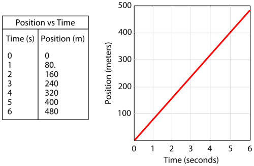

$$
\text{slope}=\frac{\text{rise}}{\text{run}}=\frac{\Delta d}{\Delta t}=\frac{400. \ \text{m}}{5.0 \ \text{s}}=80. \ \text{m/s}
$$

For accelerated motion (the velocity is constantly changing), the position vs time graph will be a curved line. The slope of the curved line at any point is the instantaneous velocity at that time. If we were using calculus, the slope of a curved line could be calculated. Without calculus, we approximate the instantaneous velocity at a particular point by laying a straight edge along the curved line and estimating the slope.

 is 4.0 seconds.  Therefore, the approximated slope is 43 m/s.")

#### Summary

* The slope of a position versus time graph is the velocity.
* For constant velocity motion, the slope gives the constant velocity, the average velocity, and the instantaneous velocity at every point.  
* For constant acceleration motion, the slope of the position versus time curve at a particular point gives the instantaneous velocity at that point.

#### Practice

Draw a velocity versus time graph for an object whose constant velocity is 15 m/s and whose position starts at $x = 0$ when $t = 0$.  Graph the motion for the first 5.0 seconds.

Use this resource to answer the questions that follow.

!?[0](https://www.youtube.com/watch?v=sujsb5ZlM8o)

Watch the video at: http://www.youtube.com/watch?v=sujsb5ZlM8o

1. In the graph on the video, what is graphed on the vertical axis?

2. What is graphed on the horizontal axis?

3. What does the slope of this graph represent?

#### Review

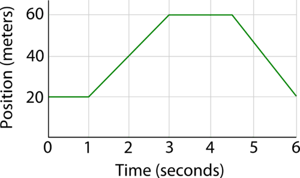

2. For the motion graphed in the position versus time graph shown above, what is the average velocity in the time interval 3 to 4 seconds?

3. For the motion graphed in the position versus time graph shown above, what is the average velocity in the time interval 5 to 6 seconds?

### Science - Instantaneous Velocity

Describes what instantaneous velocity is and gives a real world example of it. 

!?[0](https://www.youtube.com/watch?v=LkOgm6N0Vi0)

Watch the video at: http://www.youtube.com/watch?v=LkOgm6N0Vi0

### Calculus - Instantaneous Velocity

Provides an example of instantaneous velocity and shows how to solve a problem. (3:08)

!?[0](https://www.youtube.com/watch?v=S6PftYeZ8N0)

Watch the video at: http://www.youtube.com/watch?v=S6PftYeZ8N0

</article>

### 3.6 Acceleration

<article>

### Velocity and Acceleration

Students will learn the meaning of acceleration, how it is different than velocity and how to calculate average acceleration.

#### Key Equations

$v =$ velocity (m/s)

$v_i =$ initial velocity

$v_f =$ final velocity

$\Delta v =$ change in velocity $= v_f - v_i$

$v_{avg} = \frac{\Delta x}{\Delta t}$

$a =$ acceleration $(m/s^2)$

$a_{avg} = \frac{\Delta v}{\Delta t}$

> ### Guidance
> 
> * Acceleration is the rate of change of velocity. So in other words, acceleration tells you how quickly the velocity is increasing or decreasing. An acceleration of $5 \ m/s^2$ indicates that the velocity is increasing by $5 \ m/s$ in the positive direction every second.
> * Gravity near the Earth pulls an object downwards toward the surface of the Earth with an acceleration of $9.8 \ m/s^2 ( \approx 10 \ m/s^2)$. In the absence of air resistance, all objects will fall with the same acceleration. The letter $g$ is used as the symbol for the acceleration of gravity.  
>     * When talking about an object's acceleration, whether it is due to gravity or not, the acceleration of gravity is sometimes used as a unit of measurement where $1 \ g=9.8 \ m/s^2$. So an object accelerating at 2 g's is accelerating at $2 \times 9.8 \ m/s^2$ or $19.6 \ m/s^2$
> * _Deceleration_ is the term used when an object’s _speed_ (i.e. magnitude of its velocity) is decreasing due to acceleration in the opposite direction of its velocity.

#### Example 1

A Top Fuel dragster can accelerate from 0 to 160 Km/h (160 km/hr) in 0.8 seconds. What is the average acceleration in $m/s^2$?

_Question:_ $a_{avg} = ? \ [m/s^2]$

_Given:_ $v_i = 0 \ m/s$

 ${\;} \qquad \ \ v_f = 160 \ km/hr$

${\;} \qquad \ \quad t = 0.8 \ s$

_Equation:_ $a_{avg} = \frac{\Delta v }{t}$

_Plug n’ Chug:_ Step 1: Convert km/hr to m/s

$$
v_f = \left( 160 \frac{km}{hr} \right ) \left( \frac{1,000 \ m}{1 \ km} \right ) \left ( \frac{1 \ hr}{3,600 \ s} \right ) = 44.4 \ m/s
$$

Step 2: Solve for average acceleration:

$$
a_{avg} = \frac{\Delta v}{t} = \frac{v_f - v_i}{t} = \frac{44.4 \ m/s - 0 \ m/s}{0.8 \ s} = 56 \ m/s^2
$$

_Answer:_

$$
\boxed {\mathbf{56 \ m/s^2}}
$$

_Note that this is over_ _$5 \frac{1}{2} \ g$’s!_

#### Watch this Explanation

Watch the video at: https://www.youtube.com/watch?v=muDS2Cgl5vA

#### Simulation

!?[undefined](media/5000.mp4 "video")

Watch the video at: http://www.ck12.org/flx/render/embeddedobject/5000  

](http://phet.colorado.edu/sims/moving-man/moving-man_en.jnlp)")

#### Practice

1. Ms. Reena’s scooter starts from rest and accelerates at $2.0 \ m/s^2$.

a) Where will the scooter be relative to its starting point after 7.0 seconds?

b) What is the scooter's velocity after 1 s? after 2 s? after 7 s?

2. A horse is galloping forward with an acceleration of $3 \ m/s^2$. Which of the following statements is not necessarily true? You may choose more than one.

a) The horse is increasing its speed by 3 m/s every second, from 0 m/s to 3 m/s to 6 m/s to 9 m/s.

b) The speed of the horse will triple every second, from 0 m/s to 3 m/s to 9 m/s to 27 m/s.

c) Starting from rest, the horse will cover 3 m of ground in the first second.

d) Starting from rest, the horse will cover 1.5 m of ground in the first second.

3. Below are images from a race between Abhishek (above) and Ashutosh (below), two daring racecar drivers. High speed cameras took four pictures in rapid succession. The first picture shows the positions of the cars at $t = 0.0$. Each car image to the right represents times 0.1, 0.2, and 0.3 seconds later.

 Who is ahead at $t = 0.2 \;\mathrm{s}$ ? Explain.")

b) Who is accelerating? Explain.

c) Who is going fastest at $t = 0.3 \;\mathrm{s}$? Explain.

d) Which car has a constant velocity throughout? Explain.

e) Graph $x$ vs. $t$ and $v$ vs. $t$. Put both cars on same graph; label which line is which car.

f) Which car is going faster at $t = 0.2 \;\mathrm{s}$ (Hint: Assume they travel the same distance between 0.1 and 0.2 seconds)?

**Answers:**

1. a) 49 m

b) 2 m/s, 4 m/s, 14 m/s

2. discuss in class

3. See Video above

### Uniform Acceleration

Acceleration that does not change in time is called **uniform or constant acceleration.** The velocity at the beginning of the time interval is called initial velocity, $v_i$, and the velocity at the end of the time interval is called final velocity, $v_f$. In a velocity versus time graph for uniform acceleration, the slope of the line is the acceleration. The equation that describes the curve is **$v_f = v_i + at$**.

#### Example: 

If an automobile with a velocity of 4.0 m/s accelerates at a rate of 4.0 m/s_2_ for 2.5 s, what is the final velocity?

**Solution:**

$v_f = v_i + at = 4.0 \ \text{m/s} + (4.0 \ \text{m/s}^2)(2.5 \ \text{s}) = 4.0 \ \text{m/s} + 10. \ \text{m/s} = 14 \ \text{m/s}$

#### Example:

If a cart slows from 22.0 m/s with an acceleration of -2.0 m/s_2_, how long does it require to get to 4 m/s?

**Solution:**

$$
t=\frac{v_f-v_i}{a}=\frac{-18 \ \text{m/s}}{-2.0 \ \text{m/s}^2}=9.0 \ \text{s}
$$

#### Summary

* Acceleration that does not change in time is uniform, or constant, acceleration. 
* The equation relating initial velocity, final velocity, time, and acceleration is $v_f = v_i + at$.

#### Practice

Based on the knowledge you already have, fill in these three graphs, assuming an object begins at $x= -10 \ m$, $v_i=0 \ m/s$, and $a=0.5 \ m/s^2$. Let the top graph show position in meters (blue arrow), the middle graph show velocity in meters per second (red arrow), and the bottom graph show acceleration in meters per second squared (green arrow). The labels across the bottom (0 to 20) are time, in seconds.

http://phet.colorado.edu/en/simulation/moving-man

1. Familiarize yourself with the program. Then, set the initial position to -10m, the velocity to 0 m/s, and the acceleration to 0.5 m/s_2_. Run the program, and look at the graphs the program produces. How do they compare to the graphs you predicted? For each graph, explain why it looks as it does.

---

2. Given the velocity and acceleration graphs given here, draw the man's position graph. Assume he starts at 0 m.

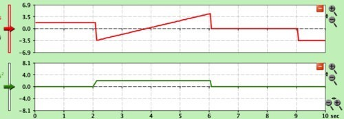

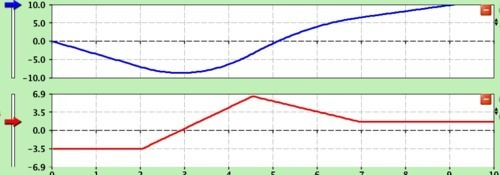

1. If an object has zero acceleration, does that mean it has zero velocity? Give an example.

2. If an object has zero velocity, does that mean it has zero acceleration? Give an example.

3. If the acceleration of a motorboat is 4.0 m/s_2_, and the motorboat starts from rest, what is its velocity after 6.0 s?

4. The friction of the water on a boat produces an acceleration of -10. m/s_2_. If the boat is traveling at 30. m/s and the motor is shut off, how long it take the boat to slow down to 5.0 m/s?

#### A car enters a freeway, uniform acceleration

An explanation of how to solve a sample uniform acceleration problem.

Video courtesy of jpbrody.

!?[0](https://www.youtube.com/watch?v=H9PCah71JhY)

Watch the video at: https://www.youtube.com/watch?v=H9PCah71JhY  

### Distance Covered By A Uniformly Accelerated Body

#### Displacement During Constant Acceleration

When acceleration is constant, there are three equations that relate displacement to two of the other three quantities we use to describe motion – time, velocity, and acceleration. These equations only work when acceleration is constant, but there are, fortunately, quite a few cases of motion where the acceleration is constant. One of the most common, if we ignore air resistance, are objects falling due to gravity.

When an object is moving with constant velocity, the displacement can be found by multiplying the velocity by the time interval, as shown in the equation below

**

$$
d = vt
$$

**

If the object is moving with constant acceleration, but not a constant velocity, we can use a derivation of this equation. Instead of using _v_, as velocity, we must calculate and use the average velocity using this equation:

**

$$
v_{\text{ave}} = \frac{1}{2} (v_f + v_i)
$$

**

The distance, then, for uniformly accelerating motion can be found by multiplying the average velocity by the time.

$$
d = \frac{1}{2}(v_f + v_i)(t) \qquad (\text{Equation} \ 1)
$$

We know that the final velocity for constantly accelerated motion can be found by multiplying the acceleration times time and adding the result to the initial velocity, **$v_f = v_i + at$.** 

The second equation that relates displacement, time, initial velocity, and final velocity is generated by substituting this equation into equation 1.

Start by distributing the 1/2 in equation 1 through:

$$
\begin{align*}
d &= \frac{1}{2} (v_f + v_i)(t) = \frac{1}{2} v_ft + \frac{1}{2} v_it \\
\end{align*}
$$

We know that **$v_f = v_i + at$**. Therefore:

$$
\begin{align*}
& \frac{1}{2} v_it + \frac{1}{2}(t)(v_i + at)\\
& = \frac{1}{2} v_it + \frac{1}{2} v_it + \frac{1}{2} at^2\\
& = v_it + \frac{1}{2} at^2 \qquad (\text{Equation} \ 2)
\end{align*}
$$

The third equation is formed by combining $v_f = v_i + at$ and $d = \frac{1}{2} (v_f + v_i)(t)$. If we solve the first equation for t and then substitute into the second equation, we get

$$
d=\left(\frac{1}{2}\right) (v_f+v_i) \left(\frac{v_f-v_i}{a}\right)=\left(\frac{1}{2}\right) \left(\frac{v^2_f-v^2_i}{a}\right)
$$

And solving for $v{_f}^2$ yields

$$
v{_f}^2 = v{_i}^2 + 2ad \qquad (\text{Equation} \ 3)
$$

Keep in mind that these three equations are only valid when acceleration is constant. In many cases, the initial velocity can be set to zero and that simplifies the three equations considerably. When acceleration is constant and the initial velocity is zero, the equations can be simplified to:

$$
\begin{align*}
d &= \frac{1}{2} \ v_f \ t\\
d &= \frac{1}{2} \ at^2 \ \text{   and}\\
v{_f}^2 &= 2ad.
\end{align*}
$$

#### Example:

Suppose a planner is designing an airport for small airplanes. Such planes must reach a speed of 56 m/s before takeoff and can accelerate at 12.0 m/s_2_. What is the minimum length for the runway of this airport?

**Solution:** The acceleration in this problem is constant and the initial velocity of the airplane is zero. Therefore, we can use the equation $v{_f}^2 = 2ad$ and solve for $d$.

$$
d=\frac{v{_f}^2}{2a}=\frac{(56 \ \text{m/s})^2}{(2)(12.0 \ \text{m/s}^2)}=130 \ \text{m}
$$

#### Example:

How long does it take a car to travel 30.0 m if it accelerates from rest at a rate of 2.00 m/s_2_?

**Solution:** The acceleration in this problem is constant and the initial velocity is zero, therefore, we can use $d = \frac{1}{2} at^2$ solved for $t$.

$$
t=\sqrt{\frac{2d}{a}}=\sqrt{\frac{(2)(30.0 \ \text{m})}{2.00 \ \text{m/s}^2}}=5.48 \ \text{s}
$$

#### Example:

A baseball pitcher throws a fastball with a speed of 30.0 m/s. Assume the acceleration is uniform and the distance through which the ball is accelerated is 3.50 m. What is the acceleration?

**Solution:** Since the acceleration is uniform and the initial velocity is zero, we can use $v{_f}^2 = 2ad$ solve for $a$.

$$
a=\frac{v_f^2}{2d}=\frac{(30.0 \ \text{m/s})^2}{(2)(3.50 \ \text{m})}=\frac{900. \ \text{m}^2/\text{s}^2}{7.00 \ \text{m}}=129 \ \text{m/s}^2
$$

Suppose we plot the velocity versus time graph for an object undergoing uniform acceleration. In this first case, we will assume the object started from rest.

If the object has a uniform acceleration of 6.0 m/s_2_ and started from rest, then each succeeding second, the velocity will increase by 6.0 m/s. Here is the table of values and the graph.

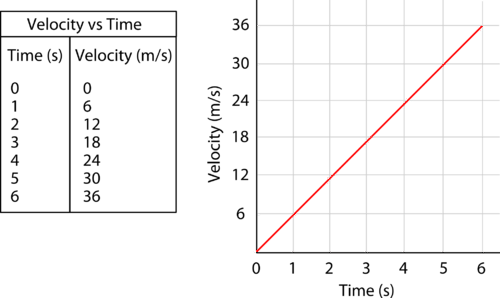

We know from geometry that the area of a triangle is calculated by multiplying one-half the base times the height. The area under the curve in the image above is the area of the triangle shown below. The area of this triangle would be calculated by $\text{area} = \left(\frac{1}{2}\right)(6.0 \ \text{s})(36 \ \text{m/s}) = 108 \ \text{m}$.

(6.0 \ \text{m/s}^2)(6.0 \ \text{s})^2 = 108 \ \text{m}$. ")

It is not coincidental that this number is the same as the area of the triangle. In fact, the area underneath the curve in a velocity versus time graph is always equal to the displacement that occurs during that time interval.

#### Summary

* There are three equations we can use when acceleration is constant to relate displacement to two of the other three quantities we use to describe motion – time, velocity, and acceleration: 
    * $d = \left(\frac{1}{2}\right)(v_f + v_i)(t)$ (Equation 1)
    * $d = v_it + \frac{1}{2} at^2$ (Equation 2)
    * $v{_f}^2 = v{_i}^2 + 2ad$ (Equation 3)
* When the initial velocity of the object is zero, these three equations become:
    * $d = \left(\frac{1}{2} \right)(v_f)(t)$ (Equation 1’)
    * $d = \frac{1}{2} at^2$ (Equation 2’)
    * $v{_f}^2 = 2ad$ (Equation 3’)
* The slope of a velocity versus time graph is the acceleration of the object.
* The area under the curve of a velocity versus time graph is the displacement that occurs during the given time interval.

---

#### Practice

Use this resource to answer the questions that follow.

Watch the video at: https://www.youtube.com/watch?v=d-_eqgj5-K8

!?[0](https://www.youtube.com/watch?v=d-_eqgj5-K8)

1. For the example in the video, what acceleration is used?

2. What time period is used in the example?

3. What does the slope of the line in the graph represent?

4. What does the area under the curve of the line represent?

#### Review

1. An airplane accelerates with a constant rate of 3.0 m/s_2_ starting at a velocity of 21 m/s. If the distance traveled during this acceleration was 535 m, what is the final velocity?

2. An car is brought to rest in a distance of 484 m using a constant acceleration of -8.0 m/s_2_. What was the velocity of the car when the acceleration first began?

3. An airplane starts from rest and accelerates at a constant 3.00 m/s_2_ for 20.0 s. What is its displacement in this time?

4. A driver brings a car to a full stop in 2.0 s. 

a) If the car was initially traveling at 22 m/s, what was the acceleration?

b) How far did the car travel during braking?

### Acceleration Due to Gravity

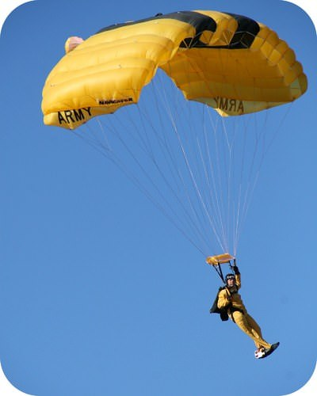

One of the most common examples of uniformly accelerated motion is that an object allowed to drop will fall vertically to the earth due to gravity. In treating falling objects as uniformly accelerated motion, we must ignore air resistance. Galileo’s original statement about the motion of falling objects is,

_At a given location on the earth and in the absence of air resistance, all objects fall with the same uniform acceleration._

We call this **acceleration due to gravity** on the earth and we give it the symbol $g$. The value of _$g$_ is 9.80 m/s_2_ in the downward direction. All of the equations involving constant acceleration can be used for falling bodies but we insert $g$ wherever “$a$” appeared and the value of $g$ is always 9.80 m/s_2__._ 

#### Example:

A rock is dropped from a tower 70.0 m high. How far will the rock have fallen after 1.00 s, 2.00 s, and 3.00 s? Assume the distance is positive downward.

**Solution:** We are looking for displacement and we have time and acceleration. Therefore, we can use $d = \frac{1}{2} at^2$.

Displacement after $1.00 \ \text{s} = \left(\frac{1}{2}\right)(9.80 \ \text{m/s}^2)(1.00 \ \text{s})^2 = 4.90 \ \text{m}$

Displacement after $2.00 \ \text{s} = \left(\frac{1}{2}\right)(9.80 \ \text{m/s}^2)(2.00 \ \text{s})^2 = 19.6 \ \text{m}$

Displacement after $3.00 \ \text{s} = \left(\frac{1}{2}\right)(9.80 \ \text{m/s}^2)(3.00 \ \text{s})^2 = 44.1 \ \text{m}$

#### Example: 

a) A person throws a ball upward into the air with an initial velocity of 15.0 m/s. How high will it go before it comes to rest?

b) How long will the ball be in the air before it returns to the person’s hand?

**Solution:** In part a), we know the initial velocity (15.0 m/s), the final velocity (0 m/s), and the acceleration (-9.80 m/s_2_). We wish to solve for the displacement, so we can use $v{_f}^2 = v{_i}^2 + 2ad$ and solve for $d$.

$$
d=\frac{v{_f}^2-v{_i}^2}{2a}=\frac{(0 \ \text{m/s})^2-(15.0 \ \text{m/s})^2}{(2)(9.80 \ \text{m/s}^2)}=11.5 \ \text{m}
$$

There are a number of methods by which we can solve part b). Probably the easiest is to divide the distance traveled by the average velocity to get the time going up and then double this number since the motion is symmetrical – that is, time going up equals the time going down.

The average velocity is half of 15.0 m/s, or 7.5 m/s, and dividing this into the distance of 11.5 m yields 1.53 sec. This is the time required for the ball to go up and the time for the ball to come down will also be 1.53 s, so the total time for the trip up and down is 3.06 sec.

#### Example:

A car accelerates with uniform acceleration from 11.1 m/s to 22.2 m/s in 5.0 s.

a) What was the acceleration and

b) How far did it travel during the acceleration?

**Solution:** 

a) $a=\frac{\Delta v}{\Delta t}=\frac{22.2 \ \text{m/s}-11.1 \ \text{m/s}}{5.0 \ \text{s}}=2.22 \ \text{m/s}^2$

b) We can find the distance traveled by $d = v_it + \frac{1}{2} at^2$, or we could find the distance traveled by determining the average velocity and multiply it by the time.

$$
\begin{align*}
d &= v_it + \frac{1}{2} at^2  \\
&= (11.1 \ \text{m/s})(5.0 \ \text{s}) + \left(\frac{1}{2}\right)(2.22 \ \text{m/s}^2)(5.0 \ \text{s})^2 \\
&= 55.5 \ \text{m} + 27.8 \ \text{m} \\
&= 83 \ \text{m}
\end{align*}
$$

$d = (v_{\text{ave}})(t) = (16.6 \ \text{m/s})(5.0 \ \text{s}) = 83 \ \text{m}$

#### Example:

A stone is dropped from the top of a cliff. It is hits the ground after 5.5 s. How high is the cliff?

**Solution:** 

$d = v_it + \frac{1}{2} at^2 = (0 \ \text{m/s})(5.5 \ \text{s}) + \left(\frac{1}{2}\right)(9.80 \ \text{m/s}^2)(5.5 \ \text{s})^2 = 150 \ \text{m}$

#### Summary

* At any given location on the earth and in the absence of air resistance, all objects fall with the same uniform acceleration.
* We call this acceleration the acceleration due to gravity on the earth and we give it the symbol $g$. 
* The value of _$g$_ is 9.80 m/s_2__._

#### Practice

This url shows a video of a discussion and demonstration of the acceleration due to gravity.

Watch the video at: http://www.youtube.com/watch?v=izXGpivLvgY

!?[0](https://www.youtube.com/watch?v=izXGpivLvgY)

1. What is the gravitational acceleration given in the video? Why does it differ from that given in this text?

2. Why does the ball travel further in later time intervals than in the earlier ones?

#### Review

1. A baseball is thrown vertically into the air with a speed of 24.7 m/s.

a) How high does it go? 

b) How long does the round trip up and down require?

2. A salmon jumps up a waterfall 2.4 m high. With what minimum speed did the salmon leave the water below to reach the top?

3. A kangaroo jumps to a vertical height of 2.8 m. How long will it be in the air before returning to earth?

### Free Fall - Example 2

Solving free fall problems where an object is thrown downwards using $v_f=v_i+at$

!?[undefined](media/131315.mp4 "video")

Watch the video at: http://www.ck12.org/flx/render/embeddedobject/131315

</article>

### 3.7 Position-Time and Velocity-Time Graphs

<article>

Students will learn how to graph motion vs time. Specifically students will learn how to take the slope of a graph and relate that to the instantaneous velocity or acceleration for position or velocity graphs, respectively. Finally students will learn how to take the area of a velocity vs time graph in order to calculate the displacement.

#### Key Equations

For a graph of position vs. time. The slope is the rise over the run, where the rise is the displacement and the run is the time. thus,

Slope = $v_{avg} = \frac{\Delta x}{\Delta t}$

**Note**: Slope of the tangent line for a particular point in time = the instantaneous velocity

For a graph of velocity vs. time. The slope is the rise over the run, where the rise is the change in velocity and the run is the time. thus,

Slope = $a_{avg} = \frac{\Delta v}{\Delta t}$

**Note**: Slope of the tangent line for a particular point in time = the instantaneous acceleration

> ### Guidance
> 
> * One must first read a graph correctly. For example on a position vs. time graph (thus the position is graphed on the $y$\-axis and the time on the $x$\-axis) for a given a data point, go straight down from it to get the time and straight across to get the position.
> * If there is constant acceleration the graph $x$ vs. $t$ produces a parabola. The slope of the $x$ vs. $t$ graph equals the instantaneous velocity. The slope of a $v$ vs. $t$ graph equals the acceleration.
> * The **slope** of the graph $v$ vs. $t$ can be used to find **acceleration;** the **area** of the graph $v$ vs. $t$ can be used to find **displacement.** Welcome to calculus!

#### What is a Graph

Watch the video at: https://www.youtube.com/watch?v=8_n_XEVN2X4

---

### Watch this Explanation

!?[0](https://www.youtube.com/watch?v=kFGfBCDr75Y)

Watch the video at: https://www.youtube.com/watch?v=kFGfBCDr75Y

!?[0](https://www.youtube.com/watch?v=b_p0ZG_9w0M)

Watch the video at: https://www.youtube.com/watch?v=b_p0ZG_9w0M

!?[0](https://www.youtube.com/watch?v=TXeL9bPkRwI)

Watch the video at: https://www.youtube.com/watch?v=TXeL9bPkRwI

#### Explore More

1. The position graph below is of the movement of a fast turtle who can turn on a dime.

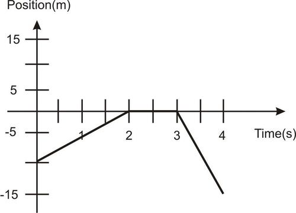

\[Figure 1\]---

a) Sketch the velocity vs. time graph of the turtle below.

 Explain what the turtle is doing (including both _speed_ and _direction_) from:")

i) 0-2s.

ii) 2-3s.

iii) 3-4s.

c) How much distance has the turtle covered after 4s?

d) What is the turtle’s displacement after 4s? 

2. Draw the position vs. time graph that corresponds to the velocity vs. time graph below. You may assume a starting position $x_0 = 0$. Label the $y-$axis with appropriate values.

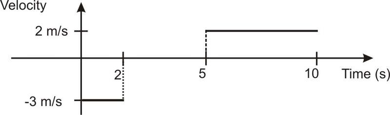

\[Figure 3\]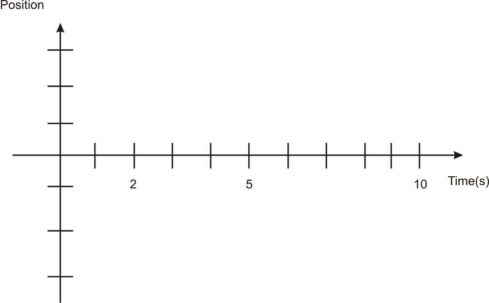\[Figure 4\]

The following velocity-time graph represents 10 seconds of actress Priyanka Chopra drive to work (it’s a rough morning).

 Fill in the tables below – remember that _displacement_ and _position_ are not the same thing!")

|     |     |     | **Instantaneous Time (s)** | **Position (m)** |
| --- | --- | --- | --- | --- |
| **Interval (s)** | **Displacement (m)** | **Acceleration$(m/s^2)$** | **0 sec** | **0 m** |
| 0-2 sec |     |     |     |     |
|     |     |     | 2 sec |     |
| 2-4 sec |     |     |     |     |
|     |     |     | 4 sec |     |
| 4-5 sec |     |     |     |     |
|     |     |     | 5 sec |     |
| 5-9 sec |     |     |     |     |
|     |     |     | 9 sec |     |
| 9-10 sec |     |     |     |     |
|     |     |     | 10 sec |     |

---

b) On the axes below, draw an _acceleration-time_ graph for the car trip. Include numbers on your acceleration axis.

 On the axes below, draw a _position-time_ graph for the car trip. Include numbers on your position axis. Be sure to note that some sections of this graph are linear and some curve – why?")

1c. 25 m

1d. -5 m

2. discuss in class

3. discuss in class

</article>

### 3.8 Scalar and Vector Quantities

<article>

Physical quantities that have only magnitude are scalars. Eg: mass of potatoes, distance travelled by a car, etc.

Vector quantities on the other hand have both magnitude and direction. Eg: weight of potatoes, displacement of a car, etc.

</article>

### 3.9 Vectors and their Application to Describe Motion

<article>

### Resolving Vectors into Axial Components

We know that when two vectors are in the same dimension, they can be added arithmetically.  Suppose we have two vectors that are on a north-south, east-west grid, as shown below.  One of the methods we can use to add these vectors is to resolve each one into a pair of vectors that lay on the north-south and east-west axes. 

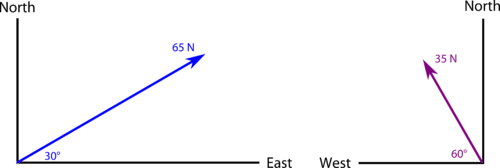

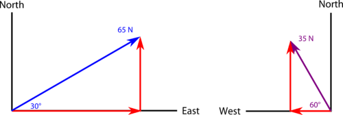

Using trigonometry, we can resolve (break down) each of these vectors into a pair of vectors that lay on the axial lines (shown in red above).

The east-west component of the first vector is (65 N)(cos 30° ) = (65 N)(0.866) = 56.3 N east

The north-south component of the first vector is (65 N)(sin 30°) = (65 N)(0.500) = 32.5 N north

The east-west component of the 2_nd_ vector is (35 N)(cos 60°) = (35 N)(0.500) = 17.5 N west

The north-south component of the 2_nd_ vector is (35 N)(sin 60°) = (35 N)(0.866) = 30.3 N north

#### Summary

* Vectors can be resolved into component vectors that lie on the axes lines.

#### Practice

Watch the video at: http://www.youtube.com/watch?v=NHnOwJE5Who

!?[0](https://www.youtube.com/watch?v=NHnOwJE5Who)

1. What does SohCahToa mean? 

2. Why is SohCahToa relevant to resolving a vector into components?

3. Why is the sum of the components larger than the resultant vector?

#### Review

1. A force of 150. N is exerted 22° north of east.  Find the northward and eastward components of this force.

2. An automobile travels a displacement of 75 km 45° north of east.  How far east does it travel and how far north does it travel?

### Graphically Adding and Resolving Vectors

#### Vectors

A **scalar** is a quantity of magnitude without direction.

A **vector** is a quantity of magnitude and direction and is often represented with an arrow.

What are examples of scalars and vectors?

#### Graphical Addition of Vectors

While adding vectors in 2-dimensions, like the vectors below, use the “tip-to-tail” method.

---

")

\[Figure 4\]

Align the vectors with the tip of one at the tail of the other and draw a vector from the exposed tail of one vector to the tip of the other.

How can you find the magnitude of the resulting vector?

In the above example, the vectors being added are conveniently perpendicular to each other, but vectors do not have to be perpendicular to be added together.  What other methods can you use to find the magnitude of the resulting vector if the vectors aren't perpendicular to each other?

How do you add vectors in 1-dimension?

#### Resolving Vectors

While at times it is important to add vectors, vectors are easier to work with while they are in their axial components.

Describe how you can resolve vectors into _x_ and _y_ components if you are given the magnitude and an angle of the vector.

For guidance in answering the questions in this guide, consult with the embedded links above.

### Graphical Methods Vector Addition

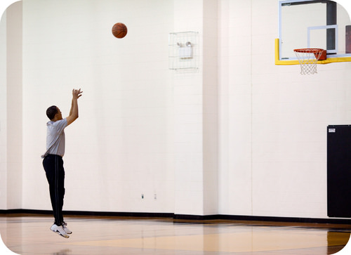

In physics, a quantity, such as mass, length, or speed that is completely specified by its magnitude and has no direction is called a **scalar**_._ A **vector**, on the other hand, is a quantity possessing both magnitude and direction. A vector quantity is typically represented by an arrow-tipped line segment. The length of the line, drawn to scale, represents the magnitude of the quantity. The direction of the arrow indicates the direction of the vector. Not only can vectors be represented graphically, but they can also be added graphically.

For one dimensional **vector** **addition**, the first vector is placed on a number line with the tail of the vector on the origin.  The second vector is placed with its tail exactly on the arrow head of the first vector.  The sum of the two vectors is the vector that begins at the origin and ends at the arrow head of the final added vector.

Consider the following two vectors.

 and ends at the arrow head of the second (blue) vector. So the sum of these two vectors is the purple vector, as shown below.")

#### Adding Vectors in Two Dimensions

In the following image, vectors $A$ and $B$ represent the two displacements of a person who walked 90. m east and then 50. m north. We want to add these two vectors to get the vector sum of the two movements.

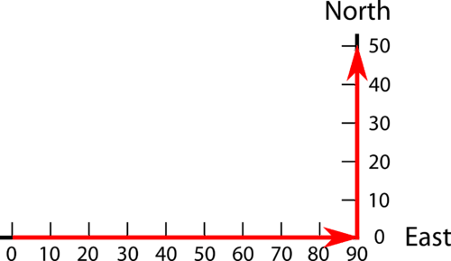

The sum of the two vectors is the vector that begins at the origin of the first vector and goes to the ending of the second vector, as shown below.

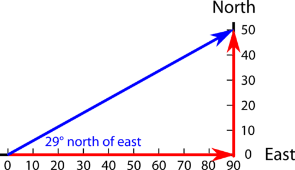

If we are using calculation means, we can divide 50. m by 90. m and determine inverse tangent of the dividend. The result of 29.05 indicates the angle of 29° north of east. The length of the sum vector can also be determined mathematically by the Pythagorean theorem, $a^2 + b^2 = c^2$.  In this case, the length of the hypotenuse would be the square root of (8100 + 2500) or 103 m.

If three or four vectors are to be added by graphical means, we would continue to place each new vector head to toe with the vectors to be added until all the vectors were in the coordinate system. The sum vector is the vector from the origin of the first vector to the arrowhead of the last vector. The magnitude and direction of the sum vector can be measured.

#### Summary

* Scalars are quantities, such as mass, length, or speed, that are completely specified by magnitude and have no direction.
* Vectors are quantities possessing both magnitude and direction and can be represented by an arrow; the direction of the arrow indicates the direction of the quantity and the length of the arrow is proportional to the magnitude.
* Vectors that are in one dimension can be added arithmetically.
* Vectors that are in two dimensions are added geometrically.
* When vectors are added graphically, graphs must be done to scale and answers are only as accurate as the graphing.

#### Practice

Use this resource to answer the following questions about adding vectors

Watch the video at: https://www.youtube.com/watch?v=PqThckE1C3I

!?[0](https://www.youtube.com/watch?v=PqThckE1C3I)

1. What is a resultant?

2. What are the steps necessary to add vectors in two dimensions?

#### Review

1. On the following number line, add the vector 7.5 m/s and the vector -2.0 m/s.

### Vector Addition

**Adding Vectors in Two Dimensions**

In the following image, vectors $A$ and $B$ represent the two displacements of a person who walked 90-m east and then 50-m north.  We want to add these two vectors to get the vector sum of the two movements.

The sum of the two vectors is the vector that begins at the origin of the first vector and goes to the ending of the second vector, as shown below.

If we are using calculation, we first determine the inverse tangent of 50 units divided by 90 units and get the angle of 29° north of east. The length of the sum vector can then be determined mathematically by the Pythagorean theorem,  $a^2 + b^2 = c^2$.  In this case, the length of the hypotenuse would be the square root of (8100 + 2500), or 103 units.

If three or four vectors are to be added by graphical means, we would continue to place each new vector head to toe with the vectors to be added until all the vectors were in the coordinate system. The resultant, or sum, vector would be the vector from the origin of the first vector to the arrowhead of the last vector; the magnitude and direction of this sum vector would then be measured.

#### Mathematical Methods of Vector Addition

We can add vectors mathematically using trig functions, the law of cosines, or the Pythagorean theorem.

If the vectors to be added are at right angles to each other, such as the example above, we would assign them to the sides of a right triangle and calculate the sum as the hypotenuse of the right triangle. We would also calculate the direction of the sum vector by using an inverse sin or some other trig function.

Suppose, however, that we wish to add two vectors that are not at right angles to each other. Let’s consider the vectors in the following images.

We know that vectors in the same dimension can be added by regular arithmetic. Therefore, we can resolve each of these vectors into components that lay on the axes as pictured below. The **resolution of vectors** reduces each vector to a component on the north-south axis and a component on the east-west axis. 

The east-west component of the first vector is (65 N)(cos 30°) = (65 N)(0.866) = 56.3 N north

The north-south component of the first vector is (65 N)(sin 30°) = (65 N)(0.500) = 32.5 N north

The east-west component of the second vector is (35 N)(cos 60°) = (35 N)(0.500) = 17.5 N west

The north-south component of the second vector is (35 N)(sin 60°) = (35 N)(0.866) = 30.3 N north

The sum of the two east-west components is 56.3 N - 17.5 N = 38.8 N east

The sum of the two north-south components is 32.5 N + 30.3 N = 62.8 N north

We can now consider those two vectors to be the sides of a right triangle and find the length and direction of the hypotenuse using the Pythagorean Theorem and trig functions.

$$
c=\sqrt{38.8^2+62.8^2}=74 \ \text{N}
$$

$\sin \ x=\frac{62.8}{74} \ \text{so} \ x=\sin^{-1} 0.84 \ \text{so} \ x=58^\circ$

The direction of the sum vector is 74 N at 58° north of east.

Perpendicular vectors have no components in the other direction. For example, if a boat is floating down a river due south, and you are paddling the boat due east, the eastward vector has no component in the north-south direction and therefore, has no effect on the north-south motion. If the boat is floating down the river at 5 mph south and you paddle the boat eastward at 5 mph, the boat continues to float southward at 5 mph. The eastward motion has absolutely no effect on the southward motion. Perpendicular vectors have NO effect on each other.

**Example Problem:** A motorboat heads due east at 16 m/s across a river that flows due north at 9.0 m/s.

a) What is the resultant velocity of the boat?

b) If the river is 135 m wide, how long does it take the boat to reach the other side?

c) When the boat reaches the other side, how far downstream will it be?

**Solution:**

Sketch:

 Since the two motions are perpendicular to each other, they can be assigned to the legs of a right triangle and the hypotenuse (resultant) calculated.")

$$
c=\sqrt{a^2+b^2}=\sqrt{(16 \ \text{m/s})^2+(9.0 \ \text{m/s})^2}=18 \ \text{m/s}
$$

$\sin \theta=\frac{9.0}{18}=0.500 \ \text{and therefore} \ \theta=30^\circ$

The resultant is 18 m/s at 30° north of east.

b) The boat is traveling across the river at 16 m/s due to the motor.  The current is perpendicular and therefore has no effect on the speed across the river.  The time required for the trip can be determined by dividing the distance by the velocity.

$$
t=\frac{d}{v}=\frac{135 \ \text{m}}{16 \ \text{m/s}}=8.4 \ \text{s}
$$

c) The boat is traveling across the river for 8.4 seconds and therefore, it is also traveling downstream for 8.4 seconds.  We can determine the distance downstream the boat will travel by multiplying the speed downstream by the time of the trip.

$$
d_{\text{downstream}} = (v_{\text{downstream}})(t) = (9.0 \ \text{m/s})(8.4 \ \text{s}) = 76 \ \text{m}
$$

#### Summary

* Vectors can be added mathematically using geometry and trigonometry.
* Vectors that are perpendicular to each other have no effect on each other.
* Vector addition can be accomplished by resolving the vectors to be added into components those vectors, and then completing the addition with the perpendicular components.

#### Practice

A video demonstrating the component method of vector addition.

Watch the video at: http://www.youtube.com/watch?v=nFDzRWw08Ew

!?[0](https://www.youtube.com/watch?v=nFDzRWw08Ew)

1. What are the steps the teacher undertakes in order to calculate the resultant vector in this problem?

2. How does she find the components of the individual vectors?

3. How does she use the individual vector’s components to find the components of the resultant vector?

4. Once the components are determined, how does she find the overall resultant vector?

#### Review

1. A hiker walks 11 km due north from camp and then turns and walks 11 km due east.

a) What is the total distance walked by the hiker?

b) What is the displacement (on a straight line) of the hiker from the camp?

2. While flying due east at 33 m/s, an airplane is also being carried due north at 12 m/s by the wind.  What is the plane’s resultant velocity?

3. Two students push a heavy crate across the floor.  John pushes with a force of 185 N due east and Joan pushes with a force of 165 N at 30° north of east.  What is the resultant force on the crate?

4. An airplane flying due north at 90. km/h is being blown due west at 50. km/h.  What is the resultant velocity of the plane?

</article>

### 3.10 Motion in a Plane

<article>

### Free Fall

**Free fall** is an idealized state of motion in which air resistance is neglected and only gravity acts upon a falling object.  We consider situations in which objects are in free fall, after being launched with a certain horizontal velocity. Examples of such motion would be a baseball thrown with an initial horizontal velocity (a “line-drive”) or rifle aimed horizontally and shot. We will discuss the more general case of an object fired at some angle above the horizontal in the next section.

Take two pennies and place them on a table top. Position one penny close to the edge of the table. Then, slide the other penny into the stationary penny with a glancing (very off center) blow. Both pennies will fall off of the table, but the one that was motionless will fall almost straight down (you may have to try this several times) while the other penny should slide off the table with an evident horizontal velocity. Have a friend watch the result to confirm that the pennies impact the ground at about the same instant. Gravity does not care how fast an object moves horizontally (just as the forward motion of the boat, in the last section, was unaffected by the current.)

The faster-moving penny follows an obvious parabolic path to the ground. The parabola is the result of the penny engaged in two one-dimensional motions, simultaneously: horizontal motion at a constant velocity (air resistance is negligible) and vertically accelerated motion due to gravity. Because the penny accelerates vertically, it does not move equal distances in equal times, as is the case for the horizontal direction. If the horizontal and vertical distances stayed in a fixed ratio to each other, the penny would appear to fall diagonally, not with the curve of a parabola.

http://groups.physics.umn.edu/demo/mechanics/movies/1D6020.mov

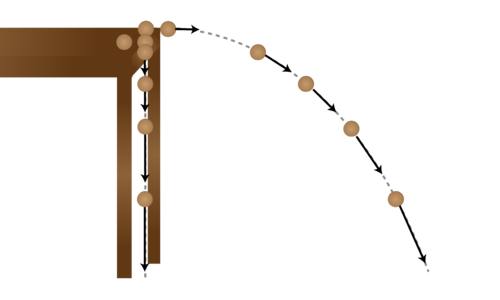

</article>

### 3.11 Projectile Motion

<article>

### Projectile Motion

The aim here is to understand and explain the parabolic motion of a thrown object, known as projectile motion. Motion in one direction is unrelated to motion in other perpendicular directions. Once the object has been thrown, the only acceleration is in the $y$ (up/down) direction due to gravity. The $x$ (right/left) direction velocity remains unchanged.

> ### Guidance
> 
> * In projectile motion, the horizontal displacement of an object from its starting point is called its _range._
> 
> * Vertical ($y$) speed is zero only at the highest point of a thrown object's flight.
> 
> * Since in the absence of air resistance there is no acceleration in the horizontal direction, this component of velocity does not change over time. This is a counter-intuitive notion for many. (Air resistance will cause velocity to decrease slightly or significantly depending on the object. But this factor is ignored for the time being.)
> 
> * Motion in the vertical direction must include the acceleration due to gravity, and therefore the velocity in the vertical direction changes over time.
> 
> * The shape of the path of an object undergoing projectile motion in two dimensions is a parabola.

#### Watch this Explanation

Watch the video at: https://www.youtube.com/watch?v=D1Bw0b6WuIQ

#### Simulations

](http://phet.colorado.edu/sims/projectile-motion/projectile-motion_en.html)")

#### Practice

1. Determine which of the following is in projectile motion. Remember that “projectile motion” means that gravity is the only means of acceleration for the object.

a) A jet airplane during takeoff.

b) A spacecraft just after all the rockets turn off in Earth orbit.

c) A basketball thrown towards a basket.

d) A bullet shot out of a gun.

e) An inter-continental ballistic missile.

f) A package dropped out of an airplane as it ascends upward with constant speed.

2. Decide if each of the statements below is True or False. Then, explain your reasoning.

a) At a projectile’s highest point, its velocity is zero.

b) At a projectile’s highest point, its acceleration is zero.

c) The rate of change of the $x$ position is changing with time along the projectile path.

d) The rate of change of the $y$ position is changing with time along the projectile path.

e) Suppose that after 2 s, an object has traveled 2 m in the horizontal direction. If the object is in projectile motion, it must travel 2 m in the vertical direction as well.

f) Suppose a hunter fires his gun. Suppose as well that as the bullet flies out horizontally and undergoes projectile motion, the shell for the bullet falls directly downward. Then, the shell hits the ground before the bullet.

3. Imagine the path of a soccer ball in projectile motion. Which of the following is true at the highest point in its flight?

a) $v_x = 0, v_y = 0, a_x =0, a_y = 0$.

b) $v_x > 0, v_y = 0, a_x =0, a_y = 0$.

c) $v_x = 0, v_y = 0, a_x =0, a_y = -9.8\ \text{m/s}^2$.

d) $v_x > 0, v_y = 0, a_x =0, a_y = -9.8\ \text{m/s}^2$.

4. A hunter with an air blaster gun is preparing to shoot at a monkey hanging from a tree. He is pointing his gun directly at the monkey. The monkey’s got to think quickly! What is the monkey’s best chance to avoid being smacked by the rubber ball?

a) The monkey should stay right where he is: the bullet will pass beneath him due to gravity.

b) The monkey should let go when the hunter fires. Since the gun is pointing right at him, he can avoid getting hit by falling to the ground.

c) The monkey should stay right where he is: the bullet will sail above him since its vertical velocity increases by 9.8 m/s every second of flight.

d) The monkey should let go when the hunter fires. He will fall faster than the bullet due to his greater mass, and it will fly over his head.

5. You are riding your bike in a straight line with a speed of 10 m/s. You accidentally drop your calculator out of your backpack from a height of 2.0 m above the ground. When it hits the ground, where is the calculator in relation to the position of your backpack? (Neglect air resistance.)

a) You and your backpack are 6.3 m ahead of the calculator.

b) You and your backpack are directly above the calculator.

c) You and your backpack are 6.3 m behind the calculator.

d) None of the above.

### Real World Example - Maximum Range

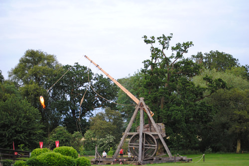

#### Why It Matters

* When projectile motion is discussed in physics it is usually under ideal conditions. Ideal conditions for projectile motion would be where there is no change in gravitational acceleration and air resistance is non-existent. Under these conditions the maximum range is defined by the following equation:

$$
Range = \frac{v \cos \theta}{g} \left(v \sin \theta + \sqrt{v^2 \sin^2 \theta + 2 gy_o}\right)
$$

* In this equation, $\theta$ is the angle the projectile is launched at with respect to the horizontal, $v$ is the velocity and $y$ is the vertical distance the object is displaced through. Because the equation is assuming ideal conditions, slight adjustments need to be made for real life applications. For example, when launching artillery shells or in the Olympic shot put event, air resistance reduces the optimal angle that a projectile must be released at to achieve the optimal range. In these cases, the optimal range is slightly lower than 45°.

---

#### Can You Apply It?

Using the information provided above, answer the following questions.

1. Using the following identity: $\sin \theta \cos \theta = \sin 2 \theta$, show that the range equation given above reduces to $Range = \frac{v^2 \sin 2 \theta}{g}$ when the projectile lands at the same height it was launched?

2. Using the solution to the previous problem, if the initial velocity is doubled, the range is increased by a factor of?

3. The range equation for projectile motion helps validate that the motion of an object can be separated into motion along its coordinate axis, True or False?

---

### Projectile Motion Problem Solving

Students will learn how to use the equations of motion in two dimensions in order to solve problems for projectiles. It is necessary to understand how to break a vector into its _x_ and _y_ components.

#### Key Equations

**Break the Initial Velocity Vector into its Components**

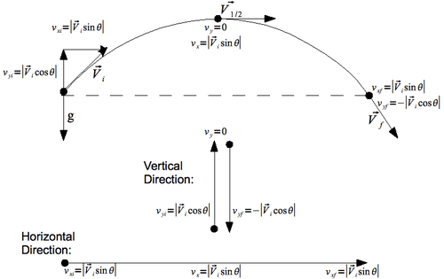

$$
\begin{align*}
\mathbf{Vertical \ Direction} && \mathbf{Horizontal \ Direction}\\
y(t)  = y_i +v_{iy} t - \frac{1}{2} g t^2 && x(t) = x_{i} +v_{ix}t\\
v_{y}(t)  = v_{iy} -gt && v_{x}(t) = v_{ix} \\
{v_y}^2  = {v_{0y}}^2 - 2g (\Delta y) && \\
a_y = -g = -9.8 \ \text{m/s}^2  \approx -10 \ \text{m/s}^2 && a_x = 0
\end{align*}
$$

> ### Guidance
> 
> * To work these problems, separate the “Big Three” equations into two sets: one for the vertical direction, and one for the horizontal. Keep them separate.
> * The only variable that can go into both sets of equations is time; use time to communicate between the _x_ and _y_ components of the object's motion.

#### Example 1

Asha discovers a car at the bottom of a 72 m cliff. How fast was the car going if it landed 22 m horizontally from the cliff’s edge? (Note that the cliff is flat, i.e. the car came off the cliff horizontally).

_Question:_ $v = \ ? \ [m/s]$

_Given:_ $h = \Delta y = 72 \ m$

$d = \Delta x = 22 \ m$

$g = 10.0 \ m/s^2$

_Equation:_ $h = v_{iy} t + \frac{1}{2} gt^2$ and $d = v_{ix} t$

_Plug n’ Chug:_ Step 1: Calculate the time required for the car to freefall from a height of 72 m.

$h = v_{iy} t + \frac{1}{2} gt^2$ but since $v_{iy}=0$, the equation simplifies to $h = \frac{1}{2} gt^2$ rearranging for the unknown variable, $t$, yields

$$
t = \sqrt{\frac{2h}{g}} = \sqrt{\frac{2(72 \ m)}{10.0 \ m/s^2}} = 3.79 \ s
$$

Step 2: Solve for initial velocity:

$$
v_{ix} = \frac{d}{t} = \frac{22 \ m}{3.79 \ s} = 5.80 \ m/s
$$

_Answer:_

_

$$
\boxed{\mathbf{5.80 \ m/s}}
$$

_

**Question**: A ball of mass $m$ is moving horizontally with a speed of $v_i$ off a cliff of height $h$. How much time does it take the ball to travel from the edge of the cliff to the ground? Express your answer in terms of $g$ (acceleration due to gravity) and $h$ (height of the cliff).

**Solution**: Since we are solving or how long it takes for the ball to reach ground, any motion in the $x$ direction is not pertinent. To make this problem a little simpler, we will define down as the positive direction and the top of the cliff to be $y=0$. In this solution we will use the equation

$$
y(t)=y_o+v_{oy}t+\frac{1}{2}gt^2.
$$

$$
\begin{align*}
y(t)&=y_o+v_{oy}t+\frac{1}{2}gt^2 && \text{start with the equation}\\
h&=y_o+v_{oy}t+\frac{1}{2}gt^2 && \text{substitute } h \text{ for } y(t) \text{ because that's the position}\\
& && \text{ of the ball when it hits the ground after time } t\\
h&=0+v_{oy}+\frac{1}{2}gt^2 && \text{substitute } 0 \text{ for } y_o \text{because the ball starts at the top of the cliff}\\
h&=0+0+\frac{1}{2}gt^2 && \text{substitute } 0 \text{ for } v_{oy} \text{ becauese the ball starts with no vertical}\\
& && \text{component to it's velocity}\\
h&=\frac{1}{2}gt^2 && \text{simplify the equation}\\
t&=\sqrt{\frac{2h}{g}} && \text{solve for } t
\end{align*}
$$

#### Watch this Explanation

Watch the video at: https://www.youtube.com/watch?v=-yxDgwsA2Io

#### Practice

1. A stone is thrown horizontally at a speed of 8.0 m/s from the edge of a cliff 80 m in height. How far from the base of the cliff will the stone strike the ground?

2. A toy truck moves off the edge of a table that is 1.25 m high and lands 0.40 m from the base of the table.

a) How much time passed between the moment the car left the table and the moment it hit the floor?

b) What was the horizontal velocity of the car when it hit the ground?

3. A hawk in level flight 135 m above the ground drops the fish it caught. If the hawk’s horizontal speed is 20.0 m/s, how far ahead of the drop point will the fish land?

4. A pistol is fired horizontally toward a target 120 m away, but at the same height. The bullet’s velocity is 200 m/s. How long does it take the bullet to get to the target? How far below the target does the bullet hit?

5. A bird, traveling at 20 m/s, wants to hit a waiter 10 m below with his dropping (see image). In order to hit the waiter, the bird must release his dropping some distance before he is directly overhead. What is this distance?

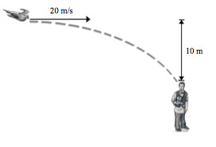

a) How long is the ball in the air? _Hint:_ you may assume that the ball lands at same height as it starts at.

b) What are the range and maximum height of the ball?

7. Beckham throws a football. He throws it with an initial velocity of 30 m/s at an angle of $25^\circ$. How much time passes until the ball travels 35 m horizontally? What is the height of the ball after 0.5 seconds? (Assume that, when thrown, the ball is 2 m above the ground.)

8. Pablo Sandoval throws a baseball with a horizontal component of velocity of 25 m/s. After 2 seconds, the ball is 40 m above the release point. Calculate the horizontal distance it has traveled by this time, its initial vertical component of velocity, and its initial angle of projection. Also, is the ball on the way up or the way down at this moment in time?

9. Yuvraj Singh hits a ball that lands in the stands at an altitude 30 m above its starting altitude. Assuming that the ball left the bat at an angle of $45^\circ$ from the horizontal, calculate how long the ball was in the air.

10. A golfer can drive a ball with an initial speed of 40.0 m/s. If the tee and the green are separated by 100 m, but are on the same level, at what angle should the ball be driven? (_Hint:_ you should use $2\cos(x)\sin(x) = \sin(2x)$ at some point.)

11. How long will it take a bullet fired from a cliff at an initial velocity of 700 m/s, at an angle $30^\circ$ below the horizontal, to reach the ground 200 m below?

12. A diver in Hawaii is jumping off a cliff 45 m high, but she notices that there is an outcropping of rocks 7 m out at the base. So, she must clear a horizontal distance of 7 m during the dive in order to survive. Assuming the diver jumps horizontally, what is his/her minimum push-off speed?

13. If Monte Ellis can jump 1.0 m high on Earth, how high can he jump on the moon assuming same initial velocity that he had on Earth (where gravity is $\frac{1}{6}$ that of Earth’s gravity)?

14. James Bond is trying to jump from a helicopter into a speeding Corvette to capture the bad guy. The car is going 30.0 m/s and the helicopter is flying completely horizontally at 100 m/s. The helicopter is 120 m above the car and 440 m behind the car. How long must James Bond wait to jump in order to safely make it into the car?

 field goal. He kicks it with an initial velocity of 22 m/s at an angle of $55^\circ$. The field goal posts are 3 meters high.")

 Does he make the field goal?")

b) What is the ball’s velocity and direction of motion just as it reaches the field goal post (_i.e.,_ after it has traveled $40\;\mathrm{m}$ in the horizontal direction)?

16. In a football game a punter kicks the ball a horizontal distance of 43 yards (39 m). On TV, they track the hang time, which reads 3.9 seconds. From this information, calculate the angle and speed at which the ball was kicked. _(Note for non-football watchers: the projectile starts and lands at the same height. It goes 43 yards horizontally in a time of 3.9 seconds)_

#### Answers to Selected Problems

1. 32 m

2. a) 0.5 s

b) 0.8 m/s

3. 104 m

4. $t = 0.60  \ s, 1.8 \ m$ below target

5. 28 m.

6. a) 3.5 s.

b) 35 m; 15 m

7. 1.3 seconds, 7.1 meters

8. 50 m; $v_{0y} = 30 \ m/s$; 50°; on the way up

9. 4.4 s

10. $19^\circ$

11. 0.5 s

12. 2.3 m/s

13. 6 m

14. 1.4 seconds

15. a) yes

b) 14 m/s @ 23 degrees from horizontal

16. 22 m/s @ 62 degrees

### Projectile Motion Problem

An example of projectile motion that uses an amusing real-world situation.

!?[0](https://www.youtube.com/watch?v=-yxDgwsA2Io)

Watch the video at: https://www.youtube.com/watch?v=-yxDgwsA2Io

### Parabolic Projectile Motion - Overview

Overview

!?[undefined](media/131329.mp4 "video")

Watch the video at: http://www.ck12.org/flx/render/embeddedobject/131329

### Projectile Motion for an Object Launched Horizontally

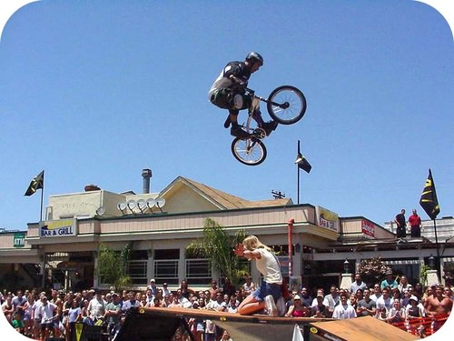

Objects that are launched into the air are called **projectiles**. The path followed by a projectile in motion is called a **trajectory**. The image of the snowboarder in the chapter introduction showed his trajectory; every object has a trajectory even when we cannot see it. **Projectile motion**, or the object's trajectory, is described in terms of position, velocity, and acceleration. Even with only an object's current location, velocity, and acceleration, we can calculate when and where the object will land. Our knowledge that perpendicular components of vectors do not affect each other allow us to easily analyze the motion of projectiles.

 are dropped at the same time.  The red ball is released with no horizontal motion and the blue ball is dropped but also given a horizontal velocity of 10 m/s.  As the balls fall to the floor, a photograph is taken every second so that in 5 seconds, we have 5 images of the two balls.  Each vertical line on the diagram represents 5 m. Since the blue ball has a horizontal velocity of 10 m/s, you will see that for every second, the blue ball has moved horizontally 10 m.  That is, in each second, the blue ball has increased its horizontal distance by 10 m. This horizontal motion is due to the ball's constant velocity.")

The red ball was dropped straight down with no horizontal velocity and therefore, in each succeeding second, the red ball falls straight down with no horizontal motion. The increasing distances between seconds in the red ball's motion indicates that this motion is accelerating.

A very important point here is that the vertical motion of these two balls is identical.  That is, they each fall exactly the same distance vertically in each succeeding second. The constant horizontal velocity of the blue ball has no effect on its accelerated vertical motion. Therefore, the vertical motion of the blue ball can be analyzed exactly the same as the vertical motion of the red ball.

**Example Problem:**  If an arrow is fired from a bow with a perfectly horizontal velocity of 60.0 m/s and the arrow was 2.00 m above the ground when the it was released, how far will the arrow fly horizontally before it strikes the ground?

**Solution:** This problem is solved by determining how long it takes the arrow to fall to the ground in exactly the same manner as if the arrow was dropped with no horizontal velocity. The time required for the arrow to fall to the ground will be the same time that the arrow flies horizontally at 60.0 m/s, so

$d = \frac{1}{2} at^2 \ \text{solved for} \ t=\sqrt{\frac{2d}{a}} = \sqrt{\frac{(2)(2.00 \ \text{m})}{9.80 \ \text{m/s}^2}}=0.639 \ \text{s}$

The time required for the fall is multiplied by the horizontal velocity to get the horizontal distance.

$$
d_{\text{horizontal}} = (v_{\text{horizontal}})(\text{time}) = (60.0 \ \text{m/s})(0.639 \ \text{s}) = 38.3 \ \text{m}
$$

**Example Problem:** A rock was thrown horizontally from a 100.0 m high cliff. It strikes the ground 90.0 m from the base of the cliff. At what speed was it thrown?

**Solution:** We can calculate how long it takes for a rock to free fall 100.0 m and then divide this time into the horizontal distance to get the horizontal velocity.

$$
\begin{align*}
t&=\sqrt{\frac{2d}{a}}=\sqrt{\frac{(2)(100.0 \ \text{m})}{9.80 \ \text{m/s}^2}}=4.52 \ \text{s} \\
v&=\frac{d}{t}=\frac{90.0 \ \text{m}}{4.52 \ \text{s}}=19.9 \ \text{m/s}
\end{align*}
$$

#### Summary

* Perpendicular components of vectors do not influence each other.
* The horizontal motion of a projectile does not influence its free fall.

#### Practice

The following video is a clip from Mythbusters, testing the “myth” that a bullet dropped at the same moment and from the same height as one shot from a gun will also hit the ground instantaneously.

---

Watch the video at: https://www.youtube.com/watch?v=abUBrQmI33Q

!?[0](https://www.youtube.com/watch?v=abUBrQmI33Q)

1. What was the problem the mythbusters had with the dropped bullet? Why was fixing this so important?

2. Why did they move the bullet being dropped to 109.7 m away?

3. What was the final result?

4. What are some possible reasons that the bullets didn't hit the ground at exactly the same time?

#### Review

1. If a bullet is fired from a high powered rifle at the exact time a duplicate bullet is dropped by hand near the barrel of the rifle, which bullet will hit the ground first?

a) the one dropped straight down

b) the one fired horizontally

c) both will hit the ground at the same time

2. A cannon is fired from the edge of a small cliff.  The height of the cliff is 80.0 m.  The cannon ball is fired with a perfectly horizontal velocity of 80.0 m/s.  How far will the cannon ball fly horizontally before it strikes the ground?

3. A cliff diver running 3.60 m/s dives out horizontally from the edge of a vertical cliff and reaches the water below 2.00 s later.  How high is the cliff and how far from the base of the cliff did the diver hit the water?

</article>

### 3.12 Uniform Circular Motion

<article>

### Circular Motion

#### Objectives

Students will learn that in circular motion there is always an acceleration (and hence a force) that points to the center of the circle defined by the objects motion. This force changes the direction of the velocity vector of the object but not the speed. Students will also learn how to calculate that speed using the period of motion and the distance of its path (circumference of the circle it traces out).

#### Vocabulary

* **centripetal acceleration:** The inward acceleration that keeps an object in circular motion.
* **centripetal force:** Force that is directed towards the centre.

#### Introduction

A satellite orbits around the Earth in **Figure** [below](#x-ck12-MjAxMjEyMDYxMzU0ODE0ODI2NTgyODUxXzg4YzYyODM3MzE3ZmQwNDdhZWNiZDk4MzI2MjdhMzY4LTIwMTIxMjA2MTM1NDgxNTI1MzU3ODU2Nw..). A car travels around a curve in **Figure** [below](#x-ck12-MjAxMjEyMDYxMzU0ODE0ODI2NjAyMDMzXzMzMjA4MjhhYTk0YWY2MmMzNzRkZGUzMTQ3ZjZkYWEzLTIwMTIxMjA2MTM1NDgxNTI1Mzc5MTg5Mg..). All of these objects are engaged in circular motion. Let us consider the satellite first. The satellite is held in place by the Earth’s gravity. The gravity holds the satellite in its orbit. In what direction does this force act? If the earth were “magically” gone, the satellite would fly off tangent to its motion at the instant gravity no longer held it. The force preventing this from happening must keep pulling the satellite toward the center of the circle to maintain circular motion.

")

\[Figure 2\]

**Figure** [below](#x-ck12-OTgwNDUtMTM1NzU5MTkxNy0zMS04Ni1QaHktSW50LUhvbm9ycy0wNS0xOQ..) shows the top view of a car moving around a circular track with a constant speed. Since acceleration is defined as $a = \frac{\Delta v}{\Delta t}$, you may be tempted to say that since the speed remains constant, $\Delta v = 0$, the acceleration must also be zero. But that conclusion would be incorrect because $\Delta v$ represents a change in velocity, not a change in speed. The velocity of the car is not constant since it is continuously changing its direction. How then do we find the acceleration of the car?

**Figure** [below](#x-ck12-OTgwNDUtMTM1NzU5MTkxNy0zMS04Ni1QaHktSW50LUhvbm9ycy0wNS0xOQ..) shows the instantaneous velocity vectors for the car in two different positions a very small time apart.

$.) The direction of the acceleration points in the direction of $\Delta V$ since acceleration is defined as $a = \frac{\Delta \vec{v}}{\Delta t}$. This is reasonable, since if there were no force directed toward the center of the circle, the car would move off tangent to the circle.")

We call the inward force that keeps an object in circular motion a “center seeking”, or **centripetal** force and the acceleration, centripetal acceleration. The centripetal acceleration is often denoted as $a_c$ In order to find the correct expression for the magnitude of the centripetal acceleration we’ll need to use a little geometric reasoning. **Figure** [below](#x-ck12-OTgwNDUtMTM1NzM0Mjk2NC0zMS0xMDAtUGh5LUludC1Ib25vcnMtMDUtMjA.) show two “almost” similar triangles.

). We construct an approximate ratio between the two triangles by assuming that during the time $\Delta t$, the car has traveled a distance $\Delta s$ along the circle.")

**Calculating Acceleration**

$$
\text{acceleration} = \text{rate of change of velocity}
$$

Since the change in velocity is due to change in direction we use vectors to find the value of acceleration.

Consider the two vectors at $A$ and $B$ are of equal magnitude and having the same angle between them as $\theta$. Think of a reason why this should be so.

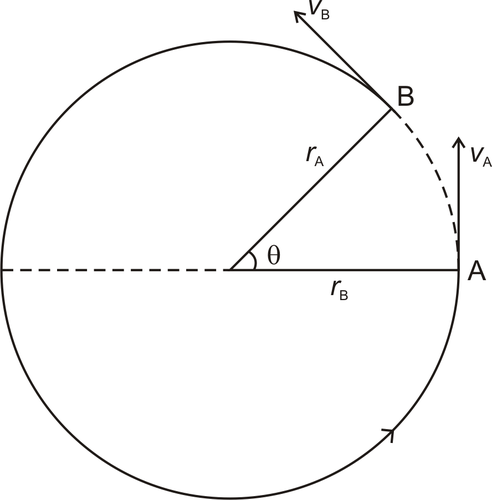

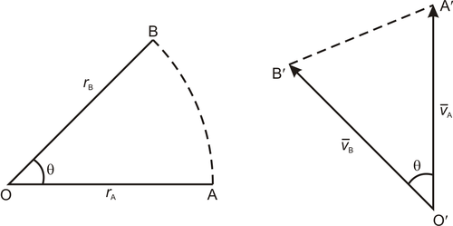
\text{change in velocity} = \bar{v}_B - \bar{v}_A
$$

  

The two $\Delta S$ are similar and the ratio of the two sides should be the same.

$$
\frac{OA}{AB}=\frac{O^{\prime}A^{\prime}}{A^{\prime}B^{\prime}}\\
\text{or  }  \frac{r}{AB} = \frac{v_A}{v_B-v_A}\\
v_B - v_A = \frac{v_A}{r} \cdot AB
$$

rate of change of velocity can be expressed by dividing both sides by time.

$$
a=\frac{v_B - v_A}{t}=\frac{v_A}{r} \cdot \frac{AB}{t}\\
a = \frac{v^2}{r}
$$

Direction of acceleration will be from $A^{\prime}$ to $B^{\prime}$ which points towards the center of the circle. This is the reason why its called centripetal acceleration.

### Angular Velocity

To find a particular song on your Ipod, you use the scroll wheel. This involves moving your finger around the wheel in a circular motion. Unfortunately for you, the song you want is near the very bottom of your songs list. And since an Ipod can hold over 1,000 songs, you have to scroll fast! As you are moving your finger in a circle, you wonder if you could measure how fast your finger is covering the distance around the circle.

Watching your finger, you realize that your finger is moving around the circle twice every second. If the radius of the Ipod wheel is 2 cm, what is the angular velocity of your finger as you scroll through your songs list? What is the linear velocity?

At the end of this Concept, you'll know how to answer these questions.

#### Watch This

!?[0](https://www.youtube.com/watch?v=jh9gRYAuau8)

Watch the video at: http://www.youtube.com/watch?v=jh9gRYAuau8

#### Guidance

You may already be familiar with the measurement of speed as the relationship of an object's distance traveled to the time it has been in motion. However, this relationship is for objects that are moving in a straight line. What about objects that are traveling on a circular path?

Do you remember playing on a merry-go-round when you were younger?

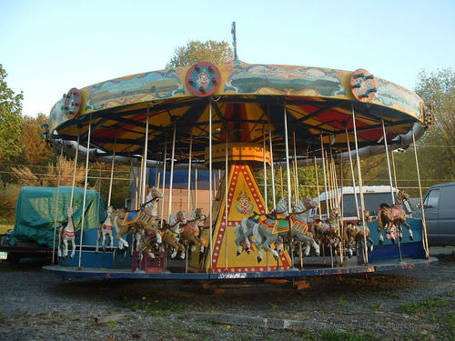

Look at the following drawing.

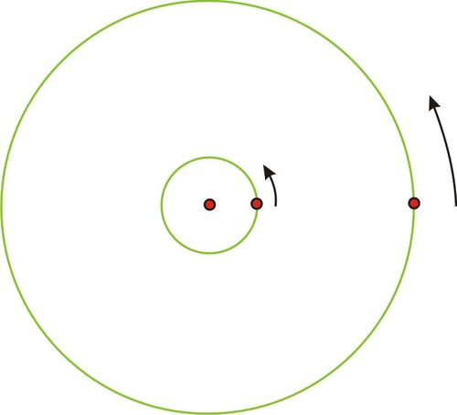

However, it is obvious that the person in the center did not travel nearly as far. The _circumference_ (and of course the radius) of that circle is much smaller and therefore the person who traveled a greater distance in the same amount of time is actually traveling faster, even though they are on the same object. So the person on the edge has a greater _linear velocity_ (recall that linear velocity is found using $\text{distance} = \text{rate} \cdot \text{time}$). If you have ever actually ridden on a merry-go-round, you know this already because it is much more fun to be on the edge than in the center! But, there is something about the two individuals traveling around that is the same. They will both cover the same rotation in the same period of time. This type of speed, measuring the angle of rotation over a given amount of time is called the **angular velocity.**

The formula for angular velocity is:

$$
\omega =\frac{\theta}{t}
$$

$\omega$ is the last letter in the Greek alphabet, omega, and is commonly used as the symbol for angular velocity. $\theta$ is the angle of rotation expressed in radian measure, and $t$ is the time to complete the rotation.

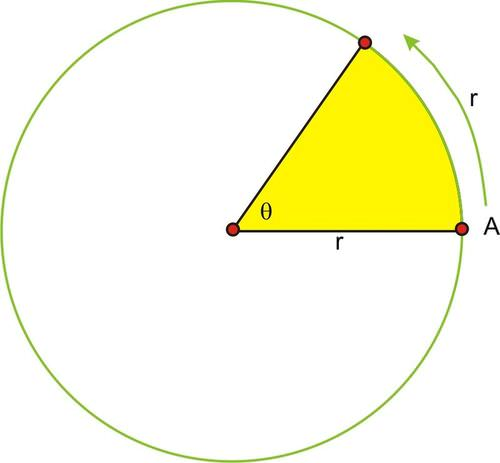

$$
\begin{align*}
\omega &=\frac{\theta}{t}\\
\omega &=\frac{1}{2} \ \text{radians per second}
\end{align*}
$$

In order to know the _linear speed_ of the particle, we would have to know the actual distance, that is, the length of the radius. Let’s say that the radius is 5 cm.

If linear velocity is $v=\frac{d}{t}$ then, $v=\frac{5}{2}$ or 2.5 cm per second.

If the angle were not exactly 1 radian, then the distance traveled by the point on the circle is the length of the arc, $s = r \theta$, or, the radius length times the measure of the angle in radians.

Substituting into the formula for linear velocity gives: $v=\frac{r\theta}{t}$ or $v=r \cdot \frac{\theta}{t}$.

Look back at the formula for angular velocity. Substituting $\omega$ gives the following relationship between linear and angular velocity, $v = r\omega$. So, the _linear velocity_ is equal to the radius times the _angular velocity._

Remember in a unit circle, the radius is 1 unit, so in this case the linear velocity is the same as the angular velocity.

$$
\begin{align*}
v &= r\omega\\
v &= 1 \times \omega\\
v &= \omega
\end{align*}
$$

Here, the distance traveled around the circle is the same for a given unit of time as the angle of rotation, measured in radians.

#### Example A

Shreya and Shruti are riding on a Merry-go-round. Shruti is standing 2.5 meters from the center and Shreya is riding on the outside edge 7 meters from the center. It takes them 6 seconds to complete a rotation. Calculate the linear _and_ angular velocity of each girl.

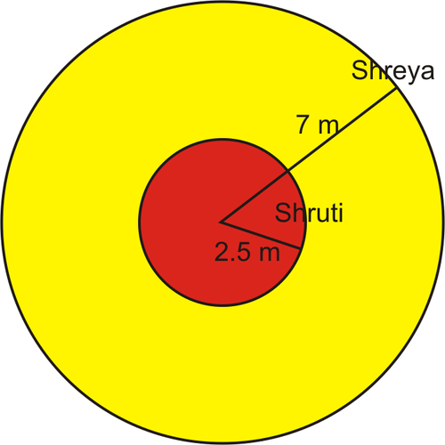

$\omega=\frac{\theta}{t}=\frac{2\pi}{6}=\frac{\pi}{3}$ radians per second, which is slightly more than 1 (about 1.05), radian per second. Because both girls cover the same angle of rotation in the same amount of time, their _angular speed_ is the same. In this case they rotate through approximately 60 degrees of the circle every second.

As we discussed previously, their linear velocities are different. Using the formula, Shruti’s linear velocity is:

$$
v = r \omega = (2.5) \left ( \frac{\pi}{3} \right ) \approx 2.6 \text{ meters per sec}
$$

Shreya’s linear velocity is:

$$
v = r \omega = (7) \left ( \frac{\pi}{3} \right ) \approx 7.3 \text{ meters per sec}
$$

#### Example B

A bug is standing near the outside edge of a compact disk (so that his radius from the center of the disc is 6 cm) that is rotating. He notices that he has traveled $\pi$ radians in two seconds. What is his angular velocity? What is his linear velocity?

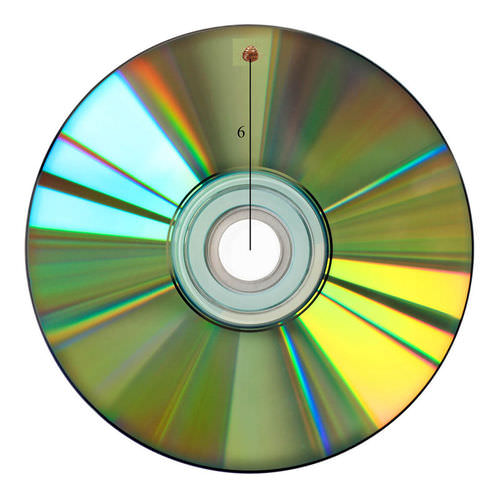

$\omega=\frac{\theta}{t}=\frac{\pi}{2}$ radians per second.

We can use the given equation to find his linear velocity:

$$
v=r\omega=(6)\left(\frac{\pi}{2}\right) \approx 9.42 \ cm \ per \ sec
$$

#### Example C

How long does it take the bug in Example B to go through two complete turns?

**Solution:** Since the angular velocity of the bug is $\frac{\pi}{2}$ radians per second, we can use the equation for angular velocity and solve for time:

$$
\begin{align*}
\omega & =\frac{\theta}{t}\\
t & =\frac{\theta}{\omega}
\end{align*}
$$

Since there are $4\pi$ radians in two complete turns of the disc, we can use this for the value of $\theta$:

$$
t =\frac{4\pi}{\frac{\pi}{2}}=4\pi \times \frac{2}{\pi}=8 \ seconds
$$

#### Vocabulary

**Angular Velocity:** The **_angular velocity_** of a rotating object is the change in angle of an object divided by the change in time.

**Linear Velocity:** The **_linear velocity_** of an object is the change in position of an object divided by the change in time.

#### Guided Practice

1. Seeta and Geeta go for a ride on a moving stage. Seeta rides on one of the outside horses and Geeta rides on one of the smaller horses near the center. Geeta’ horse is 3 m from the center of the moving stage, and Seeta’ horse is 7 m farther away from the center than Geeta’. When the moving stage starts, it takes them 12 seconds to complete a rotation.

Calculate the linear velocity of each girl. Calculate the angular velocity of the horses on the moving stage.

2. The Large Hadron Collider near Geneva, Switzerland began operation in 2008 and is designed to perform experiments that physicists hope will provide important information about the underlying structure of the universe. The LHC is circular with a circumference of approximately 27,000 m. Protons will be accelerated to a speed that is very close to the speed of light ($\approx 3 \times 10^8$ meters per second).

How long does it take a proton to make a complete rotation around the collider? What is the approximate (to the nearest meter per second) angular speed of a proton traveling around the collider? Approximately how many times would a proton travel around the collider in one full second?

3. Rahul is standing 2 meters from the center of a merry go round. If his linear velocity is 6 m/s, what is his angular velocity?

**Solutions:**

1. It is actually easier to calculate the angular velocity first. $\omega=\frac{2\pi}{12}=\frac{\pi}{6}$, so the angular velocity is $\frac{\pi}{6} \ rad$, or $0.524$. Because the linear velocity depends on the radius, each girl has her own.

Geeta: $v=r\omega = 3 \cdot \frac{\pi}{6}=\frac{\pi}{2} \ \text{or} \ 1.57 \ m/sec$

Seeta: $v=r\omega=10 \cdot \frac{\pi}{6}=\frac{5\pi}{3} \ \text{or} \ 5.24 \ m/sec$

2. $v=\frac{d}{t}\rightarrow 3 \times 10^8=\frac{27,000}{t} \rightarrow t=\frac{2.7  \times 10^4}{3 \times 10^8}=0.9 \times 10^{-4} = 9 \times 10^{-5}$ or 0.00009 seconds. $\omega=\frac{\theta}{t}=\frac{2\pi}{0.00009}\approx 69,813 \ rad/sec$ The proton rotates around once in 0.00009 seconds. So, in one second it will rotate around the LHC $1 \div 0.00009 = 11,111.11$ times, or just over 11,111 rotations.

3. Since the equation relating linear and angular velocity is given by $v = r \omega$, we can solve for omega: $\omega = \frac{v}{r} = \frac{6}{2} = 3$

#### Concept Problem Solution

As you found out in this Concept, the angular velocity is the change in angle divided by the change in time. Since you sweep around the circle twice in a second, this becomes:

$$
\omega = \frac{4\pi}{1} = 4\pi \ rad/sec
$$

Further, you can find the linear velocity with the equation:

$$
v = r\omega = (2)(4\pi) = 8\pi \approx 25.132 \ cm/s
$$

---

#### Practice

Aditya and Rohan are on a moving stage. Aditya is 7 m from the center and Rohan is right on the edge, 7 m further from the center than Aditya. Use this information and the following picture to answer questions 1-6.

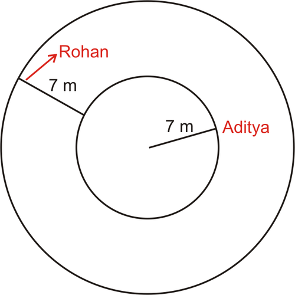

2. If the moving stage continues making revolutions every 60 seconds, what is the angular velocity of the moving stage?

3. What are Aditya and Rohan's linear velocities?

4. How far away from the center would Aditya have to be in order to have a linear velocity of $\pi$ m per second.

5. The moving stage changes to a new angular velocity of $\frac{\pi}{3}$ radians per second. How long does it take to make a complete revolution now?

6. With the moving stage's new velocity, what are Aditya and Rohan's new linear velocities?

7. What is the angular velocity of the minute hand on a clock? (in radians per minute)

8. What is the angular velocity of the hour hand on a clock? (in radians per minute)

9. A certain clock has a radius of 1 meter. What is the linear velocity of the tip of the minute hand?

10. On the same clock, what is the linear velocity of the tip of the hour hand?

11. The tip of the minute hand on another clock has a linear velocity of 2 cm per minute. What is the radius of the clock?

12. What is the angular velocity of the second hand on a clock? (in radians per minute)

13. The tip of the second hand on a clock has a linear velocity of 2 meters per minute. What is the radius of the clock?

---

### Linear Velocity and Angular Velocity

Calculates linear and angular velocity.

!?[0](https://www.youtube.com/watch?v=jh9gRYAuau8)

Watch the video at: https://www.youtube.com/watch?v=jh9gRYAuau8

</article>

### 3.13 Self Assessments

<article>

#### Assessment 1

##### Motion in a Straight Line

Lets try to answer these questions once again using all the concepts learnt in the chapter

**One-Dimensional Motion Problem Set**

1. What is the difference between distance $d$ and displacement $D$?

2. Does the odometer reading in a car measure distance or displacement?

3. Imagine a fox darting around in the woods for several hours. Can the displacement of the fox from his initial position ever be larger than the total distance d he traveled? Explain.

4. What is the difference between acceleration and velocity? Use the motion of the school bus to explain the difference.

5. Give an example of a situation where an object has an upward velocity, but a downward acceleration.

6. What is the difference between average and instantaneous velocity? Make up an example involving a trip in a car that demonstrates your point.

7. If the displacement of an object is increasing linearly with time, what can we say about its acceleration? Give a reason for your answer.

8. If the position of an object is increasing non-linearly with time, what can we say about its velocity? Give a reason for your answer.

9. A police patrol van passes you on the highway. Which of the following statements must be true at the instant he is passing you? You may choose more than one answer.

a) Your speed and his speed are the same.

b) Your position $x$ along the highway is the same as his position $x$ along the highway.

c) Your acceleration and his acceleration are the same.

10. If a car is slowing down from 50 km/h to 40 km/h, but the displacement is increasing, which of the following statements is true? You may choose more than one.

a) The velocity of the car is in the $+ x$ direction.

b) The acceleration of the car is in the same direction as the velocity.

c) The acceleration of the car is in the opposite direction of the velocity.d) The

d) acceleration of the car is in the $- x$ direction.

11. A horse is galloping forward with an acceleration of 3 m/s_2_ Which of the following statements is necessarily true? You may choose more than one.

a) The horse is increasing its speed by 3 m/s every second, from 0 m/s to 3 m/s to 6 m/s to 9 m/s.

b) The speed of the horse will triple every second, from 0 m/s to 3 m/s to 9 m/s to 27 m/s.

c) Starting from rest, the horse will cover 3 m of ground in the first second.

d) Starting from rest, the horse will cover 1.5 m of ground in the first second.

NCERT Exercise 3.1- 3.22

#### Assessment 2

##### Vector Resolution

http://www.ck12.org/physics/Resolving-Vectors-into-Axial-Components/asmtpractice/Resolving-Vectors-into-Axial-Components-Practice/?referrer=concept_details

http://www.ck12.org/physics/Vector-and-Scalar-Quantities/asmtpractice/Vector-and-Scalar-Quantities-Practice/?referrer=concept_details

#### Assessment 3

##### Graphical Method of Vector Addition

http://www.ck12.org/assessment/ui/build-20140716172159/views/test.view.new.html?531e5e4f5aa4135e958b4d0b?type=practice&referrer=practice_details&ep=http://www.ck12.org/physics/Graphical-Methods-of-Vector-Addition/asmtpractice/Graphical-Methods-of-Vector-Addition-Practice/

#### Assessment 4

##### Instantaneous Velocity

http://www.ck12.org/physics/Instantaneous-Velocity/quiz/Instantaneous-Velocity-Quiz/

#### Assessment 5

##### Velocity and Acceleration

http://www.ck12.org/physics/Uniform-Acceleration/quiz/Uniform-Acceleration-Quiz/

#### Assessment 6

##### Velocity, Acceleration and Distance Traveled

[http://www.ck12.org/physics/Displacement-Uniform-Acceleration/quiz/Displacement-During-Constant-Acceleration-Quiz/](http://www.ck12.org/physics/Displacement-During-Uniform-Acceleration/quiz/Displacement-During-Constant-Acceleration-Quiz/)

##### Motion Under Gravity

http://www.ck12.org/physics/Acceleration-Due-to-Gravity/quiz/Acceleration-Due-to-Gravity-Quiz/

#### Assessment 7

##### Motion Graphs

http://www.ck12.org/physics/Graphing-Motion/quiz/Graphing-Motion-Quiz-PPB/

#### Assessment 8

##### Projectile

http://www.ck12.org/physics/Projectile-Motion/asmtpractice/Projectile-Motion-Practice/?referrer=concept_details

[http://www.ck12.org/physics/Projectile-Motion-for-Object-Launched-Horizontally/quiz/Projectile-Motion-for-an-Object-Launched-Horizontally-Quiz/](http://www.ck12.org/physics/Projectile-Motion-for-an-Object-Launched-Horizontally/quiz/Projectile-Motion-for-an-Object-Launched-Horizontally-Quiz/)

NCERT exercise 4.15, 4.16

#### Assessment 9

##### Uniform Circular Motion

http://www.ck12.org/physics/Circular-Motion/quiz/Circular-Motion-Quiz-PPB/

http://www.ck12.org/physics/Circular-Motion/quiz/Circular-Motion-Quiz/

NCERT example 5.10

exercise 4.17, 4.18, 4.19 to be done

#### Assessment 10

##### Acceleration

http://www.ck12.org/physics/Velocity-and-Acceleration/quiz/Velocity-and-Acceleration-Quiz-PPB/

</article>

### 3.14 Home Assignments

<article>

#### Assignment 1

##### Kinematics

Lets try to answer these questions, which we have attempted earlier once again using all the concepts learnt in the chapter

1. You are sitting on your bike at rest. Your brother comes running at you from behind at a speed of 2 m/s. At the exact moment he passes you, you start up on your bike with an acceleration of $2 \ m/s^2$.

a) Draw a picture of the situation, defining the starting positions, speeds, etc.

b) At what time $t$ do you have the same speed as your brother?

c) At what time $t$ do you pass your brother?

d) Draw another picture of the exact moment you catch your brother. Label the drawing with the positions and speeds at that moment.

e) Sketch a position vs. time graph for both you and your brother, labeling the important points (_i.e_., starting point, when you catch him, etc.)

f) Sketch a speed vs. time graph for both you and your brother, labeling the important points (_i.e_., starting point, when you catch him, etc.)

2. You are standing at the foot of a building which is 52 floors (237 m) high. You launch a ball straight up in the air from the edge of the foot of the building. The initial vertical speed is 70 m/s. (For this problem, you may ignore your own height, which is very small compared to the height of the building.)

a) How high up does the ball go?

b) How fast is the ball going right before it hits the top of the building?

c) For how many seconds total is the ball in the air?

3. Measure how high you can jump vertically on Earth. Then, figure out how high you would be able to jump on the Moon, where acceleration due to gravity is 1/6 that of Earth. Assume you launch upwards with the same speed on the Moon as you do on the Earth.

4. A car is smashed into a wall during race. The car is going 25 m/s just before it strikes the wall. It comes to a stop 0.8 seconds later. What is the average acceleration of the car during the collision?

5. A helicopter is traveling with a velocity of 12 m/s directly upward. Directly below the helicopter is a very large and very soft mattress. As it turns out, this is a good thing, because the helicopter is lifting a stunt man. When the man is 20 m above the mattress, he lets go of the rope.

a) What is the speed of the man just before he lands on the mattress?

b) How long is he in the air after he lets go?

c) What is the greatest height reached by the man above the ground? (Hint: this should be greater than 20 m. Why?)

d) What is the distance between the helicopter and the man three seconds after he lets go of the rope?

6. You are speeding towards a brick wall at a speed of 55 MPH. The brick wall is only 100 feet away.

a) What is your speed in m/s?

b) What is the distance to the wall in meters?

c) What is the minimum acceleration you should use to avoid hitting the wall?

7. What acceleration should you use to increase your speed from 10 m/s to 18 m/s over a distance of 55 m?

8. You drop a rock from the top of a cliff. The rock takes 3.5 seconds to reach the bottom.

a) What is the initial speed of the rock?

b) What is the magnitude (i.e., _numerical value_) of the acceleration of the rock at the moment it is dropped?

c) What is the magnitude of the acceleration of the rock when it is half-way down the cliff?

d) What is the height of the cliff?

#### Assignment 2

##### Motion in a Straight Line

NCERT exercise 3.1 to 3..21

**Motion of along a vertical line**

1. A body is released from rest and falls freely. Compute its position and velocity after 1, 2, 3 and 4 s. Take $O$ origin of motion, $y$ axis as the vertical upward direction as positive, $g=- 10 \ ms^{-2}$

2. A ball is thrown vertically from the balcony of multistoreyed flats, leaving the thrower’s hand with a speed of 16 m/s and just missing the balcony on the way down find

a) the position and velocity of the ball after 1 s and 4 s

b) the velocity when the ball is 10 m above the starting point

c) the maximum height reached and the time after which it reached it.

3. A balloon rising vertically with a velocity of 5 m/s releases a sandbag at an instant when the balloon is 20 m above the ground.

a) Compute the position and velocity of the sandbag at the following times after its release 1/4 s, 1/2 s, 1 s, 2 s.

b) After how much time would the bag strike the ground?

c) What is the velocity with which it would strike the ground?

##### Motion In One Dimension

1. A man has to cover a distance of 1 km. He covers the first 200 m in walking at a rate of 40 m/min. How fast should he run to cover the remaining distance, such that his average speed for the entire trip is 100 m/min.

**Ans:** 160 m/min

2. A dog initially running at a speed of 2 m/s, accelerates at a constant rate of 1.5 ms_\-2_ for 5 s. Calculate

a) the distance covered by the dog from its initial position.

b) the final velocity of the dog.

**Ans:** a) 28.75 m, b) 9.75 m/s

---

3. A drunkard walking in a narrow lane takes 5 steps forward and 3 steps backward, followed again by 5 steps forward and 3 steps backwards and so on. Each step is 1 m long and takes 1 s. Plot a graph and also calculate the time he would take to fall in a pit 13 m away from start.

**Ans:** 37 s

4. A body travels a distance of 20 m in the 7_th_ s and 24 m in the 9_th_ sec. How much distance will it travel in the 15_th_ sec?

**Ans:** 36 m

5. A car accelerates from rest at a constant rate of a for some time, after which it decelerates at $a$ constant rate $b$ to come to rest. If $t$ is the total time elapsed then calculate

a) Maximum velocity attained

b) The total distance traveled by the car.

**Ans:** a) $v=\frac{ab}{a+b}t$, b) $x=\frac{1}{2}\frac{ab}{a+b}t^2$

6. A balloon is ascending at the rate of 14 m/s at a height of 98 m above the ground, when a packet is dropped from the balloon, after how much time and with what velocity does it reach the ground?

**Ans:** 45.99 m/s 16 s

7. A stone is dropped from the top of the cliff and found to travel 44.1 m during the last sec. (before it reaches the ground). What is the height of the cliff?

**Ans:** 122.5 m

8. Two balls A and B are thrown simultaneously, A vertically upwards with a speed of 20 m/s from the ground and B vertically downwards from a height of 40 m with the same speed and along the same line of motion. At what point will they collide?

**Ans:** 15.1 m from the ground

#### Assignment 3

##### Projectile Motion

http://www.ck12.org/physics/Projectile-Motion/simulation/Projectile-Motion/

1. What is a projectile?

2. What is meant by trajectory?

3. What is meant by horizontal range?

4. Why does the direction of motion of a projectile become horizontal at the highest point of a projectile?

5. At what point in the trajectory does the projectile have minimum speed ?

6. Complete the following

$$
\begin{align*}
H &=u^2 \underline{\; \; \; \; \; \; \; \; \; \; \; \;} \\
R &=\underline{\; \; \; \; \; \; \; \; \; \; \; \;\;\;\;} \qquad \quad y=x \tan^\circ - \frac{1}{2}
\end{align*}
$$

7. The maximum range of a projectile is 3 km, find the range if projected at 15°.

---

8. A projectile is fired horizontally with a velocity of 98 m/s from the top of the hill 490 m high. Find

a) the velocity with which the projectile strikes the ground

b) time taken to reach the ground

c) the distance of the target from the hill (138.5 m/s, 10 s, 980 m)

9. A bullet fired at an angle of 30° with the horizontal hits the ground 3 km away. By adjusting the angle of projection can we hope to strike at a point 5 km away? (no)

10. A shot is fired from a gun on top a cliff 90 m high with a velocity of 80 m/s at an elevation of 30°. Find the horizontal distance between the vertical line through the gun and the point where the shot strikes the ground.

11. A boy aims at a fruit on the tree. At the instant the stone leaves the his hand the fruit falls. Will the stone hit the fruit?

12. The ceiling of a long hall is 25 m high. What is the maximum horizontal distance that a ball thrown with a speed of 40 m/s can go without hitting the ceiling of the hall ? (150.5 m)

#### Assignment 4

##### Motion and Frame of Reference

http://www.ck12.org/physical-science/Motion-in-Physical-Science/lesson/Motion-Middle-School-dup-handle-tbd/

(watch, read and analyse)

#### Assignment 5

##### Vectors

1. Define equal vectors, negative vectors, null vector.

2. If $A+B = B+A$ What is the angle between them?

3. When is the sum of two vectors maximum and minimum?

4. Under what condition the sum and difference of two vectors will be equal in magnitude?

5. Can three vectors lying in a plane add up to give a null vector if yes give the condition.

6. Two vectors of magnitude 2, 3 give a resultant of 5. What is their dot product, cross product?

7. What is the angle between two vectors if the ratio of their dot product and cross product is 3?

8. What is the angle made by $2i + 3j$ with $x$ axis?

9. What is the angle between $2i+4j+5k$ and $3i+2j-k$?

10. $5i+7j-3k$ and $2i+2j-ak$ are mutually perpendicular. What is the value of $a$?

11. If $A=3i+4j$ and $B=7i+24j$. Find a vector having the same magnitude as $B$ and parallel to $A$.

12. Which vector added to $2i+5j-2k$ and $2i+5j-7k$ will give a unit vector along $j$?

13. A lady walking due east on a road with velocity of 10 m/s encounters rain falling vertically with a velocity of 30 m/s. At what angle she should hold her umbrella to protect herself from rain?

14. A man swims across the river which flows with a velocity of 3 km/h due north. If the velocity of man relative to water is 4 km/h due to east then

a) what is his relative velocity relative to the shore?

b) How long does he take to cross the river if it is 1 km wide?

c) How far north of his starting point will he reach the opposite bank?

15. An aero plane takes off at an angle of 30°. If the velocity component along the horizontal is 250 km/h, find the velocity.

16. A particle starts from the origin at $t=0 \ s$ with a velocity of $10 j \ m/s$ and moves in the $xy$ plane with an acceleration of $8i+2j \ m/s^2$

a) At what time is the $x$ coordinate of the particle 16 m?

b) What is the $y$ co-ordinate of the particle at that time?

c) What is the speed of the particle at the time?

17. Two billiard balls are rolling on a flat table, one has $V_x = 1 \ m/s$ and $V_y=3 \ m/s$, the other has $V_x=2 \ m/s$ and $V_y=2 \ m/s$. If both the balls start moving from the same point, what is the angle between their paths?

18. Two vectors acting in opposite directions have a resultant of 10 units. If they act at right angles to each other, the resultant is 50 units. Calculate the magnitude of the two vectors.

</article>

### 3.15 Class Activities

<article>

#### Activity 1

**Vocabulary Check**

http://www.ck12.org/physics/Graphical-Methods-of-Vector-Addition/preread/Graphical-Methods-of-Vector-Addition/

http://www.ck12.org/physics/Displacement-During-Uniform-Acceleration/whileread/Displacement-During-Constant-Acceleration/

#### Activity 2

**Velocity and Acceleration**

http://www.ck12.org/physics/Velocity-and-Acceleration/cthink/Velocity-and-Acceleration-Discussion-Questions/

</article>

### 3.16 References Basic Understanding

<article>

#### Instantaneous Velocity

http://www.ck12.org/physics/Instantaneous-Velocity/rwa/user:13IntG/The-Fast-and-the-Furious/

#### Falling Under Gravity

http://www.ck12.org/physics/Acceleration-Due-to-Gravity/rwa/The-Art-of-Falling/

http://www.ck12.org/physics/Acceleration-Due-to-Gravity/rwa/Physics-Behind-Darts/

</article>

### 3.17 References Advanced Understanding

<article>

#### Projectile Motion

[http://www.ck12.org/physics/Projectile-Motion-for-an-Object-Launched-Horizontally/rwa/Wil.E.Coyote/](http://www.ck12.org/physics/Projectile-Motion-for-an-Object-Launched-Horizontally/rwa/user:13IntG/Wil.E.Coyote/)

#### Scalars and Vectors

http://www.ck12.org/physical-science/Direction-in-Physical-Science/lesson/Direction/

</article>

## 4.0 Laws of Motion

<article>

</article>

### 4.1 Force

<article>

### Types of Forces

The various types of common forces are discussed and analyzed.

#### Key Equations

$$
\begin{align*}
\mathrm{Common~Forces}
\begin{cases}
F_g  = m g &  \text{Gravity}\\
F_N  & \text{Normal force: acts perpendicular to surfaces}\\
F_T & \text{Force of tension in strings and wires}\\
F_{sp}= -k \Delta x  & \text{Force of spring stretched a distance } \Delta x \text{ from equilibrium}\end{cases}
\end{align*}
$$

#### Guidance

#### Normal Force

Often, objects experience a force that pushes them into another object, but once the objects are in contact they do not move any closer together. For instance, when you stand on the surface of the earth you are obviously not accelerating toward its center. According to Newton's Laws, there must be a force opposing the earth's gravity acting on you, so that the net force on you is zero. The same also applies for your gravity acting on the earth. We call such a force the **Normal Force**. The normal force acts between any two surfaces in contact, balancing what ever force is pushing the objects together. It is actually electromagnetic in nature (like other contact forces), and arises due to the repulsion of atoms in the two objects. Here is an illustration of the Normal force on a block sitting on earth:

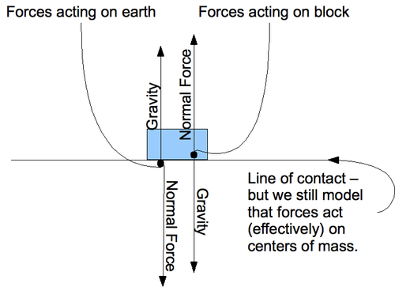

Another force that often opposes gravity is known as **tension**. This force is provided by wires and strings when they hold objects above the earth. Like the Normal Force, it is electromagnetic in nature and arises due to the intermolecular bonds in the wire or string:

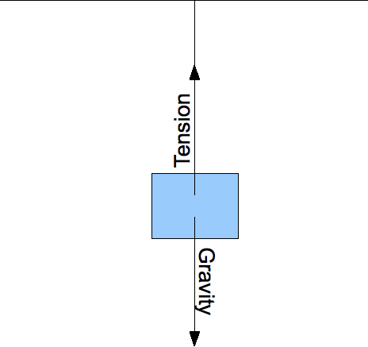

#### Friction

Friction is a force that opposes motion. Any two objects in contact have what is called a mutual coefficient of friction. To find the force of friction between them, we multiply the normal force by this coefficient. Like the forces above, it arises due to electromagnetic interactions of atoms in two objects. There are actually two coefficients of friction: static and kinetic. Static friction will oppose _initial_ motion of two objects relative to each other. Once the objects are moving, however, kinetic friction will oppose their continuing motion. Kinetic friction is lower than static friction, so it is easier to keep an object in motion than to set it in motion.

$$
\begin{align*}
f_s \le \mu_s | \vec{F_N}| && \mathrm{[5]~Static~friction~opposes~potential~motion~of~surfaces~in~contact}\\
f_k = \mu_k | \vec{F_N}| && \mathrm{[6]~Kinetic~frictions~opposes~motion~of~surfaces~in~contact}
\end{align*}
$$

There are some things about friction that are not very intuitive:

* The magnitude of the friction force does not depend on the surface areas in contact.
* The magnitude of kinetic friction does not depend on the relative velocity or acceleration of the two objects.
* Friction always points in the direction opposing motion. If the net force (not counting friction) on an object is lower than the maximum possible value of static friction, friction will be equal to the net force in magnitude and opposite in direction.

#### Spring Force

Any spring has some equilibrium length, and if stretched in either direction it will push or pull with a force equal to:

$$
\begin{align*}
\vec{F_{sp}} = -k \vec{\Delta x}  && \mathrm{[7]~Force~of~spring~}\vec{\Delta x}\mathrm{~from~equilibrium}
\end{align*}
$$

#### Example 1

**Question:**

A woman of mass 70.0 kg weighs herself in an elevator.

 If she wants to weigh less, should she weigh herself when accelerating upward or downward?")

b) When the elevator is not accelerating, what does the scale read (i.e., what is the normal force that the scale exerts on the woman)?

c) When the elevator is accelerating upward at 2.00 m/s_2_, what does the scale read?

**Answer:**

a) If she wants to weigh less, she has to decrease her force (her weight is the force) on the scale. We will use the equation $F=ma$ to determine in which situation she exerts less force on the scale.

If the elevator is accelerating upward then the acceleration would be greater. She would be pushed toward the floor of the elevator making her weight increase. Therefore, she should weigh herself when the elevator is going down.

b) When the elevator is not accelerating, the scale would read $70.0 \ \mathrm{kg}$.

c) If the elevator was accelerating upward at a speed of $2.00 \ \mathrm{m/s^2}$, then the scale would read

$$
F=ma=70 \ \mathrm{kg}\times (9.8 \ \mathrm{m/s^2}+2 \ \mathrm{m/s^2})=826 \ \mathrm{N}
$$

which is $82.6 \ \mathrm{kg}$.

---

#### Example 2

**Question:**

A spring with a spring constant of $k=400\mathrm{N/m}$ has an uncompressed length of $.23\mathrm{m}$ and a fully compressed length of $.15\mathrm{m}$. What is the force required to fully compress the spring?

**Solution:**

We will use the equation $F=kx$ to solve this. We simply have to plug in the known value for the spring and the distance to solve for the force.

$$
F=kx=(400\mathrm{N/m})(.23\mathrm{m}-.15\mathrm{m})=32\mathrm{N}
$$

#### Watch this Explanation

Watch the video at: https://www.youtube.com/watch?v=25tJTmgYinM

### Real World Application - Endless Skating

A skater glides across an ice lake.

#### Newton's First Law

An object at rest remains at rest unless acted upon by a force. An object in motion remains in motion, and at a constant velocity, unless acted upon by a force.

#### The Frictionless Lake

Friction often seems like a drag, but imagine if you could skate across an infinitely long, frictionless ice lake. Frictionless systems are commonly used in physics problems so that we can focus on the important forces. Without an outside force, such as the brakes on your skates or a snow bank, you would never stop moving. You would also stay at a constant velocity, too.

In the same system, if you were just standing on the ice, you would never start moving, either. Both of these situations demonstrate Newton’s first law.

#### Creative Applications

1. While ice skating is fairly effortless, we are unable to skate forever, despite what Newton’s First Law said. What real world property prevents a skater from moving forever?

2. What real world property prevents a skater from standing still forever?

3. If you were stuck in the middle of a frictionless lake, how could you get to the edge?

4. Of course, there are very few near frictionless surfaces. Where could you go to best experience of frictionless system?

</article>

### 4.2 Aristotle's Fallacy

<article>

### Aristotle’s fallacy

Is an external force required to keep a body in uniform motion? Aristotle and many more scientists, were even mistaken about it. This question was a mystery for many people for more than thousands of years. Aristotle explained that objects velocities were proportional to the forces exerted on them. It was true for a behaviour shown by sliding objects but according to it heavier objects should fall faster than lighter objects. The people accepted this theory because they could not find the better answer to this question. So this theory remained unparalleled. Then Italian astronomer, mathematician, and physicist Galileo galilei (1564-1642) gave logical analysis to this question. According to him if a person is stationary, he/she will remain stationary if he/she is moving in some particular direction with a steady velocity, he/she will remain moving with the same velocity in that direction until some external influence is acted upon it. This he called inertia. Galileo galilie also devised experiments to resolve conflict between Aristotle’s theory and observations of the world around him. He determined that falling objects under the action of gravity alone fall at the same rate.

So that way he could resolve the ambiguity. He said as Aristotle assumed requirement of an external force to keep the body in motion, is actually due to the presence of certain dissipative forces present around us, Like internal resistance of air, frictional forces etc.

So one has to overcome these forces to maintain their motion. In the absence of such forces (dissipative forces) one needs no external force to continue in the same state of rest or of uniform motion.

</article>

### 4.3 Newton's First Law of Motion

<article>

The First Law of Motion is often stated as the Law of Inertia. Let’s learn what Inertia is.

### Inertia

**Q:** Why is it harder to start and stop the skateboard than it is to keep it rolling?

**A:** The reason is inertia.

#### What Is Inertia?

**Inertia** is the tendency of an object to resist a change in its motion. All objects have inertia, whether they are stationary or moving. Inertia explains Newton’s first law of motion, which states that an object at rest will remain at rest and an object in motion will stay in motion unless it is acted on by an unbalanced force. That’s why Newton’s first law of motion is sometimes called the law of inertia. You can see an animation of inertia at this URL: http://www.physicsclassroom.com/mmedia/newtlaws/cci.cfm

**Q:** You probably don’t realize it, but you experience inertia all the time, and you don’t have to ride a skateboard. For example, think about what happens when you are riding in a car that stops suddenly. Your body moves forward on the seat and strains against the seat belt. Why does this happen?

**A:** The brakes stop the car but not your body, so your body keeps moving forward because of inertia.

---

#### Inertia and Mass

The inertia of an object depends on its mass. Objects with greater mass also have greater inertia. It would be easier for Aadya to push just one of her cousins on her skateboard than both of them. With just one twin, there would be only about half as much mass on the skateboard, so there would be less inertia to overcome.

#### Overcoming Inertia

To change the motion of an object, inertia must be overcome by an unbalanced force acting on the object. The unbalanced force that starts Aadya’s cousins rolling along on the skateboard is applied by Aadya when she gives it a push. Once an object starts moving, inertia keeps it moving without any additional force being applied. In fact, it won’t stop moving unless another unbalanced force opposes its motion. For example, Aadya can stop the rolling skateboard by moving to the other end and pushing in the opposite direction.

**Q:** What if Aadya didn’t stop the skateboard in this way? If it remained on a smooth, flat surface, would it just keep rolling forever?

**A:** The inertia of the moving skateboard would keep it rolling forever if no other unbalanced force opposed its motion. However, another unbalanced force does act on the skateboard

**Q:** What other force is acting on the skateboard?

**A:** The other force is rolling friction between the skateboard’s wheels and the ground. The force of friction opposes the motion of the rolling skateboard and would eventually bring it to a stop without any help from Aadya. Friction opposes the motion of all moving objects, so—like the skateboard—all moving objects eventually stop moving even if no other forces oppose their motion.

Later that day, Ishan rode his skateboard and did some jumps. You can see him in the picture [below](#x-ck12-TVNfUFMtRmx5aW5nU2thdGVib2FyZGVy). When he’s in the air, there is no rolling friction between his wheels and the ground, but another unbalanced force is acting on the skateboard and changing its motion.

**Q:** What force is acting on the skateboard when it is in the air above the ground? And how will this force change the skateboard’s motion?

**A:** The force of gravity is acting on the skateboard. It will pull the skateboard back down to the ground. Once it’s on the ground, friction will slow its motion.

* Inertia is the tendency of an object to resist a change in its motion. Because of inertia, a resting object will remain at rest, and a moving object will keep moving.
* Objects with greater mass have greater inertia.
* To change the motion of an object, inertia must be overcome by an unbalanced force acting on the object.

#### Explore More

At the following URL, read about inertia and watch the truck-and-ladder animation. Then answer the questions below.

* http://www.physicsclassroom.com/mmedia/newtlaws/il.cfm

1. Why does the ladder slide forward off the truck when the truck crashes into the car? How could this be prevented?

2. Assume that the truck driver in the animation puts on the brakes just as the truck enters the picture, but the truck still crashes into the car. Explain how inertia is involved.

3. What force affects the acceleration of the ladder after it leaves the truck?

#### Review

1. What is inertia?

2. How does inertia affect the motion of an object?

3. What is the relationship between inertia and mass?

4. Ishan and Priyansh’s older brother Mehul, who is pictured in the **Figure** [below](#x-ck12-TVNfUFMtU2thdGVib2FyZGVyUmFtcA..), is standing at the top of a half-pipe in a skating rink. Gravity is exerting a downward force on the skateboard, as seen in the picture. Why doesn’t it tip over the edge and start rolling down the side of the half-pipe?

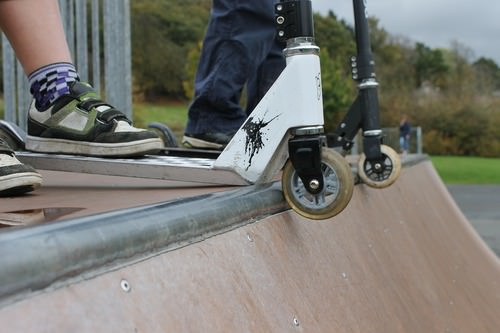

The **First Law is about inertia; objects at rest stay at rest unless acted upon and objects in motion continue that motion in a straight line unless acted upon**. Prior to Newton and Galileo, the prevailing view on motion was still Aristotle's. According to his theory the natural state of things is at rest; force is required to keep something moving at a constant rate. This made sense to people throughout history because on earth, friction and air resistance slow moving objects. When there is no air resistance (or other sources of friction), a situation approximated in space, Newton's first law is much more evident.

The amount of inertia an object has is simply related to the mass of the object. Mass and Weight are two different things. Mass (typically in units of kg or grams) is basically a measure of what comprises an object. Weight is the measure of how much the force of gravity is pulling on you. In fact, instead of saying “I weigh 80 kg”, one could say that “the force of gravity is pulling on me with a force of 80 kg.” The metric unit for weight (and force) is the Newton.

#### Key Equations

$$
F_g =  mg
$$

The force of gravity (i.e. your weight) is equal to the mass of the object multiplied by the acceleration of gravity for that planet.

$$
1 \ \text{kg}  =  9.8 \ \text{N}
$$

#### Guidance

* An object will not change its state of motion (i.e., accelerate) unless a net force acts on it. Equal and oppositely directed forces do not produce acceleration.
* If no net force acts on an object the object remains at constant velocity or at rest.

#### Example 1

What is the weight of a 90 kg person on Earth? What about the moon?

**Answers:**

On Earth,

$$
F_g = mg = (90 \ kg)(9.8 \ m/s^2) = 882 \ N
$$

On moon,

$$
F_g = mg = (90 \ kg)(1.6 \ m/s^2) = 144 \ N
$$

#### Watch this Explanation

Watch the video at: https://www.youtube.com/watch?v=BlFGN2zlDYc

#### Simulation

Try the following simulation to apply these principles.

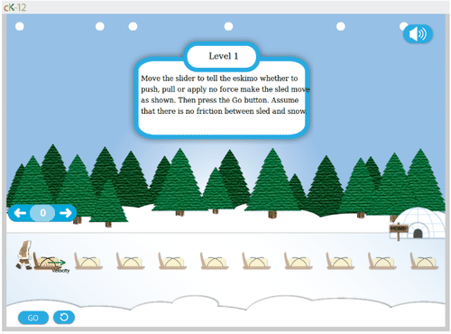

#### Explore More

1. When hit from behind in a car crash, a passenger can suffer a neck injury called whiplash. Explain in terms of inertia how this occurs, and how headrests can prevent the injury.

2. A cheetah can outrun a gazelle in a short straight race, but the gazelle can escape with its life by zigzagging. The cheetah is more massive than the gazelle – explain how this strategy works.

3. If your hammer develops a loose head, you can tighten it by banging it on the ground. A little physics secret though – it’s better to bang the hammer _head up_ rather than _head down_. Explain, using inertia.

4. If a man weighs 62 kg. on Earth, what is his weight in Newtons and his mass in kg?

#### Answers:

1. The passenger's head will remain at rest for the split second when the seat exerts a big force on the passenger's back causing a “whiplash” on your neck. This is an example of newton's first law because your head is not acted on by an unbalanced force while the rest of your body is. A head rest causes your head to accelerate with the rest of your body.

2. The cheetah must exert a bigger force to change directions than the gazelle because the cheetah has more inertia. This extra force needed for the cheetah to change directions allows the gazelle to get away.

3. The head of the hammer has more inertia than the tail. So when you bang the hammer “head up” the head exerts a large force on the rest of the hammer in order to come to a stop.

4. 620 N, 62 kg (using 10 m/s_2_) for acceleration of gravity.

### Inertia is an object's resistance to changes in it's motion

!?[0](https://www.youtube.com/watch?v=4NQbeZ0EXZQ)

Watch the video at: https://www.youtube.com/watch?v=4NQbeZ0EXZQ

!?[0](https://www.youtube.com/watch?v=d6UF-m3ODrA)

Watch the video at: https://www.youtube.com/watch?v=d6UF-m3ODrA

</article>

### 4.4 Newton's Second Law of Motion

<article>

**Q:** Does this mean that Tarun will win the race?

**A:** Not necessarily, because force isn’t the only factor that affects acceleration.

#### Force, Mass, and Acceleration

Whenever an object speeds up, slows down, or changes direction, it accelerates. Acceleration occurs whenever an unbalanced force acts on an object. Two factors affect the acceleration of an object: the net force acting on the object and the object’s mass. **Newton’s second law of motion** describes how force and mass affect acceleration. The law states that the acceleration of an object equals the net force acting on the object divided by the object’s mass. This can be represented by the equation:

$$
\begin{align*}
\begin{array}{rcl}
\text{Acceleration} & =& \frac{\text{Net force}}{\text{Mass}}\\
\text{or} \qquad \qquad a & = & \frac{F}{m}
\end{array}
\end{align*}
$$

**Q**: While Tarun races along on his rollerblades, what net force is acting on the skates?

**A:** Tarun exerts a backward force against the ground, as you can see in the Figure below, first with one skate and then with the other. This force pushes him forward. Although friction partly counters the forward motion of the skates, it is weaker than the force Tarun exerts. Therefore, there is a net forward force on the skates.

Newton’s second law shows that there is a direct relationship between force and acceleration. The greater the force that is applied to an object of a given mass, the more the object will accelerate. For example, doubling the force on the object doubles its acceleration. At the following URL, you can simulate pushing a 2000-kilogram elephant on skates, using different amounts of force. Do the simulation to see how changing force while holding mass constant changes the acceleration of the skating elephant.

http://www.ic.arizona.edu/~nats101/n2.html

The relationship between mass and acceleration is different. It is an inverse relationship. In an inverse relationship, when one variable increases, the other variable decreases. The greater the mass of an object, the less it will accelerate when a given force is applied. For example, doubling the mass of an object results in only half as much acceleration for the same amount of force.

**Q:** Tarun has greater mass than the other two boys he is racing above. How will this affect his acceleration around the track?

**A:** Tarun’s greater mass will result in less acceleration for the same amount of force.

!?[0](https://www.youtube.com/watch?v=-KxbIIw8hlc)

Watch the video at: https://www.youtube.com/watch?v=-KxbIIw8hlc

!?[0](https://www.youtube.com/watch?v=iwP4heWDhvw)

Watch the video at: https://www.youtube.com/watch?v=iwP4heWDhvw

!?[0](https://www.youtube.com/watch?v=FgOiXrwYHrI)

Watch the video at: https://www.youtube.com/watch?v=FgOiXrwYHrI

#### Summary

* Newton’s second law of motion states that the acceleration of an object equals the net force acting on the object divided by the object’s mass.
* According to the second law, there is a direct relationship between force and acceleration and an inverse relationship between mass and acceleration.

#### Vocabulary

* **Newton’s second law of motion**: Law stating that the acceleration of an object equals the net force acting on the object divided by the object’s mass.

#### Review

1. State Newton’s second law of motion.

2. How can Newton’s second law of motion be represented with an equation?

### Newton's Second Law

The acceleration experienced by an object will be proportional to the applied force and inversely proportional to its mass. If there are multiple forces, they can be added as vectors and it is the _net_ force that matters.

#### Key Equations

Newton's Second Law describes his famous equation for the motion of an object

___The change of motion is proportional to the motive force impressed; and is made in the___

_direction of the right_ (straight) _line in which that force is impressed._

The “motion” Newton mentions in the Second Law is, in his language, the product of the mass and velocity of an object --- we call this quantity momentum --- so **the Second Law is actually the** famous equation**:**

$$
\begin{align*}
\vec{F} = \frac{\Delta(m\vec{v})}{\Delta t} = \frac{m\Delta \vec{v}}{\Delta t} =m\vec{a} && \text{[1]}
\end{align*}
$$

$$
\begin{align*}
\text{Force Sums} \begin{cases}
\vec{F_{\text{net}}} = \sum_{i} F_i = m \vec{a} & \text{Net force is the vector sum of all the forces}\\
F_{\text{net,}x} = \sum_{i} {F_{ix}} = m{a}_{x} & \text{Horizontal components add also}\\
F_{\text{net,}y} = \sum_{i} {F_{iy}} = m{a}_{y} & \text{As do vertical ones}
\end{cases}
\end{align*}
$$

#### Guidance

To calculate the net force on an object, you need to calculate all the individual forces acting on the object and then add them as vectors. This requires some mathematical skill.

#### Example 1

A 175-g bluebird slams into a window with a force of 19.0 N. What is the bird’s acceleration?

**Given:**

$m = 175\ grams = 0.175\ kg$

$F = 19.0 \ N$

**Equation:**

$a = \frac{F_{net}}{m}$

$a = \frac{F_{net}}{m} = \frac{19.0 \ N}{0.175 \ kg} = \frac{19.0 \frac{kg \cdot m}{s^2}}{0.175\ kg} = 109 \frac{m}{s^2}$

**Answer:**

$$
\boxed{\mathbf{109 \ m/s^2}}
$$

#### Example 2

Calculate the acceleration of a rocket that has 500N of thrust force and a mass of 10kg.

---

**Given:**

$m = 10\ kg$

$F_{\text{thrust}} = 500\ N$

$g = 10.0\ m/s^2$

**Equations:**

$\sum F_{\text{individual forces}} = ma$ or, in this case, $\sum F_{y-\text{direction forces}} = ma_y$

Use FBD to “fill in” Newton’s second law equation:

$$
\begin{align*}
\sum F_{y-\text{direction forces}} &= ma_y \\
F - Mg & = Ma \\
500N - 10\ kg(10\ m/s^2) & = 10kg (a) \\
a & = 40\ m/s^2
\end{align*}
$$

#### Watch this Explanation

Watch the video at: https://www.youtube.com/watch?v=2QiL1bCLmbc

#### Simulation

](http://phet.colorado.edu/sims/forces-1d/forces-1d_en.jnlp)")

---

#### Explore More

1. During a rocket launch, the rocket’s acceleration increases greatly over time. Explain, using Newton’s Second Law. (Hint: most of the mass of a rocket on the launch pad is fuel).

2. When pulling a paper towel from a paper towel roll, why is a quick jerk more effective than a slow pull?

3. You pull a wagon with a force of 20 N. The wagon has a mas of 10 kg. What is the wagon's acceleration?

4. The man is hanging from a rope wrapped around a pulley and attached to both of his shoulders. The pulley is fixed to the wall. The rope is designed to hold 500 N of weight; at higher tension, it will break. Let’s say he has a mass of 80 kg. Draw a free body diagram and explain (using Newton’s Laws) whether or not the rope will break.

a) Find the tension $F_T$ in the cable.

b) If the crane lowers the box at a constant speed, what is the tension $F_T$ in the cable?

7. A physics student weighing 500 N stands on a scale in an elevator and records the scale reading over time. The data are shown in the graph below. At time $t = 0$, the elevator is at rest on the ground floor.

")

\[Figure 9\]

a) Draw a FBD for the person, labeling all forces.

b) What does the scale read when the elevator is at rest?

c) Calculate the acceleration of the person from 5-10 sec.

d) Calculate the acceleration of the person from 10-15 sec. Is the passenger at rest?

e) Calculate the acceleration of the person from 15-20 sec. In what direction is the passenger moving?

f) Is the elevator at rest at $t=25 \ s$. Justify your answer.

**Answers:** (using $g = 10 \ m/s^2$):

1. According to Newton's second law: the acceleration of an object is inversely proportional to it's mass, so if you decrease it's mass while keeping the net force the same, the acceleration will increase.

2. When you jerk the paper towel, the paper towel that you are holding onto will accelerate much more quickly than the entire roll causing it to rip. Again, acceleration is inversely proportional to the mass of the object.

3. $2 m/s^2$

4. The rope will not break because his weight of 800 N is distributed between the two ropes.

5. Yes, because his weight of 800 N is greater than what the rope can hold.

6. a) 400 N

b) 500 N

7. b) 500 N

c) $6 \ m/s^2$

d) 0

e) $-4 \ m/s^2$

---

### Impulse

Students will learn the meaning of impulse force and how to calculate both impulse and impulse force in various situations.

#### Key Equations

$\Delta \vec{p} = \vec{p_{f}} - \vec{p_{i}}$

$\Delta \vec{p} = \vec{F_{net}} \Delta t$

#### Guidance

* The force imparted on an object is equal to the change in momentum divided by the time interval over which the objects are in contact.
* Internal forces are forces for which both Newton’s Third Law force pairs are contained within the system. For example, consider a two-car head-on collision. Define the system as just the two cars. In this case, internal forces include that of the fenders pushing on each other, the contact forces between the bolts, washers, and nuts in the engines, etc.
* External forces are forces that act on the system from outside. In our previous example, external forces include the force of gravity acting on both cars (because the other part of the force pair, the pull of gravity the Earth experiences coming from the cars, is not included in the system) and the forces of friction between the tires and the road.
* If there are no external forces acting on a system of objects, the initial momentum of the system will be the same as the final momentum of the system. Otherwise, the final momentum will change by $\Delta \vec{p} = \vec{F}\Delta t$. We call such a change in momentum $\Delta \vec{p}$  an **impulse**.

#### Example 1

Watch the video at: https://www.youtube.com/watch?v=2qmv401y55Q

#### Watch this Explanation

!?[0](https://www.youtube.com/watch?v=seoPklidAio)

Watch the video at: https://www.youtube.com/watch?v=seoPklidAio

#### Explore More

1. You jump off of the top of your house and hope to land on a wooden deck below. Consider the following possible outcomes:

a) You hit the deck, but it isn’t wood! A camouflaged trampoline slows you down over a time period of $0.2$ seconds and sends you flying back up into the air.

b) You hit the deck with your knees locked in a straight-legged position. The collision time is $0.01$ seconds.

c) You hit the deck and bend your legs, lengthening the collision time to $0.2$ seconds.

d) You hit the deck, but it isn’t wood! It is simply a piece of paper painted to look like a deck. Below is an infinite void and you continue to fall, forever.

i) Which method will involve the greatest force acting on you?

ii) Which method will involve the least force acting on you?

iii) Which method will land you on the deck in the least pain?

iv) Which method involves the least impulse delivered to you?

v) Which method involves the greatest impulse delivered to you?

2. You punch the wall with your fist. Clearly your fist has momentum before it hits the wall. It is equally clear that after hitting the wall, your fist has no momentum. But momentum is always conserved! Explain.

3. You look up one morning and see that a $30 \;\mathrm{kg}$ chunk of asbestos from your ceiling is falling on you! Would you be better off if the chunk hit you and stuck to your forehead, or if it hit you and bounced upward? Explain your answer.

4. A baseball player faces a $80.0 \;\mathrm{m/s}$ pitch. In a matter of $.020$ seconds he swings the bat, hitting a $50.0\;\mathrm{m/s}$ line drive back at the pitcher. Calculate the force on the bat while in contact with the ball.

5. A place kicker applies an average force of $2400 \;\mathrm{N}$ to a football of $0.40 \;\mathrm{kg}$. The force is applied at an angle of $20.0$ degrees from the horizontal. Contact time is .$010$sec.

a) Find the velocity of the ball upon leaving the foot.

b) Assuming no air resistance find the time to reach the goal posts $40.0 \;\mathrm{m}$ away.

c) The posts are $4.00 \;\mathrm{m}$ high. Is the kick good? By how much?

6. Your author’s Italian cousin crashed into a tree. He was originally going $36 \;\mathrm{km/hr}$. Assume it took $0.40$ seconds for the tree to bring him to a stop. The mass of the cousin and the car is $450\;\mathrm{kg}$.

 What average force did he experience? Include a direction in your answer.")

b) What average force did the tree experience? Include a direction in your answer.

c) Express this force in pounds.

d) How many g’s of acceleration did he experience?

7. Serena Williams volleys a tennis ball hit to her at 30 m/s. She blasts it back to the other court at 50 m/s. A standard tennis ball has mass of 0.057 kg. If Serena applied an average force of 500 N to the ball while it was in contact with the racket, how long did the contact last?

Determining the impulse on an object using $J = F \Delta t$.

!?[undefined](media/155909.mp4 "video")

Watch the video at: http://www.ck12.org/flx/render/embeddedobject/155909

#### Impulse - Example 2

Determining the impulse on an object from the change in momentum using $J = \Delta p$.

!?[undefined](media/155910.mp4 "video")

Watch the video at: http://www.ck12.org/flx/render/embeddedobject/155910

---

### Real World Example - To Break, or Not to Break?

#### How does Physics explain why one dropped glass shatters while another remains unharmed?

A famous millionaire is hosting an expensive dinner party at his mansion. Everywhere, guests eat and drink from fine and fragile plates and glasses. A waiter has left a cart out in the middle of the room laden with used wine glasses and dinner plates. Having finished his drink, a guest is making his way from a carpeted living room and towards the cart. Suddenly, the glass slips from his hand and falls towards the carpet! At the same time, a hurried waiter bumps into the cart and sends another glass hurtling for the marble floor — from the same height at which the guest dropped his own glass. Inevitably, the glass dropped by the guest soon hits the carpet while the glass bumped by the waiter hits the marble floor. 

We learned that impulse means a change in momentum for an object. The equation for impulse is: $\triangle\overrightarrow{p} = \overrightarrow{F}_{net} \triangle{t}$. It may be helpful to remember that on Earth, the downward acceleration on any object by gravity is always the same. 

#### Creative Applications

1. Which of the two glasses is more likely to crack or shatter? Why?

2. Which glass has a greater impulse? Explain.

3. Why does throwing an object at the ground have different results than dropping it?

4. Suggest other possible happenings during the dinner party in which you could explore impulse.

</article>

### 4.5 Newton's Third Law of Motion

<article>

### Newton’s Third Law of Motion

Where do forces come from? Observations suggest that a force applied to an object is always applied by another object. A hammer strikes a nail, a car pulls a trailer, and a person pushes a grocery cart. Newton realized that forces are not so one sided. When the hammer exerts a force on the nail, the nail also exerts a force on the hammer – after all, the hammer comes to rest after the interaction. This led to **Newton’s Third Law of Motion**, which states that whenever one object exerts a force on a second object, the second object also exerts a force on the first object, equal in magnitude and opposite in direction.

This law is sometimes paraphrased as “for every action, there is an equal and opposite reaction.” A very important point to remember is that the two forces are on different objects – never on the same object. It is frequently the case that one of the objects moves as a result of the force applied but the motion of the other object in the opposite direction is not apparent. Consider the situation where an ice skater is standing at the edge of the skating rink holding on to the side rail. If the skater exerts a force on the rail, the rail is held in place with tremendous friction and therefore, will not move in any noticeable way. The skater, on the other hand, had little friction with the ice, and therefore will be accelerated in the direction opposite of her original push. This is the process people use to jump up into the air. The person's feet exert force on the ground and the ground exerts an equal and opposite force on the person's feet. The force on the feet is sufficient to raise the person off the ground. The force on the ground has little effect because the Earth is so large. One of the accelerations is visible but the other is not visible.

---

A case where the reaction motion due to the reaction force is visible is the case of a person throwing a heavy object out of a small boat, such as a kayak. The object is accelerated in one direction and the boat is accelerated in the opposite direction. In this case, both the motion of the object is visible and the motion of the boat in the opposite direction is also visible.

Rockets also work in this manner. It is a misconception that the rocket moves forward because the escaping gas pushes on the ground or the surrounding air to make the rocket go forward. Rockets work in outer space where there is no ground or surrounding air. The rocket exerts a force on the gases causing them to be expelled and the gases exert a force on the rocket causing it to be accelerated forward.

#### Summary

* A force applied to an object is always applied by another object.
* Newton’s Third Law of Motion says, “Whenever one object exerts a force on a second object, the second object also exerts a force on the first object, equal in magnitude and opposite in direction.”

#### Practice

The following video contains a discussion and an example of Newton’s Third Law of Motion.

!?[0](https://www.youtube.com/watch?v=_sr3hBxu614)

Watch the video at: https://www.youtube.com/watch?v=_sr3hBxu614

1. What does the rocket bottle have to do with Newton’s Third Law of Motion?

#### Review

1. What is wrong with the following statement: When you exert a force on a baseball, the equal and opposite force on the ball balances the original force and therefore, the ball will not accelerate in any direction.

2. When a bat strikes a ball, the force exerted can send the ball deep into the outfield. Where is the equal and opposite force in this case?

3. Suppose you wish to jump horizontally and in order for you to jump a distance of 4 feet horizontally, you must exert a force of 200 N. When you are standing on the ground, you have no trouble jumping 4 feet horizontally. If you are standing in a canoe, however, and you need to jump 4 feet to reach the pier, you will surely fall into the lake. Why is it that you cannot jump 4 feet out of a canoe when you can easily do this when on land?

---

Students will learn that Newton's 3rd law holds that for every force there is an equal but opposite reaction force. Important to note that the force and reaction force act on different objects.

#### Key Equations

$$
\vec{F} = - \vec{F'}
$$

#### Guidance

Newton’s 3_rd_ Law states for every force there is an equal but opposite reaction force. To distinguish a third law pair from merely oppositely directed pairs is difficult, but very important. Third law pairs must obey three rules: (1) Third law force pairs must be of the same type of force. (2) Third law force pairs are exerted on two different objects. (3) Third law force pairs are equal in magnitude and oppositely directed. _Example:_ A block sits on a table. The Earth’s gravity on the block and the force of the table on the block are equal and opposite. **But these are not third law pairs**, because they are both on the same object and the forces are of different types. The proper third law pairs are: (1) earth’s gravity on block/block’s gravity on earth and (2) table pushes on block/ block pushes on table.

#### Example 1

Tarun and Monika are standing on identical skateboards. Tarun and Monika push off of each other and travel in opposite directions.

a) If Tarun $(M)$ and Monika $(m)$ have identical masses, who travels farther?

b) If Tarun has a bigger mass than Monika, who goes farther?

c) If Tarun and Monika have identical masses and Tarun pushes twice as hard as Monika, who goes farther?

**Solution:**

a) Neither. Both Tarun and Monika will travel the same distance. The forced applied to each person is the same (Newton's Third Law). So 

$$
\cancel{M}a=\cancel{m}{a}
$$

which cancels to $a=a$.

Therefore both people will travel the same distance because the acceleration controls how far someone will travel and Tarun and Monika have equal acceleration.

b) Monika will go farther. Again, the same force is applied to both Monika and Tarun so

$$
Ma=ma
$$

Since Tarun has the larger mass, his acceleration must be smaller (acceleration and mass are inversely proportional). Finally, because Monika's acceleration is greater, she will travel farther.

c) Neither. Newton's Third Law states that for every action there is an equal and opposite reaction. Therefore if Tarun pushes twice as hard as Monika, Monika will essentially be pushing back with the same strength. They will therefore travel the same distance.

#### Watch this Explanation

Watch the video at: https://www.youtube.com/watch?v=Ws_sKgGNSFE

#### Simulation

#### Explore More

1. You are standing on a bathroom scale. Can you reduce your weight by pulling up on your shoes? (Try it.)

2. A Honda Accord hits a huge truck head-on. Each vehicle was initially going 50 KPH.

a) Which vehicle experiences the greater force?

b) Which experiences the greater acceleration? Explain briefly.

3. You and your friend are standing on identical skateboards with an industrial-strength compressed spring in between you. After the spring is released, it falls straight to the ground and the two of you fly apart.

a) If you have identical masses, who travels farther?

b) If your friend has a bigger mass who goes farther?

c) If your friend has a bigger mass who feels the larger force?

d) If you guys have identical masses, even if you push on the spring, why isn’t it possible to go further than your friend?

4. Analyze the situation shown here with a big kid pulling a little kid in a wagon. You’ll notice that there are a lot of different forces acting on the system. Let’s think about what happens the moment the sled begins to move.

 First, draw the free body diagram of the big kid. Include all the forces you can think of, including friction. Then do the same for the little kid.")

b) Identify all third law pairs. Decide which forces act on the two body system and which are extraneous.

c) Explain what conditions would make it possible for the two-body system to move forward.

### Real World Example - Rebuilding the Bridge

* Watch this video to learn about the different possible modes of vibrations: http://physicsandphysicists.blogspot.com/2011/01/structural-physics-of-golden-gate.html

!?[0](https://www.youtube.com/watch?v=Z4oGwg--KnY)

* Learn about the recent retrofit: [www.sfgate.com/default/article/Bay-Bridge-made-to-withstand-major-earthquake-4778622.php](http://www.sfgate.com/default/article/Bay-Bridge-made-to-withstand-major-earthquake-4778622.php)

#### Amazing But True

* When the pressure from the wind pushes on the bridge, the bridge must push back with enough force to remain stable.
* The recent retrofit allows the bridge to withstand an earthquake of a magnitude 6.7 or greater.
* The swaying of the bridge is monitored by motion detectors which relay the information to a local command center.

#### Can You Apply It?

Using the information provided above, answer the following questions.

1. In the new sling design, where would the forces be if a 100 ton vehicle was dropped on the bridge?

2. In total, how many separate ways can the bridge oscillate?

### Real World Example - The Art of Falling

#### New You Can Use

* Since the early 1400s, people have been using parachutes to skydive. You can see some of the parachute designs in a 1470s manuscript from Renaissance Italy and now available in British museum. Even though they didn’t know it, they were using the most basic principles of physics. By using a parachute, the effective surface area of the falling body is increased allowing for more air to be caught.
* Effective parachutes will expose a skydiver to 3-4 g's of negative acceleration when the parachute is deployed. This causes the skydiver's velocity to go from 190 km per hour to roughly only 25 km per hour in a matter of seconds. With the forces balanced, the skydiver will be able to safely land.

#### Show What You Know

Using the information provided above, answer the following questions.

1. When the skydiver is falling at a constant velocity after the parachute is open, what is their acceleration?

2. Explain why it is not advised to use a parachute that is as big as possible, assuming you could safely deploy it?

3. At what point in the skydiving experience is the acceleration due to gravity equal to zero?

### Real World Example - Non-Newtonian Fluids

#### News You Can Use

* While most fluids show little resistance when a shear stress is applied, non-Newtonian fluids provide a resistance that is proportional to the applied stress. This is a result of the particles that are held in suspension in the fluid. As a result, the liquid behaves more like a solid than a liquid when the shear rate is increased. The shear stress is defined as the ratio of the shear force ($F_s$) to the area it is applied ($A$):

$$
Shear \ Stress=\frac{F_s}{A}
$$

* The behavior of non-Newtonian fluids is dependent upon many parameters such as particle size, particle distribution, and particle volume fraction. When a sufficient shear stress is applied to a non-Newtonian fluid, the particles inside jam up like too many people trying to get through a single doorway. This jam causes an increase in the viscosity of the fluid.
* Chances are that you've interacted with non-Newtonian fluids but never realized it. Everyday examples include: silly putty, corn starch and water, and even some brake pads in cars. Recent advances in the study of non-Newtonian fluids suggest that these fluids could even be used as a form of body armor in the future.
* Watch the Time Warp Crew video on non-Newtonian fluids in slow motion: http://www.youtube.com/watch?v=S5SGiwS5L6I

!?[0](https://www.youtube.com/watch?v=S5SGiwS5L6I)

* Watch a scientist from MythBusters walk on water using Non-Newtonian fluid: http://www.youtube.com/watch?v=5GWhOLorDtw

!?[0](https://www.youtube.com/watch?v=5GWhOLorDtw)

#### Explore More

Using the information provided above, answer the following questions.

1. Would ketchup be considered a non-Newtonian fluid? Why or why not?

2. In both of the videos above, why did the scientists have to move quickly across the surface of the liquid?

3. Would quicksand be considered a Newtonian or a non-Newtonian fluid?

### Conservation of Linear Momentum

#### Conservation of Momentum in One Dimension

Let us take an example where a ball thrown towards a bat is hit by it and thrown back in air. According to Newton's third law, when the bat exerts a force on the ball, the ball also exerts an equal and opposite force on the bat. Since the time of the collision between bat and ball is the same for the bat and for the ball, then we have equal forces (in opposite directions) exerted for equal times on the ball AND the bat. That means that the impulse exerted on the bat is equal and opposite (-Ft) to the impulse on the ball (Ft) and that also means that there was a change in momentum of the bat $[-\Delta (mv)_{\text{BAT}}]$ that was equal and opposite to the change in momentum of the ball $[\Delta (mv)_{\text{BALL}}]$.

The change in momentum of the ball is quite obvious because it changes direction and flies off at greater speed. However, the change in momentum of the bat is not obvious at all. This occurs primarily because the bat is more massive than the ball. Additionally, the bat is held firmly by the batter, so the batter's mass can be combined with the mass of the bat. Since the bat's mass is so much greater than that of the ball, but they have equal and opposite forces, the bat's final velocity is significantly smaller than that of the ball. 

Consider another system: that of two ice skaters. If we have one of the ice skaters exert a force on the other skater, the force is called an **internal force** because both the object exerting the force and the object receiving the force are inside the system. In a closed system such as this, momentum is always conserved. The total final momentum always equals the total initial momentum in a closed system. Conversely, if we defined a system to contain just one ice skater, putting the other skater outside the system, this is not a closed system. If one skater pushes the other, the force is an external force because the receiver of the force is outside the system. Momentum is not guaranteed to be conserved unless the system is closed.

In a closed system, momentum is always conserved. Take another example: if we consider two billiard balls colliding on a billiard table and ignore friction, we are dealing with a closed system. The momentum of ball $A$ before the collision plus the momentum of ball $B$ before collision will equal the momentum of ball $A$ after collision plus the momentum of ball $B$ after collision. This is called the law of **conservation of momentum** and is given by the equation.

$$
p_{A \text{before}}+p_{B \text{before}}=p_{A \text{after}} + p_{B \text{after}}
$$

#### Example 1

Ball $A$ has a mass of 2.0 kg and is moving due west with a velocity of 2.0 m/s while ball $B$ has a mass of 4.0 kg and is moving west with a velocity of 1.0 m/s. Ball $A$ overtakes ball $B$ and collides with it from behind. After the collision, ball $A$ is moving westward with a velocity of 1.0 m/s. What is the velocity of ball $B$ after the collision?

**Solution:**

Because of the law of conservation of momentum, we know that, $p_{A \text{before}}+p_{B \text{before}}=p_{A \text{after}} + p_{B \text{after}}$.

$$
\begin{align*}
\begin{array}{rcl}
m_A v_A+m_B v_B &=& m_A v{^\prime}_A+m_B v{^\prime}_B \\
(2.0 \ \text{kg})(2.0 \ \text{m/s})+(4.0 \ \text{kg})(1.0 \ \text{m/s}) &=& (2.0 \ \text{kg})(1.0 \ \text{m/s})+(4.0 \ \text{kg})(v_B{^\prime} \ \text{m/s}) \\
4.0 \ \text{kg} \cdot \text{m/s}+4.0 \ \text{kg} \cdot \text{m/s} &=& 2.0 \ \text{kg} \cdot \text{m/s} + 4v_B{^\prime} \ \text{kg} \cdot \text{m/s} \\
4v_B{^\prime} &=& 8.0-2.0=6.0 \\
v_B{^\prime} &=& 1.5 \ \text{m/s}
\end{array}
\end{align*}
$$

After the collision, ball $B$ is moving westward at 1.5 m/s.

#### Example 2

A railroad car whose mass is 30,000 kg is traveling with a velocity of 2.2 m/s due east and collides with a second railroad car whose mass is also 30,000 kg and is at rest. If the two cars stick together after the collision, what is the velocity of the two cars?

**Solution:**

Note that since the two trains stick together, the final mass is mA+mB, and the final velocity for each object is the same. Thus the conservation of momentum equation, $m_A v_A+m_B v_B=m_A v{^\prime}_A+m_B v{^\prime}_B$, can be rewritten,

$$
\begin{align*}
\begin{array}{rcl}
m_A v_A+m_B v_B &=& \left(m_A+m_B\right) v{^\prime} \\
(30, 000 \ \text{kg})(2.2 \ \text{m/s})+(30, 000 \ \text{kg})(0 \ \text{m/s}) &=& (60, 000 \ \text{kg})(v^\prime \ \text{m/s}) \\
66000+0 &=& 60000v^\prime \\
v^\prime &=& \frac{66000}{60000}=1.1 \ \text{m/s}
\end{array}
\end{align*}
$$

After the collision, the two cars move off together toward the east with a velocity of 1.1 m/s. 

#### Summary

* A closed system is one in which both the object exerting a force and the object receiving the force are inside the system.
* In a closed system, momentum is always conserved.

#### Practice

The following video shows the Mythbusters building and using various sizes of a toy called “Newton's Cradle.” Use this resource to answer the question that follows.

!?[0](https://www.youtube.com/watch?v=BiLq5Gnpo8Q)

Watch the video at: https://www.youtube.com/watch?v=BiLq5Gnpo8Q

1. What is Newton's Cradle?

2. How does Newton's Cradle work?

3. How does a Newton's Cradle show conservation of momentum?

---

#### Review

1. A 0.111 kg hockey puck moving at 55 m/s is caught by a 80 kg goalie at rest.  With what speed does the goalie slide on the (frictionless) ice?

2. A 0.050 kg bullet strikes a 5.0 kg stationary wooden block and embeds itself in the block.  The block and the bullet fly off together at 9.0 m/s.  What was the original velocity of the bullet?

3. A 0.50 kg ball traveling at 6.0 m/s due east collides head on with a 1.00 kg ball traveling in the opposite direction at -12.0 m/s.  After the collision, the 0.50 kg ball moves away at -14 m/s.  Find the velocity of the second ball after the collision.

4. Two carts are stationary with a compressed spring between them and held together by a thread. When the thread is cut, the two carts move apart.  After the spring is released, one cart $m = 3.00 \ \text{kg}$ has a velocity of 0.82 m/s east. What is the magnitude of the velocity of the second cart $(m = 1.70 \ \text{kg})$after the spring is released?

a) less impulse in stopping.

b) longer time to stop.

c) both of these

d) neither of these.

6. A butterfly is hit by a garbage truck on the highway.  The force of the impact is greater on the

a) garbage truck.

b) butterfly.

c) it is the same for both.

7. A rifle recoils from firing a bullet.  The speed of the rifle’s recoil is small compared to the speed of the bullet because

a) the force on the rifle is small.

b) the rifle has a great deal more mass than the bullet.

c) the momentum of the rifle is unchanged.

d) the impulse on the rifle is less than the impulse on the bullet.

e) none of these.

### Law of Conservation of Momentum

**Q:** Can you guess what happens next?

**A:** Skater 2 runs into skater 1.

#### Conserving Momentum

When skater 2 runs into skater 1, he’s going faster than skater 1 so he has more momentum. **Momentum** is a property of a moving object that makes it hard to stop. It’s a product of the object’s mass and velocity. At the moment of the collision, skater 2 transfers some of his momentum to skater 1, who shoots forward when skater 2 runs into him. Whenever an action and reaction such as this occur, momentum is transferred from one object to the other. However, the combined momentum of the objects remains the same. In other words, momentum is conserved. This is the **law of conservation of momentum**.

#### Modeling Momentum

The **Figure** [below](#x-ck12-TVNfUFMtUHVzaA..) shows how momentum is conserved in the two colliding skaters. The total momentum is the same after the collision as it was before. However, after the collision, skater 1 has more momentum and skater 2 has less momentum than before.

---

**A:** As in all actions and reactions, momentum is also conserved in a head-on collision. You can see how at this URL: http://www.physicsclassroom.com/mmedia/momentum/cthoi.cfm

#### Summary

* Whenever an action and reaction occur, momentum is transferred from one object to the other. However, total momentum is conserved. This is the law of conservation of momentum.

#### Vocabulary

* **Momentum**: Property of a moving object that makes it hard to stop; equal to the object’s mass times its velocity.
* **Law of conservation of momentum**: Law stating that, when an action and reaction occur, the combined momentum of the objects remains the same.

#### Practice

Watch the astropitch animation at the following URL. Experiment with different velocities. Then take the quiz and check your answers.

* http://pdukes.phys.utb.edu/PhysApplets/AstroPitch/TabbedastroPitch2.html

#### Review

1. State the law of conservation of momentum.

2. Fill in the missing velocity in the diagram of a vehicle collision seen in the **Figure** [below](#x-ck12-TVNfUFMtQ3Jhc2g.) so that momentum is conserved.

### Momentum

Students will learn what momentum is and how to calculate momentum of objects. In addition, students will learn how to use conservation of momentum to solve basic problems.

#### Key Equations

$p = mv$ Momentum is equal to the objects mass multiplied by its velocity.

$\sum p_{\text{initial}} = \sum p_{\text{final}}$ The total momentum does not change in closed systems.

#### Guidance

* Momentum is a vector that points in the direction of the velocity vector. The magnitude of this vector is the product of mass and speed.
* The total momentum of the universe is always the same and is equal to zero. The total momentum of an isolated system never changes.
* Momentum can be transferred from one body to another. In an isolated system in which momentum is transferred internally, the total initial momentum is the same as the total final momentum.
* Momentum conservation is especially important in collisions, where the total momentum just before the collision is the same as the total momentum after the collision.

#### Example 1

A truck with mass 500 kg and originally carrying 200 kg of dirt is rolling forward with the transmission in neutral and shooting out the dirt backwards at 2 m/s (so that the dirt is at relative speed of zero compared with the ground). If the truck is originally moving at 2 m/s, how fast will it be moving after it has shot out all the dirt. You may ignore the effects of friction.

**Solution:**

To solve this problem we will apply conservation of momentum to the truck when it is full of dirt and when it has dumped all the dirt.

$$
\begin{align*}
\begin{array}{rcl}
m_iv_i & = & m_fv_f  \qquad \qquad \qquad \text{start by setting the initial momentum equal to }\\
& &  \qquad \qquad \qquad \qquad \text{the final momentum}\\
(m_t+m_d)v_i & = & m_tv_f   \qquad \qquad \qquad \text{substitute the mass of the truck plus the mass of }\\
& &  \qquad \qquad \qquad \qquad \text{the dirt in the truck at the initial and final states}\\
v_f & = & \frac{(m_t+m_d)v_i}{m_t} \qquad \qquad \ \ \text{solve for the final velocity}\\
v_f & = & \frac{(500\;\text{kg} + 200\;\text{kg}) \times 2\;\text{m/s}}{500\;\text{kg}} \quad \text{plug in the numerical values}\\
v_f & = & 2.8\;\text{m/s}
\end{array}
\end{align*}
$$

#### Example 2

Jatin and Nalin are standing at rest in middle of a frozen lake so there is no friction between their feet and the ice. Both of them want to get to shore so they simultaneously push off each other in opposite directions. If Jatin's mass is 50 kg and Nalin's mass is 40 kg and Jatin moving at 5 m/s after pushing off Nalin, how fast is Nalin moving?

**Solution:**

For this problem, we will apply conservation of momentum to the whole system that includes both Jatin and Nalin. Since both of them are at rest to start, we know that the total momentum of the whole system must always be zero. Therefore, we know that the sum of Jatin’s and Nalin’s momentum after they push off each other is also zero. We can use this to solve for Nalin's velocity.

$$
\begin{align*}
0&=m_jv_j+m_bv_b\\
-m_bv_b&=m_jv_j\\
v_b&=-\frac{m_jv_j}{m_b}\\
v_b&=-\frac{50\;\text{kg}*5\;\text{m/s}}{40\;\text{kg}}\\
v_b&=-6.25\;\text{m/s}\\
\end{align*}
$$

The answer is negative because Nalin is traveling in the opposite direction to Jatin.

#### Watch this Explanation

Watch the video at: https://www.youtube.com/watch?v=HdjxMw9bumI

#### Explore More

1. You find yourself in the middle of a frozen lake. There is no friction between your feet and the ice of the lake. You need to get home for dinner. Which strategy will work best?

a) Press down harder with your shoes as you walk to shore.

b) Take off your jacket. Then, throw it in the direction opposite to the shore.

c) Wiggle your butt until you start to move in the direction of the shore.

d) Call for help from the Pawan Putra Hanuman.

2. You and your sister are riding skateboards side by side at the same speed. You are holding one end of a rope and she is holding the other. Assume there is no friction between the wheels and the ground. If your sister lets go of the rope, how does your speed change?

a) It stays the same.

b) It doubles.

c) It reduces by half.

, but now she is riding behind you. You are holding one end of a meter stick and she is holding the other. At an agreed time, you push back on the stick hard enough to get her to stop. What happens to your speed? Choose one. (For the purposes of this problem pretend you and your sister weigh the same amount).")

a) It stays the same.

b) It doubles.

c) It reduces by half.

4. An astronaut is using a drill to fix the gyroscopes on the Hubble telescope. Suddenly, she loses her footing and floats away from the telescope. What should she do to save herself?

5. A $5.00\;\mathrm{kg}$ firecracker explodes into two parts: one part has a mass of $3.00 \;\mathrm{kg}$ and moves at a velocity of $25.0 \;\mathrm{m/s}$ towards the west. The other part has a mass of $2.00 \;\mathrm{kg}$. What is the velocity of the second piece as a result of the explosion?

6. A firecracker lying on the ground explodes, breaking into two pieces. One piece has twice the mass of the other. What is the ratio of their speeds?

7. While driving in your pickup truck down NH-8 an asteroid lands in your truck bed! Despite its $220 \;\mathrm{kg}$ mass, the asteroid does not destroy your $1200\;\mathrm{kg}$ truck. In fact, it landed perfectly vertically. Before the asteroid hit, you were going $25 \;\mathrm{m/s}$. After it hit, how fast were you going?

---

8. An astronaut is $100\;\mathrm{m}$ away from her spaceship doing repairs with a $10.0 \;\mathrm{kg}$ wrench. The astronaut’s total mass is $90.0 \;\mathrm{kg}$ and the ship has a mass of $1.00 \times10^4\;\mathrm{kg}$. If she throws the wrench in the opposite direction of the spaceship at $10.0 \;\mathrm{m/s}$ how long would it take for her to reach the ship?

### Rocket Propulsion

!?[undefined](media/155807.mp4 "video")

Watch the video at: http://www.ck12.org/flx/render/embeddedobject/155807

* http://interactives.ck12.org/simulations/physics/crash-test-dummy/app/index.html?hash=651ffa6bc27280ef6b6de9e76a195256&artifactID=1732594&backUrl=http%3A//www.ck12.org/physics/Momentum/

</article>

### 4.6 Friction

<article>

### Friction and its Types

#### Friction

Most of the time, in beginning physics classes, **friction** is ignored. Concepts can be understood and calculations made assuming friction to be non-existent. Whenever physics intersects with the real world, however, friction must be taken into account. Friction exists between two touching surfaces because even the smoothest looking surface is quite rough on a microscopic scale.

The force of friction between these two blocks is related to two factors. The first factor is the roughness of the surfaces that are interacting which is called the **coefficient** **of friction**, $\mu$ (Greek letter mu). The second factor is the magnitude of the force pushing the top block down onto the lower block. It is reasonable that the more forcefully the blocks are pushed together, the more difficult it will be for one to slide over the other. A very long time ago, when physics was young, the word “normal” was used in the same way that we use the word “perpendicular” today. The force pushing these blocks together is the perpendicular force pushing the top block down on the lower block and this force is called the **normal** **force**. Much of the time, this normal force is simply the weight of the top block but on some occasions, the weight of the top block has some added or reduced force so the normal force is not always the weight. The force of friction then, can be calculated by

$$
F_{\text{friction}} = \mu \times F_{\text{normal}}
$$

This is an approximate but reasonably useful and accurate relationship. It is not exact because **$\mu$** depends on whether the surfaces are wet or dry and so forth.

The frictional force we have been discussing is referred to as sliding friction because it is involved when one surface is sliding over another. If you have ever tried to slide a heavy object across a rough surface, you may be aware that it is a great deal easier to keep an object sliding than it is to start the object sliding in the first place. When the object to slide is resting on a surface with no movement, the force of friction is called static friction and it is somewhat greater than sliding friction. Surfaces that are to move against one another will have both a coefficient of static friction and a coefficient of sliding friction and the two values will NOT be the same. For example, the coefficient of sliding friction for ice on ice is 0.03 whereas the coefficient of static friction for ice on ice is 0.10 – more than three times as great_._

#### Example 1

A box weighing 2000 N is sliding across a cement floor. The force pushing the box is 500 N and the coefficient of sliding friction between the box and the floor is 0.20. What is the acceleration of the box.

**Solution:**

In this case, the normal force for the box is its weight. Using the normal force and the coefficient of friction, we can find the frictional force. We can also find the mass of the box from its weight since we know the acceleration due to gravity. Then we can find the net force and the acceleration.

$$
\begin{align*}
\begin{array}{rcl}
F_F &=& \mu F_N = (0.20)(2000 \ \text{N}) = 400 \ \text{N} \\
\text{mass of box} &=& \frac{\text{weight}}{g}=\frac{2000 \ \text{N}}{9.8 \ \text{m}/\text{s}^2}=204 \ \text{g} \\
F_{\text{NET}} &=& \text{Pushing force} - \text{frictional force} = 500 \ \text{N} - 400 \ \text{N} = 100 \ \text{N} \\
a &=& \frac{F_N}{m}=\frac{100 \ \text{N}}{204 \ \text{kg}}=0.49 \ \text{m/s}^2
\end{array}
\end{align*}
$$

#### Example 2

Two boxes are connected by a rope running over a pulley (see image). The coefficient of sliding friction between box A and the table is 0.20. (Ignore the masses of the rope and the pulley and any friction in the pulley.)  The mass of box A is 5.0 kg and the mass of box B is 2.0 kg. The entire system (both boxes) will move together with the same acceleration and velocity.

Find the acceleration of the system.

The force tending to move the system is the weight of box B and the force resisting the movement is the force of friction between the table and box A. The mass of the system would be the sum of the masses of both boxes. The acceleration of the system will be found by dividing the net force by the total mass.

$$
\begin{align*}
\begin{array}{rcl}
F_N (\text{box A}) &=& mg = (5.0 \ \text{kg})(9.8 \ \text{m/s}^2) = 49 \ \text{N} \\
F_{\text{friction}} &=& \mu F_N = (0.20)(49 \ \text{N}) = 9.8 \ \text{N} \\
\text{Weight of box B} &=& mg = (2.0 \ \text{kg})( 9.8 \ \text{m/s}^2) = 19.6 \ \text{N} \\
F_{\text{NET}} &=& 19.6 \ \text{N} - 9.8 \ \text{N} = 9.8 \ \text{N} \\
a &=& \frac{F_{NET}}{\text{mass}}=\frac{9.8 \ \text{N}}{7.0 \ \text{kg}}=1.4 \ \text{m/s}^2
\end{array}
\end{align*}
$$

#### Summary

* Friction is caused by bodies sliding over rough surfaces.
* The degree of surface roughness is indicated by the coefficient of friction, $\mu$.
* The force of friction is calculated by multiplying the coefficient of friction by the normal force.
* The frictional force always opposes motion.
* Acceleration is caused by the net force which is found by subtracting the frictional force from the applied force.

#### Practice

A video explaining friction.

!?[0](https://www.youtube.com/watch?v=CkTCp7SZdYQ)

Watch the video at: http://www.youtube.com/watch?v=CkTCp7SZdYQ

#### Review

1. A 52 N sled is pulled across a cement sidewalk at constant speed. A horizontal force of 36 N is exerted. What is the coefficient of sliding friction between the sidewalk and the metal runners of the sled?

2. If the coefficient of sliding friction between a 25 kg crate and the floor is 0.45, how much force is required to move the crate at a constant velocity across the floor?

3. A smooth wooden 40.0 N block is placed on a smooth wooden table. A force of 14.0 N is required to keep the block moving at constant velocity.

a) What is the coefficient of sliding friction between the block and the table top?

b) If a 20.0 N brick is placed on top of the wooden block, what force will be required to keep the block and brick moving at constant velocity?

#### Key Equations

$$
\begin{align*}
\text{Static and Kinetic Friction}
\begin{cases}
f_s \le \mu_s | F_N| & \text{Opposes potential motion of surfaces in contact}\\
f_k = \mu_k | F_N| & \text{Opposes motion of surfaces in contact}
\end{cases}
\end{align*}
$$

#### Guidance

* The force of **friction** can actually be described in terms of the _coefficient of friction_, $\mu$. It is determined experimentally and varies depending upon the two surfaces in contact.
* **Static friction** $(\mu_s)$ acts between two surfaces that are in contact but not in motion with respect to each other. This force prevents objects from sliding. It always opposes potential motion, and it rises in magnitude to a maximum value given by the formula below._2_
* **Kinetic friction** $(\mu_k)$ acts between two surfaces that are in contact and in motion with respect to each other. This force reduces the acceleration and it always opposes the direction of motion._2_

#### Example 1

Calculate the force necessary to slide a 4.7-kg chair across a room at a constant speed if the coefficient of kinetic friction between the chair and the floor is 0.68.

**_Given:_**

$m = 4.7\ kg$

$\mu_k = 0.68$

$g = 10.0\ m/s^2$

---

**Equations:** 

$\sum F = ma$

$$
\begin{align*}
\begin{array}{rcl}
\sum F_y &=& N - mg = 0, \text{ so}\ N = mg \\
\sum F_x &=& ma_x \\
F_{\text{pull}} - f_k &=& 0 \ (\text{because the chair is moving at constant speed, so} \ a=0) \\
F_{\text{pull}} &=& \mu_k N
\end{array}
\end{align*}
$$

The force necessary to move the chair at a constant speed is equal to the frictional force between the chair and the floor. However in order to calculate the frictional force you must first determine the normal force which is (in this case) equal to the weight (i.e. $F_g$) of the chair.

$$
\begin{align*}
\begin{array}{rcl}
N  &=& mg = (4.7 \ kg)(10 \ m/s^2) = 47 \ N \\
F_{\text{pull}}  &=& \mu_k \ N = (0.68)(47 \ N) = 32 \ N
\end{array}
\end{align*}
$$

**Answer:**

$$
\boxed{\mathbf{32 \ N}}
$$

#### Example 2

Watch the video at: https://www.youtube.com/watch?v=Fws5Ld9p0t8

#### Watch this Explanation

!?[0](https://www.youtube.com/watch?v=uSfAut5GMq4)

Watch the video at: https://www.youtube.com/watch?v=uSfAut5GMq4

#### Simulation

](http://phet.colorado.edu/sims/motion-series/ramp-forces-and-motion_en.jnlp)")

#### Explore More

1. Nalin pulls his little brother in a wagon, using a rope inclined at $30^\circ$ above the horizontal. The wagon and brother have a total mass of 80 kg, the average coefficient of friction between the wagon wheels and the floor is 0.08, and Nalin pulls on the rope with a force of 100 N.

 Draw a force diagram for the wagon, labeling all forces.")

b) Calculate the horizontal and vertical components of Nalin’s pull. Label them on your diagram (use dotted lines for components so as not to confuse them with other forces).

c) Calculate the normal force acting on the wagon. (HINT: It is NOT equal to the weight! Use your FBD above).

d) Calculate the force of friction on the wagon.

e) Calculate the horizontal acceleration of the wagon.

2. When the 20 kg box to the right is pulled with a force of 100 N, it just starts to move (i.e. the maximum value of static friction is overcome with a force of 100 N). What is the value of the coefficient of static friction, $\mu_S$?

4. The large box on the table is $30 \;\mathrm{kg}$ and is connected via a rope and pulley to a smaller $10 \;\mathrm{kg}$ box, which is hanging. The $10 \;\mathrm{kg}$ mass is the highest mass you can hang without moving the box on the table. Find the coefficient of static friction $\mu_S$.

---

a) The mass of the little block is $0.15 \;\mathrm{kg}$. What frictional force is required to keep it from falling? (State a magnitude and direction.)

b) If both blocks are accelerating to the right with an acceleration $a = 14.0 \;\mathrm{m/s}^2$, what is the normal force on the little block provided by the big block?

c) What is the minimum coefficient of static friction required?

**Answers:**

1. b) $F_x = 87 \ N, F_y = 50 \ N$

c) $N = 750 \ N$

d) $f = 60 \ N$

e) $0.34 \ m/s^2$

2. 0.5

3. 0.2

4. 0.33

5. a. $1.5 \;\mathrm{N}; 2.1 \;\mathrm{N}; 0.71$

* http://interactives.ck12.org/simulations/physics/malt-shop/app/index.html?hash=e87fee136eacd3e4afdb3aa5ad7bffd6&artifactID=1732593&backUrl=http%3A//www.ck12.org/physics/Friction/%3Freferrer%3Dconcept_details%26by%3Dall%26difficulty%3Dall

#### Angle of Friction and Angle of Repose

* http://interactives.ck12.org/simulations/physics/malt-shop/app/index.html?hash=e87fee136eacd3e4afdb3aa5ad7bffd6&artifactID=1732593&backUrl=http%3A//www.ck12.org/physics/Friction/%3Freferrer%3Dconcept_details%26by%3Dall%26difficulty%3Dall

#### Laws of Friction

* http://interactives.ck12.org/simulations/physics/sprinter/app/index.html?hash=91525ebc231d1c9284b48339a5edd2e0&artifactID=1795182&backUrl=http%3A//www.ck12.org/physics/Friction/%3Freferrer%3Dconcept_details%26by%3Dall%26difficulty%3Dall

#### Friction - Angel or a Devil?

James May looks at why trains can't go uphill.

!?[0](https://www.youtube.com/watch?v=KbUsKWbOqUU)

Watch the video at: https://www.youtube.com/watch?v=KbUsKWbOqUU

### Rolling Friction

Rolling friction is friction that acts on objects when they are rolling over a surface. Rolling friction is much weaker than sliding friction or static friction. This explains why it is much easier to move boxes on a wheeled dolly than by carrying or sliding them. It also explains why most forms of ground transportation use wheels, including cars, 4-wheelers, bicycles, roller skates, and skateboards. Ball bearings are another use of rolling friction (see **Figure** [below](#x-ck12-cGh5c2NpLTEzLTAxMw..)). They allow parts of a wheel or other machine to roll rather than slide over one another.

Watch the following video to learn more.

!?[0](https://www.youtube.com/watch?v=bmWsBkGTXFk)

Watch the video at: https://www.youtube.com/watch?v=bmWsBkGTXFk

</article>

### 4.7 Free Body Diagrams

<article>

Students will learn how to draw a free-body diagram and apply it to the real world.

#### Guidance

For every problem involving forces it is essential to draw a free body diagram (FBD) before proceeding to the problem solving stage. The FBD allows one to visualize the situation and also to make sure all the forces are accounted. In addition, a very solid understanding of the physics is gleaned and many questions can be answered solely from the FBD.

#### Example 1

Watch the video at: https://www.youtube.com/watch?v=b3p7NV7w7d0

#### Watch this Explanation

Watch the video at: https://www.youtube.com/watch?v=25tJTmgYinM

#### Explore More

1. Draw free body diagrams (FBDs) for all of the following objects involved (in **bold**) and label all the forces appropriately. Make sure the lengths of the vectors in your FBDs are proportional to the strength of the force: smaller forces get shorter arrows!

a) A **man** stands in an elevator that is accelerating upward at $2 \ m/s^2$.

b) A boy is dragging a **sled** at a constant speed. The boy is pulling the sled with a rope at a $30^\circ$ angle.

c) The **picture s**hown here is attached to the ceiling by three wires.

 A **bowling ball** rolls down a lane at a constant velocity.")

e) A **car** accelerates down the road. There is friction $f$ between the tires and the road.

2. For the following situation, identify the $3^{rd}$ law force pairs on the associated free body diagrams. Label each member of one pair $A$, each member of the next pair $B$, and so on. The spring is stretched so that it is pulling the block of wood to the right.

\[Figure 3\]

</article>

### 4.8 Circular Motion

<article>

Students will learn that in circular motion there is always an acceleration (and hence a force) that points to the center of the circle defined by the objects motion. This force changes the direction of the velocity vector of the object but not the speed. Students will also learn how to calculate that speed using the period of motion and the length of its path (circumference of the circle it traces out).

#### Key Equations

$$
v = \frac{2 \pi r} {T}
$$

If a particle travels a distance $2 \pi r$ in an amount of time $T$, then its speed is distance over time or $\frac{2 \pi r}{T}$

The Earth-Sun distance is about $1.5 \times 10^{11} \ m$ The Earth-Moon distance is about $3.84 \times 10^8 \ m$

#### Guidance

* An orbital period, $T$, is the time it takes to make one complete rotation.
* If a particle travels a distance $2 \pi r$ in an amount of time $T$, then its speed is distance over time or $\frac{2 \pi r}{T}$.
* An object moving in a circle has an instantaneous velocity vector tangential to the circle of its path. The force and acceleration vectors point to the center of the circle.
* Net force and acceleration _always_ have the same direction.
* Centripetal acceleration is just the acceleration provided by centripetal forces.

#### Example 1

\[Figure 1\]---

#### Watch this Explanation

Watch the video at: https://www.youtube.com/watch?v=9dJjRgOnQ00

#### Explore More

1. When you make a right turn at constant speed in your car what is the force that causes _you_ (not the car) to change the direction of _your_velocity? Choose the best possible answer.

a) Friction between your butt and the seat

b) Inertia

c) Air resistance

d) Tension

e) All of the above

f) None of the above

2. A pendulum consisting of a rope with a ball attached at the end is swinging back and forth. As it swings downward to the right the ball is released at its lowest point. Decide which way the ball attached at the end of the string will go at the moment it is released.

 Straight upwards")

b) Straight downwards

c) Directly right

d) Directly left

e) It will stop

---

3. A ball is spiraling outward in the tube shown to the right. Which way will the ball go after it leaves the tube? Towards the top of the page")

b) Towards the bottom of the page

c) Continue spiraling outward in the clockwise direction

d) Continue in a circle with the radius equal to that of the spiral as it leaves the tube

e) None of the above

4. Explain using Newton’s Second Law why an object moving in a circle must experience a net force towards the center of the circle.

5. Using the known distance Earth is from the sun, calculate the speed that Earth is moving through space in relation to the sun.

6. Using the known distance the moon is from Earth, calculate the speed that the moon is moving through space in relation to Earth.

\[Figure 4\] 

Weather satellites, like the one shown above, are found miles above the earth's surface. Satellites can be polar orbiting, meaning they cover the entire Earth asynchronously, or geostationary, in which they hover over the same spot on the equator.

The earth is a sphere. If you draw a horizontal straight line from a point on the surface of the earth, the surface of the earth drops away from the line. The distance that the earth drops away from the horizontal line is very small – so small, in fact, that we cannot represent it well in a drawing. In the sketch below, if the blue line is 1600 m, the amount of drop (the red line) would be 0.20 m.  If the sketch were drawn to scale, the red line would be too short to see.

---

What initial horizontal velocity would be necessary for this to occur? We first calculate the time to fall the 0.20 m:

$$
t=\sqrt{\frac{2d}{a}}=\sqrt{\frac{(2)(0.20 \ \text{m})}{9.80 \ \text{m/s}^2}}=0.20 \ \text{s}
$$

The horizontal velocity necessary to travel 1600 m in 0.20 s is 8000 m/s. Thus, the necessary initial horizontal velocity is 8000 m/s.

In order to keep an object traveling in a circular path, there must be an acceleration toward the center of the circle. This acceleration is called **centripetal acceleration.** In the case of satellites orbiting the earth, the centripetal acceleration is caused by gravity. If you were swinging an object around your head on a string, the centripetal acceleration would be caused by your hand pulling on the string toward the center of the circle.

It is important to note that the object traveling in a circle has a constant speed but does not have a constant velocity. This is because direction is part of velocity; when an object changes its direction, it is changing its velocity. Hence the object's acceleration. The acceleration in the case of uniform **circular** **motion** is the change in the direction of the velocity, but not its magnitude.

For an object traveling in a circular path, the centripetal acceleration is directly related to the square of the velocity of the object and inversely related to the radius of the circle. 

$$
a_c=\frac{v^2}{r}
$$

Taking a moment to consider the validity of this equation can help to clarify what it means. Imagine a yo-yo. Instead of using it normally, let it fall to the end of the string, and then spin it around above your head. If we were to increase the speed at which we rotate our hand, we increase the velocity of the yo-yo - it is spinning faster. As it spins faster, it also changes direction faster. The acceleration increases. Now let's think about the bottom of the equation: the radius. If we halve the length of the yo-yo string (bring the yo-yo closer to us), we make the yo-yo's velocity greater. Again, it moves faster, which increases the acceleration. If we make the string longer again, this decreases the acceleration. We now understand why the relationship between the radius and the acceleration is an inverse relationship - as we decrease the radius, the acceleration increases, and visa versa.

A ball at the end of a string is swinging in a horizontal circle of radius 1.15 m. The ball makes exactly 2.00 revolutions per second. What is its centripetal acceleration?

**Solution:**

We first determine the velocity of the ball using the facts that the circumference of the circle is $2 \pi r$ and the ball goes around exactly twice per second.

$v=\frac{(2)(2 \pi r)}{t}=\frac{(2)(2)(3.14)(1.15 \ \text{m})}{1.00 \ \text{s}}=14.4 \ \text{m/s}$

We then use the velocity and radius in the centripetal acceleration equation.

$a_c=\frac{v^2}{r}=\frac{(14.4 \ \text{m/s})^2}{1.15 \ \text{m}}=180 \ \text{m/s}^2$

#### Example 2

The moon's nearly circular orbit around the earth has a radius of about 385,000 km and a period of 27.3 days. Calculate the acceleration of the moon toward the earth.

**Solution:**

$v=\frac{2 \pi r}{T}=\frac{(2)(3.14)(3.85 \times 10^8 \ \text{m})}{(27.3 \ \text{d})(24.0 \ \text{h/d})(3600 \ \text{s/h})}=1020 \ \text{m/s}$

$a_c=\frac{v^2}{r}=\frac{(1020 \ \text{m/s})^2}{3.85 \times 10^8 \ \text{m}}=0.00273 \ \text{m/s}^2$

As shown in the previous example, the velocity of an object traveling in a circle can be calculated by

$$
v=\frac{2 \pi r}{T}
$$

Where $r$ is the radius of the circle and $T$ is the period (time required for one revolution).

This equation can be incorporated into the equation for centripetal acceleration as shown below.

$$
a_c=\frac{v^2}{r}=\frac{\left(\frac{2\pi r}{T}\right)^2}{r}=\frac{4 \pi^2 r}{T^2}
$$

#### Summary

* In order to keep an object traveling in a circular path, there must be an acceleration toward the center of the circle. This acceleration is called centripetal acceleration**_._** 
* The acceleration in the case of uniform circular motion changes the direction of the velocity but not its magnitude.
* Formulas for centripetal acceleration are $a_c=\frac{v^2}{r}$ and $a_c=\frac{4 \pi^2 r}{T^2}$.

#### Practice

This video is a demonstration of centripetal force using balloons and trays of water. Use this resource to answer the questions that follow.

!?[0](https://www.youtube.com/watch?v=EX5DZ2MHlV4)

Watch the video at: https://www.youtube.com/watch?v=EX5DZ2MHlV4

1. What does centripetal mean?

2. What is uniform circular motion?

3. Why is centripetal acceleration always towards the center?

#### Review

1. An automobile rounds a curve of radius 50.0 m on a flat road at a speed of 14 m/s. What centripetal acceleration is necessary to keep the car on the curve?

2. An object is swung in a horizontal circle on a length of string that is 0.93 m long. If the object goes around once in 1.18 s, what is the centripetal acceleration?

### Real World Example - Roller Coasters

Have you ever ridden a roller coaster? They often have numerous dips and turns and some even have loops. These turns that a rider experiences all involve circular motion and centripetal force. But how is this possible if a roller coaster rarely, if ever, moves in a perfect circle?

Centripetal force and circular motion occur instantaneously while the car is in motion. In the middle of a curve, the rider is experiencing instantaneous centripetal force as he travels along the arc of a larger circle.

#### Creative Applications

1. How would centripetal force work differently on a hill or dip than a curve?

2. What other forces act on the roller coaster? In what ways?

3. Without the use of handles, bars, or seatbelts, how could riders stay in their seats when going over a loop?

### Real World Example - Spinning on Ice

#### News You Can Use

* A spin is accomplished by the skater rotating on the part of the blade that is just behind the toe pick. Skaters can perform different types of spins depending on the position of the skater's arms, legs, and body. Spins fall into three different categories: upright spins, sit spins and camel spins. As a skater spins, it can be observed that the rotation speed of the skater generally increases as an outstretched limb is brought closer. This is a result of the conservation of angular momentum.
* Angular momentum is nearly identical to ordinary translational momentum $p$, except it deals with velocities that are defined in rotational terms. Angular momentum is defined as:

$$
\overrightarrow{L} = \overrightarrow{r} \times \overrightarrow{p} = rmv \sin \theta
$$

In the above equation, $\overrightarrow{L}$ represents the angular momentum vector, $\overrightarrow{r}$ represents the distance between the object and the point from which it's rotating, and $\overrightarrow{p}$ represents the translational momentum vector.

* As with translational momentum, angular momentum must be conserved as shown in the following equation.
    

$$
\begin{align*}
\Delta L&= L_{final} - L_{initial}=0 \\
\rightarrow L_{final} &= L_{initial}
\end{align*}
$$

So when an ice skater who is spinning with a given angular velocity, $\omega$, brings an outstretched limb closer, $r$ becomes smaller. Since angular momentum must be conserved, the angular velocity $\omega$ must increase if $r$ decreases. (Remember that $\omega=v/r$.) Therefore, the skater speeds up.

* Learn more about angular momentum below: http://www.youtube.com/watch?v=Lzm35FxKcOY

!?[0](https://www.youtube.com/watch?v=Lzm35FxKcOY)

#### Show What You Know

Using the information provided above, answer the following questions.

1. When the water bottles were brought closer to Bill's body in the video, why did he speed up?

2. Are the angular velocity and the angular momentum parallel or perpendicular to one another?

</article>

### 4.9 Self Assessments

<article>

#### Assessment 1

##### Force (Definition)

http://www.ck12.org/physics/Types-of-Forces/asmtpractice/Types-of-Forces-Practice/?referrer=concept_details

http://www.ck12.org/physics/Types-of-Forces/quiz/Types-of-Forces-Quiz-PPB/?referrer=concept_details

#### Assessment 2

##### Linear Momentum and its Conservation

http://www.ck12.org/physics/Conservation-of-Momentum-in-One-Dimension/quiz/Conservation-of-Momentum-in-One-Dimension-Quiz/

#### Assessment 3

##### Newton's First Law of Motion

http://www.ck12.org/physics/Newtons-First-Law/asmtpractice/Newtons-First-Law-Practice/?referrer=concept_details

http://www.ck12.org/physics/Newtons-First-Law/quiz/Newtons-First-Law-Quiz-PPB/?referrer=concept_details

#### Assessment 4

##### Newton's Second Law of Motion

http://www.ck12.org/physics/Newtons-Second-Law/quiz/Newtons-Second-Law-Quiz-PPB/?referrer=concept_details-First-Law-Discussion-Questions/?referrer=concept_details

http://www.ck12.org/physics/Newtons-Second-Law/asmtpractice/Newtons-Second-Law-Practice/?referrer=concept_details

#### Assessment 5

##### Newton's Third Law of Motion

http://www.ck12.org/assessment/ui/build-20150112170712/views/test.view.new.html?51d9966d5aa41360e3207c59?type=practice&referrer=featured_content&ep=http://www.ck12.org/physics/Newtons-Third-Law/

http://www.ck12.org/physics/Newtons-Third-Law/asmtpractice/Newtons-Third-Law-Practice/?referrer=concept_details

#### Assessment 6

##### Impulse

http://www.ck12.org/physics/Impulse/asmtpractice/Impulse-Practice/?referrer=concept_details

http://www.ck12.org/physics/Impulse/quiz/Impulse-Quiz-PPB/?referrer=concept_details

#### Assessment 7

##### Friction and its types

http://www.ck12.org/physics/Friction/asmtpractice/Friction-Practice/?referrer=concept_details

##### Angle of Friction and Angle of Repose

http://www.ck12.org/physics/Friction/quiz/Friction-Quiz/?referrer=concept_details

##### Laws of Friction

http://www.ck12.org/physics/Friction/quiz/Friction-Quiz-PPB/?referrer=concept_details

#### Assessment 8

##### Circular Motion

http://www.ck12.org/physics/Circular-Motion/asmtpractice/Circular-Motion-Practice/?referrer=concept_details

http://www.ck12.org/physics/Circular-Motion/quiz/Circular-Motion-Quiz-PPB/?referrer=concept_details

http://www.ck12.org/physics/Circular-Motion/quiz/Circular-Motion-Quiz/?referrer=concept_details

</article>

### 4.10 Home Assignments

<article>

#### Assignment 1

##### Force

NCERT Exercise 5.1 to 5.10

#### Assignment 2

##### Newton’s Third Law of Motion

http://www.ck12.org/physics/Newtons-Third-Law/cthink/Newton's-Third-Law-Discussion-Questions/?referrer=concept_details

NCERT Exercise 5.13, 5.27, 5.28 and 5.29.

#### Assignment 3

##### Impulse

NCERT Exercise 5.14, 5.18 and 5.20

#### Assignment 4

##### Friction and its types

http://www.ck12.org/physics/Friction/cthink/Friction-Discussion-Questions/?referrer=concept_details

http://www.ck12.org/assessment/ui/views/test.view.new.html?practice/Friction-Practice?type=practice&referrer=featured_content&ep=http://www.ck12.org/physics/Friction/?referrer=concept_details&by=all&difficulty=all#activities

NCERT Exercise 5.34 to 5.37

#### Assignment 5

##### Free Body Diagrams

NCERT Exercise 5.15 to 5.16, 5.32 and 5.33

#### Assignment 6

##### Circular Motion

NCERT Exercise 5.21, 5.22, 5.30, 5.31, 5.39, 5.40

</article>

### 4.11 Class Activities

<article>

#### Activity 1

##### Force

http://www.ck12.org/physics/Types-of-Forces/cthink/Types-of-Forces-Discussion-Questions/?referrer=concept_details

http://www.ck12.org/physics/Types-of-Forces/flashcard/Types-of-Forces-Flashcards/?referrer=concept_details

#### Activity 2

##### Newton's First Law of Motion

http://www.ck12.org/physics/Newtons-First-Law/?referrer=concept_details&by=all&difficulty=all#simulations

#### Activity 3

##### Newton's Second Law of Motion

http://www.ck12.org/physics/Newtons-Second-Law/enrichment/Newtons-Second-Law-of-Motion-Example-1/?referrer=concept_details

http://www.ck12.org/physics/Newtons-Second-Law/enrichment/Newtons-Second-Law-of-Motion-Example-2/?referrer=concept_details

http://www.ck12.org/physics/Newtons-Second-Law/enrichment/Newtons-Second-Law-of-Motion-Example-3/?referrer=concept_details

http://www.ck12.org/physics/Newtons-Second-Law/cthink/Newton's-Second-Law-Discussion-Questions/?referrer=concept_details

#### Activity 4

##### Newton's Third Law of Motion

http://www.ck12.org/assessment/ui/views/test.view.new.html?practice/Newtons-Third-Law-Practice?type=practice&referrer=featured_content&ep=http://www.ck12.org/physics/Newtons-Third-Law/?referrer=concept_details&by=all&difficulty=all#simulations

#### Activity 5

##### Impulse

http://www.ck12.org/physics/Impulse/lecture/Impulse-Problem/?referrer=concept_details

http://www.ck12.org/physics/Impulse/enrichment/Impulse-Overview/?referrer=concept_details

http://www.ck12.org/physics/Impulse/cthink/Impulse-Discussion-Questions/?referrer=concept_details

#### Activity 6

##### Friction and its Types

http://www.ck12.org/physics/Friction/lesson/user:aG1hbG1iZXJnQGRhcmxpbmd0b25zY2hvb2wub3Jn/Friction/?referrer=concept_details

http://www.ck12.org/physics/Friction/rwa/user:13IntQ/How-to-start-a-fire-using-IKEA-products/?referrer=concept_details

http://www.ck12.org/physics/Friction/lecture/Friction-Explained/?referrer=concept_details

#### Activity 7

##### Angle of Friction and Angle of Repose

http://www.ck12.org/physics/Friction/enrichment/Frictional-Force-Overview/?referrer=concept_details

#### Activity 8

##### Laws of Friction

http://www.ck12.org/physics/Friction/enrichment/Frictional-Force-Example-1/?referrer=concept_details

http://www.ck12.org/physics/Friction/enrichment/Frictional-Force-Example-2/?referrer=concept_details

http://www.ck12.org/physics/Friction/enrichment/Frictional-Force-Example-3/?referrer=concept_details

http://www.ck12.org/physics/Friction/enrichment/Frictional-Force-Example-4/?referrer=concept_details

</article>

### 4.12 References for Basic Understanding

<article>

#### An Overview of the Chapter

http://www.ck12.org/physics/Newtons-Third-Law/studyguide/Newton%27s-Laws-Study-Guide/?referrer=concept_details

#### 1. Newton's First Law of Motion

http://www.ck12.org/physics/Newtons-First-Law/enrichment/Newtons-First-Law-of-Motion-Overview/?referrer=featured_content

http://www.ck12.org/physics/Newtons-First-Law/lecture/Professor-Mac-Explains-Newtons-First-Law-of-Motion/?referrer=concept_details

#### 2. Newton's Second Law of Motion

http://www.ck12.org/physics/Newtons-Second-Law/flashcard/Newton's-Second-Law-Flashcards/?referrer=concept_details

http://www.ck12.org/physics/Impulse/flashcard/Impulse-Flashcards/?referrer=concept_details

#### 3. Friction and its Types

[https://www.ck12.org/auth/signin?&requestor=http%3A//www.ck12.org/physics/Friction/simulation/Friction-Simulation/%3Freferrer%3Dconcept\_details&returnTo=http%3A//www.ck12.org/account/federated/authorized/?next=http%253A//www.ck12.org/physics/Friction/simulation/Friction-Simulation/%253Freferrer%253Dconcept\_details](http://www.ck12.org/physics/Friction/simulation/Friction-Simulation/?referrer=concept_details)

#### 4. Laws of Friction

http://www.ck12.org/physics/Friction/flashcard/Friction-Flashcards/?referrer=concept_details

#### 5. Circular Motion

http://www.ck12.org/physics/Circular-Motion/enrichment/Uniform-Circular-Motion-Example-2/?referrer=concept_details

</article>

### 4.13 References for Advanced Understanding

<article>

#### 1. Newton’s Second Law of Motion

http://www.ck12.org/physics/Newtons-Third-Law/web/Lunar-Lander/?referrer=concept_details

http://www.ck12.org/physics/Newtons-Second-Law/?referrer=concept_details&by=all&difficulty=all#simulations

http://www.ck12.org/physics/Newtons-Second-Law/rwa/user:13IntT/A-Big-Kick-But-Big-Enough/?referrer=concept_details

#### 2. Friction and its Types

http://interactives.ck12.org/simulations/physics/coulombs-law/app/index.html?hash=2b25cf506b97fcb3cfa5b5bd04b377d3&artifactID=1795189&backUrl=http%3A//www.ck12.org/physics/Friction/%3Freferrer%3Dconcept_details%26by%3Dall%26difficulty%3Dall

http://www.ck12.org/physics/Friction/rwa/user:c3Nub3c3Nzk4QGdtYWlsLmNvbQ../Friction%2C-Pressure%2C-and-Osteoarthritis/?referrer=concept_details

http://www.ck12.org/physics/Friction/rwa/Mass-Doesnt-Matter/?referrer=concept_details

http://www.ck12.org/physics/Friction/rwa/Race-to-The-Finish/?referrer=concept_details

#### 3. Circular Motion

http://www.ck12.org/physics/Circular-Motion/studyguide/Circular-Motion-Study-Guide/?referrer=concept_details

http://www.ck12.org/physics/Circular-Motion/flashcard/Circular-Motion-Flashcards/?referrer=concept_details

</article>

## 5.0 Work, Power and Energy

<article>

</article>

### 5.1 Work (Definition)

<article>

The word **work** has both an everyday meaning and a specific scientific meaning. In the everyday use of the word, work would refer to anything which required a person to make an effort. In physics, however, work is defined as the force exerted on an object multiplied by the distance the object moves due to that force.

**$W = Fd$**

In the scientific definition of the word, if you push against an automobile with a force of 200 N for 3 minutes but the automobile does not move, then you have done no work. Multiplying 200 N times 0 meters yields zero work. If you are holding an object in your arms, the upward force you are exerting is equal to the object’s weight. If you hold the object until your arms become very tired, you have still done no work because you did not move the object in the direction of the force. When you lift an object, you exert a force equal to the object’s weight and the object moves due to that lifting force. If an object weighs 200 N and you lift it 1.50 meters, then your work is $W = Fd = (200 \ \text{N})(1.50 \ \text{m}) = 300 \ \text{N m}$.

One of the units you will see for work is shown above: the Newton meter (Nm). More often, however, units of work are given as the **Joule** (pronounced “jool”) in honor of James Prescott Joule, a nineteenth century English physicist. A Joule is a kg·m_2_/s_2_. 

#### Example 1

A boy lifts a box of apples that weighs 185 N. The box is lifted a height of 0.800 m. How much work did the boy do?

**Solution:**

$W = Fd = (185 \ \text{N})(0.800 \ \text{m}) = 148 \ \text{N m} = 148 \ \text{Joules}$

Work is done only if a force is exerted in the direction of motion. If the motion is perpendicular to the force, no work has been done. If the force is at an angle to the motion, then the component of the force in the direction of the motion is used to determine the work done.

#### Example 2

Suppose a 125 N force is applied to a lawnmower handle at an angle of 25° with the ground and the lawnmower moves along the surface of the ground.  If the lawnmower moves 56 m, how much work was done?

The solution requires that we determine the component of the force that was in the direction of the motion of the lawnmower because the component of the force that was pushing down on the ground does not contribute to the work done.

$F_{\text{parallel}} = (\text{Force})(\cos 25^\circ) = (125 \ \text{N})(0.906) = 113 \ \text{N}$

$W = F_{\text{parallel}} d = (113 \ \text{N})(56 \ \text{m}) = 6300 \ \text{J}$

#### Summary

* Work is the force exerted on an object multiplied by the distance the object moves due to that force.
* The unit for work is called the joule, which is a kg m_2_/s_2_.
* If the force is at an angle to the motion, then the component of the force in the direction of the motion is used to determine the work done.

#### Practice

The following video introduces energy and work. Use this resource to answer the questions that follow.

!?[0](https://www.youtube.com/watch?v=2WS1sG9fhOk)

Watch the video at: http://wn.com/Work_physics_#/videos

1. What definition is given in the video for energy?

2. What is the definition given in the video for work?

3. What unit is used in the video for work?

Visit the following website and answer the questions for practice at calculating work.

* http://www.sparknotes.com/testprep/books/sat2/physics/chapter7section6.rhtml

#### Review

1. How much work is done by the force of gravity when a 45 N object falls to the ground from a height of 4.6 m?

2. A workman carries some lumber up a staircase.  The workman moves 9.6 m vertically and 22 m horizontally.  If the lumber weighs 45 N, how much work was done by the workman?

3. A barge is pulled down a canal by a horse walking beside the canal.  If the angle of the rope is 60.0°, the force exerted is 400 N, and the barge is pulled 100 m, how much work did the horse do?

 record at 461 kilograms or 1015 pounds. By having a solid understanding of work, power, torque, and Newton's laws, with enough hard work and dedication others could achieve similar feats of strength.")

#### Amazing But True

* What most people don't realize about various forms of training is how a little knowledge of physics could greatly improve their results. To achieve superhuman levels of strength like Magnússon, you have to do more than basic training. By monitoring a few variables during your training, you can determine if you're making progress or falling behind.
* Using the squat for example, imagine an individual that is $5^{\prime} 10^{\prime \prime}$ in has a thigh that is 17 inches or 0.43 meters long. If this person performs the eccentric phase of a squat from a point where their thigh is parallel to the floor, he will have moved through a distance of approximately 0.43 meters. If the same person does the eccentric phase from a half squat, which is typically seen in most gyms, he will have moved through a total distance of 0.215 meters. Assuming all other variables are equal, the individual doing full squats will perform twice the amount of work. The only way the person doing the half squat would be able to perform the same amount of work would be if he increased the weight moved by a factor of 2!

#### Show What You’ve Learned

Using the information provided above, answer the following questions.

1. A bar weighing 227 kg is lifted vertically through a range of 10 in. How much work is performed? 

2. If you placed a 90 kg barbell on your shoulders and walked for 10 m, how much work did you perform?

3. If Magnússon deadlifted 461 kg through a distance of 0.3 m, how much work did he perform?

### Real World Example 2 - The Pillars of Hercules

* Watch Tim Thacker perform this amazing feat at the link below: 

!?[0](https://www.youtube.com/watch?v=nlQvyeeOU0k)

Watch the video at: http://www.youtube.com/watch?v=nlQvyeeOU0k

#### Amazing But True

* Each pillar in the Pillars of Hercules challenge is approximately 160 kg. And even though the pillars make each competitor feel like they are going to be torn apart, physics says there is no work being done. How is this possible when you can clearly see each competitor struggling and exerting a lot of effort?
* What is happening is that even though the definition of work states that no work is being done, each competitor’s muscles must remain contracted to withstand the load. Internal work is being done in their bodies due to contraction and release of their muscle fibers. This explains why the work done on the pillars is equal to zero but the competitors feel like they are struggling.

#### Show What You’ve Learned

Using the information provided above, answer the following questions.

1. Why is easier for the competitors to have a pillar on each side of them as opposed to one, or two in front of them?

2. Many of the competitors apply chalk to their hands before attempting this challenge, why?

3. Why would having pillars that were uneven in weight be even more challenging?

### Real World Example 3 - Doing Work!

Its pretty obvious when we're exerting force, but how do we know if we're doing work? Work is done when an object is moved some distance, in the direction that the force was applied. It is defined by the force exerted multiplied by the displacement of the object. We can examine some examples of work by watching someone lifting weights in the gym. He starts by lifting the weight, until it is above his head. He has done work on the bar, because he exerted force up, and the bar moved up. Now he starts to lower the bar, however he still must exert force upwards to make sure the bar doesn’t fall too fast. This time he is not doing work, because he is exerting force up, but the bar is moving down.

#### Creative Applications

1. Chetan and Gagan are each moving identical blocks from point A to point B. Gagan pushes the block directly from point A to point B, whereas Chetan pushes the block to the right, and then curves back to point B. Who does more work?

2. A shopper is holding a box while he travels up an elevator. He must exert an upwards force while he’s holding the box, to counteract the force of gravity. Is he doing work on the box as the elevator moves from the first floor to the second floor?

3. A strongman pushes against a large rock with all his might, but is unable to the move the rock. Is he doing work?

</article>

### 5.2 Work Done by a Constant Force

<article>

Consider a body placed on a horizontal surface at $A$. Let $\vec{F}$  is the force applied on it making an angle $\theta$ with the horizontal direction.

Resolving $\vec{F}$  into two components:

i) $F \cos \theta$ is the component of the force in the direction of displacement of the body.

ii) $F \sin \theta$ is the component of force perpendicular to the direction of displacement.

Thus, Work done by the force in displacing the body through a distance $S$ is given by

$$
W = (F \cos \theta)S = FS \cos \theta = \vec{F} \cdot \vec{S}
$$

 

$\therefore$ Work done by a force is the dot product of force and displacement.

</article>

### 5.3 Work Done by Variable Force

<article>

Let us consider a variable force (whose magnitude changes continuously) is acting on a body. Let the body gets displacement which is plotted using this graph.

Let force $F(x)$ is variable from $x_i$ to $x_f$ (i.e. initial position to final position), divide the total displacement into small intervals each of width $\triangle x$. Force is taken to be constant for $\triangle x$.

Small work is done when $F(x)$ acts for $\triangle x$

$$
\therefore \ \Delta w = F(x) \Delta x \quad [F(x) \to \text{ mean value of force for interval } \Delta x]
$$

Total work done in taking the body form $x_i$ to $x_f$

$$
\begin{align*}
\begin{array}{rcl}
w = \sum \Delta w && \text{where }  \Delta x \to 0\\
\text{or } w = \int dw && \text{Therefore, } \sum \Delta x = \int dx
\end{array}
\end{align*}
$$

$$
\int dw = \int F(x) dx =\text{Area under the curve from} \ x_i \ \text{to} \ x_f
$$

**Note:** If $F(x) =$ given, then work can be calculated.

</article>

### 5.4 Positive and Negative Work

<article>

### Work

Students will learn that work is simply the transfer of energy into or out of a system. Students will learn how to calculate the work done and how to incorporate it into energy conservation.

#### Key Equations

$W = F_{x} \Delta x = Fd \ \cos \theta$ ; Work is equal to the distance an object moves multiplied by the component of the force in the direction that object is moving.

$W =$ work (in Joules; work is just energy being transferred)

#### Guidance

When an object moves in the direction of an applied force, we say that the force does **work** on the object. Note that the force may be slowing the object down, speeding it up, maintaining its velocity --- any number of things. In all cases, the net work done is given by this formula:

$$
W = \vec{F}\cdot \vec{d} = \vec{F}\cdot \Delta \vec{x} \qquad \text {Work is the dot product of force and displacement.}
$$

In other words, if an object has traveled a distance $d$ under force $\vec{F}$ , the work done on it will equal to $d$ multiplied by the component of $\vec{F}$  along the object's path. Consider the following example of a block moving horizontally with a force applied at some angle:

#### Example 1

A 1 kg ball has been attached to a 2 m string and is at rest on a frictionless surface. If you exert a constant force of 10 N on the string and pull the ball over the course of 5 m and then begin spinning the ball in a circle, after 3 revolutions, what is the total amount of work you have done on the ball?

**Solution:**

Since the centripetal force you exert on the ball in order to make it spin is perpendicular to the ball's path, you do not work on the ball while spinning it in a circle. Therefore, the only work you do on the ball is when you are pulling it in a straight line.

$$
\begin{align*}
\begin{array}{rcl}
W & = & Fd\\ \\
W & = & 10\text{ N} \times 5\text{ m}\\ \\
W & = & 50\text{ J}
\end{array}
\end{align*}
$$

#### Example 2

A block of mass 5 kg is sliding down a ramp inclined at 45 degrees. If the coefficient of kinetic friction between the ramp and the block is 0.3, how much work does the force of friction do as the block slides 3 m down to the bottom of the ramp.

**Solution:**

In order to find the work done by friction, we first want to find out the magnitude of the force of friction.

$$
\begin{align*}
f&=\mu_kN && \text{start with the equation for the force of friction}\\
f&=\mu_kmg\cos(30) && \text{substitute the y-component of the weight of the block for the normal force}\\
\end{align*}
$$

Now that we have the magnitude of the force of friction, we can plug that into the equation for work.

$$
\begin{align*}
\begin{array}{rcl}
W & = & Fd\\ \\
W & = & \mu_kmg\cos(45)\\ \\
W & = & 0.3 \times 5\text{ kg} \times 9.8\text{ m/s}^2 \times \cos(45)\\ \\
W & = & 10.4 \ J
\end{array}
\end{align*}
$$

#### Watch this Explanation

!?[0](https://www.youtube.com/watch?v=WTfLrIEaRHA)

Watch the video at: https://www.youtube.com/watch?v=WTfLrIEaRHA

#### Explore More

1. You slide down a hill on top of a big ice block as shown in the diagram. Your speed at the top of the hill is zero. The coefficient of kinetic friction on the slide down the hill is zero $(\mu_k = 0)$. The coefficient of kinetic friction on the level part just beneath the hill is $0.1 (\mu_k = 0.1)$.

 What is your speed just as you reach the bottom of the hill?")

b) How far will you slide before you come to a stop?

2. Manoj is at rest on his skateboard (total mass $50\;\mathrm{kg}$) until he catches a ball traveling with a speed of $50\;\mathrm{m/s}$. The baseball has a mass of $2\;\mathrm{kg}$. What percent of the original kinetic energy is transferred into heat, sound, deformation of the baseball, and other non-mechanical forms when the collision occurs?

 hit and stuck to a second car (mass $800\;\mathrm{kg}$), which was initially at rest. The two cars slid a distance of $30.0\;\mathrm{m}$ over rough pavement with a coefficient of friction of $0.60$ before coming to a halt. What was the speed of the first car? Was the driver above the posted $60\;\mathrm{KPH}$ speed limit?")

4. Force is applied in the direction of motion to a $15.0\;\mathrm{kg}$ cart on a frictionless surface. The motion is along a straight line and when $t = 0$, then $x = 0$ and $v = 0$. (The displacement and velocity of the cart are initially zero.) Look at the following graph:

 What is the change in momentum during the first $5$ sec?")

b) What is the change in velocity during the first $10$ sec?

c) What is the acceleration at $4$ sec?

d) What is the total work done on the cart by the force from $0 - 10$ sec?

e) What is the displacement after $5$ sec?

5. Force is applied in the direction of motion to a $4.00\;\mathrm{kg}$ cart on a frictionless surface. The motion is along a straight line and when $t = 0, v = 0$ and $x = 0$. Look at the following graph:

 What is the acceleration of the cart when the displacement is $4\;\mathrm{m}$?")

b) What work was done on the cart between $x = 3\;\mathrm{m}$ and $x = 8\;\mathrm{m}$?

c) What is the total work done on the cart between $0 -10\;\mathrm{m}$?

d) What is the speed of the cart at $x = 10\;\mathrm{m}$?

e) What is the impulse given the cart by the force from $1 - 10\;\mathrm{m}$?

f) What is the speed at $x = 8\;\mathrm{m}$?

g) How much time elapsed from when the cart was at $x = 8$ to when it got to $x = 10\;\mathrm{m}$?

#### Nature of work done

Although work done is a scalar quantity, yet its value may be positive, negative or zero.

#### Positive work

If a force acting on a body has a component in the direction of the displacement, then the work done by the force is positive.

e.g a) When a body falls freely under gravity $(\theta=0^\circ)$ the work done by the gravity is positive.

b) When a spring is stretched, both the stretching force and the displacement act in the same direction. So work done is positive.

#### Negative Work

If a force acting on a body has a component in the opposite direction of displacement, the work done is negative.

$$
W=FS \cos \theta = \text{a negative value}
$$

</article>

### 5.5 Work in Terms of Rectangular Components

<article>

#### Work done in terms of a rectangular components of force and displacement:

Let a force $\vec{F}$  is applied on a body placed at the origin “$O$” of a rectangular co-ordinate system as shown in figure.

The body gets displaced through a distance $S$,

$$
\vec{S} = x \hat{i} + y \hat{j}+z \hat{k},
$$

The force $\vec{F}$  in terms of rectangular components is written as

$$
\vec{F} = F_x  \hat{i} + F_y  \hat{j} + F_z  \hat{k}
$$

where $F_x, F_y$ and $F_z$ are components along $x, y, z$ axes respectively.

Work done is given as

$$
\begin{align*}
\begin{array}{rcl}
W & = & \vec{F} \cdot \vec{S}\\ \\
W & = &  (F_x \hat{i} + F_y \hat{j} + F_z \hat{k}) \cdot (x\hat{i}+y\hat{j}+z\hat{k})\\ \\
W & = &  xF_x + yF_y + zF_z
\end{array}
\end{align*}
$$

$$
[\because \ i \cdot i=j \cdot j=k \cdot k = 1, \\
 i \cdot j=j \cdot k=k \cdot i = 0,\\
j \cdot i = k \cdot j = i \cdot k = 0]
$$

</article>

### 5.6 Energy and its Forms

<article>

**Video:**

https://s3.amazonaws.com/ck12bg.ck12.org/curriculum/105036/video.mp4

### Energy types - Example

Recognize energy release as work or heat

!?[undefined](media/148429.mp4 "video")

Watch the video at: http://www.ck12.org/flx/render/embeddedobject/148429

#### Different forms of Energy

**1. Mechanical Energy**

The sum of kinetic and potential energies in bulk is called mechanical energy. Kinetic energy is due to motion while potential is due to position or configuration.

**2. Internal Energy**

The molecules of a body possess kinetic energy due to their motion and potential energy due to their attractions and repulsions. The sum of these energies is called internal energy.

**3. Heat or Thermal Energy**

A body possesses heat energy due to the  random motion of its molecules. It is also related to internal energy of the body.

**4. Chemical Energy**

A stable chemical compound has lesser energy than its consitituent atoms, the difference being in the arrangement and motion of electrons in the compound. This difference is called Chemical energy.

**5. Electrical Energy**

Electric charges exert forces on each other. Work has to be done to move charges with respect to one another. This work is called electrical energy.

**6. Nuclear Energy**

Neutrons and protrons attract each other very strongly at distance of order to $10^{-15}m$ and bind together to form nuclei. The associated energy is called nuclear energy.

</article>

### 5.7 Kinetic Energy

<article>

#### Kinetic Energy

****Energy**** is the capacity of an object to do work, and like work, energy's unit is the joule (J). Energy exists in many different forms, but the one we think of most often when we think of energy is **kinetic energy**. Kinetic energy is often thought of as the energy of motion because it is used to describe objects that are moving. Remember, though, that energy is the ability of an object to do work. Any moving object has the capacity to cause another object to move if they collide. This ability is what we mean when we refer to an object's kinetic energy: the ability to change another object's motion or position simply by colliding with it. The equation of an object's kinetic energy depends on its mass and velocity:

$$
KE = \frac{1}{2} \ mv^2,
$$

The kinetic energy of a moving object is directly proportional to its mass and directly proportional to the square of its velocity. This means that an object with twice the mass and equal speed will have twice the kinetic energy while an object with equal mass and twice the speed will have quadruple the kinetic energy.

The kinetic energy of an object can be changed by doing work on the object. The work done on an object equals the kinetic energy gain or loss by the object. This relationship is expressed in the work-energy theorem $W_{\text{NET}} = \Delta KE$.

#### Example 1

A farmer heaves a 7.56 kg bale of hay with a final velocity of 4.75 m/s.

a) What is the kinetic energy of the bale?

b) The bale was originally at rest. How much work was done on the bale to give it this kinetic energy?

**Solution:**

a) $KE = \frac{1}{2} \ mv^2 = \left(\frac{1}{2}\right)(7.56 \ \text{kg})(4.75)^2 = 85.3 \ \text{Joules}$

b) $\text{Work done} = \Delta KE = 85.3 \ \text{Joules}$

#### Example 2

What is the kinetic energy of a 750 kg car moving at 50.0 km/h?

**Solution:**

$\left(\frac{50.0 \ \text{km}}{\text{h}}\right) \left(\frac{1000 \ \text{m}}{\text{km}}\right) \left(\frac{1 \ \text{h}}{3600 \ \text{s}}\right)=13.9 \ \text{m/s}$

$KE = \frac{1}{2} \ mv^2 = \left(\frac{1}{2}\right)(750 \ \text{kg})(13.9 \ \text{m/s})^2 = 72,300 \ \text{Joules}$

#### Example 3

How much work must be done on a 750 kg car to slow it from 100 km/h to 50.0 km/h?

**Solution:**

From the previous example problem, we know that the $KE$ of this car when it is moving at 50.0 km/h is 72,300 Joules.  If the same car is going twice as fast, its $KE$ will be four times as great because $KE$ is proportional to the square of the velocity.  Therefore, when this same car is moving at 100 km/h, its $KE$ is 289,200 Joules.  Therefore, the work done to slow the car from 100 km/h to 50.0 km/h is $(289,200 \ \text{Joules}) - (72,300 \ \text{Joules}) = 217,000 \ \text{Joules}$.

#### Summary

* Energy is the ability to change an object’s motion or position.
* The energy of motion is called kinetic energy.
* The formula for kinetic energy is $KE = \frac{1}{2} \ mv^2$.
* The work done on an object equals the kinetic energy gain or loss by the object, $W_{\text{NET}} = \Delta KE$.

#### Practice

The following video discusses kinetic energy. Use this resource to answer the questions that follow.

!?[0](https://www.youtube.com/watch?v=g157qwT1918)

Watch the video at: http://www.youtube.com/watch?v=g157qwT1918

1. Potential energy is present in objects that are \_\_\_\_\_\_\_\_\_\_\_\_\_\_.

2. Kinetic energy is present in objects that are \_\_\_\_\_\_\_\_\_\_\_\_\_\_.

3. What formula is given for kinetic energy?

---

Practice problems involving kinetic energy:

* http://www.physicsclassroom.com/Class/energy/u5l1c.cfm

#### Review

1. A comet with a mass of $7.85 \times 10^{11} \ \text{kg}$ is moving with a velocity of 25,000 m/s. Calculate its kinetic energy.

2. A rifle can shoot a 4.00 g bullet at a speed of 998 m/s.

a) Find the kinetic energy of the bullet.

b) What work is done on the bullet if it starts from rest?

c) If the work is done over a distance of 0.75 m, what is the average force on the bullet?

d) If the bullet comes to rest after penetrating 1.50 cm into a piece of metal, what is the magnitude of the force bringing it to rest?

Students will learn about kinetic energy, how and when to apply it and how to use kinetic energy.

#### Key Equations

$$
\begin{align*}
K = \frac{1}{2}mv^2 \begin{cases}
m & \text{mass~(in~kilograms,~kg)}\\
v & \text{speed~(in~meters~per~second,~}\text{m}/\text{s}\text{)}
\end{cases}
\end{align*}
$$

> ### Guidance
> 
> The energy of motion is kinetic energy, KE. Whenever an object is in motion it has kinetic energy. The faster it is going, the more energy it has.

#### Example 1

You are using a sling to throw a small stone. If the sling is .5 m long and you are spinning it at 15 rad/s, how high would the rock go if you throw it straight up?

#### Solution:

We'll start by setting the kinetic energy of rock to it's gravitational potential energy at it's maximum height and then solving for the rock's height.

$$
\begin{align*}
KE_i&=PE_f\\
\frac{1}{2}mv^2&=mgh\\
h&=\frac{v^2}{2g}\\
\end{align*}
$$

We still don't know the rock's linear velocity, but we do know the sling's angular velocity and radius so we can put those into the equation instead.

$$
h=\frac{(\omega r)^2}{2g}\\
h=\frac{(15\;\text{rad/s} \times .5\;\text{m})^2}{2 \times 9.8\;\text{m/s}^2}\\
h=2.9\;\text{m}
$$

#### Explore More

1. A bomb with 8 x 10_4_ J of potential energy explodes. Assume 20% of its potential energy is converted to kinetic energy of the metal pieces flying outward (shrapnel).

a) What is the total kinetic energy of the shrapnel?

b) Assume the average mass of the shrapnel is 0.4 kg and that there are 200 pieces. What is the average speed of one piece?

2. A 1500 kg car starts at rest and speeds up to 3.0 m/s.

a) What is the gain in kinetic energy?

b) We define efficiency as the ratio of output energy (in this case kinetic energy) to input energy. If this car’s efficiency is 0.30, how much input energy was provided by the petrol?

c) If 0.15 litres were used up in the process, what is the energy content of the petrol in Joules per litre?

3. An airplane with mass $200,000 \;\mathrm{kg}$ is traveling with a speed of $268 \;\mathrm{m/s}$.

a) What is the kinetic energy of the plane at this speed?

A wind picks up, which causes the plane to lose $1.20 \times 10^8 \;\mathrm{J}$ per second.

b) How fast is the plane going after 25 seconds?

#### Answers to Selected Problems

1. The answers are:

a) $1.2 \times 10^6 J$

b) $20 m/s$

2. The answers are:

a) $6750 J$

b) $2.25 \times 10^5 \;\mathrm{J}$

c) $1.5 \times 10^5 \;\mathrm{J/litre \ of \ gas}$

3. a) $7.18 \times 10^9 \;\mathrm{J}$

### Real World Example - Trebuchet

#### Amazing But True

* Besides the base, the main component of a trebuchet is the long beam that is attached to the central axle. The long end of the beam houses the projectile while the short end of the beam is where the counter weight is attached. The counter weight is raised by bringing the longer side of the beam down, at which point the trebuchet is ready to be fired.
* The trebuchet works on the principle of conservation of energy. As the counterweight is raised, potential energy is being stored in the system. Once the counterweight is raised to the desired height, all the energy in the system becomes potential, leaving zero kinetic energy. When the counter weight is released, it plummets towards the ground causing the projectile on the other end to rotate. As the counterweight falls, all the potential energy is transferred into kinetic energy (to be more specific, rotational kinetic energy).

#### Show What You Know

Using the information provided above, answer the following questions.

1. Where does the potential energy in the system originate from?

2. Why would the maximum angle for launching projectiles from a trebuchet be 45?

3. If the recommended counterweight mass is 100 times the weight of the object to be thrown, how heavy of a counterweight do you need to launch a 45 kg stone the optimal distance?

</article>

### 5.8 Work - Energy Theorem

<article>

It states that the work done by the net force acting on a body is equal to the change produced in the kinetic energy of the body.

#### Work Energy Theorem for a Constant Force

Suppose a constant force acting on a body of mass $m$ moves a body by a distance $S$, and velocity changes from $u$ to $v$,

$\therefore$ Using equation of motion,

$$
v^2 - u^2 = 2aS
$$

Multiplying by $\frac{1}{2} m$, to both sides

$$
\begin{align*}
\begin{array}{rcl}
\frac{1}{2} mv^2 - \frac{1}{2} mu^2 &=& \frac{1}{2} m 2aS \\
\\
\frac{1}{2} mv^2 - \frac{1}{2} mu^2 &=& (ma) S \\
\\
K_f - K_i = F \cdot S &=& \text{Workdone}
\end{array}
\end{align*}
$$

Change in Kinetic Energy = Work done on the body

#### Work-Energy Theorem for a Variable Force

Let $\vec{F}$  is a variable force acting on a body of mass $m$ produces displacement $\overrightarrow{ds}$ in its own direction $(\theta = 0^\circ)$

Small workdone is

$$
\begin{align*}
\begin{array}{rcl}
dw = \vec{F} \cdot \overrightarrow{ds} & = & F ds \cos 0^\circ \\
& = & F ds \qquad \quad (1)
\end{array}
\end{align*}
$$

Also 

$$
F=ma = m \frac{dv}{dt} \qquad (2)
$$

$$
\begin{align*}
\begin{array}{rcl}
dw &=& m \frac{dv}{dt} ds \\
\\
&=& mdv \left( \frac{ds}{dt} \right) \\
\\
dw &=& mvdv
\end{array}
\end{align*}
$$

Total workdone is

$$
\int dw = \int mvdv = \int\limits_{u}^{v} mvdv \\
W = m \left |\frac{v^2}{2} \right |_{u}^{v} = \frac{1}{2} m (v^2 - u^2)
$$

Workdone = Final Kinetic energy - Inital Kinetic energy.

</article>

### 5.9 Potential Energy

<article>

### Energy Unit:  Potential Energy

#### Stored Energy

The diver has energy because of her position high above the pool. The type of energy she has is called potential energy. **Potential energy** is energy that is stored in a person or object. Often, the person or object has potential energy because of its position or shape.

**Q:** What is it about the diver’s position that gives her potential energy?

**A:** Because the diver is high above the water, she has the potential to fall toward Earth because of gravity. This gives her potential energy.

#### Gravitational Potential Energy

Potential energy due to the position of an object above Earth’s surface is called gravitational potential energy. Like the diver on the diving board, anything that is raised up above Earth’s surface has the potential to fall because of gravity. You can see other examples of people with gravitational potential energy in the **Figure** [below](#x-ck12-TVNfUFMtU2xlZA..) and [below](#x-ck12-TVNfUFMtQmFsYW5jZQ..). You can also watch a cartoon introduction to gravitational potential energy by playing video #10 at this URL: http://www.animatedscience.co.uk/flv/

---

")

\[Figure 3\]

Gravitational potential energy depends on an object’s weight and its height above the ground.

#### Other Forms of Potential Energy

All of the examples of potential energy described above involve movement or the potential to move. The form of energy that involves movement is called mechanical energy. Other forms of energy also involve potential energy, including chemical energy and nuclear energy. Chemical energy is stored in the bonds between the atoms of compounds. For example, food and batteries both contain chemical energy. Nuclear energy is stored in the nuclei of atoms because of the strong forces that hold the nucleus together. Nuclei of radioactive elements such as uranium are unstable, so they break apart and release the stored energy.

#### Summary

* Potential energy is energy that is stored in a person or object.
* Gravitational potential energy is due to the position of an object above Earth’s surface. The object has the potential to fall due to gravity. Gravitational potential energy depends on an object’s weight and its height above the ground.
* Chemical energy and nuclear energy are other forms of potential energy.

#### Vocabulary

* **potential energy**: Stored energy an object has because of its position or shape.

#### Practice

Do the animation at the following URL, and then answer the questions below.

* http://www.classzone.com/books/ml_science_share/vis_sim/mem05_pg69_potential/mem05_pg69_potential.html

1. Which paint can has greater potential energy after the painter carries it up the ladder? Why is this can’s potential energy greater?

2. How could the painter give the other can more potential energy?

#### Review

1. What is potential energy?

2. Why does food have potential energy?

### Potential Energy

When an object is held above the earth, it has the ability to make matter move because all you have to do is let go of the object and it will fall of its own accord. Since energy is defined as the ability to make matter move, this object has energy. This type of energy is stored energy and is called **potential energy.** An object held in a stretched rubber band also contains this stored energy. Specifically, a rubber band (and the bow pictured above) has _elastic_ potential energy. If the stretched rubber band is released, the object will move. If you hold two positive charges near each other, their _electromagnetic_ potential energy pushes them apart when you let go. Potential energy is stored in chemical bonds (_chemical_). When these bonds are broken, the excess energy is seen as molecular motion and heat.

If a cannon ball is fired straight up into the air, it begins with a high kinetic energy. As the cannon ball rises, it slows down due to the force of gravity pulling it toward the earth. As the ball rises, its gravitational potential energy is increasing and its kinetic energy is decreasing. When the cannon ball reaches the top of its arc, its kinetic energy is zero and its potential energy is at the maximum. As gravity continues to pull the cannon ball toward the earth, the ball will fall downwards, causing its height to decrease and its speed to increase. The ball's potential energy decreases and its kinetic energy increases. When the ball returns to its original height, its kinetic energy will be the same as when it started upward.

If we consider the potential energy of a bent stick or a stretched rubber band, the potential energy can be calculated by multiplying the force exerted by the stick or rubber band by the distance over which the force will be exerted. The formula for calculating this potential energy looks exactly like the formula for calculating work done: $W = Fd$. The only difference is that work is calculated when the object actually moves and potential energy is calculated when the system is still at rest, before any motion actually occurs.

In the case of gravitational potential energy, the force exerted by the object is its weight and the distance it can travel is its height above the earth. Since the weight of an object is calculated by $W = mg$, then gravitational potential energy can be calculated by $PE = mgh$, where _$m$_ is the mass of the object, $g$ is the acceleration due to gravity, and _$h$_ is the height the object will fall.

#### Example 1

A 3.00 kg object is lifted from the floor and placed on a shelf that is 2.50 m above the floor.

a) What was the work done in lifting the object?

b) What is the gravitational potential energy of the object sitting on the shelf?

c) If the object falls off the shelf and falls to the floor in the absence of air resistance, what will its velocity be when it hits the floor?

**Solution:**

$\text{weight of the object} = mg = (3.00 \ kg)(9.80 \ m/s^2) = 29.4 \ N$

a) $W = Fd = (29.4 \ N)(2.50 \ m) = 73.5 \ J$

b) $PE = mgh = (3.00 \ kg)(9.80 \ m/s^2)(2.50 \ m) = 73.5 \ J$

c) $KE = PE \ \text{so} \ \frac{1}{2} \ mv^2 = 73.5 \ J$

$v= \sqrt{\frac{2KE}{m}}= \sqrt{\frac{(2)(73.5 \ J)}{3.00 \ kg}}=7.00 \ m/s$

#### Example 2

A pendulum is constructed from a 7.58 kg bowling ball hanging on a 3.00 m long rope.  The ball is pulled back until the rope makes an angle of $45^\circ$ with the vertical.

a) What is the potential energy of the ball?

b) If the ball is released, how fast will it be traveling at the bottom of its arc?

You can use trigonometry to find the vertical height of the ball in the pulled back position.  This vertical height is found to be 0.877 m.

$PE = mgh = (7.58 \ kg)(9.80 \ m/s^2)(0.877 \ m) = 65.1 \ J$

When the ball is released, the $PE$ will be converted into $KE$ as the ball swings through the arc.

$KE = \frac{1}{2} \ mv^2 = 65.1 \ J$

$v=\sqrt{\frac{(2)(65.1 \ kg \cdot m^2/s^2)}{7.58 \ kg}}=4.14 \ m/s$

#### Summary

* Stored energy is called potential energy.
* Energy may be stored by holding an object elevated in a gravitational field or by holding it while a force is attempting to move it.
* Potential energy may be converted to kinetic energy.
* The formula for gravitational potential energy is $PE = mgh$.
* In the absence of friction or bending, work done on an object must become either potential energy or kinetic energy or both.

#### Practice

The following video discusses types of energy. Use this resource to answer the questions that follow.

!?[0](https://www.youtube.com/watch?v=nC6tT1wkXEc)

Watch the video at: http://www.youtube.com/watch?v=nC6tT1wkXEc

1. What is the definition of energy?

2. Name two types of potential energy.

3. How is energy transferred from one object to another?

Potential and kinetic energy practice problems with solutions:

* http://www.physicsclassroom.com/Class/energy/U5L2bc.cfm

#### Review

1. A 90.0 kg man climbs hand over hand up a rope to a height of 9.47 m.  How much potential energy does he have at the top?

2. A 50.0 kg shell was fired from a cannon at earth’s surface to a maximum height of 400 m.

a) What is the potential energy at maximum height?

b) It then fell to a height of 100 m. What was the loss of PE as it fell?

3. A person weighing 645 N climbs up a ladder to a height of 4.55 m.

a) What work does the person do?

b) What is the increase in gravitational potential energy?

c) Where does the energy come from to cause this increase in $PE$?

### Real World Example - The World’s Fastest Roller Coaster

#### Amazing But True

The energy equation lets engineers determine how fast a roller coaster can travel

* While roller coasters are all different from one another, they all follow the same basic principle. The system's potential energy is increased by gaining altitude. Then, gravity takes over, causing most of the potential energy to be converted into kinetic energy. Any of the leftover energy that has not been converted into kinetic energy by the end of the ride is energy lost due to friction.
* The energy at any given point along the ride is given as:

$$
K_{initial}+U_{initial}+W_{ext}=K_{final}+U_{final}
$$

In the equation, $K$ and $U$ represent the kinetic and potential energies respectively. $W$ represents any work that is done on the ride by external forces (friction/air resistance). Using this equation and the principle that energy must be conserved, engineers are able to determine how fast they can make the ride as well as how sharp each turn can be.

* Learn more about the physics of roller coasters: http://nuskool.com/learn/lesson/the-physics-of-roller-coasters/
    
* Watch the videos below to learn more:
    

!?[0](https://www.youtube.com/watch?v=GrD3uo5DXNM)

Watch the video at: http://www.youtube.com/watch?v=GrD3uo5DXNM#t=118

!?[0](https://www.youtube.com/watch?v=ShQBI36g1ck)

Watch the video at: http://www.youtube.com/watch?v=ShQBI36g1ck

!?[0](https://www.youtube.com/watch?v=-dpBVtAbKJU)

Watch the video at: http://www.youtube.com/watch?v=-dpBVtAbKJU

#### What Do You Think?

Using the information provided above, answer the following questions.

1. Why do most roller coasters start by bringing the passengers up to the top of a large incline?

2. Does the $W_{\text{ext}}$ in the above equation serve to increase or decrease the speed at which the roller coaster can reach?

3. How is the energy in the system distributed when one of the carts on the roller coaster goes through an upside down loop?

#### Potential Energy of a Spring:

When the spring is stretched or compressed by pulling or pushing the block, a spring force $F_s$ begins to act in the spring towards the equilibrium position.

$$
\begin{align*}
\begin{array}{rcl}
F_s & \propto & x \\
F_s   &=& -kx
\end{array}
\end{align*}
$$

where $k$ is spring constant. SI unit of $k$ is Nm_\-1_. The negative sign is for direction of $F_s$ against $x$.

The work done by the spring force for small extension $dx$ is

$$
dw = F_sd_x = -kx \ dx
$$

Total work done from $x_i$ to $x_f$ positions is,

\begin{align*}
\begin{array}{rcl}
W = \int dw &=& - \int\limits^{x_f}_{x_i} kx \ dx \\ \\
&=& -k \left | \frac{x^2}{2} \right |^{x_f}_{x_i}\\ \\
W & = & \frac{1}{2} kx_{i}^{2} - \frac{1}{2} kx_{f}^{2}
\end{array}
\end{align*}
$$

e.g. $x_i = 0, \ \ x_f = x_m$

$$
\therefore W= -\frac{1}{2} kx_m^2
$$

</article>

### 5.10 Conservative Forces and Non Conservative Forces

<article>

#### Conservative Force

A force is said to be conservative if the work done by the force in displacing a body from one point to another is independent of the path followed by the particle and depends on the end points.

E.g. Gravitational force, Electrostatic force.

E.g. Suppose a body of mass $m$ is raised to a height $h$ vertically upwards from position $A$ to $B$. Then work done against gravity is

$$
\begin{align*}
\begin{array}{rcl}
W &=& mg \times AB \\
&=& mgh
\end{array}
\end{align*}
$$

Now, the body is taken from $A$ to $B$ via $CDE$ pts.

$\therefore$ Total workdone

$$
\begin{align*}
\begin{array}{rcl} W &=& W_{AC} + W_{CD} + W_{DE} + W_{EB} \\ &=& mg \times AC + 0 + mg \times DE + 0 \\ &=& mg (AC+DE) \\
&=& mgh \end{array}
\end{align*}
$$

Thus workdone by a gravitational force depends only on the initial and final positions. So, it is a conservative force.

Note: Workdone by a Conservative force in moving particle around a closedpath is zero.

#### Non-Conservative force

If the amount of work done in moving an object against a force from one point to another depends on the path along which the body moves, then such a force is called a non conservative force.

E.g. Force of friction and Viscosity.

</article>

### 5.11 Collision

<article>

### Elastic and Inelastic Collisions

For all collisions in a closed system, momentum is conserved. In some collisions in a closed system also energy is conserved. When both momentum and energy are conserved, the collision is called an **elastic collision.** Most collisions are inelastic because some amount of energy is converted into another form. Any denting or other changing of shape by one of the objects will also be accompanied by a loss of energy. The only commonly seen elastic collisions are those between billiard balls or ball bearings, because these balls do not compress. And, of course, collisions between molecules are elastic if no damage is done to the molecules.

Much more common are **inelastic collisions**. These collisions occur whenever energy is not conserved, primarily when an object's height is increased after the collision or when one of the objects is compressed.

#### Practice

The following video is a demonstration of elastic and inelastic collisions. Use this resource to answer the questions that follow.

!?[undefined](media/82509.mp4 "video")

Watch the video at: http://www.teachertube.com/viewVideo.php?video_id=30870

1. Explain what happened in the first demonstration on elastic collisions.

2. Explain what happened in the second demonstration on inelastic collisions.

3. Assuming the first carts started at the same speed in both demonstrations, explain using momentum why the inelastic collision.

**Practice problems for elastic collision:**

* http://courses.ncssm.edu/aphys/problems/collisions/elascoll.html

#### Review

1. A 4.00 kg metal cart is sitting at rest on a frictionless ice surface. Another metal cart whose mass is 1.00 kg is fired at the cart and strikes it in a one-dimensional elastic collision. If the original velocity of the second cart was 2.00 m/s, what are the velocities of the two carts after the collision?

2. Identify the following collisions as most likely elastic or most likely inelastic.

a) A ball of modeling clay dropped on the floor.

b) A fender-bender automobile collision.

c) A golf ball landing on the green.

d) Two billiard balls colliding on a billiard table.

e) A collision between two ball bearings.

### Real World Example - Ballistic Pendulum - An Inelastic Collision

#### Amazing But True

* A collision between two objects must either be elastic or inelastic. In an elastic collision, both the momentum and the kinetic energy of the system are conserved. On the other hand, in an inelastic collision, momentum is conserved and the two objects stick together after the collision. In the case of the ballistic pendulum, the collision is inelastic because the bullet is embedded in the block.
* To determine the velocity of the bullet that is fired into the block, start with the conservation of momentum:

$$
\begin{align*}
\begin{array}{rcl}
p_{initial} &=& p_{final} \\
m_{bullet}v_{bullet} + m_{block}v_{block} &=& \left(m_{bullet} + m_{block}\right)v_{final} \\
v_{bullet} &=& \left(m_{bullet} + m_{block}\right) \frac{v_{final}}{m_{bullet}}
\end{array}
\end{align*}
$$

* Watch a ballistic pendulum in action: 

!?[0](https://www.youtube.com/watch?v=cVjxn4KjOb4)

Watch the video at: http://www.youtube.com/watch?v=cVjxn4KjOb4

#### What Do You Think?

Using the information provided above, answer the following questions.

1. Why is the collision inelastic and not elastic?

2. When a bullet is fired into a ballistic pendulum, where is the kinetic energy lost?

3. If the bullet that is fired at the ballistic pendulum exits the block, is the collision elastic or inelastic? Would you still be able to determine the initial velocity of the bullet?

### Collisions

The term collision refers to the interaction between two bodies or particles due to which direction and magnitude of the velocity of colliding particles charge. \[External forces being here are neglected\].

---

#### Types of Collisions

**1. The first group is based on their directions.**

a) **Head-on Collision** - If colliding particles before and after collision move in one straight line, it is said to be Head-on Collision.

b) **Non-Headon Collision** - If colliding particles before and after collision do not remain in one straight line, it is non-head-on collision

**2. Based on their Conservation of Kinetic energy**

In all the collisions, linear momentum is always conserved because of external force is considered to be zero.

$$
\begin{align*}
\begin{array}{rcl}
\therefore \text{ by } \quad \frac{d \vec{P}}{dt} &=& \vec{F}_{ext} \\
\frac{d \vec{P}}{dt} & = & O, \qquad \vec{P} = \text{constant}
\end{array}
\end{align*}
$$

Now if kinetic energy is conserved it is Elastic Collision and if kinetic energy is not conserved it is Inelastic Collision.

a) **Perfectly elastic collision** - Here kinetic energy, total energy and linear momentum are conserved.

e.g. Collision between atoms, marble balls, billiard balls are nearly elastic.

b) **Inelastic collision** - Here total energy and linear momentum is conserved but kinetic energy is not conserved.

e.g. Stone striking a window and collisions between macroscopic bodies.

c) **Perfectly inelastic collisions** - If two bodies get stick together after collision, it is said to be perfectly inealstic.

e.g. Bullet striking a wooden block mud thrown on a wall.

**3. This group is based on their distance of separation.**

a) **Direct Collision** - If bodies actually collide against each other it is direct collision.

b) **Indirect Collision** - If bodies interact through a large distance it is called indirect collision.

e.g. Collision between similar charges.

</article>

### 5.12 Perfectly Elastic Collisions

<article>

#### Key Equations

$\sum p_{\text{initial}} = \sum p_{\text{final}} \; \; \text{The total momentum does not change in closed systems}$

$\sum KE_{\text{initial}} = \sum KE_{\text{final}} \; \; \text{The total kinetic energy does not change in elastic collisions}$

#### Guidance

1. An elastic collision is a collision where both momentum and kinetic energy are conserved. The only true case of elastic collisions are in particle physics. However, pool balls, bumper cars, etc. loose very little of their kinetic energy during the collision and approximate an elastic collision. These types of collisions are used as elastic collision problems.

2. In elastic collisions the objects can not stick together (this would suck kinetic energy out of the system).

3. In elastic collisions one can use conservation of momentum and conservation of energy to solve the problem.

#### Example 1

!?[0](https://www.youtube.com/watch?v=bOK3NyQNkl0)

Watch the video at: https://www.youtube.com/watch?v=bOK3NyQNkl0

#### Example 2

Chetan and Akshay are playing pool. Ashley hits the cue ball into the 8 ball with a velocity of 1.2 m/s. The cue ball $(c)$ and the 8 ball ($e$) react as shown in the diagram. The 8 ball and the cue ball both have a mass of .17 kg. What is the velocity of the cue ball? What is the direction (the angle) of the cue ball?

**Answer:**

We know the equation for conservation of momentum, along with the masses of the objects in question as well two of the three velocities. Therefore, all we need to do is manipulate the conservation of momentum equation so that it is solved for the velocity of the cue ball after the collision and then plug in the known values to get the velocity of the cue ball.

$$
\begin{align*}
m_{c}v_{ic}+m_{e}v_{ie}&=m_{c}v_{fc}+m_{e}v_{fe}\\
v_{fc}&=\frac{m_{c}v_{ic}+m_{e}v_{ie}-m_{e}v_{fe}}{m_{c}}\\
v_{fc}&=\frac{.17\mathrm{kg}\times 2.0\mathrm{m/s}+.17\mathrm{kg}\times 0\mathrm{m/s}-.17\mathrm{kg}\times 1.2\mathrm{m/s}}{.17\mathrm{kg}}\\
v_{fc}&=.80\mathrm{m/s}\\
\end{align*}
$$

Now we want to find the direction of the cue ball. To do this we will use the diagram below.

$$
m_cv_cy=m_ev_ey \rightarrow v_cy=v_ey
$$

Given this and the diagram, we can find the direction of the cue ball. After 1 second, the 8 ball will have traveled 1.2 m. Therefore, we can find the distance it has traveled in the $y$ direction.

$$
\sin25^\circ=\frac{\text{opposite}}{\text{hypotenuse}}=\frac{x}{1.2\mathrm{m}} \rightarrow x=\sin25\times 1.2\mathrm{m}=.51\mathrm{m}
$$

Therefore, in one second the cue ball will have traveled .51 m in the $y$ direction as well. We also know how far in total the cue ball travels in one second (.80 m). Thus we can find the direction of the cue ball.

$$
\sin^{-1}\frac{\text{opposite}}{\text{hypotenuse}}=\sin^{-1}\frac{.51\mathrm{m}}{.80\mathrm{m}}=40^\circ
$$

#### Watch this Explanation

!?[0](https://www.youtube.com/watch?v=HdjxMw9bumI)

Watch the video at: https://www.youtube.com/watch?v=HdjxMw9bumI

#### Simulation

Note: move the elasticity meter to 100% for perfectly elastic collisions.

: http://phet.colorado.edu/sims/collision-lab/collision-lab_en.html")

#### Explore More

1. You are playing pool and you hit the cue ball with a speed of $2\;\mathrm{m/s}$ at the $8$\-ball (which is stationary). Assume an elastic collision and that both balls are the same mass. Find the speed and direction of both balls after the collision, assuming neither flies off at any angle.

2. A $0.045\;\mathrm{kg}$ golf ball with a speed of $42.0\;\mathrm{m/s}$ collides elastically head-on with a $0.17\;\mathrm{kg}$ pool ball at rest. Find the speed and direction of both balls after the collision.

3. Ball $A$ is traveling along a flat table with a speed of $5.0\;\mathrm{m/s}$, as shown below. Ball $B$, which has the same mass, is initially at rest, but is knocked off the table in an elastic collision with Ball $A$. Find the horizontal distance that Ball $B$ travels before hitting the floor.

a) no collision: $41.2 \;\mathrm{cm}$

b) target ball: $37.3 \;\mathrm{cm}$ in the direction of motion and $14.1 \;\mathrm{cm}$ perpendicular to the direction of motion

 From this data predict the impact position of the other ball.")

ii) One of the lab groups declares that the data on the floor alone demonstrate to a $2$% accuracy that the collision was elastic. Show their reasoning.

iii) Another lab group says they can’t make that determination without knowing the velocity the balls have on impact. They ask for a timer. The instructor says you don’t need one; use your meter stick. Explain.

iv) Design an experiment to prove momentum conservation with balls of different masses, giving apparatus, procedure and design. Give some sample numbers.

5. A 3 kg ball is moving 2 m/s in the positive $x-$direction when it is struck dead center by a 2 kg ball moving in the positive $y-$direction at 1 m/s. After collision the 3 kg ball moves at 3 m/s 30 degrees from the positive $x-$axis.

#### Answers to Selected Problems

1. $8 \;\mathrm{m/s}$ same direction as the cue ball and $0 \;\mathrm{m/s}$

2. $\mathrm{v}_{golf} =-24.5 \;\mathrm{m/s}; \mathrm{vpool} = 17.6 \;\mathrm{m/s}$

3. $2.8\;\mathrm{m}$

4. .

5. $1.5 \ m/s \ 54^\circ$

### Real World Example - Right On Cue!

#### How do certain physical world collisions approximate elastic collisions?

In the physical world, perfectly elastic collisions cannot truly happen. This is because a small amount of energy is lost whenever objects such as bumper cars collide. Only particle physics can be considered as having true ellastic collisions because particles lose virtually no energy when they collide. Cue balls (or pool balls) come close enough to being called elastic because they do not lose too much energy when they collide.

Watch this following video simulation of cue balls colliding on a pool table.

!?[0](https://www.youtube.com/watch?v=lr9oSJR_5tY)

Watch the video at: https://www.youtube.com/watch?v=lr9oSJR_5tY

#### Creative Applications

1. What is kinetic energy generally lost as when real-life cue balls collide?

2. The cue balls never stop moving in the video. Therefore, what can you assume about this simulation?

3. During what point in the video was your observation from the previous question most apparent:

a) 2 balls moving;

b) all balls present and moving? Why?

4. Explore: Does throwing a chewed piece of gum at a wall result in an elastic collision? If not, what would happen if the collision _was_ perfectly elastic?

#### Example 1

Suppose two bodies A and B of masses $m_1$ and $m_2$ moving with $u_1$ and $u_2$ along same path collide elastically (Head-on).

Total linear momentum of the system before collision $= m_1 u_1 + m_2 u_2$

Let, after collision, masses $m_1$ and $m_2$ start moving with $V_1$ and $V_2$ along same path (where $V_2 \gt  V_1$),

Since, Linear momentum is conserved.

(External force = 0)

$$
\begin{align*}
\begin{array}{rcl}
m_1u_1 + m_2u_2 &=& m_1v_1 + m_2v_2 \\
m_1(u_1 - v_1) &=& m_2 (v_2 - u_2) \qquad  (1)
\end{array}
\end{align*}
$$

According to law of Conservation of kinetic energy,

Initial kinetic energy of the system = Final kinetic energy of the system.

$$
\begin{align*}
\begin{array}{rcl}
\frac{1}{2} m_1 u_1^2 + \frac{1}{2} m_2 u_2^2 &=& \frac{1}{2} m_1 v_1^2 + \frac{1}{2} m_2 v_2^2 \\ \\
m_1(u_1^2 - v_1^2) &=& m_2(v_2^2 - u_2^2) \\ \\
m_1(u_1 - v_1) (u_1 + v_1) &=& m_2(v_2 - u_2)(v_2 + u_2) \qquad (2)
\end{array}
\end{align*}
$$

Diving (2) by (1), we get

$$
\begin{align*}
\begin{array}{rcl}
v_1+u_1 &=& v_2+u_2 \qquad (3) \\ \\
\text{i.e.} \quad u_1 - u_2 &=& v_2 - v_1 \qquad (4)
\end{array}
\end{align*}
$$

Relative velocity of approach (Before Collision) = Relative velocity of Separation (After Collision)

$$
\begin{align*}
\begin{array}{rcl} 
e &=& \text{Coefficient of restitution }\\ \\
e &=& \frac{|v_2 - v_1|}{|u_1 - u_2|} \\ \\
e & \rightarrow & \text{depends upon nature of materials of bodies}.
\end{array}
\end{align*}
$$

Now, from (3) we get

$$
v_2 = (u_1 - u_2) +v_1 \qquad (5)
$$

Subsituing (5) in (1), we get

$$
\begin{align*}
\begin{array}{rcl}
m_1 (u_1 - v_1) & = & m_2 [-u_2 + (u_1 - u_2) + v_1]  \\
m_1 u_1 - m_1 v_1 & = & -m_2 u_2 + m_2 u_1 - m_2 u_2 + m_2 v_1  \\
-m_2 v_1 - m_1 v_1 & = & -m_1 u_1 - m_2 u_2 + m_2 u_1 - m_2 u_2  \\
(m_1 + m_2) v_1 & = & m_1 u_1 - m_2 u_1 + 2m_2 u_2 
\end{array}
\end{align*}
$$

$$
v_1 = \frac{(m_1 - m_2) u_1}{(m_1+m_2)} + \frac{2 m_2 u_2}{(m_1 + m_2)} \qquad (6)
$$

If we Substitute,

$v_1 = v_2 - (u_1 - u_2)$ in equation (3), we get

$$
\begin{align*}
\begin{array}{rcl}
m_1 [u_1 - (v_2 - (u_1 - u_2)) ] & = &  m_2 (v_2 - u_2) \\
m_1 u_1 - m_1 v_2 + m_1 u_1 - m_1 u_2&=& m_2 v_2 - m_2 u_2 \\
2m_1 u_1 + (m_2 - m_1) u_2 &=& v_2 (m_1 + m_2) 
\end{array}
\end{align*}
$$

$$
v_2 = \left( \frac{2m_1}{m_1 + m_2} \right) u_1 + \frac{(m_2 - m_1) }{(m_1 + m_2)} u_2 \qquad (7)
$$

**Special Cases:**

1. If 

$$
\begin{align*}
\begin{array}{rcl}m_1 &=& m_2 = m \\ \\
v_1 &=& \frac{2m}{2m} \quad u_2 = u_2 \\ \\
v_2 &=& u_1
\end{array}
\end{align*}
$$

i.e. two bodies of equal masses exchange their velocities.

2. If $u_2= 0$  \[i.e. Body 2 is at rest\]

$$
v_1 = u_1 \left( \frac{m_1 - m_2 }{m_1 + m_2} \right), v_2= \frac{2m_1 u_1}{(m_1 + m_2)}
$$

i) If $m_1 = m_2$

$$
\begin{align*}
\begin{array}{rcl}
v_1 &=& 0 \\
v_2 &=& u_1
\end{array}
\end{align*}
$$

ii) If $m_1 >> m_2$

$$
\begin{align*}
\begin{array}{rcl}
v_1 & \cong & u_1 \\
v_2 & \cong & 2u_1
\end{array}
\end{align*}
$$

e.g. Big Ball hitting a small ball (at rest).

c) If $m_1 \lt < m_2$

i.e. $v_1 \cong -u_1, v_2 \cong 0$

e.g. Ball striking a wall.

**Special features:**

1. If $e=1$, it is termed as perfectly elastic collision.

2. If $e=0$, it is perfectly inelastic collision.

3. If $0\lt e<1$. it is Inelastic collision.

4. If $e\gt 1$, it is superelastic collision.

#### Example 2

Suppose two bodies of masses $m_1$ and $m_2$ collide elastically with non-head on collision.

")

\[Figure 10\]

#### Applying law of conservation of momentum

along $x$ axis

$$
m_1u_1 + 0 = m_1v_1 \cos \phi_1 + m_2 v_2 \cos \phi_2
$$

along $y$ axis

$$
0+0 = m_1 v_1 \sin \phi_1 - m_2 v_2 \sin \phi_2
$$

Knowing $u_1, u_2, m_1, m_2, \phi_1, \phi_2$ (experimentally) $v_1$ and $v_2$ can be calculated.

#### According to law of conservation of kinetic energy

$$
\frac{1}{2} m_1 u_1^2 = \frac{1}{2} m_1 v_1^2 + \frac{1}{2} m_2 v_2^2
$$

</article>

### 5.13 Inelastic Collisions

<article>

### Key Equations

$\sum p_{\text{initial}} = \sum p_{\text{final}} \; \; \text{The total momentum does not change in closed systems}$

#### Guidance

* In an inelastic collision, momentum is conserved within the system but kinetic energy is not; energy from the collision is turned into other forms besides kinetic energy. For example, some of the kinetic energy goes into producing heat and deforming the objects.
    * You can find the change in kinetic energy by calculating the kinetic energy of all the objects before and after the collision, but you must first use conservation of momentum to solve for the unknown values.
* In a perfectly inelastic collision, the objects will stick together and combine into a single mass. This means that when you calculate the final momentum of the system, you should consider there to be only one object with a larger total mass.
* **Remember: you can only use conservation of momentum to solve a problem involving an inelastic collision**

#### Example 1

Two blocks collide on a frictionless surface. Afterwards, they have a combined mass of 10 kg and a speed of 2.5 m/s. Before the collision, block A, which has a mass of 8.0 kg, was at rest. What was the mass and initial speed of block B?

To find mass of block B we have a simple subtraction problem. We know that the combined mass is 10 kg and the mass of block A is 8.0 kg.

$$
10\text{ kg}-8.0\text{ kg}=2.0\text{ kg}
$$

Now that we know the mass of both blocks we can find the speed of block B. We will use conservation of momentum. This was a completely inelastic collision. We know this because the blocks stuck together after the collision. This problem is one dimensional, because all motion happens along the same line. Thus we will use the equation

$$
(m_A+m_B)v_f=m_A\times v_A+m_B\times v_B
$$

and solve for the velocity of block B.

$$
(m_A+m_B)v_f=m_A\times v_A+m_Bv_B \Rightarrow \frac{(m_A+m_B)(v_f)-(m_A)(v_A)}{m_B}=v_B
$$

#### Watch this Explanation

!?[0](https://www.youtube.com/watch?v=zucpwrkhCV4)

Watch the video at: https://www.youtube.com/watch?v=zucpwrkhCV4

!?[0](https://www.youtube.com/watch?v=Dria9CuEHds)

Watch the video at: https://www.youtube.com/watch?v=Dria9CuEHds

### Simulation

Note: move the elasticity meter to 0% for perfectly inelastic collisions.

: http://phet.colorado.edu/sims/collision-lab/collision-lab_en.html")

: http://simulations.ck12.org/Sims/SimMotion5.html?simname=carscollide")

#### Explore More

3. The train engine and its four boxcars are coasting at $40 \;\mathrm{m/s}$. The engine train has mass of $5,500 \;\mathrm{kg}$ and the boxcars have masses, from left to right, of $1,000 \;\mathrm{kg}$, $1,500 \;\mathrm{kg}$, $2,000 \;\mathrm{kg},$ and $3,000 \;\mathrm{kg}$. (For this problem, you may neglect the small external forces of friction and air resistance.)

 What happens to the speed of the train when it releases the last boxcar? (_Hint: Think before you blindly calculate._)")

b) If the train can shoot boxcars backwards at $30 \;\mathrm{m/s}$_relative to the train’s speed,_ how many boxcars does the train need to shoot out in order to obtain a speed of $58.75 \;\mathrm{m/s}$?

4. On NH 24 a $4000 \;\mathrm{kg}$ SUV is traveling $30 \;\mathrm{m/s}$ south crashes into an empty school bus, $7000 \;\mathrm{kg}$ traveling east. The collision is perfectly inelastic.

a) Find the velocity of the wreck just after collision

b) Find the direction in which the wreck initially moves

5. Mayank $(80.0\;\mathrm{kg})$ and Lavanya $(60.0\;\mathrm{kg})$ are figure skaters. They are moving toward each other. Mayank’s speed is $2.00\;\mathrm{m/s}$; Lavanya’s speed is $4.00\;\mathrm{m/s}$. When they meet, Lavanya flies into Mayank’s arms.

a) With what speed does the entwined couple move?

b) In which direction are they moving?

c) How much kinetic energy is lost in the collision?

#### Answers to Selected Problems

1. $2.0 \;\mathrm{kg}, 12.5 \;\mathrm{m/s}$

2. $0.13 \;\mathrm{m/s}$ to the left

3. a) no change

b) the last two cars

4. a) $15 \;\mathrm{m/s}$

b) $49^\circ \;\mathrm{S}$ of $\;\mathrm{E}$

5. a) 0.57 m/s

b) the direction Lavanya was originally travelling

c) 297.26 J

</article>

### 5.14 Law of Conservation of Energy

<article>

#### Conservation of Energy

The **law of conservation of energy** states that within a closed system, energy can change form, but the total amount of energy is constant. Another way of expressing the law of conservation of energy is to say that energy can neither be created nor destroyed. An important part of using the conservation of energy is selecting the system. Just as in conservation of momentum, energy is conserved only if the system is closed. In a **closed system**, objects may not enter or leave, and it is isolated from external forces so that no work can be done on the system.

In the analysis of the behavior of an object, you must make sure you have included everything in the system that is involved in the motion. For example, if you are considering a ball that is acted on by gravity, you must include the earth in your system. If considered by itself, one can tell that the kinetic energy of the ball is increasing as it falls, but only by including the earth in the system can you see that the increasing kinetic energy is balanced by an equivalent loss of potential energy. The sum of the kinetic energy and the potential energy of an object is often called the **mechanical energy.**

Consider a box with a weight of 20.0 N sitting at rest on a shelf that is 2.00 m above the earth. The box has zero kinetic energy but it has potential energy related to its weight and the distance to the earth’s surface.

$$
PE = mgh = (20.0 \ N)(2.00 \ m) = 40.0 \ J
$$

If the box slides off the shelf, the only force acting on the box is the force of gravity and so the box falls. We can calculate the speed of the box when it strikes the ground by several methods.  We can calculate the speed directly using the formula $v{_f}^2 = 2ad$.  We can also find the final velocity by setting the kinetic energy at the bottom of the fall equal to the potential energy at the top, $KE = PE$, thus $\frac{1}{2} \ mv^2 = mgh$. When reduced, we see that $v{_f}^2 = 2gh$. Note that these formulas are essentially the same; when gravity is the acceleration and the height is the distance, they are the same equation.

$$
v=\sqrt{(2)(9.80 \ m/s^2)(2.00 \ m)}=6.26 \ m/s
$$

#### Example 1

Suppose a cannon is sitting on top of a 50.0 m high hill and a 5.00 kg cannon ball is fired with a velocity of 30.0 m/s at some unknown angle. What is the velocity of the cannon ball when it strikes the earth?

**Solution:**

Since the angle at which the cannon ball is fired is unknown, we cannot use the usual equations from projectile motion. However, at the moment the cannon ball is fired, it has a certain $KE$ due to the mass of the ball and its speed and it has a certain $PE$ due to its mass and it height above the earth. Those two quantities of energy can be calculated. When the ball returns to the earth, its $PE$ will be zero. Therefore, its $KE$ at that point must account for the total of its original $KE + PE$.

$$
\begin{align*}
\begin{array}{rcl}
E_{\text{TOTAL}} &=& KE + PE = \frac{1}{2} \ mv^2 + mgh \\ \\
&=& \left(\frac{1}{2}\right)(5.00 \ kg)(30.0 \ m/s)^2 + (5.00 \ kg)(9.80 \ m/s^2)(50.0 \ m) \\ \\
&=& 2250 \ J + 2450 \ J = 4700 \ J \\ \\
\frac{1}{2} \ mv{_f}^2 &=& 4700 J \\ \\
v_f &=& \sqrt{\frac{(2)(4700 \ J)}{5.00 \ kg}}=43.4 \ m/s
\end{array}
\end{align*}
$$

#### Example 2

A 2.00 g bullet moving at 705 m/s strikes a 0.250 kg block of wood at rest on a frictionless surface. The bullet sticks in the wood and the combined mass moves slowly down the table.

a) What is the $KE$ of the bullet before the collision?

b) What is the speed of the combination after the collision?

c) How much $KE$ was lost in the collision?

**Solution:**

a) $KE_{\text{BULLET}} = \frac{1}{2} \ mv^2 = \left(\frac{1}{2}\right)(0.00200 \ kg)(705 \ m/s)^2 = 497 \ J$

b) 

$$
\begin{align*}
\begin{array}{rcl}
m_Bv_B + m_Wv_W &=& (m_{B+W})(v_{B+W}) \\ \\
(0.00200 \ kg)(705 \ m/s) + (0.250 \ kg)(0 \ m/s) &=& (0.252 \ kg)(V) \\ \\
(1.41 \ kg \ m/s)  &=& (0.252 \ kg)(V) \\ \\
V &=& 5.60 \ m/s
\end{array}
\end{align*}
$$

c) 

$$
\begin{align*}
\begin{array}{rcl}
KE_{\text{COMBINATION}} &=& \frac{1}{2} mv^2 =\left(\frac{1}{2}\right)(0.252 \ kg)(5.60 \ m/s)^2 =3.95 \ J \\ \\
KE_{\text{LOST}} &=& KE_{\text{BEFORE}} - KE_{\text{AFTER}} = 497 \ J - 4 \ J = 493 \ J
\end{array}
\end{align*}
$$

#### Summary

* In a closed system, energy may change forms but the total amount of energy is constant.

#### Practice

The following video demonstrates Newton Ball tricks. Use this resource to answer the questions that follow.

!?[0](https://www.youtube.com/watch?v=JadO3RuOJGU)

Watch the video at: http://www.youtube.com/watch?v=JadO3RuOJGU

1. What happens when one ball is pulled up to one side and released?

2. What happens when three balls are pulled up to one side and released?

3. What happens when two balls are pulled out from each side and released?

Practice problems with answers for the law of conservation of energy:

* http://www.physicsclassroom.com/class/energy/u5l2bc.cfm

#### Review

1. A 15.0 kg chunk of ice falls off the top of an iceberg.  If the chunk of ice falls 8.00 m to the surface of the water,

a) what is the kinetic energy of the chunk of ice when its hits the water, and

b) what is its velocity?

2. An 85.0 kg cart is rolling along a level road at 9.00 m/s.  The cart encounters a hill and coasts up the hill.

a) Assuming the movement is frictionless, at what vertical height will the cart come to rest?

b) Do you need to know the mass of the cart to solve this problem?

3. A circus performer swings down from a platform on a rope tied to the top of a tent in a pendulum-like swing.  The performer’s feet touch the ground 9.00 m below where the rope is tied.  How fast is the performer moving at the bottom of the arc?

4. A skier starts from rest at the top of a 45.0 m hill, coasts down a $30^\circ$slope into a valley, and continues up to the top of a 40.0 m hill.  Both hill heights are measured from the valley floor.  Assume the skier puts no effort into the motion (always coasting) and there is no friction.

a) How fast will the skier be moving on the valley floor?

b) How fast will the skier be moving on the top of the 40.0 m hill?

5. A 2.00 kg ball is thrown upward at some unknown angle from the top of a 20.0 m high building. If the initial magnitude of the velocity of the ball is 20.0 m/s, what is the magnitutde of the final velocity when it strikes the ground? Ignore air resistance.

6. If a 2.00 kg ball is thrown straight upward with a KE of 500 J, what maximum height will it reach? Neglect air resistance.

</article>

### 5.15 Einstein's Relativistic Mass Formula

<article>

### Einstein's Mass Energy Equivalence

In 1905, Albert Einstein discovered that mass can be converted into energy and vice versa. He showed mass and energy are realted by

$$
E=mc^2
$$

where $C = \text{Speed of light in vacuum} = 3 \times 10^8m/s$

According to Einstein, if mass “$m$” disappears, an energy $(E=mc^2)$ appears in the relation and if Energy $E$ disappears, a mass $(=E/c^2)$ appears.

#### Examples

1. When an electron $(_{-1}e^0)$ and a positron $(_{+1}e^0)$ come close, they destroy each other releasing two γ rays \[Electro magnetic radiation\].

2. When a γ-ray photon of energy 1.02 meV passes close to a massive nucleus, it materialises into a pair of an electron and a positron.

</article>

### 5.16 Power

<article>

, a type of nuclear power reactor originally built in the 1970s, produce 1100 to 1500 megawatts, or about 1,500,000,000 Joules/second. By comparison, a windmill farm with hundreds of individual windmills produces about 5 megawatts (5,000,000 Joules/second).")

#### Power

**Power** is defined as the rate at which work is done, or the rate at which energy is transformed.

$$
Power=\frac{Work}{Time}
$$

In SI units, power is measured in Joules per second, which is given a special name: the watt, $W$.

1.00 watt = 1.00 J/s

Another unit for power that is fairly common is horsepower.

1.00 horsepower = 746 watts

#### Example 1

A 70.0 kg man runs up a long flight of stairs in 4.0 s. The vertical height of the stairs is 4.5 m. Calculate the power output of the man in watts and horsepower. 

**Solution:**

The force exerted must be equal to the weight of the man:

$$
\begin{align*}
\begin{array}{rcl}
mg &=& (70.0 \ \text{kg})(9.80 \ \text{m/s}^2) = 686 \ \text{N} \\ \\
W = Fd &=& (686 \ \text{N})(4.5 \ \text{m}) = 3090 \ \text{N m} = 3090 \ \text{J} \\ \\
P &=& \frac{W}{t}=\frac{3090 \ \text{J}}{4.0 \ \text{s}}=770 \ \text{J/s}=770 \ \text{W} \\
\\
P &=& 770 \ \text{W} = 1.03 \ \text{hp}
\end{array}
\end{align*}
$$

Since $P = \frac{W}{t}$ and $W = Fd$, we can use these formulas to derive a formula relating power to the speed of the object that is produced by the power.

$$
P=\frac{W}{t}=\frac{Fd}{t}=F \frac{d}{t}=Fv
$$

The velocity in this formula is the average speed of the object during the time interval.

#### Example 2

Calculate the power required of a 1400 kg car if the car climbs a 10° hill at a steady 80 km/h.

**Solution:**

First convert 80 km/h to m/s: 22.2 m/s.

In 1.00 s, the car would travel 22.2 m on the road surface but the distance traveled upward would be (22.2 m)(sin 10°) = (22.2 m)(0.174) = 3.86 m. The force in the direction of the upward motion is the weight of the car: (1400 kg)(9.80 m/s_2_) = 13720 N.

$$
W = Fd = (13720 \ \text{N})(3.86 \ \text{m}) = 53,000 \ \text{J}
$$

Since this work was done in 1.00 second, the power would be 53,000 W.

This problem can be solved a different way; by calculating the upward component of the velocity of the car. The process would be similar, and start with finding the vertical component of the velocity vector: $(22.2 \text{ m/s})(\sin 10^\circ) = (22.2 \text{ m/s})(0.174) = 3.86 \text{ m/s}$. Again, calculate the weight of the car: $(1400 \text{ kg})(9.80 \text{ m/s}^2) = 13720 \text{ N}$. Finally, we could use the formula relating power to average speed to calculate power.

$$
P = Fv = (13720 \ \text{N})(3.86 \ \text{m/s}) = 53,000 \ \text{W}
$$

#### Summary

* Power is defined as the rate at which work is done or the rate at which energy is transformed.
* $\text{Power}=\frac{\text{Work}}{\text{Time}}$
* $\text{Power} = \text{Force} \times \text{velocity}$

#### Review

1. If the circumference of an orbit for a toy on a string is 18 m and the centripetal force is 12 N, how much work does the centripetal force do on the toy when it follows its orbit for one cycle?

2. A 50.0 kg woman climbs a flight of stairs 6.00 m high in 15.0 s.  How much power does she use?

#### Answers:

1. 680 N m

2. 196 W

#### TEKS

**6C:**  Calculate the mechanical energy of power generated within a physical system.

#### What Is Power?

**Power** is a measure of the amount of work that can be done in a given amount of time. Power can be represented by the equation:

$$
\mathrm{Power=\frac{Work}{Time}}
$$

In this equation, work is measured in joules (J) and time is measured in seconds (s), so power is expressed in joules per second (J/s). This is the SI unit for power, also known as the **watt (W)**. A watt equals 1 joule of work per second. You’re probably already familiar with watts. Light bulbs and small appliances such as microwave ovens are labeled with the watts of power they provide. For example, the package of light bulbs in the **Figure** [below](#x-ck12-TVNfUFMtTGlnaHRidWxi) is labeled “14 watts.”

. If one light bulb is a 25-watt bulb and the other is a 60-watt bulb, which bulb produces brighter light?")

**A**: The 60-watt bulb is more powerful, so it produces brighter light.

Compared with a less powerful device, a more powerful device can either do more work in the same time or do the same work in less time. For example, compared with a low-power microwave oven, a high-power microwave oven can cook more food in the same time or the same amount of food in less time.

#### Calculating Power from Work and Time

Power can be calculated using the formula above if the amount of work and time are known. For example, assume that a microwave oven does 24,000 joules of work in 30 seconds. Then the power of the microwave is:

$\text{Power}=\frac{\text{Work}}{\text{Time}}=\frac{24000 \ \text{J}}{30 \ \text{s}}=800 \ \text{J/s, or } 800 \ \text{W}$

**Q**: Another microwave oven does 5,000 joules of work in 5 seconds. What is its power?

**A**: The power of the other microwave oven is:

$\text{Power}=\frac{5000 \ \text{J}}{5 \ \text{s}}=1000 \ \text{J/s, or } 1000 \ \text{W}$

**Q**: Which microwave oven will heat the same amount of food in less time?

**A**: The 1000-watt microwave oven has more power, so it will heat the same amount of food in less time.

#### Calculating Work from Power and Time

You can also calculate work if you know power and time by rewriting the power equation above as:

$$
\text{Work} = \text{Power} \times \text{Time}
$$

For example, if you use a 1000-watt microwave oven for 20 seconds, how much work does it do? First express 1000 watts in J/s and then substitute this value for power the work equation:

$$
\text{Work} = 1000 \text{ J/s} \times 20 \text{ s} = 20,000 \text{ J}
$$

You can watch a video about calculating work and power at this URL:

!?[0](https://www.youtube.com/watch?v=pDK2p1QbPKQ)

Watch the video at: http://youtu.be/pDK2p1QbPKQ

#### Horsepower

Sometimes power is measured in a unit called the horsepower. For example, the power of car engines is usually expressed in horsepower. One horsepower is the amount of work a horse can do in 1 minute. It equals 746 watts of power. Compare the horsepower in the **Figure** [below](#x-ck12-TVNfUFMtSG9yc2Vwb3dlcg..) to the other **Figure** [below](#x-ck12-TVNfUFMtUmVkVHJhY3Rvcg..).

**Q**: If the team of horses and the tractor do the same amount of work plowing a field, which will get the job done faster?

**A**: The tractor will get the job done faster because it has more power. In fact, because the tractor has 30 times the power of the six-horse team, ideally it can do the same work 30 times faster!

#### Summary

* Power is a measure of the amount of work that can be done in a given amount of time. Power equals work ($J$) divided by time ($s$).
    
* The SI unit for power is the watt ($W$), which equals 1 joule of work per second ($J/s$).
    
* Power can be calculated from work and time using the equation: .
    
* Power may be measured in a unit called the horsepower. One horsepower is the amount of work a horse can do in 1 minute, which equals 746 watts of power.
    

#### Vocabulary

* **power**: Measure of the amount of work that can be done in a given amount of time.
    
* **watt** ($W$): SI unit for work, equal to 1 joule of work per second.
    

#### Review

At the following URL, review what power means and how it is calculated. Then do the first four Check Your Understanding problems. Be sure to check your answers and read the explanations. For an extra challenge, try to do the last two Check Your Understanding problems.

http://www.physicsclassroom.com/Class/energy/u5l1e.cfm

#### Practice Questions

1. What is power? What is the SI unit for power?

2. How much power does a toaster have if it does 21,000 joules of work in 30 seconds?

3. How much work can be done in 30 seconds by a 1000-watt microwave oven?

4. Lamar’s mom has a car with a 182-horsepower engine. How many watts of power is that?

5. Two objects weighing 2 kg and 4 kg are lifted in 4 s and 1 s respectively. Which scenario requires more power?

6. Compare and contrast work and power.

7. A weightlifter raises a barbell of mass 100 kg from the floor to over his head (2.5 meters) in 2 seconds.  What is his average power input?

8. If a small motor does 520 J of work to move a toy car 260 m, what force does it exert?  If it does this work in 3 second how much power was developed?

9. A 75.0 kg man pushes on a 500,000 t wall for 250 s but it does not move.  How much work does he do on the wall?  How much power does he have?

10. A power mower does 9.00 × 10_5_ J of work in 0.500 h.  What power does it develop?

### Real World Example 1 - Powerful Trucks on the Construction Field?

#### How can you tell if objects are using a lot of power or not?

You've probably heard the word power a million times. When we say that someone is powerful, we mean that they're strong. But what is power when we're talking about physics?

Power, in physics, is the rate at which the work is done. It is a measure of how much work is done in a certain amount of time. Thus, the equation for power is **P = W/t**. However, power can also be directly related to force and velocity, as shown below.

Derivation of the 2nd power equation:

$$
\begin{align*}
\begin{array}{rcl}
P = \frac{W}{t} && P = F \left(\frac{d}{t} \right) \\ \\
P = \frac{(Fd)}{t} && P = FV
\end{array}
\end{align*}
$$

You see two large trucks working in the construction field as you drive by. They rush to and fro various spots within the construction field, carrying loads of concrete.

#### Creative Applications

1. Are the trucks using a lot of power?

2. How do the trucks satisfy the first definition of power $(P = W/t)$?

3. How do the trucks satisfy the second definition of power $(P = FV)$?

</article>

### 5.17 Self Assessments

<article>

#### Assessment 1

##### Work (definition)

http://www.ck12.org/physics/Work/asmtpractice/Work-Practice/?referrer=concept_details

http://www.ck12.org/physics/Work/quiz/Work-Quiz-PPB/

http://www.ck12.org/physics/Work/quiz/Work-Quiz/

#### Assessment 2

##### Potential Energy

http://www.ck12.org/physics/Potential-Energy/asmtpractice/Potential-Energy-Practice/?referrer=concept_details

#### Assessment 3

##### Collisions

http://www.ck12.org/physics/Elastic-and-Inelastic-Collisions/quiz/Elastic-and-Inelastic-Collisions-Quiz/

#### Assessment 4

##### Inelastic Collision

http://www.ck12.org/physics/Inelastic-Collisions/asmtpractice/Inelastic-Collisions-Practice/?referrer=concept_details

#### Assessment 5

##### Law of Conservation of Energy

http://www.ck12.org/physics/Conservation-of-Energy/asmtpractice/Conservation-of-Energy-Practice/?referrer=concept_details

#### Assessment 6

##### Power

http://www.ck12.org/physics/Power/quiz/Power-Quiz/

http://www.ck12.org/physics/Potential-Energy/quiz/Potential-Energy-Quiz-PPB/

</article>

### 5.18 Home Assignments

<article>

#### Assignment 1

##### Work (definition)

http://www.ck12.org/physics/Work/cthink/Work-Discussion-Questions/

http://www.ck12.org/physics/Work/prepostread/Work/

#### Assignment 2

##### Work Done by a Constant Force

Example 6.2 of NCERT Vol 1 Class XI

#### Assignment 3

##### Work Done by a Variable Force

Example 6.5 of NCERT and 6.6

#### Assignment 4

##### Positive and Negative Work

Example 6.3 of NCERT

#### Assignment 5

##### Work in Terms of Rectangular Components

Question 6.11 of Exercise NCERT

#### Assignment 6

##### Potential Energy

http://www.ck12.org/physics/Potential-Energy/enrichment/Gravitational-Potential-Energy-Overview/

http://www.ck12.org/physics/Potential-Energy/lecture/user:13IntF/Potential-vs-Kinetic-Energy/

http://www.ck12.org/physics/Potential-Energy/enrichment/Spring-Potential-Energy-Overview/

Example 6.8 of NCERT

#### Assignment 7

##### Collision

http://www.ck12.org/physics/Elastic-and-Inelastic-Collisions/studyguide/user:13IntC/Elastic-and-Inelastic-Collisions/

#### Assignment 8

##### Perfectly Elastic Collision

Do questions 6.19 of NCERT Exercise and Example 6.13

#### Assignment 9

##### Power

http://www.ck12.org/physics/Power/lecture/user:13IntK/High-School-Physics-Power/

Do questions from Exercise 6.15 and 6.22 of NCERT

</article>

### 5.19 Class Activities

<article>

#### Activity 1

##### Work (Definition)

http://www.ck12.org/physics/Work/lecture/Work/

http://www.ck12.org/physics/Work/enrichment/Work-Overview/

http://www.ck12.org/physics/Work/enrichment/Work-Example-1/

#### Activity 2

##### Work in Terms of Rectangular Components

Do questions 6.11 of NCERT

#### Activity 3

##### Potential Energy

http://www.ck12.org/physics/Potential-Energy/cthink/Potential-Energy-Discussion-Questions/

http://www.ck12.org/physics/Potential-Energy/whileread/Potential-Energy/

#### Activity 4

##### Collisions

http://www.ck12.org/physics/Elastic-and-Inelastic-Collisions/simulationint/Collisions/

#### Activity 5

##### Power

http://www.ck12.org/physics/Power/preread/Power/

http://interactives.ck12.org/simulations/physics/trampoline/app/index.html?hash=861f9de4d3b631b96a5329e557ea754f&artifactID=1732570&backUrl=http%3A//www.ck12.org/physics/Potential-Energy/%3Fby%3Dall%26difficulty%3Dall

</article>

## 6.0 Rotational Motion

<article>

</article>

### 6.1 Rotational Equilibrium and Principle of Moments

<article>

#### Rotational equilibrium and the principle of moments:

A rigid body can execute two kinds of motion, one is **Rotation** about an axis and the second is **Translation**, in which all particles move with same velocity.

When rigid body has one point fixed, the condition of rotational equilibrium arise. We have seen the common balance, which has beam turning about a fixed point. From ancient times, people have known that if the balance does not turn either way, then the two forces are equal. This has been used in trade in all civilizations.

Note that an object is said to be in Rotational Equilibrium if it has no net external torque or any force that causes it to rotate any further.

Therefore Rotational Equilibrium may mean that the object is not rotating, or it may mean that the object is rotating with constant angular velocity.

Hence whenever there is a rotational equilibrium, i.e no rotation about a fixed point “$F$” (Fulcrum), then weights $W_1$ and $W_2$ of two bodies satisfy the condition:

$$
W_1d_1=W_2d_2
$$

i.e $\text{load} \times \text{load arm}=\text{effort} \times \text{effort arm}$.

This is sometimes known as lever principle or principle of moments.

We can see that,

**The condition for rotational equilibrium involves the product of two quantities:**

i) The force$(F)$

ii) The perpendicular distance of line of action of force from the fixed point about which body rotates$(d)$.

As the product “$Fd$” indicate the turning tendency, we call this product as “moment of force” above the fixed point about which the body is free to rotate.

It is assigned a positive sign if the turning tendency of the force is anticlockwise and a negative sign if it is clockwise.

</article>

### 6.2 Centre of Mass

<article>

### Centre of Mass:

For a system of $N$ masses $m_1, m_2 \ \ldots \ m_N$ placed at $r_1, r_2 \ \ldots \ r_N$, the centre of mass (also known as centre of gravity) is located at a point “$R$” where

$$
R=\frac{m_1 \vec{r_1}+m_2\vec{r_2}+ \ldots + m_N\vec{r_N}}{m_1+m_2+ \ldots + m_N}.
$$

We can say that centre of mass is a point at which whole mass of the system/rigid body is assumed to lie, such that this point describe the motion of the whole system/body; as Newton's Laws are applicable to this point.

### Center of Mass - Overview

Overview

!?[undefined](media/133607.mp4 "video")

Watch the video at: http://www.ck12.org/flx/render/embeddedobject/133607

### Center of Mass - Example 1

Determining the center of mass for objects positioned along the same straight line.

!?[undefined](media/133608.mp4 "video")

Watch the video at: http://www.ck12.org/flx/render/embeddedobject/133608

---

### Center of Mass - Example 2

Determining the $x$\- and $y$\-coordinates of the center of mass for objects.

!?[undefined](media/133609.mp4 "video")

Watch the video at: http://www.ck12.org/flx/render/embeddedobject/133609

</article>

### 6.3 Moment of Inertia

<article>

Consider a body which rotates about an axis with an angular speed “$\omega$”. Every particle moves in a circle, which lies in a plane perpendicular to the rotational axis. Thus linear speed of a particle depends on its perpendicular distance $r_{\perp}$ from the axis of rotation and is given by $V=r_{\perp}\omega$. As all the particles have same angular speed, the kinetic energy of a rigid body can be obtained as

$$
K \cdot E=\sum \frac{1}{2} m_i r^2_{i {\perp}} \omega^2
$$

i.e. $K \cdot E=\frac{1}{2} \omega^2 \left(\sum m_i r^2_{i \perp} \right)=\frac{1}{2} I \omega^2$

Where $I=\sum m_i r^2_{i {\perp}}$ called moment of inertia.

The moment of inertia of a rigid body about axis of rotation plays the similar role in the rotational motion as the mass does in linear motion. As the mass of the body resists a change in its state of linear motion. Similarly, the moment of interia about a given axis resists a change in its rotational motion. It can be regarded as a measure of rotational inertia of the body.

Unlike mass of a body, the moment of inertia is not a fixed quantity but depends on orientation and position of the axis of rotation. It also depends on the mass of the body, its shape and size and distribution of mass about the axis of the rotation.

#### Real World Situation

The rotational inertia of the body has been put to a great extent in the machines such as steam engine and automobile engine. These engines have a large disc called fly wheel, which produce rotational motion. Because of its large moment of interia, the flywheel resists the sudden increase or decrease of the speed of the vehicle. It allows gradual change in the speed and prevents Jerky motions; thereby ensuring a smooth side for the passengers on the vehicle.

To calculate, moment of inertia of rigid body, we often use two theorem. The first theorem applies to planar body. Consider a body in $xy$ plane, then $I_x+I_y=I_z$. This is called the theorem of perpendicular axes.

The second theorem, is called the theorem of parallel axes which says that moment of inertia about an axis parallel to the axis passing through $CG$, normal to the plane is given by $I=I_{CG}+Ma^2$ where “$a$” is the separation of the two parallel axes, This theorem is true for three dimensional body also.

Students will learn what is momentum of inertia, what determines a large or small moment of inertia for an object and how to calculate moment of inertia.

#### Key Equations

$$
I = \sum m_{i} r^2_{i}
$$

\[Figure 4\]> ### Guidance
> 
> Moment of inertia tells you how difficult it is to rotate an object. It is equivalent to the mass in linear problems. Moment of inertia is proportional to an objects mass and to it's distance from the rotational axis squared. The distance from the rotational axis dominates over the objects mass due to the square power. Thus the more mass an object has at it's “edges” the more moment of inertia it has. Thus if you grab a big long pole and hold it at the center, it is fairly easy to rotate. However, if you hold the same pole at the end and try to rotate it -not so easy! Finally, moment of inertias can be added as long as the rotating parts in question are rotating around the same axis. For example, the moment of inertia of a pole with a mass at its end is the sum of the individual moment of inertias of each object involved. See example 2 for another problem where the moment of inertias are added together.

#### Example 1

Watch the video at: https://www.youtube.com/watch?v=uyU25DdONjo

#### Example 2

Two 2 kg masses is placed at either end of a rod that has a mass of .5 kg and a length of 3 m. What is the moment of inertia if the system it is rotated about (a) one end of the rod and (b) the center of the rod?

**Solution:**

For both parts of this problem we will be summing the moment of inertia's for each component of the system based on the table above. We will treat the masses as satellites when calculating their moment of inertia's.

a) For this part, we'll only add the value for the rod being rotated about one end and one of the masses because one of the masses is at the axis of rotation.

$$
\begin{align*}
I&=\Sigma I_i = \frac{1}{3}mL^2 + ML^2\\
 I&=\frac{1}{3}.5\text{ kg} \times (3 \text{ m})^2 + 2 \text{ kg} \times (3 \text{ m})^2\\
 I&=19.5 \text{ kg*m}^2
\end{align*}
$$

b) For the second part, we'll sum the moment of inertia's of both masses and the rod being rotated about it's center.

$$
\begin{align*}
I&=\frac{1}{12}m \left ( \frac{L}{2} \right )^2 + 2  \text{ m} \left ( \frac{L}{2} \right )^2\\
 I&=\frac{1}{12}.5 \text{ kg} \times \left ( \frac{3\text{ m}}{2} \right )^2 + 2 \times 2 \text{ kg} \times \left ( \frac{3\text{ m}}{2} \right )^2\\
 I&=9.1 \text{ kg*m}^2
\end{align*}
$$

#### Watch this Explanation

!?[0](https://www.youtube.com/watch?v=POHD6GRoZEI)

Watch the video at: https://www.youtube.com/watch?v=POHD6GRoZEI

#### Practice

1. You have two coins; one is a one rupee coin, and the other is a coin of equal mass and size, but with a hole cut out of the center. Which coin has a higher moment of inertia?

2. The wood plug, shown below, has a lower moment of inertia than the steel plug because it has a lower mass.

 Which of these plugs would be easier to spin on its axis? Explain.")

Even though they have the same mass, the plug on the right has a higher moment of inertia (I), than the plug on the left, since the mass is distributed at greater radius.

 Which of the plugs would be harder to slow down? Explain.")

3. Use the moment of inertia table in the _Key Equations_ section in order to answer the following questions:

a) Calculate the moment of inertia of the Earth about its spin axis.

b) Calculate the moment of inertia of the Earth as it revolves around the Sun.

c) Calculate the moment of inertia of a hula hoop with mass $2 \;\mathrm{kg}$ and radius $0.5 \;\mathrm{m}$.

d) Calculate the moment of inertia of a rod $0.75 \;\mathrm{m}$ in length and mass $1.5 \;\mathrm{kg}$ rotating about one end.

e) Repeat d. but calculate the moment of inertia about the center of the rod.

4. If most of the mass of the Earth were concentrated at the core (say, in a ball of dense iron), would the moment of inertia of the Earth be higher or lower than it is now? (Assume the total mass stays the same.)

5. Two spheres of the same mass are spinning in your garage. The first is $12 \;\mathrm{cm}$ in diameter and made of solid plastic. The second is $10 \;\mathrm{cm}$ in diameter but is a thin sphere shell of iron filled with air. Which is harder to slow down? Why? (And why are two spheres spinning in your garage?)

**Answers:**

1. coin with hole in the middle because has more mass farther from rotational axis and thus a larger moment of inertia

2. a) wood

b) plug on the right

3. a) $9.74 \times 10^{37} \;\mathrm{kg \ m}^2$

b) $1.33 \times 10^{47} \;\mathrm{kg \ m}^2$

c) $0.5 \;\mathrm{kg \ m}^2$

d) $0.28 \;\mathrm{kg \ m}^2$

e) $0.07 \;\mathrm{kg \ m}^2$

4. Lower

5. Iron ball, discuss why in class

### Bowling Hard!!

**What's the best bowling ball to use?**

Inertia, as you may have already know, is the resistance of an object to a change in motion. Higher inertia objects tend to be more massive. They hit other objects with more force. However, up until now, the inertia that you have experienced probably only deals with objects that slide.

There is also a form of inertia that deal with objects that roll. For rolling objects, they have a moment of inertia, with the symbol I. Like sliding objects, rolling objects with a higher moment of inertia hit other objects with more force. The moment of inertia of any rolling object depends on mass and radius. It varies for different types of rolling objects, but you should know that the moment of inertia for a disk is $\left ( \frac{1}{2} \right )MR^2$ and the moment of inertia for a sphere is $\left ( \frac{2}{5} \right )MR^2$, as they are more common objects in our everyday lives. 

Your family is spending the night bowling. You want to win each game but you have trouble deciding what weight of the bowling ball to use. 

#### Creative Applications

1. Without knowing the physics of these items, what bowling ball would you choose to use? A 4.5 kg or a 5.5 kg bowling ball?

2. Now that you know about moment of inertia, which bowling ball would you choose to use? A 4.5 kg or a 5.5 kg bowling ball?

3. Why would you choose that particular bowling ball?

4. Why does mass matter more than radius when it comes to bowling?

</article>

### 6.4 Torque

<article>

Students will learn to calculate Torque in various situations.

#### Torque

The moment of force as defined above(article 1.1) is also called “the torque exerted by the force about the point”.

#### Key Equations

$$
\vec{\tau} = \vec{r} \times \vec{F} = r _\perp F = rF _\perp
$$

Individual torques are determined by multiplying the force applied by the _perpendicular_ component of the moment arm

> ### Guidance
> 
> Torque is equal to the cross product as stated above. In general, one can simplify by saying that the torque is equal to the force acting on the object multiplied by the perpendicular distance from the application of the force to the rotational axis. Say you had a seesaw. It is easier to exert torque, get the seesaw to move, if you pushed on the board near the end rather than near the middle. It is the rotational version of Force.

#### Example 1

Watch the video at: https://www.youtube.com/watch?v=_GrvO-Y78pk

#### Example 2

A 1 m long 2 kg rod is attached to the side of a building with a hinge at one end. The rod is held level by a cable that makes an angle of 45 degrees with the rod and is also attached to the building above the rod. What is the tension in the cable? The situation is illustrated in a diagram below.

There will be multiple steps to this problem. First we'll make a free body diagram for the rod; making free body diagrams in torque problems is just as important as in Newton's Laws problems. In the diagram, the force of tension from the cable, the rod's weight, and the forces from the hinge are shown. For the purposes of calculating torque, an object's weight acts from its center of mass (half way along the rod in this case). In the diagram below, the force on the rod from the hinge is already broken into it's components to make it easier to visualize.

$$
\begin{align*}
\Sigma\tau&=0\\
mg\frac{r}{2} - T\sin(\theta)r&=0\\
T&=\frac{mgr}{2\sin(\theta)r}\\
T&=\frac{mg}{2\sin(\theta)}\\
T&=\frac{2\;\text{kg} \times 9.8\;\text{m/s}^2}{2\sin(45)}\\
T&=13.85\;\text{N}\\
\end{align*}
$$

#### Watch this Explanation

!?[0](https://www.youtube.com/watch?v=8yMUn6RoHn4)

Watch the video at: https://www.youtube.com/watch?v=8yMUn6RoHn4

#### Simulation

](http://phet.colorado.edu/sims/rotation/torque_en.jnlp)")

#### Practice

1. Consider hitting someone with a cricket bat. Will it hurt them more if you grab the end or the middle of the bat when you swing it? Explain your thinking, but do so using the vocabulary of _moment of inertia_ (treat the bat as a rod) and _torque_ (in this case, torques caused by the contact forces the other person’s head and the bat are exerting on each other).

2. A wooden plank is balanced on a pivot, as shown below. Weights are placed at various places on the plank.

a) What force, precisely, is responsible for this torque?

b) What is the magnitude (value) of this force, in Newtons?

c) What is the moment arm of the torque produced by weight $A$?

d) What is the magnitude of this torque, in $N \cdot m$?

e) Repeat parts (a – d) for weights $B$ and $C$.

f) Calculate the net torque. Is the plank balanced? Explain.

3. There is a uniform rod of mass $2.0 \;\mathrm{kg}$ of length $2.0 \;\mathrm{m}$. It has a mass of $2.6 \;\mathrm{kg}$ at one end. It is attached to the ceiling $.40 \;\mathrm{m}$ from the end with the mass. The string comes in at a $53$ degree angle to the rod.

a) Calculate the total torque on the rod.

b) Determine its direction of rotation.

c) Explain, but don’t calculate, what happens to the angular acceleration as it rotates toward a vertical position.

**Answers:**

1. At End. Discuss in class. Moment of inertia at the end $\frac{1}{3} \text{ML}^2$ at the center $\frac{1}{12}  \text{ML}^2$ and torque, $\tau = I\alpha$ change the in the same way

2. a) weight

b) $19.6 \;\mathrm{N}$

c) plank’s length (0.8 m) left of the pivot

d) $15.7 \;\mathrm{N \ m}$,

e) Ba. weight, Bb. $14.7 \;\mathrm{N}$, Bc. plank’s length (0.3 m) left of the pivot, Bd. $4.4 \;\mathrm{N \ m}$, Ca. weight, Cb. $13.6\;\mathrm{N}$, Cc. plank’s length (1.00 m) right of the pivot, Cd. $13.6 \;\mathrm{N \ m}$,

f) $6.5 \;\mathrm{N \ m \ CC}$,

g) no, net torque doesn’t equal zero

3. CCW

---

### Torque - Overview

Overview

!?[undefined](media/133610.mp4 "video")

Watch the video at: http://www.ck12.org/flx/render/embeddedobject/133610

### Torque - Example 1

Calculating the magnitude of the torque of $F$ using $\tau = rF \sin \theta$ or $\tau = rF_{\perp}$

!?[undefined](media/133611.mp4 "video")

Watch the video at: http://www.ck12.org/flx/render/embeddedobject/133611

</article>

### 6.5 Newtons Second Law for Rotation

<article>

Students will learn to apply Newton's 2nd law in the case of rotational dynamics.

#### Key Equations

$$
\alpha = \frac{\tau_{net}}{I}
$$

Angular accelerations are produced by net torques, with inertia opposing acceleration; because $\alpha$ is the rotational version of a, linear acceleration, $\tau$ is the rotational version of $F$, force, and $I$ is the rotational version of mass.

This is the rotational analog of Newton's 2nd law $a = \frac{F_{net}}{m}$

$$
\tau_{net} = \Sigma \tau_i = I \alpha
$$

The net torque is the vector sum of all the torques acting on the object. When adding torques it is necessary to subtract CW from CCW torques.

> ### Guidance
> 
> * Use this law just as you did in the Newton's Laws lessons. First choose a pivot point to take **all** torques around, and then add up all the torques acting on an object and that will equal the moment of inertia multiplied by the angular acceleration.
> * **Torques** produce angular accelerations, but just as masses resist acceleration (due to inertia), there is an inertia that opposes angular acceleration. The measure of this inertial resistance depends on the mass, but more importantly on the distribution of the mass in a given object. **The** **_moment of inertia,_** $I,$ **is the rotational version of mass.** Values for the moment of inertia of common objects are given above. Torques have only two directions: those that produce clockwise (CW) and those that produce counterclockwise (CCW) rotations. The angular acceleration or change in $\omega$ would be in the direction of the torque.
> * Many separate torques can be applied to an object. The angular acceleration produced is $\alpha = \frac{\tau_{net}}{I}$

#### Example 1

Watch the video at: https://www.youtube.com/watch?v=284dlZeIx38

#### Example 2

Some old doors have the door knob in the center of the door like in the picture below. If you had a door of mass 20 kg and 1.5 m wide, what would be the angular acceleration if you pushed at the center of the door with a force of 50 N? What would the angular acceleration be if you pushed at the far end of the door with the same force? Where should you push the door if you want to open it the fastest?

To solve this problem, we will plug in the known values into Newton's second law for rotation and solve for $\alpha$. When calculating the moment of inertia of the door, we'll consider it a rod being rotated about one end. We'll first calculate the angular acceleration when pushing from the center of the door.

$$
\begin{align*}
\Sigma\tau&=I\alpha\\
Fr&=I\alpha\\
Fr&=\frac{1}{3}mr^2\alpha\\
\alpha&=\frac{3Fr}{mr^2}\\
\alpha&=\frac{3 \times 50 \text{ N} \times .75 \text{ m}}{20 \text{ kg} \times (1.5 \text{ m})^2}\\
\alpha&=2.5 \text{ rad/s}^2
\end{align*}
$$

Now we'll calculate the angular acceleration when pushing from the end of the door.

$$
\begin{align*}
\alpha&=\frac{3Fr}{mr^2}\\
\alpha&=\frac{3 \times 50 \text{ N} \times 1.5\text{ m}}{20 \text{ kg} \times (1.5 \text{ m})^2}\\
\alpha&=5 \text{ rad/s}^2
\end{align*}
$$

Clearly, it is much faster and easier to open doors when pushing from the point farthest from the hinge.

#### Watch this Explanation

!?[0](https://www.youtube.com/watch?v=mYWvmRj-CSg)

Watch the video at: https://www.youtube.com/watch?v=mYWvmRj-CSg

#### Practice

1. In the figure we have a horizontal beam of length, $L$, pivoted on one end and supporting $2000 \;\mathrm{N}$ on the other. Find the tension in the supporting cable, which is at the same point at the weight and is at an angle of 30 degrees to the vertical. Ignore the weight of the beam.

2. Two painters are on the fourth floor of a building on a scaffold, which weighs $400 \;\mathrm{N}$. The scaffold is $3.00 \;\mathrm{m}$ long, supported by two ropes, each located $0.20 \;\mathrm{m}$ from the end of the scaffold. The first painter of mass $75\;\mathrm{kg}$ is standing at the center; the second of mass, $65.0 \;\mathrm{kg}$, is standing $1.00 \;\mathrm{m}$ from one end.

 Draw a free body diagram, showing all forces and all torques. (Pick one of the ropes as a pivot point.)")

b) Calculate the tension in the two ropes.

c) Calculate the moment of inertia for rotation around the pivot point, which is supported by the rope with the least tension. (This will be a compound moment of inertia made of three components.)

d) Calculate the instantaneous angular acceleration assuming the rope of greatest tension breaks.

3. A horizontal beam of weight $60 \;\mathrm{N}$ and $1.4 \;\mathrm{m}$ in length has a $100 \;\mathrm{N}$ weight on the end. It is supported by a cable, which is connected to the horizontal beam at an angle of 37 degrees at $1.0 \;\mathrm{m}$ from the wall. Further support is provided by the wall hinge, which exerts a force of unknown direction, but which has a vertical (friction) component and a horizontal (normal) component.

a) Find the tension in the cable.

b) Find the two components of the force on the hinge (magnitude and direction).

c) Find the coefficient of friction of wall and hinge.

a) Find the tension in the cable.

b) Find the magnitude and direction of the horizontal and vertical forces on the hinge.

c) Find the total moment of inertia around the hinge as the axis.

d) Find the instantaneous angular acceleration of the beam if the cable were to break.

a) Draw a free-body diagram labeling all torques.

b) Find the mass of the ballast.

c) Find the force on the vertical support.

d) How would the angular acceleration change as the beam moves from the horizontal to the vertical position. (Give a qualitative explanation.)

e) In order to maximize range at what angle should the projectile be released?

f) What additional information and/or calculation would have to be done to determine the range of the projectile?

**Answers:**

1. $2300\;\mathrm{N}$

2. b) $771\;\mathrm{N}, 1030\;\mathrm{N}$

c) $554 \;\mathrm{kgm}^2$

d) $4.81 \ \mathrm{rad/sec}^2$

3. a) $300\;\mathrm{N}$

b) $240\;\mathrm{N}, -22\;\mathrm{N}$

c) $.092$

4. a) $2280\;\mathrm{N}$

b) $856 \;\mathrm{N}$ toward beam, $106\;\mathrm{N}$ down

c) $480 \;\mathrm{kgm}^2$

d) $3.8 \;\mathrm{rad/sec}^2$

5. b) $345 \;\mathrm{kg}$ using $9.8 \;\mathrm{m/s}^2$ for acceleration of gravity

c) 4690 N

### Yo-Yo Type Problems

Students will learn to solve Yo-Yo type problems. That is problems where an object is rotating in free fall yet attached to a string (or some other similar restraint).

#### Key Equations

$$
\alpha = \frac{\tau_{net}}{I}
$$

angular accelerations are produced by net torques, with inertia opposing acceleration; this is the rotational analog of $a = \frac{F_{net}}{m }$

$$
\tau_{net} = \Sigma \tau_i = I \alpha
$$

the net torque is the vector sum of all the torques acting on the object. When adding torques it is necessary to subtract CW from CCW torques.

$$
\tau = r \times F = r _\perp F = rF _\perp
$$

individual torques are determined by multiplying the force applied by the _perpendicular_ component of the moment arm.

> ### Guidance
> 
> In these types of problems it is very important to realize where the application of the force is acting. Remember that Torque is equal to the Force multiplied by the **perpendicular** distance from the rotation axis. So if the CM is the rotation axis then there is not torque from gravity, as the distance from the rotation axis is zero. Also, in these types of problems, make sure to use Newton's laws in the linear form (i.e. $\Sigma F = ma$) and also in the rotation form (i.e. $\Sigma \tau_i = I \alpha$). Then you can substitute in for one of the unknowns and solve for the other.

#### Example 1

A wooden disk of mass m and radius r has a string of negligible mass is wrapped around it. If the the disk is allowed to fall and the string is held so that it unravels without sliding as the disk is falling, what will be the wooden disk's acceleration?

**Solution:**

First we'll draw a free body diagram for the situation. In the diagram below the force of gravity and the tension from the string have been labeled and are drawn from they points they are acting.

$$
\begin{align*}
\Sigma F&=ma\\
mg-T&=ma\\
\end{align*}
$$

As you can see, we have two unknowns in this equation ($T$ and $a$), so we're going to use Newton's second law for rotation as our second equation and solve for $T$. The rotation axis is at the cm of the cylinder, thus there is no torque from gravity.

$$
\begin{align*}
\Sigma \tau&=I\alpha\\
Tr&=I\alpha\\
T&=\frac{I\alpha}{r}\\
\end{align*}
$$

Now we will substitute in values for $I$ and $\alpha$. In order to calculate the moment of inertia of the wooden disk, we use the known formula for a disk being rotated about it's center.

$$
\begin{align*}
T&=\frac{\frac{1}{2}mr^2\alpha}{r} && \text{substituting for } I\\
T&=\frac{1}{2}mr^2\frac{a}{r}\frac{1}{r} && \text{substituting for } \alpha \text{ in terms of } a\\
T&=\frac{1}{2}ma && \text{simplifying the equation.}\\
\end{align*}
$$

We can now plug this back into our original Newton's second law equation from the first step.

$$
\begin{align*}
mg-T&=ma && \text{start with the equation from we derived in the first step}\\
mg-\frac{1}{2}ma&=ma && \text{substitute for } T\\
a&=\frac{2}{3}g && \text{simplifying and solving for } a
\end{align*}
$$

#### Watch this Explanation

Watch the video at: https://www.youtube.com/watch?v=smT3teaCQ9s

!?[0](https://www.youtube.com/watch?v=QJ1ho3QM6ds)

Watch the video at: https://www.youtube.com/watch?v=QJ1ho3QM6ds

#### Practice

1. A game of tug-o-war is played … but with a twist (ha!). Each team has its own rope attached to a merry-go-round. One team pulls clockwise, the other counterclockwise. Each pulls at a different point and with a different force, as shown.

 Who wins?")

b) By how much? That is, what is the net torque?

c) Assume that the merry-go-round is weighted down with a large pile of steel plates. It is so massive that it has a moment of inertia of $2000 \;\mathrm{kg}\cdot m^2$. What is its angular acceleration?

d) How long will it take the merry-go-round to spin around once completely?

$, with two strings attached, both at a 20° from the top. See figure. The string thickness is negligible compared to the Sphere radius.")

a) Calculate the final linear velocity of the Yo-Yo when dropped from a height of 0.5 m.

b) Calculate the angular acceleration of the Yo-Yo.

c) If the string thickness is not ignored, how would this change your results in parts a. and b.

---

**Answers**

1. a) $200 \;\mathrm{N}$ team

b) $40 \;\mathrm{Nm}$

c) $0.02 \;\mathrm{rad/s}^2$

d) $25 \;\mathrm{s}$

2. a) 2.6 m/s

b) 72 ${rad/s}^2$

c) Effectively makes $r$ bigger, thus acceleration goes up and thus final velocity goes up.

### Moving Out of the House

**How do you determine what to move when people ask you to help move objects out of the house?**

You might recall that Newton developed a formula for net force relating mass and acceleration, where $F_{net} = ma$. However, there is also an equivalent for rotation, in terms of angular quantities. To get a **net torque**, a rotational force, you would need an angular equivalent of mass and an angular equivalent of acceleration. Therefore, Newton’s Second Law for Rotation would be as follows: $\tau_{net} = \iota \alpha$. $\iota$ is the moment of inertia of the object and $\alpha$ is its angular acceleration.

Let’s say that your older brother wants you and your younger brother to move a mini round table and a medicine ball to the truck. However, you realize that you have to exert a different amount of torque on each object in order to produce the same acceleration.

---

#### Creative Applications

1. Why would you need a different amount of torque on each object to produce the same acceleration?

2. Which object would require more torque? Why?

3. Now, let’s say that your dad wants you and your brother to help out by moving either a hollow car tire or a rubber yoga sphere to the truck. You are an extremely selfish brother and want to do the least amount of work possible. How would you say to your brother about which object to move? Assume the car tire and yoga sphere have the same mass and radius.

</article>

### 6.6 Angular Momentum

<article>

Students will learn about the conservation of angular momentum. How to apply it in both conceptual questions and in problem solving situations.

#### Key Equations

$$
\begin{align*}
L & = I\omega\\
\vec{L} & = \vec{r} \times \vec{p} = r _\perp p = rp _\perp
\end{align*}
$$

The _angular momentum_ of a spinning object can be found in two equivalent ways. Just like linear momentum, one way, shown in the first equation, is to multiply the moment of inertia, the rotational analog of mass, with the angular velocity. The other way is simply multiplying the linear momentum by the radius, as shown in the second equation.

$$
\tau = \frac{\Delta L}{\Delta{t}}
$$

Just the same as linear momentum, the torque required to change the momentum $L$ in t time $\left ( \frac{L}{t} \right )$ can be compared to the force required to change the momentum $p$ in $t$ time. $\left ( \frac{p}{t} \right )$ Torques produce a change in angular momentum with time.

> ### Guidance
> 
> The same principles that hold with linear momentum conservation can be applied here with angular momentum conservation. The direction of $L$ is given by the right hand rule. Simply wrap your fingers around and in the direction the object is spinning and your thumb tells you the direction the vector is pointing.
> 
> 
> 
> \[Figure 1\]
> 
> * Angular momentum can not change unless an outside torque is applied to the object.
> 
> * Recall that momentum is a vector quantity, thus the direction a spinning object is pointing can not change without an applied torque.

#### Example 1

Watch the video at: https://www.youtube.com/watch?v=XITie2avBq0

#### Watch this Explanation

!?[0](https://www.youtube.com/watch?v=OIoJ6mLdHnU)

Watch the video at: https://www.youtube.com/watch?v=OIoJ6mLdHnU

#### Practice

1. You have two coins; one is a one rupee coin, and the other is a coin of equal mass and size, but with a hole cut out of the center.

a) Which coin has a higher moment of inertia?

b) Which coin would have the greater angular momentum if they are both spun at the same angular velocity?

2. A star is rotating with a period of 10.0 days. It collapses with no loss in mass to a white dwarf with a radius of .001 of its original radius.

a) What is its initial angular velocity?

b) What is its angular velocity after collapse?

3. A merry-go-round consists of a uniform solid disc of $225 \;\mathrm{kg}$ and a radius of $6.0 \;\mathrm{m}$. A single $80 \;\mathrm{kg}$ person stands on the edge when it is coasting at $0.20$ revolutions per sec. How fast would the device be rotating after the person has walked $3.5 \;\mathrm{m}$ toward the center. (The moments of inertia of compound objects add.)

**Answers:**

1. a) Coin with the hole

b) Coin with the hole

2. a) $7.27  \times  10^{-6} \;\mathrm{rad/s}$

b) $7.27 \;\mathrm{rad/s}$

3. $0.30 \;\mathrm{rev/sec}$

</article>

### 6.7 Angular Momentum and Energy for System of Particles (Problems)

<article>

### Rolling Energy Problems

Students will learn how to use energy conservation in situations that include rotating objects. Remember, conservation of energy still holds. A rolling object has two parts to its kinetic energy: the linear kinetic energy that you've already done, and this rotational kinetic energy. The method to calculate the rotational energy from the moment of inertia and rotational velocity is shown below.

#### Key Equations

$$
\begin{align*}
\sum E_{\text{initial}} & = \sum E_{\text{final}} \qquad \text{The total energy does not change in closed systems}\\
KE_{rot} & = \frac{1}{2} I\omega^2
\end{align*}
$$

> ### Guidance
> 
> You can use energy conservation in rotation problems just like you did in the energy conservation lessons for linear motion. Note that rotating objects also have kinetic energy of rotation and this must be included when accounting for energy conservation.

#### Example 1

A hoop of mass 1 kg and radius .75 m, begins at rest at the top of a ramp, 3 m above the ground. What is it's rotational velocity at the bottom of the ramp if the hoop rolls down the ramp without slipping?

**Solution:**

To solve this problem, we'll apply energy conservation to the hoop. The hoop only has gravitational potential energy at the top of the ramp, and it has both rotational and linear kinetic energy at the bottom of the ramp.

$$
\begin{align*}
E_i&=E_f\\
PE&=KE + KE_{rot} && \text{start with conservation of energy}\\
mgh&=\frac{1}{2}mv^2 + \frac{1}{2}I\omega^2 && \text{substitute the proper value for each energy term}\\
mgh&=\frac{1}{2}mv^2 + \frac{1}{2}mr^2\omega^2 && \text{substitute in the moment of inertia of the hoop}\\
mgh&=\frac{1}{2}m(\omega r)^2 + \frac{1}{2}mr^2\omega^2 && \text{we can put } v \text{ in terms of omega because the hoop is rolling without sliding}\\
2gh&=(\omega r)^2 + r^2\omega^2 && \text{now we will multiply by 2 and divide by m to simplify the equation}\\
2gh&=2\omega^2r^2\\
\omega&=\frac{\sqrt{gh}}{r} && \text{solving for }\omega\\
\omega&=\frac{\sqrt{9.8\;\text{m/s}^2 \times 3\;\text{m}}}{.75\;\text{m}} && \text{plug in the known values}\\
\omega&=7.2\;\text{rad/s}
\end{align*}
$$

#### Watch this Explanation

Watch the video at: https://www.youtube.com/watch?v=A09bMRsBHO8

#### Practice

1. Your bike brakes went out! You put your feet on the wheel to slow it down. The rotational kinetic energy of the wheel begins to decrease. Where is this energy going?

2. 

3. The upper pulley has mass of 2 kg and a radius of 30 cm. The lower pulley has mass of 4 kg and a radius of 1.0 m. The 12 kg mass is 5 m off the ground.

---

a) With what velocity will the 12 kg mass hit the ground if $\mu k = 0$?

b) With what velocity will the 12 kg mass hit the ground if $\mu k = 0.2$?

**Solutions:**

1. The energy goes into the heat generated by the friction between your foot and the tire.

2. a) 5.87 m/s

b) 4.79 m/s

### Rolling Objects

Students will learn how to solve problems of rolling objects and also of objects that are rolling and sliding.

#### Key Equations

$$
\tau_{net} = \Sigma \tau_i = I \alpha = F_{Friction} R_{RollingRadius} = \mu F_{normal} R_{RollingRadius}
$$

$$
\begin{align*}
\text{Static and Kinetic Friction'}
\begin{cases}
f_s \le \mu_s | F_N| & \text{Opposes potential motion of surfaces in contact}\\
f_k = \mu_k | F_N| & \text{Opposes motion of surfaces in contact}
\end{cases}
\end{align*}
$$

> ### Guidance
> 
> When an object is rolling without slipping this means that $v = r \omega$ and $a = r \alpha$. This is also true in the situation of a rope on a pulley that is rotating the pulley without slipping. Using this correspondence between linear and angular speed and acceleration is very useful for solving problems, but is only true if there is no slipping. Also, know that when the object is sliding, kinetic friction is in play. When it is rolling, then static friction. Often, an object will start out rolling and sliding (kinetic friction) until it slows enough that it is rolling without sliding (static friction). One can set up a condition by forcing $v = r \omega$ and $a = r \alpha$ in order to find the point where it stops sliding. Finally, when this rolling object rolls down the incline, it gains kinetic energy and loses potential energy, just like any object going down an incline. However, for rolling objects the kinetic energy is split between two forms: rotational and kinetic:
> 
> $$
> KE_{Rolling \ Object} = \frac{1}2 m{v}^2 + \frac{1}2 I{\omega}^2
> $$
> 
> Remember, if the object isn't sliding but perfectly rolling: $v = \omega r$

#### Example 1

You throw a bowling ball of mass $m$ and radius $r$ with an initial speed $v_o$ down a flat bowling lane with a coefficient of kinetic friction $\mu_k$. Initially, the ball slides down the lane not rotating at all, but after a time $\Delta t$, it begins to roll perfectly without sliding. Find $\Delta t$ in terms of the values given above.

---

**Solution:**

We'll start by drawing an FBD for the bowling ball.

We'll start by applying Newton's second law to the bowling ball. The force of friction is the only force in the x-direction.

$$
\begin{align*}
\Sigma F_x&=ma_x && \text{start with Newton's second law}\\
f&=ma && \text{put in friction for the net force}\\
f&=m\frac{\Delta v}{\Delta t} && \text{substitute in the definition of acceleration. } \\
& && \Delta t \text{ is the time it takes for the ball to begin rolling}\\
f&=m\frac{v_f-v_o}{\Delta t} && \text{substitute in } v_f \text{ and } v_o \text{, where } v_f \text{ is the velocity at}\\
& && \text{the moment the ball begins rolling without sliding}\\
\end{align*}
$$

We now have two unknowns in our equation so we'll use Newton's second law for rotation as our second equation to help us solve this problem. Using Newton's second law for rotation, we're going to determine a value for $v_f$ in terms of the other values.

$$
\begin{align*}
\Sigma\tau&=I\alpha && \text{start Newton's second law for rotation}\\
fr&=I\alpha&& \text{substitute in friction for the net torque}\\
fr&=I\frac{\Delta\omega}{\Delta t} && \text{substitute in the definition of angular acceleration. } \\
& && \Delta t \text{ is the time it takes for the ball to begin rolling}\\
fr&=I\frac{\omega_f - w_o}{\Delta t} && \text{substitute in } \omega_f \text{ and } \omega_o \text{ for } \Delta\omega\\
fr&=I\frac{\omega_f}{\Delta t} && \omega_o \text{ is zero so we an simplify the equation}\\
fr&=I\frac{v_f}{r\Delta t} && \text{since } \omega_f \text{ is the angular speed when the ball begins}\\
& && \text{rolling without sliding, we can express it in terms of } v_f\\
v_f&=\frac{fr^2\Delta t}{I} && \text{solving for }v_f\\
\end{align*}
$$

Now, we can put that value we just found back into our Newton's second law equation and solve for $\Delta t$.

$$
\begin{align*}
f&=m\frac{\frac{fr^2\Delta t}{I} - v_o}{\Delta t} && \text{making the substitution}\\
\Delta t&=\frac{mv_o}{\frac{mfr^2}{I} - f} && \text{solving for } \Delta t\\
\Delta t&=\frac{mv_o}{\frac{\mu_km^2gr^2}{I} - \mu_kmg} && \text{substitute the known values for } f \\
\Delta t&=\frac{mv_o}{\frac{\mu_km^2gr^2}{\frac{2}{5}mr^2} - \mu_kmg} && \text{substitute the known value for } I\\
\Delta t&=\frac{2}{3}\frac{v_o}{\mu_kg} && \text{simplify to get the answer}\\
\end{align*}
$$

#### Watch this Explanation

Watch the video at: https://www.youtube.com/watch?v=y-dWEjMc5h4

#### Practice

1. A solid cylinder of mass, $M$, and radius $R$ rolls without slipping down an inclined plane that makes an angle $\theta$. The cylinder starts from rest at a height H. The inclined plane makes an angle $\theta$ with the horizontal. Express all solutions in terms of $M,  \theta , R, H,$ and $g$.

a) Draw the free body diagram for the cylinder.

b) Determine the acceleration of the center of mass of the cylinder while it is rolling down the inclined plane.

c) Determine the minimum coefficient of friction between the cylinder and the inclined plane that is required for the cylinder to roll without slipping.

d) The coefficient of friction $\mu$ is now made less than the value determined in part d so that the cylinder both rotates and slips. How does the translational speed change from above (i.e. larger, smaller, same). Justify your answer.

2. For a ball rolling without slipping with a radius of $0.10 \;\mathrm{m}$, a moment of inertia of $25.0 \;\mathrm{kg}m^2$, and a linear velocity of $10.0 \;\mathrm{m/s}$ calculate the following:

a) The angular velocity.

b) The rotational kinetic energy.

c) The angular momentum.

d) The torque needed to double its linear velocity in 0.2 sec.

**Solutions:**

1. a) $a = 2g \sin \frac{\theta}{3}$

b) $\frac{(\tan \theta)}{3}$

c) The translational, or linear speed increases because some of the energy that would have gone into rotational kinetic energy now goes to linear kinetic energy, hence making the linear speed greater.

2. a) $100 \;\mathrm{rad/s}$

b) $1.25  \times  10^5 \;\mathrm{J}$

c) $2500 \;\mathrm{Js}$

d) $12,500 \;\mathrm{Nm}$

</article>

### 6.8 Kinematics of Rotation

<article>

Students will learn how to apply the kinematic equations for rotation.

#### Key Equations

$$
v = r \omega
$$

linear speed $v$ is equal to the angular speed $\omega$ multiplied by the radius of the rotating object.

$$
a = r \alpha
$$

linear acceleration $a$ is equal to the angular acceleration $\alpha$ multiplied by the radius of the rotating object.

$$
\theta (t) = \theta_0 + \omega_0 t + \frac{1}{2} \alpha t^2
$$

Rotational equivalent of

$$
\begin{align*}
x (t) & = x_i + v_i t +\frac{1}{2}at^2\\
\omega (t) & = \omega_0 + \alpha t
\end{align*}
$$

Rotational equivalent of

$$
\begin{align*}
v_f & = v_i + at\\
\omega^2 & = \omega_0^2 + 2 \alpha (\triangle \theta)
\end{align*}
$$

Rotational equivalent of

$$
v_f^2 = v_i^2 + 2a \Delta x
$$

#### Guidance

These equations work in the case of constant angular acceleration. Use them just as you would use the linear kinematic equations studied in the One-Dimensional Motion lessons. Just replace displacement with the change in angle, the velocity with the angular velocity and the acceleration with the angular acceleration.

* When something rotates in a circle, it moves through a _position angle_ $\theta$ that runs from 0 to $2\pi$ radians and starts over again at 0. The physical distance it moves is called the _path length._ If the radius of the circle is larger, the path length traveled is longer.

* The angular velocity $\omega$ tells you how quickly the angle $\theta$ changes. In more formal language, the rate of change of $\theta$, the angular position, is called the angular velocity $\omega$. The direction of angular velocity is either clockwise or counterclockwise. Analogously, the rate of change of $\omega$ is the angular acceleration $\alpha$.

* The linear velocity and linear acceleration of rotating object also depend on the radius of rotation, which is called the _moment arm_ (See figure below.) If something is rotating at a constant angular velocity, it moves more quickly if it is farther from the center of rotation. For instance, people at the Earth’s equator are moving faster than people at northern latitudes, even though their day is still 24 hours long – this is because they have a greater circumference to travel in the same amount of time.

A 2 kg mass is attached to a .5 m long string. Starting from rest, the mass is given a constant angular acceleration of 2 rad/s_2_. If the string breaks when the tension exceeds 50 N, how long will it be before the string breaks and what will the object's angular displacement be?

**Solution:**

To start, we first want to find the object's linear speed when the string breaks.

$$
\begin{align*}
F_c&=\frac{mv^2}{r}\\
v&=\sqrt{\frac{F_cr}{m}}\\
v&=\sqrt{\frac{50\:\text{N} \times .5\:\text{m}}{2\:\text{kg}}}\\
v&=3.53\:\text{m/s}
\end{align*}
$$

Now, we can find the angular speed.

$$
\begin{align*}
\omega&=\frac{v}{r}\\
\omega&=\frac{3.53\:\text{m/s}}{.5\:\text{m}}\\
\omega&=7.06\:\text{rad/s}
\end{align*}
$$

Now we can begin finding the values asked in the problem based on this information using the equations from the section above. We'll start by finding the time before the string breaks.

$$
\begin{align*}
\omega&=\alpha \times t\\
t&=\frac{\omega}{\alpha}\\
t&=\frac{7.1\:\text{rad/s}}{2\:\text{rad/s}^2}\\
t&=3.53\:\text{s}
\end{align*}
$$

Lastly, we'll find the angular displacement of the mass.

$$
\begin{align*}
\omega^2&=\omega_o^2 + 2\alpha\Delta\theta\\
\omega^2&= 0 + 2\alpha\Delta\theta\\
\Delta\theta&=\frac{\omega^2}{2\alpha}\\
\Delta\theta&=\frac{(7.06\;\text{rad/s})^2}{2\times2\:\text{rad/s}^2}\\
\Delta\theta&=12.5\;\text{rad}
\end{align*}
$$

#### Watch this Explanation

Watch the video at: https://www.youtube.com/watch?v=I_qskMkH7GE

#### Practice

1. You spin up some pizza dough from rest with an angular acceleration of $5\;\mathrm{rad/s}^2$.

a) How many radians has the pizza dough spun through in the first 10 seconds?

b) How many times has the pizza dough spun around in this time?

c) What is its angular velocity after 5 seconds?

2. Driving in your truck, you notice that your speed is 30 m/s. The wheels of your truck are 0.5 meters in radius. An ant is stuck on one of your wheels.

a) What is the rotating speed of the ant in rads per second?

b) How many radians has the ant covered in 4 seconds?

c) How many times did the ant go fully around in the 4 seconds (i.e. how many full revolutions did the ant make?

3. Now the truck begins to accelerate at $2 \ m/s^2$ for the next 6 seconds.

a) What is the ants angular acceleration?

b) After 6 seconds, what is the ants rotational speed in radians per second?

c) how many full revolutions has the ant made in these 6 seconds while the truck was accelerating?

**Answers:**

1. a) 250 rad

b) almost 40 revolutions

c) 25 rads/s

2. a) 60 rads/s

b) 240 radians

c) 38 full revolutions

d) $4 \ rads/s^2$

e) 84 rads/s

f) 432 revolutions

### A Miracle at the Car Maintenance

**What dictates the reading of the car speedometer?**

Remember how you had a series of kinematic equations to analyze linear motion? Well, if you replace them with angular, you can now analyze rotational motion too.

|     |     |
| --- | --- |
| **Linear Kinematic Equation** | **Rotational Kinematic Equivalent** |
| $x = x_o + vt$ | $\theta = \theta_o + \omega t$ |
| $v = v_o + at$ | $\omega = \omega_o + \alpha t$ |
| $x = x_o + v_o t + \left(\frac{1}{2} \right) at^2$ | $\theta = \theta_o + \omega_o t + \left(\frac{1}{2} \right) \alpha t^2$ |
| $v^2 = v_o^2 + 2a (x - x_o)$ | $\omega^2 = \omega_o^2 + 2 \alpha (\theta - \theta_o)$ |

However, the rotational kinematic equations, like their linear counterparts, are only applicable under one condition: constant acceleration. This means that has to be the same throughout.

In cars, the linear speed is often based off the angular speed of the tires. When you take your car to maintenance, you would notice that even when the car is lifted off the surface, the speedometer moves as you step on the gas pedal. The car itself is not moving, but the wheels move, causing the speedometer to show.

#### Creative Applications

1. Let’s say that your car is lifted off the ground at maintenance and you are trying to see what the speedometer will read when you step on the gas midair. You know the angular acceleration of the vehicle and you are trying to find the angular speed at a certain time. Which kinematic equation would you use?

2. For the last Creative Applications scenario, the angular acceleration of the vehicle is 5 rad/sec_2_. What is the angular speed of the vehicle by 5 seconds?

3. When wheels don’t slip, there is a relation between linear velocity and angular velocity, given by the following formula: $V = r \omega$. $R$ is the radius of the wheel. What is the significance of finding the linear velocity in our scenario?

4. Suppose that your car tire has a radius of 0.6 m. What will your speedometer read when you accelerate the car for 5 seconds? The angular acceleration of your vehicle is 10 rad/sec_2_.

</article>

### 6.9 Self Assessments

<article>

#### Assessment 1

**Moment of Inertia**

[https://ck12.org/physics/Moment-of-Inertia/quiz/Moment-of-Inertia-Quiz-PPB/](https://www.google.com/url?q=https%3A%2F%2Fck12.org%2Fphysics%2FMoment-of-Inertia%2Fquiz%2FMoment-of-Inertia-Quiz-PPB%2F&sa=D&sntz=1&usg=AFQjCNH0goxUJYmq-sSlzKVy8Tdos3f2_A)

#### Assessment 2

**Torque**

[https://ck12.org/physics/Torque/quiz/Torque-Quiz-PPB/](https://www.google.com/url?q=https%3A%2F%2Fck12.org%2Fphysics%2FTorque%2Fquiz%2FTorque-Quiz-PPB%2F&sa=D&sntz=1&usg=AFQjCNHcMjV_7x6Nhlhd7e8zefw5PaLOog)

#### Assessment 3

**Angular Momentum**

[https://ck12.org/physics/Angular-Momentum/asmtpractice/Angular-Momentum-Practice/](https://www.google.com/url?q=https%3A%2F%2Fck12.org%2Fphysics%2FAngular-Momentum%2Fasmtpractice%2FAngular-Momentum-Practice%2F%3Freferrer%3Dconcept_details&sa=D&sntz=1&usg=AFQjCNHeNRI1VnKs1gaoGo2h_s3MVRg-Vw)

#### Assessment 4

**Rolling Objects**

[https://ck12.org/physics/Rolling-Objects/Rolling-Objects-Practice/?referrer=concept\_details](https://www.google.com/url?q=https%3A%2F%2Fck12.org%2Fphysics%2FRolling-Objects%2Fasmtpractice%2FRolling-Objects-Practice%2F%3Freferrer%3Dconcept_details&sa=D&sntz=1&usg=AFQjCNGNcQzZIEzCI53X85-sIkJc1LTeGA)

#### Assessment 5

**Kinematics of Rotation**

[https://ck12.org/physics/Kinematics-of-Rotation/quiz/Kinematics-of-Rotation-Quiz-PPB/](https://www.google.com/url?q=https%3A%2F%2Fck12.org%2Fphysics%2FKinematics-of-Rotation%2Fquiz%2FKinematics-of-Rotation-Quiz-PPB%2F&sa=D&sntz=1&usg=AFQjCNFq-4d0sMQSCjiNcKowmwx6sgM23Q)

</article>

### 6.10 Home Assignments

<article>

#### Assignment 1

**Rotational Mechanics**

[https://ck12.org/physics/Rotational-Mechanics/Rotational-Mechanics-Practice/?referrer=concept\_details](https://www.google.com/url?q=https%3A%2F%2Fck12.org%2Fphysics%2FRotational-Mechanics%2Fasmtpractice%2FRotational-Mechanics-Practice%2F%3Freferrer%3Dconcept_details&sa=D&sntz=1&usg=AFQjCNF5kEvgZt3ptDl1ErI-RWngKuDc9A)

#### Assignment 2

**Kinematics of Rotation**

[https://ck12.org/physics/Kinematics-of-Rotation/Kinematics-of-Rotation-Practice/?referrer=concept\_details](https://www.google.com/url?q=https%3A%2F%2Fck12.org%2Fphysics%2FKinematics-of-Rotation%2Fasmtpractice%2FKinematics-of-Rotation-Practice%2F%3Freferrer%3Dconcept_details&sa=D&sntz=1&usg=AFQjCNEz6i0OEM-k0XfuzdkAa3mpUREd4w)

</article>

### 6.11 Class Activities

<article>

1. Having read about the Center of Gravity of Regular and Irregular Objects, use your knowledge of the topic in order to Find the Center of Gravity of the Land of India. Make use of a Map to find the point upon which the Map can be balanced even on the nib of a pen.

2. Try and come up with an Activity to verify the Principle of Moments and show that the Angular Momentum is conserved in an Isolated System.

</article>

### 6.12 References for Basic Understanding

<article>

The Key Points to keep in mind while studying and practicing the concepts of Rotational Motion are given in the Summary of the chapter which can be read using the following link: http://ncert.nic.in/NCERTS/l/keph107.pdf

</article>

## 7.0 Gravitation

<article>

</article>

### 7.1 Universal Law Of Gravitation

<article>

Students will learn to use Newton's Universal Law of Gravity equation to solve problems. They will also learn how the acceleration of gravity on Earth is calculated and a bit about gravitational fields in general.

#### gravity between the Sun and the Earth. (Key Equations

* $F_G =\frac{Gm_1m_2}{r^2}$; the force of gravity between an object with mass $m_1$ and another object of mass $m_2$ and a distance between them of $r$.
* $G = 6.67 \times 10^{-11} \ Nm^2 /  kg^2$; the universal constant of gravity
* $g = \frac{Gm}{r^2}$ ; gravitational field strength or gravitational acceleration of a planet with mass $m$ and radius $r$. Note that this is not really a separate equation but comes from Newton’s second law and the law of universal gravitation.
* Some data needed for the problems:

__The radius of Earth is $6.4 \times 10^6 \ m$__

The Earth-Moon distance is about $3.8 \times 10^8 \ m$

> ### Guidance
> 
> * When using the Universal Law of Gravity formula and the constant $G$ above, make sure to use units of meters and kilograms.
> * The direction of the force of gravity is in a straight line between two objects. It is always attractive.
> * Newton invented calculus in order to prove that for a spherical object (like Earth) one can assume all of its mass is at the center of the sphere (thus in his formula, one can use the radius of Earth for the distance between a falling rock and Earth).
> * Newton's Laws apply to all forces; but when he developed them only one was known: gravity. Newton's major insight --- and one of the greatest in the history of science --- was that the same force that causes objects to fall when released is also responsible for keeping the planets in orbit.

#### Universal Gravity

Any two objects in the universe, with masses $m_1$ and $m_2$ with their centers of mass at a distance $r$ apart will experience a force of mutual attraction along the line joining their centers of mass equal to:

$$
\begin{align*}
\vec{F_G}=\frac{Gm_1m_2}{r^2} && \text{Universal Gravitation, }
\intertext{where G is the Gravitational constant:}
G = 6.67300\times10^{-11} \mathrm{m^3 kg^{-1} s^{-2}}
\end{align*}
$$

---

Here is an illustration of this law for two objects, for instance the earth and the sun:

On the surface of a planet --- such as earth --- the $r$ in formula \[3. is very close to the radius of the planet, since a planet's center of mass is --- usually --- at its center. It also does not vary by much: for instance, the earth's radius is about 6,000 km, while the heights we consider for this book are on the order of at most a few kilometers --- so we can say that for objects near the surface of the earth, the $r$ in formula \[3. is constant and equal to the earth's radius. This allows us to say that gravity is more or less constant on the surface of the earth. Here's an illustration:

$$
\vec{F_G} = \frac{Gm_{earth}m_{obj}}{(r_{earth}+h)^2}
$$

Now we make the approximation that

$$
r_{earth}+h \approx r_{earth}
$$

then, we can rewrite the force of gravity equation as

$$
\vec{F_G} = \underbrace{\frac{Gm_{earth}}{r_{earth}^2}}_{\vec{g_{earth}}}\times m_{obj} = m_{obj}\times{\vec{g}}
$$

 

We can do this because the quantity in braces only has constants; we can combine them and call their product $g$. Remember, _this is an approximation that holds_ **_only_** _when the $r$ in formula \[3. is more or less constant._

We call the quantity $mg$ an object's **weight**. Unlike an object's mass, an object's weight can change and depends on the gravitational force it experiences. In fact, an object's weight is the magnitude of the gravitational force on it. To find the weight of an object on another planet, star, or moon, use the appropriate values in the formula for the force of gravity.

#### Simulation

#### Explore More

1. Which is greater – the gravitational force that the Sun exerts on the moon, or the force the Earth exerts on the moon? Does the moon orbit the Earth or the Sun? Explain.

2. Use Newton’s Law of Universal Gravitation to explain why even though Jupiter has 300 times the mass of the earth, on the “surface” of Jupiter you’d weigh only 3 times what you weigh on earth. What other factor has to be considered here?

3. Prove $g$ is _approximately_ $10 \ m/s^2$ on Earth by following these steps:

a) Calculate the force of gravity between a falling object (for example an apple) and that of Earth. Use the symbol $m_o$ to represent the mass of the falling object.

b) Now divide that force by the object’s mass to find the acceleration $g$ of the object.

c) Calculate the force of gravity between the Sun and the Earth. (sun mass $= 2.0 \times 10^{30} \ kg;$ average distance from sun to earth = $1.5 \times 10^{11} \ m$)

4. Calculate the gravitational force that your pencil or pen pulls on you. Use the center of your chest as the center of mass (and thus the mark for the distance measurement) and estimate all masses and distances.

a) If there were no other forces present, what would your acceleration be towards your pencil? Is this a large or small acceleration?

b) Why, in fact, doesn’t your pencil accelerate towards you?

5. Mo and Jo have been traveling through the galaxy for eons when they arrive at the planet Remulak. Wanting to measure the gravitational field strength of the planet they drop Mo’s lava lamp from the top deck of their spacecraft, collecting the velocity-time data shown below.

| **velocity (m/s)** | **time (s)** |
| --- | --- |
| 0   | 0   |
| 3.4 | 1.0 |
| 7.0 | 2.0 |
| 9.8 | 3.0 |
| 14.0 | 4.0 |
| 17.1 | 5.0 |

a) Plot a velocity-time graph using the axes above. Put numbers, labels and units on your axes. Then draw a best-fit line (use a ruler) and use that line to find the gravitational field strength of Remulak. Explain below how you did that.

 Mo and Jo go exploring and drop a rock into a deep canyon – it hits the ground in 8.4 s. How deep is the canyon?")

c) If the rock has a mass of 25 g and makes a hole in the ground 1.3 cm deep, what force does the ground exert to bring it to a stop?

d) Mo and Jo observe the shadows of their lava lamps at different positions on the planet and determine (a la Eratosthenes, the Greek astronomer, around 200 B.C.) that the radius of Remulak is 4500 km. Use that and your result for $g$ to find the mass of Remulak.

</article>

### 7.2 Acceleration Due To Gravity

<article>

\[Figure 1\]

In the absence of air resistance, all objects fall toward the earth with the same acceleration. Parachutists, like the one from the US Army Parachute Team shown above, maximize air resistance in order to limit the acceleration of the fall. Man, however, makes maximum use of air resistance in the construction of parachutes for both entertainment and military use.

### Acceleration Due to Gravity

One of the most common examples of uniformly accelerated motion is that an object allowed to drop will fall vertically to the earth due to gravity. In treating falling objects as uniformly accelerated motion, we must ignore air resistance. Galileo’s original statement about the motion of falling objects is,

_At a given location on the earth and in the absence of air resistance, all objects fall with the same uniform acceleration._

We call this **acceleration due to gravity** on the earth and we give it the symbol $g$. The value of _$g$_ is 9.80 m/s_2_ in the downward direction. All of the equations involving constant acceleration can be used for falling bodies but we insert $g$ wherever “$a$” appeared and the value of $g$ is always 9.80 m/s_2__._

#### Example 1

A rock is dropped from a tower 70.0 m high. How far will the rock have fallen after 1.00 s, 2.00 s, and 3.00 s? Assume the distance is positive downward.

**Solution:**

We are looking for displacement and we have time and acceleration. Therefore, we can use $d = \frac{1}{2} at^2$.

Displacement after $1.00 \ \text{s} = \left(\frac{1}{2}\right)(9.80 \ \text{m/s}^2)(1.00 \ \text{s})^2 = 4.90 \ \text{m}$

Displacement after $2.00 \ \text{s} = \left(\frac{1}{2}\right)(9.80 \ \text{m/s}^2)(2.00 \ \text{s})^2 = 19.6 \ \text{m}$

Displacement after $3.00 \ \text{s} = \left(\frac{1}{2}\right)(9.80 \ \text{m/s}^2)(3.00 \ \text{s})^2 = 44.1 \ \text{m}$

#### Example 2

a) A person throws a ball upward into the air with an initial velocity of 15.0 m/s. How high will it go before it comes to rest?

b) How long will the ball be in the air before it returns to the person’s hand?

**Solution:**

In part a) we know the initial velocity (15.0 m/s), the final velocity (0 m/s), and the acceleration (-9.80 m/s_2_). We wish to solve for the displacement, so we can use $v{_f}^2 = v{_i}^2 + 2ad$ and solve for $d$.

$$
d=\frac{v{_f}^2-v{_i}^2}{2a}=\frac{(0 \ \text{m/s})^2-(15.0 \ \text{m/s})^2}{(2)(9.80 \ \text{m/s}^2)}=11.5 \ \text{m}
$$

There are a number of methods by which we can solve part (b). Probably the easiest is to divide the distance traveled by the average velocity to get the time going up and then double this number since the motion is symmetrical – that is, time going up equals the time going down.

The average velocity is half of 15.0 m/s, or 7.5 m/s, and dividing this into the distance of 11.5 m yields 1.53 sec. This is the time required for the ball to go up and the time for the ball to come down will also be 1.53 s, so the total time for the trip up and down is 3.06 sec.

#### Example 3

A stone is dropped from the top of a cliff. It hits the ground after 5.5 s. How high is the cliff?

**Solution:** 

$$
d = v_it + \frac{1}{2} at^2 = (0 \ \text{m/s})(5.5 \ \text{s}) + \left(\frac{1}{2}\right)(9.80 \ \text{m/s}^2)(5.5 \ \text{s})^2 = 150 \ \text{m}
$$

#### Summary

* At any given location on the earth and in the absence of air resistance, all objects fall with the same uniform acceleration.
* We call this acceleration the acceleration due to gravity on the earth and we give it the symbol $g$. 
* The value of _$g$_ is 9.80 m/s_2__._

#### Practice

This url shows a video of a discussion and demonstration of the acceleration due to gravity.

!?[0](https://www.youtube.com/watch?v=izXGpivLvgY)

Watch the video at: http://www.youtube.com/watch?v=izXGpivLvgY

1. What is the gravitational acceleration given in the video? Why does it differ from that given in this text?

2. Why does the ball travel further in later time intervals than in the earlier ones?

#### Review

1. A baseball is thrown vertically into the air with a speed of 24.7 m/s.

a) How high does it go? 

b) How long does the round trip up and down require?

2. A salmon jumps up a waterfall 2.4 m high. With what minimum speed did the salmon leave the water below to reach the top?

3. A kangaroo jumps to a vertical height of 2.8 m. How long will it be in the air before returning to earth?

### Real World Example - The Art of Falling

After jumping out of a plane that is flying 3048 meters above the Earth's surface, this skydiver reached speeds of up to 193 km per hour before deploying his parachute. Within a matter of seconds the increased surface area reduced his velocity to safe enough levels for landing. By using Newton's 2_nd_ law, you can easily calculate his landing speed.

#### New You Can Use

* Since the early 1400s, people have been using parachutes to skydive. Even though they didn't know it, they were using the most basic principles of physics. By using a parachute, the effective surface area of the falling body is increased allowing for more air to be ?caught?.
* Effective parachutes will expose a skydiver to 3-4 g's of negative acceleration when the parachute is deployed. This causes the skydiver's velocity to go from 193 km per hour to roughly only 29 km per hour in a matter of seconds. With the forces balanced, the skydiver will be able to safely land.

#### Show What You Know

Using the information provided above, answer the following questions.

1. When the skydiver is falling at a constant velocity after the parachute is open, what is their acceleration?

2. Explain why it is not advised to use a parachute that is as big as possible, assuming you could safely deploy it?

3. At what point in the skydiving experience is the acceleration due to gravity equal to zero?

</article>

### 7.3 Gravitational Field Intensity

<article>

!?[0](https://www.youtube.com/watch?v=4a4p9bW9tRI)

Watch the video at: https://www.youtube.com/watch?v=4a4p9bW9tRI

</article>

### 7.4 Gravitational Potential

<article>

### Gravitational Potential

Though gravitational potential is not often discussed in introductory physics books, it may be helpful to define the concept as a comparison to the electric potential which we will discuss soon.

Let us rewrite the equation expressing the gravitational potential energy $(PE=mgh)$, as $\frac{PE}{m}=gh$. We define the quantity $gh$ as the **gravitational potential** (the potential energy per unit mass) and represent it with the symbol $V_g$.

Hence,

$$
V_g=gh
$$

Since potential energy and mass are scalar quantities, so is the gravitational potential $V_g$. If $g$ is constant, as it is near the surface of the Earth, then the gravitational potential $V_g$ is directly proportional to the position $h$ of the mass. Recall that only differences in potential are meaningful. Therefore we define the gravitational potential $V_g=0$, when $h=0$.

* http://demonstrations.wolfram.com/PotentialEnergyOfObjectsFromDailyLife/

</article>

### 7.5 Gravitational Potential Energy

<article>

#### Vocabulary

* **Gravitational Potential:** The potential energy per unit mass, represented by $V_g$.

#### Introduction

Earlier, we compared Newton’s law of universal gravity with Coulomb’s law. In this chapter, we will use gravitational potential energy to draw an analogy with electrical potential energy. Let us begin by reviewing gravitational potential energy.

### A Review of Gravitational Potential Energy

If we remain close to the surface of the earth, the gravitational acceleration $g$ is considered constant. The gravitational potential energy of an object then increases if we lift it higher. We have done work on the object and increased the potential energy of the object. The Earth, however, has done negative work on the object, because as the object is lifted, the force on the object due to gravity is opposite to the object’s displacement, **Figure** [below](#x-ck12-OTgwNDUtMTM2MTQwNjY1MS04Ny04Mi1QaHktSW50LUhvbm9ycy0xNi0wMQ..). Conversely, if the object is dropped, its potential energy decreases, but the work done by gravity is positive, because the force on the object due to gravity is in the same direction as the object’s displacement, **Figure** [below](#x-ck12-OTgwNDUtMTM2MTQwNjczOS00LTgyLVBoeS1JbnQtSG9ub3JzLTE2LTAy).

---

If the object has mass $m$, then the change in potential energy when it is lifted is $\Delta PE=mgh_f-mgh_i$ .  The change in potential energy is positive, but the work done by gravity is negative. We can therefore write $W=-\Delta PE$. The negative sign ensures that the work done by gravity is negative when the object is lifted. The equation is true regardless of whether the object is lifted or dropped. When the object is dropped, its change in potential energy is negative and the work done by gravity is positive (the gravitational force and the displacement are in the same direction when the object falls).

If the object is lifted at a constant velocity, the work $W$ that an external force does on the object is $W=\Delta PE$ (no negative sign). The external force is in the same direction as the displacement of the object when lifting it, and opposite to the displacement when lowering it.

#### Check Your Understanding: Review

a) An object of mass 10.0 kg falls from a height of 8.00 m to a height of 3.00 m. What is the change in potential energy of the object?

**Answer:**

$\Delta PE=mgh_f-mgh_i=(10.0 \ kg)\left(9.81 \frac{m}{s^2}\right)(3.00 \ m-8.00 \ m)=-490.5 \rightarrow -4.91 \times 10^2 \ J$

b) How much work has the gravitational force done on the object?

**Answer:**

$W=-\Delta PE=-(-4.91 \times 10^2 \ J)=4.91 \times 10^2 \ J$

c) Assuming the object was lifted at a constant velocity, how much work would be done on the object by the lifting force to move it from 3.00 m to 8.00 m?

**Answer:**

$W=\Delta PE \rightarrow$

$\Delta PE=mgh_f-mgh_i=(10.0 \ kg)\left(9.81 \frac{m}{s^2}\right)(8.00 \ m-3.00 \ m)=490.5 \rightarrow 4.91 \times 10^2 \ J$

</article>

### 7.6 Orbital Velocity

<article>

\[Figure 1\]

### Orbital Motion

We commonly talk about satellites orbiting Earth. But what does that really mean? When a satellite, space shuttle, or some other object is orbiting a planet, it maintains a circular orbit around the planet a constant distance off the surface. Manmade satellites typically orbit between 320 and 480 km. For example, the International Space Station (ISS) orbits at 370 km, or 230 miles.

The ISS has an average velocity of 7.66 km/sec tangential to its orbit. An orbiting satellite is close enough to be acted upon by Earth’s gravity. This force is constantly pulling the satellite in toward the center of the earth – it is a centripetal force and causes a centripetal acceleration. At this height, however, Earth’s gravity is only about 8.7 m/s_2_. As was discussed in Motion in Two Dimensions: Circular Motion, the velocity and centripetal acceleration are perpendicular.

NASA scientists, in designing this and all other satellites, must carefully calculate the velocity necessary to keep the satellite orbiting. To keep the satellite from falling back to Earth, the horizontal velocity must be large enough. The satellite must travel far enough horizontally that it follows the curve of the planet, as shown below.

When the satellite is orbiting in this way, it is falling straight down towards Earth. Imagine standing in an elevator when the bottom drops out from under you. The elevator, you, and anything you might have had with you all fall straight down. If you had a backpack on your back, the weight of the books can no longer be felt because the books are in free fall as well. A similar thing is happening in the space shuttle or orbiting satellite, where objects are weightless. 

For a full description of weight, look at Forces: Mass versus Weight. In sum, weight is the result of the force of gravity being opposed by the normal force.  As we just learned, objects in orbit are in freefall; they have nothing exerting a normal force against them and thus no weight.

---

#### Example 1

Consider a satellite of the earth orbiting at 225 km above the surface of the earth.  Keep in mind that this is NOT the radius of the satellite’s orbit.  The satellite’s orbit is measured from the center of the earth, so its radius will be the radius of the earth, $6.37 \times 10^6 \ m$, plus the 225,000 m.  The mass of the earth is $5.98 \times 10^{24} \ kg$.  What is the velocity of the satellite?

**Solution:**

Since the centripetal force keeping this satellite traveling in orbit is provided by the gravitational force of the earth, we can set the formula for centripetal force equal to the formula for gravitational force.

$F_c=\frac{mv^2}{r} \ and \ F_g=\frac{Gm_1m_2}{d^2}$

$\frac{Gm_Em_s}{r^2}=\frac{m_s v^2}{r} \ so \ v=\sqrt{\frac{Gm_E}{r}}$

$v=\sqrt{\frac{(6.67 \times 10^{-11} \ \text{N} \cdot \text{m}^2 / \text{kg}^2)(5.98 \times 10^{24} \ \text{kg})}{6.60 \times 10^6 \ \text{m}}}=7770 \ \text{m/s}$

#### Example 2

Set the equation for Newton’s law of gravity equal to the equation for centripetal force shown below and derive an equation for the period of a planet around the earth.

$F_g=\frac{Gm_Em_s}{r^2} \ \text{and} \ F_c=\frac{4 \pi^2 \ m_{sat}r}{T^2}$

**Solution:**

**$\frac{Gm_Em_s}{r^2}=\frac{4 \pi^2 m_sr}{T^2} \ \text{and} \ T=2 \pi \sqrt{\frac{r^3}{Gm_E}}$**

#### Summary

* A satellite in a circular orbit accelerates toward the object it is orbiting at a rate equal to the acceleration of gravity at its orbital radius.
* As in a falling elevator, objects in orbit are in constant freefall.
* Objects in free fall have no normal force acting upon them, and thus no weight.

#### Practice

Use the two resources below to answer the following questions.

!?[0](https://www.youtube.com/watch?v=N6ZJnIJRUCI)

Watch the video at: http://www.youtube.com/watch?v=N6ZJnIJRUCI

---

The following website has a discussion of weightlessness:

* http://www.sparknotes.com/testprep/books/sat2/physics/chapter11section4.rhtml

1. What are some of the things the astronauts are learning to do/practicing in this video?

2. These astronauts are in a plane, flying over Earth. How do they simulate weightlessness?

3. How is a falling elevator similar to an orbiting satellite?

4. Why does your weight double when the elevator is rising with an acceleration of g?

5. Why doesn’t the pen fall when you drop it while weightless?

#### Review

1. Sanvi mass on the earth is 50 kg.

a) What is her weight on the earth?

b) What is her weight on the moon?

c) What is her mass on the moon?

2. The radius of the planet Mercury is $2.43 \times 10^6 \ m$ and its mass is $3.2 \times 10^{23} \ kg$.

a) Find the speed of a satellite in orbit 265,000 m above the surface.

b) Find the period of the satellite.

3. A geosynchronous orbit is an orbit in which the satellite remains over the same spot on the earth as the earth turns. This is accomplished by matching the velocity of the satellite to the velocity of the turning earth. The orbital radius of a geosynchronous satellite is $4.23 \times 10^7 \ m$ (measured from the center of the earth).

a) What is the speed of the satellite in orbit?

b) What is its period?

</article>

### 7.7 Total Energy of the Satellite

<article>

#### Watch This

!?[0](https://www.youtube.com/watch?v=-Bdp6TZr1sU)

Watch the video at: https://www.youtube.com/watch?v=-Bdp6TZr1sU

</article>

### 7.8 Escape Velocity

<article>

### The Great Escape!

#### Why It Matters

An object taking off from the surface of Earth may take one of several paths. If the object has enough velocity, its flight path will take it beyond the pull of Earth's gravity and it can enter space where it can then travel to the Moon, other planets, or other solar system's like the Voyager spacecraft, launched in 1977.

#### See for Yourself

Learn more about escape velocity from NASA.

* http://www.nasa.gov/audience/foreducators/k-4/features/F_Escape_Velocity.html

#### Explore More

Read more about the escape velocity of NASA's Saturn V:

* http://www.school-for-champions.com/science/gravitation_escape_velocity_saturn_v.htm#.U2EN4K1dWWE

Read more about the laws of physics governing a rocket launch and the difference between escape velocity and orbital velocity from NASA:

* http://www.nasa.gov/mission_pages/station/expeditions/expedition30/tryanny.html
* http://www.nasa.gov/audience/forstudents/5-8/features/orbit_feature_5-8_prt.htm

### To Mars and Back

#### Leaving Orbit

**Escape velocity** is the speed a spaceship needs to reach to break free from a planet's gravitational attraction. The equation for escape velocity is $v=\sqrt{\frac{2GM}{R}}$, where $G$ is the universal gravitational constant, $M$ is the mass of the planet, and $R$ is the radius of the planet. The more massive a planet, the harder it is to break out of its orbit. Escaping orbit requires a lot of power. If a rocket were to carry enough fuel to escape two different orbits, it would have to be very large and very expensive.

Some scientists believe fusion power could provide the answer. **Nuclear fusion**, a process in which the nuclei of atoms collide, generates a lot of energy from very little fuel. Nuclear-powered spaceships could travel to Mars and back, completing the entire journey in about 6 months. The only problem is that we're not yet sure how to build a ship that can be powered by nuclear fusion.

See for yourself: http://www.bbc.co.uk/news/science-environment-21608742

!?[undefined](media/108299.mp4 "video")

#### Explore More

Watch the following videos to learn about Mars's environment and one organization's plans to establish a human colony on the Red Planet.

??[failed](http://download.macromedia.com/pub/shockwave/cabs/flash/swflash.cab#version=9,0,47,0?hash=9d498b5e0d32be316cba46e1bfa377d5)

Watch the video at: http://www.space.com/23525-why-is-mars-a-desert-wasteland-nasa-maven-mission-will-investigate-video.html

!?[0](https://www.youtube.com/watch?v=7gV7LX0tLDw)

Watch the video at: http://www.youtube.com/watch?v=7gV7LX0tLDw

</article>

### 7.9 Keplers Laws of Planetary Motion

<article>

#### Kepler’s Laws

Fifty years before Newton proposed his three laws of motion and his law of universal gravitation, Johannes Kepler (1571 – 1630) published a number of astronomical papers with detailed descriptions of the motions of the planets.  Included in those papers were the findings that we now refer to as _Kepler’s Laws of Planetary Motion._ These are summarized below.

**Kepler’s First Law:**

The path of each planet around the sun is an ellipse with the sun at one focus.

, remember that a perfect circle is an ellipse with the foci in the same place. Since the Earth's orbit is nearly circular, the sun appears to stay in the center.")

**Kepler’s Second Law:**

As a planet moves in its orbit, a line from the sun to the planet sweeps out equal areas in equal times.

**Kepler’s Third Law:**

The ratio of the squares of the periods of any two planets revolving around the sun is equal to the ratio of the cubes of their average distance from the sun.

$$
\left(\frac{T_1}{T_2}\right)^2=\left(\frac{r_1}{r_2}\right)^3
$$

This is the only one of Kepler's three laws that deals with more than one planet at a time.

This equation can be reworked to reveal that the ratio between the period and the radius of the planet's orbit is always the same:

$$
\frac{\left(T_1\right)^2}{\left(r_1\right)^3}=\frac{\left(T_2\right)^2}{\left(r_2\right)^3}
$$

In truth, it has been calculated that this ratio holds for all the planets in our solar system, in addition to moons and other satellites. 

#### Example 1

The planet Venus has a mean distance from the sun of $108.2 \times 10^6 \ km$ and a period of 0.615 years. The planet Mars has an average mean distance from the sun of $227.9 \times 10^6 \ km$ and a period of 1.88 years. Do these planets follow Kepler’s third law?

---

**Solution:**

The average mean distance of Venus divided by the average mean distance of Mars = 0.475.  The period of Venus divided by the period of Mars = 0.327.

The square of the period ratio is 0.107 and the cube of the mean distance ratio is 0.107.  It is clear that these two planets follow Kepler’s third law.

#### Summary

* **Kepler’s First Law:** The path of each planet around the sun is an ellipse with the sun at one focus.
* **Kepler’s Second Law:** Each planet moves such that an imaginary line drawn from the sun to the planet sweeps out equal areas in equal periods of time.
* **Kepler’s Third Law:** The ratio of the squares of the periods of any two planets revolving around the sun is equal to the ratio of the cubes of their average distance from the sun.

#### Practice

The following is a video about Kepler’s three laws. Use this resource to answer the questions that follow.

!?[0](https://www.youtube.com/watch?v=6TGCPXhMLtU)

Watch the video at: http://www.youtube.com/watch?v=6TGCPXhMLtU

1. What is the shape of a planetary orbit?

2. How are the areas swept out by the line able to be equal, when the line is much longer at some times than others?

3. What is the T in Kepler's Third Law? What is the r?

#### Review

1. The average mean distance of the earth from the sun is $149.6 \times 10^6 \ km$ and the period of the earth is 1.0 year.  The average mean distance of Saturn from the sun is $1427 \times 10^6 \ km$. Using Kepler’s third law, calculate the period of Saturn.

2. Which of the following is one of Kepler's Laws of Planetary Motion?

a) Planets move in elliptical orbits with the Sun at one focus.

b) Gravitational force between two objects decreases as the distance squared.

c) An object in motion remains in motion.

d) Inner planets orbit in a different direction that outer ones.

3. If a planet's orbital speed is 20 km/s when it's at its average distance from the sun, which is most likely orbital speed when it is nearest the sun?

---

a) 10 km/s

b) 15 km/s

c) 20 km/s

d) 25 km/s

### Real World Example - Earth’s Orbit

#### Amazing But True

A satellite captures this image of Earth during the Spring Equinox

According to Newton's law, every object in the universe attracts every other object with a force that is directly proportional to the square of the distance that separates them:

$$
F = G \frac{M_1 M_2}{R_2}
$$

$G$ is the universal gravitational constants and $M_1$ and $M_2$ are the masses of the objects. Since the Earth is in orbit around the sun, we can define the force on the earth to be a centripetal force:

$$
\frac{Mv_2}{R_2} = G \frac{M_1 M_2}{R_2}
$$

if we rewrite the speed of the orbit in terms of its period we get,

$$
T_2 = \left(\frac{4 \pi^2}{GM}\right) R_3
$$

$R$ is the radius for a circular orbit or for the length of a semi major axis for an elliptical orbit.

* Learn more about the Earth's elliptical orbit: http://hyperphysics.phy-astr.gsu.edu/hbase/orbv.html

#### Show What You Know

Using the information provided above, answer the following questions.

1. What force is keeping the Earth in orbit around the Sun?

2. From the link provided, determine the reduced mass if $m_1 = 4 \ kg$ and $m_2 = 6 \ kg$. 

3. If the Earth had a uniform density, how would you expect the force of gravity to change as you get closer and closer to the center of the earth?

</article>

### 7.10 Self Assessments

<article>

#### Assessment 1

##### Universal Law Of Gravitation

http://www.ck12.org/physics/Universal-Law-of-Gravity/quiz/Universal-Law-of-Gravity-Quiz-PPB/?referrer=concept_details

#### Assessment 2

##### Acceleration Due To Gravity

http://www.ck12.org/physics/Acceleration-Due-to-Gravity/quiz/Acceleration-Due-to-Gravity-Quiz/?referrer=concept_details

#### Assessment 3

##### Orbital Motion

[http://www.ck12.org/physics/Orbital-Motion/?referrer=concept\_details&by=all&difficulty=all#assessment](http://www.ck12.org/physics/Orbital-Motion/quiz/Orbital-Motion-Quiz/?referrer=concept_details)

#### Assessment 4

##### Keplers Laws Of Planetary Motion

http://www.ck12.org/physics/Keplers-Laws-of-Planetary-Motion/quiz/Keplers-Laws-of-Planetary-Motion-Quiz/?referrer=concept_details

</article>

### 7.11 Home Assignments

<article>

#### Assignment 1

##### Acceleration Due To Gravity

NCERT Question No. 8.2, 8.15, 8.16

#### Assignment 2

##### Escape Velocity

NCERT Question No. 8.7, 8.18, 8.19

#### Assignment 3

##### Total Energy Of The Satellite

NCERT Question No. 8.17, 8.19, 8.24, 8.25

Also try these practice problems on orbital Satellites

http://physics.info/orbital-mechanics-2/practice.shtml

#### Assignment 4

##### Gravitational Potential

NCERT Question No. 8.21, 8.22

#### Assignment 5

##### Universal Law Of Gravitation

NCERT Question No. 8.12

</article>

## 8.0 Mechanical Properties of Solids

<article>

</article>

### 8.1 Elastic Behaviour

<article>

### Solids

#### Snowflakes and Other Solids

A snowflake is made of ice, or water in the solid state. A **solid** is one of four well-known states of matter. The other three states are liquid, gas, and plasma. Compared with these other states of matter, solids have particles that are much more tightly packed together. The particles are held rigidly in place by all the other particles around them so they can’t slip past one another or move apart. This gives solids a fixed shape and a fixed volume.

#### Types of Solids

Not all solids are alike. Some are crystalline solids; others are amorphous solids. Snowflakes are crystalline solids. Particles of crystalline solids are arranged in a regular repeating pattern, as you can see in the sketch in **Figure** [below](#x-ck12-UFNfU2FsdF9Db21wb3NpdGU.). The repeating particles form a geometric shape called a crystal. You can watch a snowflake crystal forming at the following URL: http://www.its.caltech.edu/~atomic/snowcrystals/movies/movies.htm. Another crystalline solid is table salt (sodium chloride). Crystals of table salt are pictured in the **Figure** [below](#x-ck12-UFNfU2FsdF9Db21wb3NpdGU.).

---

. An example of an amorphous solid is cotton candy, also shown in the **Figure** [below](#x-ck12-UFNfQ290dG9uX0NhbmR5X0NvbXBvc2l0ZQ..).")

. Which type of solid do you think each of them is?")

\[Figure 4\]---

**A:** The quartz is a crystalline solid. Rocks are made of minerals and minerals form crystals. You can see their geometric shapes. The bag is an amorphous solid. It is made of the plastic and most plastics do not form crystals.

#### Summary

* A solid is a state of matter in which particles of matter are tightly packed together. This holds the particles rigidly in place and gives solids a fixed shape and fixed volume.
* Crystalline solids have particles that are arranged in a regular repeating pattern. They form crystals. Amorphous solids have particles that are arranged more-or-less at random. They do not form crystals.

#### Explore More

At the following URL, read the article about solids. Then answer the questions below.

http://www.chemistryexplained.com/Ru-Sp/Solid-State.html

1. According to the article, what is the only way the shape of a solid can be changed? Give an example.

2. Describe the analogy in the article in which crystalline and amorphous solids are compared to a classroom.

#### Review

1. What is a solid?

2. Why does a solid have a fixed shape and fixed volume?

3. Create a table comparing and contrasting crystalline and amorphous solids. Include an example of each type of solid in your table.

4. Diamonds like the one pictured in the **Figure** [below](#x-ck12-UFMtTVNfRGlhbW9uZA..) are the hardest of all minerals. Is a diamond a crystalline or an amorphous solid? How do you know?

\[Figure 5\]---

### Elastic Force

#### Lesson Objectives

* Define elasticity and elastic force.
* Describe uses of elastic force.

#### Lesson Vocabulary

* elastic force
* elasticity

#### Introduction

The boy in **Figure** [below](#x-ck12-cGh5c2NpLTEzLTAyNA..) has a newspaper route. Every morning, he rolls up newspapers for his customers and puts rubber bands around them. The rubber bands keep the newspapers tightly rolled up so it is easy to toss them onto porches and driveways as the boy rides by on his bicycle. Rubber bands are useful for this purpose because they are elastic.

#### Elasticity and Elastic Force

Something that is elastic can return to its original shape after being stretched or compressed. This property is called **elasticity**. As you stretch or compress an elastic material, it resists the change in shape. It exerts a counter force in the opposite direction. This force is called **elastic force**. Elastic force causes the material to spring back to its original shape as soon as the stretching or compressing force is released. You can watch a demonstration of elastic force at this URL: http://www.youtube.com/watch?v=fFtM9JznLh8 (3:57).

!?[0](https://www.youtube.com/watch?v=fFtM9JznLh8)

#### Using Elastic Force

Elastic force can be very useful. You probably use it yourself every day. A few common uses of elastic force are pictured in **Figure** [below](#x-ck12-cGh5c2NpLTAxMy0yNQ..). Did you ever use a resistance band like the one in the figure? When you pull on the band, it stretches but doesn’t break. The resistance you feel when you pull on it is elastic force. The resistance of the band to stretching is what gives your muscles a workout. After you stop pulling on the band, it returns to its original shape, ready for the next workout.

Springs like the ones in **Figure** [below](#x-ck12-cGh5c2NpLTEzLTAyNg..) also have elastic force when they are stretched or compressed. And like stretchy materials, they return to their original shape when the stretching or compressing force is released. Because of these properties, springs are used in scales to measure weight. They also cushion the ride in a car and provide springy support beneath a mattress. Can you think of other uses of springs?

#### Lesson Summary

* Elasticity is the ability of a material to return to its original shape after being stretched or compressed. Elastic force is the counter force that resists the stretching or compressing of an elastic material.
* Elastic force is very useful. It is used in rubber bands, bungee cords, and bed springs, to name just a few uses.

#### Lesson Review Questions

##### Recall

1. What is elasticity?

2. Describe elastic force.

3. Identify uses of elastic force.

##### Apply Concepts

4. Think of a way you could demonstrate elastic force to a younger student. Describe the procedure you would follow and the materials you would use.

##### Think Critically

5. Explain how springs are used in scales to measure weight.

---

### Intermolecular Forces and Physical Properties

#### Summary

* The physical properties of a material are affected by the intermolecular forces holding the molecules together.

</article>

### 8.2 Stress and Strain

<article>

Learn about Stress and Strain in the following video:

!?[0](https://www.youtube.com/watch?v=IyvFpuFeDYc)

Watch the video at: https://www.youtube.com/watch?v=IyvFpuFeDYc

Check out this interactive resource to understand this concept:

* https://lab.concord.org/embeddable.html#interactives/sam/phase-change/5-interatomic-interactions-and-states.json

#### What causes Stress?

* http://www.scec.org/education/k12/learn/eq4.htm

</article>

### 8.3 Hooke's Law and Elastic Limit

<article>

**Q**: What will happen next?

**A**: The cord will only stretch so far, and then it will snap back to its original shape, causing the jumper to bounce back up. Bungee cords are useful for this purpose because they are elastic.

### Hooke's Law and Elasticity

Hooke's Law states that the extension produced in a spring is directly proportional to the force applied to cause the extension.

If $F$ is the Force applied that causes $x$ units of extension or compression, then $F=kx$ where $x$ is the constant of proportionality.

!?[0](https://www.youtube.com/watch?v=A3FgahPrN6s)

Watch the video to learn more: https://www.youtube.com/watch?v=A3FgahPrN6s

Something that is elastic can return to its original shape after being stretched or compressed. This property is called **elasticity**. As you stretch or compress an elastic material like a bungee cord, it resists the change in shape. It exerts a counter force in the opposite direction. This force is called **elastic force**. The farther the material is stretched or compressed, the greater the elastic force becomes. As soon as the stretching or compressing force is released, elastic force causes the material to spring back to its original shape.

You can do some virtual bungee jumping at this URL:

!?[0](https://www.youtube.com/watch?v=eaICwFMHcaY)

Watch the video at: http://www.youtube.com/watch?v=eaICwFMHcaY

**Q**: What force stretches the bungee cord after the jumper jumps? When does the bungee cord snap back to its original shape?

**A**: After the bungee jumper jumps, he accelerates toward the ground due to gravity. His weight stretches the bungee cord. As the bungee cord stretches, it exerts elastic force upward against the jumper, which slows his descent and brings him to a momentary stop. Then the bungee cord springs back to its original shape, and the jumper bounces upward.

#### Using Elastic Force

Elastic force can be very useful and not just for bungee jumping. In fact, you probably use elastic force every day. A few common uses of elastic force are shown in the **Figure** [below](#x-ck12-TVNfUFMtRWxhc3RpY1N0dWZm). Do you use elastic force in any of these ways?

**A**: When you pull on the band, it stretches but doesn’t break. The resistance you feel when you pull on it is elastic force. The farther you stretch the band, the greater the resistance is. The resistance of the band to stretching is what gives your muscles a workout. After you stop pulling on the band, it returns to its original shape, ready for the next stretch.

Springs like the spring toy pictured in the **Figure** [below](#x-ck12-TVNfUFMtU2xpbmt5) also have elastic force when they are stretched or compressed. And like stretchy materials, they return to their original shape when the stretching or compressing force is released. Springs are used in scales to measure weight. They also cushion the ride in a car.

")

**Q**: Can you think of other uses of springs?

**A**: Bedsprings provide springy support beneath a mattress. The spring in a door closer pulls the door shut. The spring in a retractable ballpoint pen retracts the point of the pen. The spring in a pogo stick bounces the rider up off the ground.

#### Summary

* Elasticity is the ability of a material to return to its original shape after being stretched or compressed. When an elastic material is stretched or compressed, it exerts elastic force. This force increases the more the material is stretched or compressed.
* Elastic force has many uses, from hair scrunchies to bed springs.

#### Explore More

At the following URL, read the short article on elasticity and watch the earthquake animation. Then answer the questions below.

http://www.scec.org/education/k12/learn/eq5.htm

1. Which of the following have elastic properties?

a) pencils

b) rocks

c) rubber bands

d) all of the above

2. Materials with elastic properties have a point at which any additional force will permanently change the object's shape. That point is called the

a) elastic force.

b) rigid structure.

c) elastic limit.

d) breaking point.

3. Elastic rebound occurs when materials

a) return to their original shape.

b) stretch beyond their normal limit.

c) permanently change their shape.

d) become brittle and break.

4. Which type of material is most likely to withstand an earthquake without breaking?

a) rigid material

b) compressed material.

c) elastic material.

d) deformed material.

5. In an earthquake, seismic waves are generated by

a) rock displacement.

b) elastic rebound.

c) elastic breakage.

d) plastic deformation.

#### Review

1. What is elasticity?

2. How does an elastic material exert elastic force?

3. Explain how elastic force is used to shoot an arrow from a bow.

</article>

### 8.4 Shear and Modulus of Rigidity

<article>

With all the movement occurring on Earth's surface — slabs of crust smashing into each other, sideways movements along faults, magma rising through solid rock — it's no wonder that rocks experience stress. Rocks respond differently to different types of stress and under different conditions.

### Causes and Types of Stress

**Stress** is the force applied to an object. In geology, stress is the force per unit area that is placed on a rock. Four types of stresses act on materials.

* A deeply buried rock is pushed down by the weight of all the material above it. Since the rock cannot move, it cannot deform. This is called **confining stress.**
* **Compression** squeezes rocks together, causing rocks to fold or fracture (break) (**Figure** [below](#x-ck12-RWFyU2NpLTA3MDEtMDE.)). Compression is the most common stress at convergent plate boundaries.

---

* Rocks that are pulled apart are under **tension**. Rocks under tension lengthen or break apart. Tension is the major type of stress at divergent plate boundaries.
* When forces are parallel but moving in opposite directions, the stress is called **shear** (**Figure** [below](#x-ck12-RWFyU2NpLTA3MDEtMDI.)). Shear stress is the most common stress at transform plate boundaries.

When stress causes a material to change shape, it has undergone **strain** or **deformation**. Deformed rocks are common in geologically active areas.

A rock’s response to stress depends on the rock type, the surrounding temperature, the pressure conditions the rock is under, the length of time the rock is under stress, and the type of stress.

---

#### Stress vs Strain Curve

The Hooke's Law states that Deformation in a solid is directly proportional to the force applied. In other words it can be also stated that Stress is directly proportional to strain.

What is the maximum limit to which force can be applied such that the body retain it's original state ?

We study the Stress vs Strain Curve to understand this concept.

!?[0](https://www.youtube.com/watch?v=0qGrbZPeQew)

Watch the video at: https://www.youtube.com/watch?v=0qGrbZPeQew

#### Responses to Stress

Rocks have three possible responses to increasing stress (illustrated in **Figure** [below](#x-ck12-RWFyU2NpLTA3MDEtMDM.)):

* **elastic deformation**: the rock returns to its original shape when the stress is removed.
* **plastic deformation**: the rock does not return to its original shape when the stress is removed.
* **fracture**: the rock breaks.

 elastic deformation, (2) plastic deformation, and (3) fracture.")

Under what conditions do you think a rock is more likely to fracture? Is it more likely to break deep within Earth’s crust or at the surface? What if the stress applied is sharp rather than gradual?

* At the Earth's surface, rocks usually break quite quickly, but deeper in the crust, where temperatures and pressures are higher, rocks are more likely to deform plastically.
* Sudden stress, such as a hit with a hammer, is more likely to make a rock break. Stress applied over time often leads to plastic deformation.

#### Summary

* Stress is the force applied to an object. Stresses can be confining, compression, tension, or shear.
* Rocks under stress may show strain or deformation. Deformation can be elastic or plastic, or the rock may fracture.
* Rocks respond to stress differently under different conditions.

#### Explore More

Use this resource to answer the questions that follow.

This video goes into more depth than the questions will ask for.

!?[0](https://www.youtube.com/watch?v=FXZmBPEG9wM)

Watch the video at: https://www.youtube.com/watch?v=FXZmBPEG9wM

1. What is stress defined as?

2. What are body forces and what are they proportional to?

3. What are surface forces?

4. Why does stress need to be studied in vector components?

5. In what direction do the forces go in normal stress? What about in shear stress?

6. What is strain?

#### Practice

Use this resource to answer the questions that follow.

https://www.as.uky.edu/sites/default/files/elearning/module10swf.swf

1. What is stress?

2. What are the three directions in which stress can be applied?

3. What does tension cause?

4. What does compression cause?

5. What is shearing?

#### Review

1. What type of stress would you find at a transform fault? At a subduction zone? What type of stress at a continental rift zone?

2. Compare and contrast fracture, plastic deformation, and elastic deformation.

3. What do you think happens with stressed rocks in an earthquake zone?

</article>

### 8.5 Young's Modulus of Elasticity

<article>

Before Studying Young's Modulus, let us first take a look at the various Modulii of Elasticity.

!?[0](https://www.youtube.com/watch?v=Hoga089lHjs)

* Watch the video at: https://www.youtube.com/watch?v=Hoga089lHjs

!?[0](https://www.youtube.com/watch?v=rmuh58PgTTw)

* Watch the video at: https://www.youtube.com/watch?v=rmuh58PgTTw

Read about the Young's Modulus and watch the video that follows.

* http://www.britannica.com/EBchecked/topic/654186/Youngs-modulus

!?[0](https://www.youtube.com/watch?v=d4NiywmTW64)

* Watch the video at: https://www.youtube.com/watch?v=d4NiywmTW64

!?[0](https://www.youtube.com/watch?v=gZuv36F0f_k)

* Watch the video at: https://www.youtube.com/watch?v=gZuv36F0f_k

</article>

### 8.6 Bulk Modulus of Elasticity

<article>

Read about the Bulks Modulus and the watch the video that follows.

* http://hyperphysics.phy-astr.gsu.edu/hbase/permot3.html

!?[0](https://www.youtube.com/watch?v=kr_Gipe158M)

* Watch the video at: https://www.youtube.com/watch?v=kr_Gipe158M

!?[0](https://www.youtube.com/watch?v=XyMjCOXeFeA)

* Watch the video at: https://www.youtube.com/watch?v=XyMjCOXeFeA

</article>

### 8.7 Poisson's Ratio

<article>

Watch this video to learn about Poisson's Ratio: https://www.youtube.com/watch?v=hBnzrBhnzVo

!?[0](https://www.youtube.com/watch?v=hBnzrBhnzVo)

</article>

### 8.8 Elastic Potential Energy

<article>

### Potential Energy

#### Stored Energy

The diver has energy because of her position high above the pool. The type of energy she has is called potential energy. **Potential energy** is energy that is stored in a person or object. Often, the person or object has potential energy because of its position or shape.

**Q:** What is it about the diver’s position that gives her potential energy?

**A:** Because the diver is high above the water, she has the potential to fall toward Earth because of gravity. This gives her potential energy.

#### Gravitational Potential Energy as an Example

Potential energy due to the position of an object above Earth’s surface is called gravitational potential energy. Like the diver on the diving board, anything that is raised up above Earth’s surface has the potential to fall because of gravity. You can see another example of people with gravitational potential energy in the **Figure** [below](#x-ck12-TVNfUFMtU2xlZA..). You can also watch a cartoon introduction to gravitational potential energy by playing video #10 at this URL: http://www.animatedscience.co.uk/flv/

Gravitational potential energy (GPE) = weight × height

Consider the little girl on the sled, pictured in the **Figure** [above](#x-ck12-TVNfUFMtU2xlZA..). She weighs 140 Newtons, and the top of the hill is 4 meters higher than the bottom of the hill. As she sits at the top of the hill, the child’s gravitational potential energy is:

GPE = 140 N × 4 m = 560 N • m

Notice that the answer is given in Newton • meters (N • m), which is the SI unit for energy. A Newton ∙ meter is the energy needed to move a weight of 1 Newton over a distance of 1 meter. A Newton • meter is also called a joule (J).

**Q:** The gymnast on the balance beam pictured in the **Figure** [above](#x-ck12-TVNfUFMtU2xlZA..) weighs 360 Newtons. If the balance beam is 1.2 meters above the ground, what is the gymnast’s gravitational potential energy?

**A:** Her gravitational potential energy is:

GPE = 360 N × 1.2 m = 432 N • m, or 432 J

#### Elastic Potential Energy

Potential energy due to an object’s shape is called elastic potential energy. This energy results when an elastic object is stretched or compressed. The farther the object is stretched or compressed, the greater its potential energy is. A point will be reached when the object can’t be stretched or compressed any more. Then it will forcefully return to its original shape.

Look at the pogo stick in the **Figure** [below](#x-ck12-TVNfUFMtUG9nbw..). Its spring has elastic potential energy when it is pressed down by the boy's weight. When it can’t be compressed any more, it will spring back to its original shape. The energy it releases will push the pogo stick—and the boy—off the ground. You can see how a pogo stick spring compresses and then returns to its original shape in the animation at this URL: http://en.wikipedia.org/wiki/File:Pogoanim.gif

---

 is giving the elastic band of his slingshot potential energy by stretching it. He’s holding a small stone against the stretched band. What will happen when he releases the band?")

**A:** The elastic band will spring back to its original shape. When that happens, watch out! Some of the band’s elastic potential energy will be transferred to the stone, which will go flying through the air.

All of the examples of potential energy described above involve movement or the potential to move. The form of energy that involves movement is called mechanical energy. Other forms of energy also involve potential energy, including chemical energy and nuclear energy. Chemical energy is stored in the bonds between the atoms of compounds. For example, food and batteries both contain chemical energy. Nuclear energy is stored in the nuclei of atoms because of the strong forces that hold the nucleus together. Nuclei of radioactive elements such as uranium are unstable, so they break apart and release the stored energy.

---

#### Summary

* Potential energy is energy that is stored in a person or object.
* Gravitational potential energy is due to the position of an object above Earth’s surface. The object has the potential to fall due to gravity. Gravitational potential energy depends on an object’s weight and its height above the ground (GPE = weight x height).
* Elastic potential energy is due to an object’s shape. It results when an elastic object is stretched or compressed. The more it is stretched or compressed, the greater its elastic potential energy is.
* Chemical energy and nuclear energy are other forms of potential energy.

#### Explore More

Do the animation at the following URL, and then answer the questions below.

http://www.classzone.com/books/ml_science_share/vis_sim/mem05_pg69_potential/mem05_pg69_potential.html

1. Which paint can has greater potential energy after the painter carries it up the ladder? Why is this can’s potential energy greater?

2. How could the painter give the other can more potential energy?

#### Review

1. What is potential energy?

2. Compare and contrast gravitational and elastic potential energy, and give an example of each.

3. The diver on the diving board in the opening picture weighs 500 Newtons. The diving board is 5 meters above the ground. What is the diver’s gravitational potential energy?

4. Why does food have potential energy?

#### Elastic Potential Energy

Potential energy due to an object’s shape is called elastic potential energy. This energy results when elastic objects are stretched or compressed. Their elasticity gives them the potential to return to their original shape. For example, the rubber band in **Figure** [below](#x-ck12-TVMtUFMtMTctMDYtRWxhc3RpYy1tYXRlcmlhbC1jaGFuZ2Utc2hhcGU.) has been stretched, but it will spring back to its original shape when released. Springs like the handspring in the figure have elastic potential energy when they are compressed. What will happen when the handspring is released?

#### Conservation of Energy

The law of conservation of energy applies to energy conversions. Energy is not used up when it changes form, although some energy may be used to overcome friction, and this energy is usually given off as heat. For example, the diver’s kinetic energy at the bottom of his fall is the same as his potential energy when he was on the diving board, except for a small amount of heat resulting from friction with the air as he falls.

#### Examples of Energy Conversions

There are many other examples of energy conversions between potential and kinetic energy. **Figure** [below](#x-ck12-TVMtUFMtMTctMDctUG90ZW50aWFsLWtpbmV0aWMtZW5lcmd5LWNoYW5nZQ..) describes how potential energy changes to kinetic energy and back again on swings and trampolines. You can see an animation of changes between potential and kinetic energy on a ramp at the URL below. Can you think of other examples?

http://www.physicsclassroom.com/mmedia/energy/ie.cfm

Similar to the trampoline case, is the example of the diver diving from a spring board. The spring board gives the diver elastic potential energy.

#### Lesson Summary

* Energy is the ability to do work. When work is done, energy is transferred from one object to another. Energy can exist in different forms, such as electrical and chemical energy. Most forms of energy can also be classified as kinetic or potential energy.
* Kinetic energy is the energy of moving matter. Things with kinetic energy can do work. Kinetic energy depends on an object’s mass and velocity.
* Potential energy is the energy stored in an object because of its position or shape. It includes gravitational potential energy and elastic potential energy. Gravitational potential energy depends on an object’s weight and height above the ground.
* Energy conversion occurs when energy changes from one type or form of energy to another. Energy often changes between potential and kinetic energy. Energy is always conserved during energy conversions.

#### Lesson Review Questions

##### Recall

1. Define kinetic energy and give an example.

2. What is potential energy?

3. Describe how energy changes on a swing.

##### Apply Concepts

4. Explain how energy changes in the spring toy below when it goes down stairs.

5. How is energy related to work?

6. Compare and contrast gravitational potential energy and elastic potential energy.

#### Points to Consider

The examples of kinetic and potential energy you read about in this lesson are types of mechanical energy. Mechanical energy is one of several forms of energy you can read about in the next lesson, “Forms of Energy.”

* Based on the examples in this lesson, how would you define mechanical energy?
* What might be other examples of mechanical energy?

</article>

### 8.9 Self Assessments

<article>

#### Assessment 1

**Elastic Behaviour**

http://www.ck12.org/section/Elastic-Force-%3A%3Aof%3A%3A-Forces-Assessments-%3A%3Aof%3A%3A-CK-12-Physical-Science-For-Middle-School-Quizzes-and-Tests/

http://www.ck12.org/section/Stress-in-Earths-Crust-%3A%3Aof%3A%3A-MS-Earthquakes-Assessments-%3A%3Aof%3A%3A-CK-12-Earth-Science-For-Middle-School-Quizzes-and-Tests/

#### Assessment 2

**Stress and Strain**

Answer the following questions. You may also download these questions directly from the link

http://www.ck12.org/physical-science/Elastic-Force-in-Physical-Science/quiz/Elastic-Force-Quiz-MS-PS/

**Elastic Force Quiz**

1. The ability of matter to return to its original shape after being stretched or compressed is called \_\_\_\_\_.

2. The counter force exerted by an elastic material as it changes shape is known as \_\_\_\_\_ force.

3. True or false: The less an elastic material is stretched or compressed, the greater the force it exerts.

4. True or false: Elastic force causes an elastic material to spring back to its original shape after being stretched or compressed.

5. Describe two uses of elastic force.

6. The point beyond which more stretching or compressing will permanently change the shape of an elastic material is called the elastic \_\_\_\_\_\_.

7. Elastic \_\_\_\_\_ occurs when an elastic material returns to its original shape.

8. Play objects with elasticity include

a) spring toys.

b) silly putty.

c) modeling clay.

d) all of the above

9. Predict what will happen to a rubber band if you continue to stretch it beyond its elastic limit.

10. True or false: An elastic material offers no resistance to forces that change its shape.

</article>

### 8.10 Home Assignments

<article>

#### Assignment 1

##### Elastic Force

http://www.ck12.org/physical-science/Elastic-Force-in-Physical-Science/asmtpractice/Elastic-Force-in-Physical-Science-Practice/

#### Assignment 2

Do Questions 9.1 to 9.16 on page 242 to 244 of NCERT

</article>

### 8.11 Class Activities

<article>

#### Why are Rubber Bands so much Fun?

http://www.ck12.org/physical-science/Elastic-Force-in-Physical-Science/rwa/user:13IntO/Why-are-rubber-bands-are-so-much-fun/

</article>

### 8.12 References for Basic Understanding

<article>

#### 1. Elasticity in Human Bodies

http://www.ck12.org/section/Arteries-and-Arterioles-%3A%3Aof%3A%3A-Arteries-and-Arterioles-Student-Edition-Human-Biology-%3A%3Aof%3A%3A-Human-Biology-Circulation/

##### Our skeleton

http://www.ck12.org/section/Skeletal-System-%3A%3Aof%3A%3A-Skeletal-Muscular-and-Integumentary-Systems-%3A%3Aof%3A%3A-CK-12-Biology-I-Honors-CA-DTI3/

#### 2. Shear and Earthquakes

http://earthquake.usgs.gov/regional/nca/simulations/1906/movies/sf1906tomalesbay_hires.mov#sthash.GDr7uxbr.dpuf

</article>

## 9.0 Mechanical Properties of Fluids

<article>

</article>

### 9.1 Pressure

<article>

### Pressure in Fluids

**Pressure** is defined as force per unit area, where the force $F$ is understood to be acting perpendicular to the surface area, $A$.

$$
Pressure=P=\frac{F}{A}
$$

The SI unit for pressure is N/m_2_. This unit is also known as a **pascal** (Pa): 1 Pa = 1 N/m_2_.

#### Example 1

Consider a 80.0 kg person whose two feet cover an area of 500 cm_2_. Determine the pressure applied to the ground by his feet.

**Solution:**

The force exerted by this person on the ground would be (80.0 kg)(9.80 m/s_2_) = 784 N. The area over which this force is exerted would be 0.0500 m_2_.

$$
P=\frac{F}{A}=\frac{784 \ \text{N}}{0.0500 \ \text{m}^2}=15,700 \ \text{Pa}
$$

It has been determined experimentally that a **fluid** exerts pressure equally in all directions.  In the sketch below, from any given point below the surface of the fluid, the pressure in all directions is the same. The fluid exerts the same pressure upward from this point as it does downward.

Consider a gigantic tub filled with water as shown below. A column of water with a cross-sectional area of 1.00 m_2_ is designated. If we multiply the cross-sectional area by the height of the column, we get the volume of water in this column. We can then multiply this volume by the density of water, 1000 kg/m_3_, and get the mass of water in the column. We then multiply this mass by the acceleration due to gravity, $g$, to get the weight of the water in this column.

F_{\text{weight}}=(\text{area})(\text{height})(\rho)(g)
$$

The pressure exerted by this force would be exerted over the area at the bottom of the column.

$$
P=\frac{F}{A}=\frac{\rho gh A}{A}=\rho g h
$$

Therefore, the pressure of a column of fluid is proportional to the density of the fluid and to the height of the column of fluid above the level. This is the pressure due to the fluid itself. If an external pressure is exerted at the surface, this must also be taken into account. 

#### Example 2

The surface of the water in a storage tank is 30.0 m above a water faucet in the kitchen of a house. Calculate the water pressure at the faucet.

**Solution:**

The pressure of the atmosphere acts equally at the surface of the water in the storage tank and on the water leaving the faucet – so it will have no effect. The pressure caused by the column of water will be:

$P=\rho gh=(1000.\ kg/m^3)(9.80 \ m/s^2)(30.0 \ m)=294, 000 \ Pa$

The pressure of the earth’s atmosphere, as with any fluid, increases with the height of the column of air. In the case of earth’s atmosphere, there are some complications. The density of the air is not uniform but decreases with altitude. Additionally there is no distinct top surface from which height can be measured. We can, however, calculate the approximate difference in pressure between two altitudes using the equation  $P=\rho g \Delta h$. The average pressure of the atmosphere at sea level is 1.013 × 10_5_ Pa. This pressure is often expressed as 101.3 kPa.

#### Summary

* Pressure is defined as force per unit area, $P=\frac{F}{A}$.
* The SI unit for pressure is N/m_2_ which has been named _pascal_ (Pa).
* It has been determined experimentally that a fluid exerts pressure equally in all directions.
* The pressure of a column of fluid is proportional to the density of the fluid and to the height of the column of fluid above the level, $P=\rho gh$.
* The average pressure of the atmosphere at sea level is 1.013 × 10_5_ Pa, or 101.3 kPa.

#### Practice

The following video explains fluid pressure. Use this resource to answer the three questions that follow.

!?[0](https://www.youtube.com/watch?v=oUK7agBG4KA)

Watch the video at: [http://www.youtube.com/embed/oUK7agBG4KA](http://www.youtube.com/embed/oUK7agBG4KA?)

1. Why do the streams of water at the bottom of the bottle go the farthest?

2. Why does water stop flowing out of the top hole even before the water level falls below it?

3. Calculate the pressure produced by a force of 800 N acting on an area of  2.00 m_2_.

4. A swimming pool of width 9.0 m and length 24.0 m is filled with water to a depth of 3.0 m. Calculate pressure on the bottom of the pool due to the water.

5. What is the pressure on the side wall of the pool at the junction with the bottom of the pool in the previous problem?

</article>

### 9.2 Pascal's Law and Its Application

<article>

### Pressure in Fluids

Students will learn about pressure and solving pressure problems in the context of fluids.

#### Key Equations

$$
\begin{align*}
\begin{array}{rcl}
P & = & \frac{F}{A} \qquad \quad \ \ \text{Pressure is force per unit area}\\
P & = & P_o - \rho g h  \quad \text{Pressure in an incompressible fluid as a function of depth}
\end{array}
\end{align*}
$$

> ### Guidance
> 
> * The _pressure_ of a fluid is a measure of the forces exerted by a large number of molecules when they collide and bounce off its boundary. The unit of pressure is the Pascal (Pa).
> * In a fluid at rest, pressure increases linearly with depth – this is due to the weight of the water above it.
> * _Pascal’s Principle_ reminds us that, for a fluid of uniform pressure, the force exerted on a small area in contact with the fluid will be smaller than the force exerted on a large area. Thus, a small force applied to a small area in a fluid can create a large force on a larger area. This is the principle behind hydraulic machinery.
> * Liquids obey a _continuity equation_ which is based on the fact that liquids are very difficult to compress. This means that the total volume of a fluid will remain constant in most situations. Imagine trying to compress a filled water balloon!

#### Example 1

A weather balloon is ascending through the atmosphere. If the density of air is 1.2 kg/m_3_ and atmospheric pressure at sea level is 101.3 kPa, then what is the pressure on the balloon at (a) 100 m above the ground, (b) 500 m above the ground, and (c) 1000 m above the ground?

**Solution:**

For all parts of these problems, we'll be using the equation for pressure given above where the atmospheric pressure at sea level is Po.

a) 

$$
\begin{align*}
\begin{array}{rcl}
P & = & P_o-\rho_{air}gh\\
P & = & 101.3 \text{ kPa} - 1.2 \text{ kg/m}^3 \times 9.8 \text{ m/s}^2 \times 100 \text{ m}\\
P & = & 100.12 \text{ kPa}
\end{array}
\end{align*}
$$

b) 

$$
\begin{align*}
\begin{array}{rcl}
P & = & 101.3\;\text{kPa} - 1.2\;\text{kg/m}^3 \times 9.8\;\text{m/s}^2 \times 500\;\text{m}\\
P & = & 95.4\;\text{kPa}
\end{array}
\end{align*}
$$

c) 

$$
\begin{align*}
\begin{array}{rcl}
P & = & 101.3\;\text{kPa} - 1.2\;\text{kg/m}^3 \times 9.8\;\text{m/s}^2 \times 1000\;\text{m}\\
P & = & 89.5\;\text{kPa}
\end{array}
\end{align*}
$$

#### Watch this Explanation

Watch the video at: https://www.youtube.com/watch?v=TjzKpke0nSU

#### Explore More

a) If there is no net force on the car, calculate the pressure in the pipe.

b) The other end of the pipe has a radius of $2.00\;\mathrm{cm}$. How much force must be exerted at this end?

c) To generate an upward acceleration for the car of $1.0 \;\mathrm{m/s}^2$, how much force must be applied to the small end of the pipe?

2. A SCUBA diver descends deep into the ocean. Calculate the water pressure at each of the following depths.

a) $15 \;\mathrm{m}.$

b) $50 \;\mathrm{m}.$

c) $100 \;\mathrm{m}.$

3. Ouch! You stepped on my foot! That is, you put a force of $550 \;\mathrm{N}$ in an area of $9 \;\mathrm{cm}^2$on the tops of my feet!

a) What was the pressure on my feet?

b) What is the ratio of this pressure to atmospheric pressure?

#### Answers to Selected Problems

1. a) $83,000 \;\mathrm{Pa}$

b) $104 \;\mathrm{N}$

c) $110 \;\mathrm{N}$

2. a) $248 \;\mathrm{kPa}$

b) $591 \;\mathrm{kPa}$

c) $1081 \;\mathrm{kPa}$

3. a) $611 \;\mathrm{kPa}$

b) $6 \;\mathrm{atm}$

### Hydraulic Press

Explains how pressure is used in hydraulic presses to allow people to lift very heavy objects.

!?[0](https://www.youtube.com/watch?v=TjzKpke0nSU)

Watch the video at: https://www.youtube.com/watch?v=TjzKpke0nSU

### Pascal’s Principle

---

The earth’s atmosphere exerts a pressure on all objects with which it is in contact. Atmospheric pressure acting on a fluid is transmitted throughout that fluid. For example, the water pressure at 100 m below the surface of a lake is 9.8 × 10_5_ Pa. The total pressure at that point, however, is the pressure of the water plus the pressure of the air above the water. The pressure of the air at the surface of the water is 1.0 × 10_5_ Pa, or 1 atm (atmosphere). Therefore, the total pressure at 100 m below the surface of the water is 9.8 × 10_5_ Pa + 1.0 × 10_5_ Pa = 10.8 × 10_5_ Pa.

This is an example of **Pascal’s Principle**, which states that pressure applied to a confined liquid increases the pressure throughout by the same amount. A number of practical devices take advantage of this principle. Hydraulic brakes, **hydraulic lifts**, and hydraulic presses are three useful tools that make use of Pascal’s Principle.

The sketch below is an example of a hydraulic lift. We have a confined liquid in contact with two pistons ($A$ and $B$) of different sizes. The pressure of the liquid on these two pistons is the same (Pascal's principle). Therefore, $F_A=F_B$,

and      $\frac{F_A}{A_A}=\frac{F_B}{A_B}$    _and_       $\frac{F_A}{F_B}=\frac{A_A}{A_B}$.

Suppose that the area of piston $A$ is 4.0 cm_2_ and the area of piston $B$ is 200 cm_2_. If we place an automobile weighing 10,000 N on piston $B$, we can lift that car by exerting a force of 200 N on piston $A$. This is another form of  simple machine and its ideal mechanical advantage is 50. The ideal mechanical advantage of a hydraulic lift equals the ratio of the large piston area to the small piston area.

* Atmospheric pressure acting on a fluid is transmitted throughout that fluid.
* Pascal’s Principle states that pressure applied to a confined liquid increases the pressure throughout by the same amount.

#### Practice

The following video is a lecture on the hydraulic lift. Use this resource to answer the questions that follow.

!?[0](https://www.youtube.com/watch?v=A3ormYVZMXE)

Watch the video at: http://youtu.be/A3ormYVZMXE

1. What property of liquids allows for the great mechanical advantage of a hydraulic lift?

2. If the ratio of A2 to A1 was 100, what force would be required to lift a 10000 N car?

Practice problems for hydraulic lifts:

* http://w3.shorecrest.org/~Lisa_Peck/Physics/syllabus/phases/liquids/hydraulic_ws.pdf

#### Review

1. In a hydraulic lift whose input line has a cross-sectional area of 1.00 cm_2_ and whose output line has a cross-sectional area of 20.0 cm_2_, what is the largest mass (kg) that can be lifted by an input force of 1000 N?

2. In a hydraulic lift whose IMA is 50, how far (ideally) will the output platform be lifted when the input platform is depressed 100 cm?

3. A 20.0 N force is exerted on the small piston of a hydraulic system. The cross-sectional area of the small piston is 0.0500 m_2_. What is the magnitude of the weight than can be lifted by the large piston, which has a cross-sectional area of 0.100 m_2_?

</article>

### 9.3 Atmospheric Pressure and Gauge Pressure

<article>

Atmospheric pressure is the pressure exerted by gas particles in Earth’s atmosphere as those particles collide with objects. A **barometer** is an instrument used to measure atmospheric pressure. A traditional mercury barometer consists of an evacuated tube immersed in a container of mercury. Air molecules push down on the surface of the mercury. Because the inside of the tube is a vacuum, the mercury rises inside the tube. The height to which the mercury rises is dependent on the external air pressure.

 A barometer measures atmospheric pressure as the height of a column of mercury. (B) A modern aneroid barometer in the form of a dial is used by meteorologists to help them predict upcoming weather.")

---

A more convenient barometer, called an **aneroid barometer**, measures pressure by the expansion and contraction of a small spring within an evacuated metal capsule.

#### Atmospheric Pressure and Altitude

At sea level, a mercury column will rise a distance of 760 mm. This **atmospheric pressure** is reported as 760 mmHg (millimeters of mercury). At higher altitudes, the atmospheric pressure is decreased and so the column of mercury will not rise as high. On the summit of Mt. Everest (elevation of 8848 m), the air pressure is 253 mmHg. Atmospheric pressure is slightly dependent on weather conditions. From the graph we can see the decrease in atmospheric pressure as the altitude increases. At sea level, the atmospheric pressure would be a little over 100 kPa (one atmosphere or 760 mm Hg). If we climb to the top of Mount Everest (the highest mountain in the world at 29,029 feet or 8848 meters), the atmospheric pressure will drop to slightly over 30 kPa (about 0.30 atmospheres or 228 mm Hg). This marked decrease in atmospheric pressure results in much lower levels of oxygen. Teams that climb this mountain must bring supplies of oxygen with them in order to breathe at these high altitudes.

#### Summary

* Atmospheric pressure is the pressure exerted by gas particles in Earth’s atmosphere as those particles collide with objects.
* A barometer measures atmospheric pressure.
* Atmospheric pressure decreases as the altitude increases.

#### Review

1. Define atmospheric pressure.

2. What is an aneroid barometer?

3. How does the atmospheric pressure change as the altitude increases?

### Atmospheric Pressure and How It Affects Our Daily Life

Explains the basics of Atmospheric Pressure and how it affects our everyday lives.

!?[0](https://www.youtube.com/watch?v=xJHJsA7bYGc)

Watch the video at: https://www.youtube.com/watch?v=xJHJsA7bYGc

### Effects of Water Pressure

Illustrates the effects of water pressure on a ball filled with air.

!?[0](https://www.youtube.com/watch?v=dL08xX4lBQg)

Watch the video at: https://www.youtube.com/watch?v=dL08xX4lBQg

* http://interactives.ck12.org/simulations/physics/scuba-training/app/index.html?hash=9159120b7f044d15178e9d595ca94089&artifactID=1732571&backUrl=http%3A//www.ck12.org/physics/Pressure-in-Fluids

### Manometer

Here is a helpful video explaining the basics of gas pressure.

!?[0](https://www.youtube.com/watch?v=zvh9uv2Hxx4)

Watch the video at: https://www.youtube.com/watch?v=zvh9uv2Hxx4

Fluid Pressure is a Scalar. Check out the link below:

* http://www.grc.nasa.gov/WWW/k-12/airplane/pressure.html

---

#### Explore More

Use the link below to answer the following questions:

* http://www.sciencecompany.com/-W135.aspx

1. Who invented the mercury barometer?

2. List two factors that will affect how closely your barometer will agree with the local weather station.

3. Your barometer reading is 29.95 inches and falling. What might your weather prediction be?

</article>

### 9.4 Flow of Fluids

<article>

**Streamline Flow. Check this link:**

* http://hyperphysics.phy-astr.gsu.edu/hbase/fluid.html#flucon

### What Would Newton Say?

#### The Back Story

* All fluids (liquids and gases) can flow, but they resist flowing to some degree. Some fluids resist more than others (think honey vs. water). Resistance to flowing is called viscosity.
* Most fluids have more-or-less constant viscosity at a given temperature. Such fluids are called Newtonian fluids. That’s because they behave as first described by Isaac Newton in the 1600s.
* A few fluids are non-Newtonian fluids. These fluids behave very strangely and their viscosity can change. Sometimes they act like liquids. Sometimes they act like solids.

---

* An example of a non-Newtonian fluid is oobleck, a cornstarch-and-water mixture you may have made in school or at home. It’s fun to play with oobleck because it runs through your fingers like a liquid but acts like a solid if you squeeze it. You can see some oobleck and learn how to make it by watching this video: http://www.scientificamerican.com/article.cfm?id=oobleck-bring-science-home

#### Can You Apply It?

Learn more about Newtonian and non-Newtonian fluids at the link below. Then answer the questions that follow.

* http://www.sciencelearn.org.nz/Science-Stories/Strange-Liquids/Non-Newtonian-fluids

1. What is a non-Newtonian fluid?

2. Besides oobleck and mud, what are some examples of non-Newtonian fluids?

3. What are examples of forces that change the viscosity of non-Newtonian fluids?

4. What happens when the stress is removed from a non-Newtonian fluid?

5. Why might an earthquake cause a mudflow?

6. Why would a non-Newtonian fluid be good for body armor?

#### Explore More - The Siphon

Provides a short overview of the siphoning process and explains how gravity and air pressure play a role.

!?[0](https://www.youtube.com/watch?v=CZmP0vsRBZ8)

Watch the video at: https://www.youtube.com/watch?v=CZmP0vsRBZ8

</article>

### 9.5 Bernoulli's Principle and Its Applications

<article>

 across the back of this racecar. The bar is called a spoiler. It causes air pressure to push the car toward the ground. This increases friction between the wheels and the pavement, helping the car to hug the track. How does a spoiler work? Bernoulli’s law has the answer.")

### What Is Bernoulli’s Law?

**Bernoulli’s law** states that the pressure of a moving fluid such as air is less when the fluid is moving faster. Pressure is the amount of force applied per given area. The law is named for Daniel Bernoulli, a Swiss mathematician who discovered it during the 1700s. Bernoulli used mathematics to arrive at his law. For an animation of the law, go to the URL: http://mitchellscience.com/bernoulli_principle_animation

#### Using Air Pressure to Fly

Did you ever wonder how the wings of airplanes or birds allow them to fly? Bernoulli’s law provides the answer. Look at the wings of the plane and hawk in the **Figure** [below](#x-ck12-TVNfUFMtRmx5). The shape of the wings causes air to flow more slowly below them than above them. This causes air pressure to be greater below the wings than above them. The difference in air pressure lifts the plane or bird above the ground.

**A:** A spoiler on a racecar is like an upside-down wing. Its shape causes air to flow more slowly—and air pressure to be greater—above the spoiler than below it. As a result, air pressure pushes the car downward, helping it to stay on the track.

#### Summary

* Bernoulli’s law states that the pressure of a moving fluid such as air is less when the fluid is moving faster.
* Bernoulli’s law explains how wings of airplanes and birds create lift and allow them to fly.

#### Explore More

Use Bernoulli’s law to explain what you observe in the demonstrations at this URL: http://www.youtube.com/watch?v=P-xNXrELCmU

!?[0](https://www.youtube.com/watch?v=P-xNXrELCmU)

#### Review

1. What is Bernoulli’s law?

2. Explain how the wings of an airplane create lift that allows the plane to leave the ground.

### Bernoulli's Law

#### Objective

* Understand Bernoulli’s principle and be able to discuss its implications.

#### Introduction

Flying has always been one of the great goals of human engineering.  The key question is, what moves the force upward on an airplane wing?  We can measure air speed and show that the shape of a wing makes the air go faster over the top of the wing than below the wing.  How does this create lift, though?

---

.  **Bernoullo's Principle** states:")

At those points in space where the velocity of a fluid is high, the pressure is low.  At those points in space where the velocity of a fluid is low, the pressure is high.

The mathematical equation that Bernoulli derived based on this principle is stated below.

Bernoulli’s Equation: $P_1 + \frac{1}{2} \rho v{_1}^2 + \rho gh_1 = P_2 + \frac{1}{2} \rho v{_2}^2 + \rho gh_2 = \text{constant}$

where $P$ is the pressure of the fluid, $\rho$ is the density of the fluid, $v$ is the velocity of the fluid, and $h$ is the height of the fluid.  Though each term in the equation has units of pressure, Bernoulli derived the equation based on the conservation of energy. The equation is, in fact a statement of the conservation of energy.

A demonstration of this principle can be seen with a device called a venture tube, **Figure** [below](#x-ck12-OTgwNDUtMTM2MjExNDAyMC0wMi01Ny1QaHktSW50LUhvbm9ycy0xMi0yMA..).

 that where the fluid has a greater velocity, the vertical tube  as a lower water level. This is  the result of a lower internal pressure in the fluid at this point. If you have ever placed your finger partly over the opening of a garden hose, you’ve probably seen water velocity increase. The water sprays out! In the same way, in **Figure** [above](#x-ck12-OTgwNDUtMTM2MjExNDAyMC0wMi01Ny1QaHktSW50LUhvbm9ycy0xMi0yMA..), equal volumes of fluid must flow through the large cross sectional area $(A_1)$ and small cross sectional area $(A_2)$ of the tube. Therefore, the flow through the $A_2$ must have a greater velocity than the flow $A_1$.")

---

#### Vocabulary

* **Bernoulli’s Principle:** A key principle connecting velocity and air.  At those points in space where the velocity of a fluid is high, the pressure is low.  At those points in space where the velocity of a fluid is low, the pressure is high.

**Check this link:**

http://hyperphysics.phy-astr.gsu.edu/hbase/pber.html

</article>

### 9.6 Viscosity

<article>

### Liquids

#### Water and Other Liquids

Water is the most common substance on Earth, and most of it exists in the liquid state. A **liquid** is one of four well-known states of matter, along with solid, gas, and plasma states. The particles of liquids are in close contact with each other but not as tightly packed as the particles in solids. The particles can slip past one another and take the shape of their container. However, they cannot pull apart and spread out to take the volume of their container, as particles of a gas can. If the volume of a liquid is less than the volume of its container, the top surface of the liquid will be exposed to the air, like the vinegar in the bottle pictured in the **Figure** [below](#x-ck12-TVNfUFNfVmluZWdhci1Cb3R0bGU.).

---

**A:** Almost 97 percent of water on Earth’s surface is found as liquid salt water in the oceans. The temperature over most of Earth’s surface is above the freezing point (0°C) of water, so relatively little water exists as ice. Even near the poles, most of the water in the oceans is above the freezing point. And in very few places on Earth’s surface do temperatures reach the boiling point (100°C) of water. Although water exists in the atmosphere in a gaseous state, water vapor makes up less than 1 percent of Earth’s total water.

#### Surface Tension and Viscosity

Two unique properties of liquids are surface tension and viscosity. Surface tension is a force that pulls particles at the exposed surface of a liquid toward other liquid particles. Surface tension explains why water forms droplets, like the water droplet that has formed on the leaky faucet pictured in the **Figure** [below](#x-ck12-TVNfUFMtTGVha3ktRmF1Y2V0). You can learn more about surface tension at this URL: http://io9.com/5668221/an-experiment-with-soap-water-pepper-and-surface-tension.

Viscosity is a liquid’s resistance to flowing. You can think of it as friction between particles of liquid. Thicker liquids are more viscous than thinner liquids. For example, the honey pictured in the **Figure** [below](#x-ck12-TVNfUFMtVmlzY29zaXR5) is more viscous than the vinegar. You can learn more about viscosity at this URL: http://chemed.chem.wisc.edu/chempaths/GenChem-Textbook/Viscosity-840.html.

---

**A:** The viscosity of honey and chocolate syrup vary by brand and other factors, but chocolate syrup generally is more viscous than honey.

#### Summary

* A liquid is a state of matter in which particles can slip past one another and take the shape of their container. However, the particles cannot pull apart and spread out to take the volume of their container.
* Surface tension is a force that pulls particles at the exposed surface of a liquid toward other liquid particles. Viscosity is a liquid’s resistance to flowing.

#### Explore More

**Table** [below](#x-ck12-UHJhY3Q.) shows the viscosity of water at different temperatures. Use the data in the table to answer the questions below. The meaning of the units of viscosity is not necessary to appreciate the relationship between temperature and viscosity.

| **Temperature \[°C\]** | **Viscosity \[mPa•s\]** |
| --- | --- |
| 10  | 1.308 |
| 20  | 1.002 |
| 30  | 0.7978 |
| 40  | 0.6531 |
| 50  | 0.5471 |
| 60  | 0.4668 |
| 70  | 0.4044 |
| 80  | 0.3550 |
| 90  | 0.3150 |
| 100 | 0.2822 |

1. Describe in words what the data in the table show.

2. If you were to draw a line graph of temperature and viscosity, what would it look like? Make a rough sketch to show how it would look. (Assume that the $x$\-axis represents temperature and the $y$\-axis represents viscosity.)

3. Write a hypothesis to explain the relationship between temperature and viscosity of water.

---

#### Review

1. State the properties of matter in the liquid state.

2. What property of liquids explains why water beads up on the car surface pictured in the **Figure** [below](#x-ck12-TVNfUFMtV2F0ZXItb24tQ2Fy)?

. Then do online research to find out if your prediction is correct.")

#### Viscosity

Compares the viscosity of different liquids.

* http://chemmovies.unl.edu/chemistry/smallscale/SS070.html

</article>

### 9.7 Surface Tension

<article>

### Properties of Liquids: Surface Tension and Capillary Action

A video explaining two of the important properties of water: surface tension and capillary action.

!?[0](https://www.youtube.com/watch?v=cbTwMoNOwag)

Watch the video at: https://www.youtube.com/watch?v=cbTwMoNOwag

Check out this link for soap-water-pepper experiment: 

http://io9.com/5668221/an-experiment-with-soap-water-pepper-and-surface-tension

### Surface Tension

The next time you are by a still body of water, take a close look at what is scooting along on the surface. You may see insects seemingly floating on top of the water. These creatures are known by a variety of names including water skaters, water striders, pond skaters, and other equally descriptive names. They take advantage of a property called surface tension to stay above the water and not sink. The force they exert downward is less than the forces exerted among the water molecules on the surface of the pond, so the insect does not penetrate beneath the surface of the water.

Molecules within a liquid are pulled equally in all directions by intermolecular forces. However, molecules at the surface are pulled downwards and sideways by other liquid molecules, but not upwards away from the surface. The overall effect is that the surface molecules are pulled into the liquid, creating a surface that is tightened like a film (see A in **Figure** [below](#x-ck12-OTgwNDUtMTM2NDQ1MDE3Ni04My00My1DLUludENoLTA0LTAxLTA2LVN1cmZhY2UtVGVuc2lvbg..)). The **surface tension** of a liquid is a measure of the elastic force in the liquid’s surface. Liquids that have strong intermolecular forces, like the hydrogen bonding in water, exhibit the greatest surface tension. Surface tension allows objects that are denser than water, such as the paper clip shown in B in **Figure** [below](#x-ck12-OTgwNDUtMTM2NDQ1MDE3Ni04My00My1DLUludENoLTA0LTAxLTA2LVN1cmZhY2UtVGVuc2lvbg..), to nonetheless float on its surface. It is also responsible for the beading up of water droplets on a freshly waxed car because there are no attractions between the polar water molecules and the nonpolar wax.

Watch a short video of water striders in a pond:

!?[0](https://www.youtube.com/watch?v=mCd6zIuACLw)

Watch the video at: https://www.youtube.com/watch?v=mCd6zIuACLw

#### Summary

* The surface tension of a liquid is a measure of the elastic force in the liquid’s surface.
* Liquids with strong intermolecular forces have higher surface tensions than liquids with weaker forces.

#### Practice

Use the link below to answer the following questions:

http://www.ehow.com/about_6584563_can-certain-bugs-walk-water_.html

1. Do water-walking insects produce a wax that keeps their legs from getting wet?

2. What is on these insects legs that helps them walk on water?

3. How do other insects keep from sinking in the water?

#### Review

1. Define surface tension.

2. What is responsible for the strong surface tension in water?

3. Does diethyl ether have a stronger or weaker surface tension than water?

### An Experiment with Surface Tension

An easy experiment with pepper and soap that allows you to see surface tension, one of the unique properties of liquids.

http://io9.com/5668221/an-experiment-with-soap-water-pepper-and-surface-tension

### Surface Tension Demonstration

This video is a demonstration of surface tension in action.

!?[0](https://www.youtube.com/watch?v=u5AxlJSiEEs)

Watch the video at: https://www.youtube.com/watch?v=u5AxlJSiEEs

</article>

### 9.8 Drops and Bubbles

<article>

#### Why It Matters

* There’s much more to soap bubbles than you might think. Several basic scientific principles are involved in how soap bubbles form and reflect light.

* Recently, scientists have even turned to bubbles as models of black holes, those mysterious areas of the universe that are too dense to emit light.
* To really appreciate the beauty and wonder of bubbles, watch comic bubble artist Casey Carlisle in the following video. He takes bubble blowing to a whole new level. Closely observe the amazing colours and behaviors of the bubbles in his performance here: http://www.bubblemania.com/video/bubblevision-tv.html

!?[0](https://www.youtube.com/watch?v=dD7DLUA80Lk)

#### Show What You Know

Learn more about bubbles at the links below. Then answer the following questions.

* http://www.exploratorium.edu/ronh/bubbles/
* http://www.webexhibits.org/causesofcolor/15E.html
* http://phys.org/news66408910.html

1. What is a bubble? What is the membrane, or skin, of a bubble made of?

2. What is the shape of a bubble? Why does it take this shape?

3. What always happens when two bubbles meet? Why?

4. When many bubbles merge, they form a mass of hexagonal (six-sided) cells. A beehive has the same structure. Why?

5. Soap is made of hydrocarbons. What are hydrocarbons?

6. Describe the two ends of a soap molecule. How are soap molecules arranged in the membrane of a soap bubble?

7. What determines the colour of a soap bubble?

8. How do black holes resemble soap bubbles?

http://www.exploratorium.edu/ronh/bubbles/sticky_water.html

</article>

### 9.9 Capillary Rise

<article>

#### Role of Detergents and How they Work

### Grandma's Lye Soap

               
> 
> Do you remember grandma's lye soap?
> 
> Good for everything in the home
> 
> And the secret was in the scrubbing
> 
> It wouldn't suds and couldn't foam
> 
> Then let us sing right out for grandma's, for grandma's lye soap
> 
> Used for, for everything, everything on the place
> 
> For pots and kettles, the dirty dishes
> 
> And for your hands and for your face.

These are some of the lyrics from “Grandma’s Lye Soap” (1920).

#### News You Can Use

* Soap in some form or another has been known for over 2800 years. Various civilizations (including the Babylonians, Egyptians, Greeks, and Romans) all have left evidence of soap making. The recipes were quite similar to one another, involving some forms of animal fats and wood ashes. This soap was not used for personal hygiene, but for cleaning equipment and for medicinal purposes.
* The original “lye soap” was harsh on the skin and hard on fabrics. Since the base material (a hydroxide) had not been removed from the final product, it remained behind to provide irritation to the skin. There were also no oils added for skin softening.
* Modern soap makers start with the fatty acids obtained from the animal fat instead of using the native triglycerides as the initial material. This process eliminates the formation of glycerol as a side product. The soap is treated with salt and water to separate the glycerin from the soap and to remove impurities. Perfumes are incorporated near the end of the process when the soap is cool. This approach minimizes evaporation of expensive oils.
* Watch a video that describes the old-fashioned way of making soap at the link below: http://www.youtube.com/watch?v=gqe_LVp1iUY

!?[0](https://www.youtube.com/watch?v=gqe_LVp1iUY)

* Watch a performance of “Grandma’s Lye Soap” at the link below: http://www.youtube.com/watch?v=gjvTOidpNmI

!?[0](https://www.youtube.com/watch?v=gjvTOidpNmI)

</article>

### 9.10 Self Assessments

<article>

#### Assessment 1

##### Properties of Liquids

http://www.ck12.org/physical-science/Liquids-in-Physical-Science/quiz/Liquids-Quiz-MS-PS

http://www.ck12.org/physical-science/Liquids-in-Physical-Science/asmtpractice/Liquids-in-Physical-Science-Practice/?referrer=concept_details

#### Assessment 2

##### Capillary Rise

Use the links below to learn more about making soap. Then answer the following questions.

* http://www.soaphistory.net/
* http://antoine.frostburg.edu/chem/senese/101/consumer/faq/print-making-soap.shtml
* http://www.cleaninginstitute.org/clean_living/soaps__detergents_manufacturing.aspx
* http://www.letstalkscience.ca/hands-on-activities/chemistry/what-is-the-difference-between-a-soap-and-a-detergent.html

1. How far back in time do the current basic processes in soap making go?

2. What are the major ingredients of soap?

3. What are the major sources of fats and oils for soaps?

4. What does a detergent do that a soap does not do?

</article>

### 9.11 Home Assignments

<article>

#### Assignment 1

##### Pascal’s Law and its Application

NCERT Example 10.5, 10.6

Back Exercise 10.1, 10.2, 10.5, 10.8, 10.9, 10.10

#### Assignment 2

##### Flow of Fluids

http://www.ck12.org/physical-science/Pressure-in-Fluids-in-Physical-Science/quiz/Pressure-in-Fluids-Quiz-MS-PS/

#### Assignment 3

##### Gauge Pressure

http://www.ck12.org/chemistry/Gas-Pressure/quiz/Gas-Pressure-Quiz/

#### Assignment 4

##### Atmospheric Pressure

http://www.ck12.org/chemistry/Atmospheric-Pressure/quiz/Atmospheric-Pressure-Quiz/

#### Assignment 5

##### Variation of Pressure with Depth

NCERT Problem 10.6, 10.7

#### Assignment 6

##### Bernoulli’s Principle

http://www.ck12.org/physical-science/Physics-of-Liquids-Solids-and-Gases-in-Physical-Science/quiz/Bernoullis-Law-Quiz-MS-PS/

#### Assignment 7

##### Surface Tension

http://www.ck12.org/chemistry/Surface-Tension-in-Chemistry/quiz/Surface-Tension-Quiz/

</article>

### 9.12 Class Activities

<article>

#### Activity 1

##### Pressure in Liquids

1. Take a 2 lit empty plastic bottle/limca or any other.

2. Make holes at different height using a pointed pen/needle.

3. Fill water to the top pressing down on the holes to hold back the water.

4. Hold the bottle and allow the water to run out.

5. Observe and establish the rue that pressure in a liquid increases with height.

#### Activity 2

##### Surface Tension

**You Will Need:**

Painting brush, water trough, filter paper a needle, ruler.

1. Put the brush end of the paint brush in the water, observe the bristles take the brush out note your observation.

2. Place the needle on the filter paper gently lower it on the water surface o the trough observe.

#### Activity 3

##### Capillary Rise

**To study capillary rise:**

Cotton wool, Ruler trough of water

1. Make wicks out off the cotton wool say five of different thickness, dip the wick and note the height upto which the water rises.

2. Compare or others and observe the variation for different thickness.

3. Look for capillaries in plant stems.

</article>

### 9.13 References for Basic Understanding

<article>

#### Barometer and Weather Prediction

http://www.sciencecompany.com/-W135.aspx

#### Fluid Properties

http://www.ck12.org/physics/Pressure-and-Force/studyguide/Fluids-Study-Guide/

</article>

### 9.14 References for Advanced Understanding

<article>

### Stuck on You

#### News You Can Use

* Glue has been around for many centuries. Archaeological findings from 4000 BC show clay pots that were repaired with a material from tree sap. The ancient Greeks used glue for carpentry projects that was made out of things like eggs whites, blood, milk, and cheese. The Romans took a different approach, employing beeswax and tar for their gluing needs. The first patents for glue were issued in Great Britain in the 1750s.
* A major step forward in gluing came with the development of cyanoacrylates, a group of polymers. First proposed as a possible plastic for gun sights in the early 1940s, these polymers were rejected because they were too sticky. Further work in the 1950s showed that these compounds made excellent glues. They are the basis for Superglue types of materials today.

---

  

* The mechanism(s) for why glue works are not clear at present. There are several possible explanations, but some of the theories depend on what type of glue we are considering.
* Flies and many other creatures can walk on ceilings without dropping off. It appears that the feet of the fly have two footpads that contain larger numbers of hairs. These hairs produce materials that function as glues.
* Watch a video that shows how to make glue from milk: https://www.youtube.com/watch?v=90UDm3KgYSo

!?[0](https://www.youtube.com/watch?v=90UDm3KgYSo)

#### Can You Apply It?

Use the links below to learn more about glue. Then answer the following questions.

* http://www.straightdope.com/columns/read/2257/how-does-glue-work
* http://www.sciencedaily.com/releases/2012/02/120216165500.htm
* http://www.nytimes.com/2007/12/04/health/04real.html

1. What are the two major factors that determine the effectiveness of glue?

2. What is the major intermolecular force that influences how glue works?

3. What factors affect the ability of the gecko feet to stick to objects?

4. What material is used as an adhesive in the Geckskin?

5. What did Viet Nam-era medics use to stop bleeding?

### Can We Wash Away an Oil Spill?

#### News You Can Use

Chemicals can be used to disperse the oil after a spill. Chemical dispersants are polymers, molecules that are linked in a long chain. When sprayed on an oil spill, these chemicals break up the oil. Without big globs of oil in the water, animals do not become coated and beaches stay cleaner. But there may be damage that people do not see. Many people think that the dispersants may be toxic. The damage they cause may not be visible right away, like harmful mutations in the organism’s genetic makeup. Some people think that the chemicals may even cause more damage than they prevent. So scientists are trying to create non-toxic chemical dispersants. See how they do it.

 -Deepwater Horizon Response effort")

#### Explore More

Use the links below to learn more about how scientists develop non-toxic chemical dispersants. Then answer the following questions.

* How to Wash an Ocean: Testing Chemical Dispersants on Oil Spill Cleanup from NBC Learn: http://www.nbclearn.com/portal/site/learn/chemistry-now/chemistry-of-dispersants
* Cactus is one source of material for a non-toxic chemical dispersant: http://news.usf.edu/article/templates/?z=0&a=4387

1. What does a chemical dispersant do to oil?

2. How does a polymer work on oil in water?

3. What materials are used to develop a non-toxic chemical dispersant? How do scientists know that a substance is non-toxic?

4. How are scientists testing whether the new dispersants work?

5. What happens to the oil in the test?

</article>

## 10.0 Thermal Properties of Matter

<article>

</article>

### 10.1 Temperature and Heat Energy

<article>

### Heat, Temperature, and Thermal Energy Transfer

 reaches 1,160 degrees Celsius (2,120 degrees Fahrenheit). A crude estimation of temperature can be determined by looking at the color of the rock: orange-to-yellow colors are emitted when rocks (or metals) are hotter than about 900 degrees Celsius; dark-to-bright cherry red is characteristic as material cools to 630 degrees Celsius; faint red glow persists down to about 480 degrees Celsius. For comparison, a pizza oven is commonly operated at temperatures ranging from 260 to 315 degrees Celsius.")

The first theory about how a hot object differs from a cold object was formed in the 18th century. The suggested explanation was that when an object was heated, an invisible fluid called “caloric” was added to the object. Hot objects contained more caloric than cold objects. The caloric theory could explain some observations about heated objects (such as that the fact that objects expanded as they were heated) but could not explain others (such as why your hands got warm when you rub them together).

In the mid-19th century, scientists devised a new theory to explain heat. The new theory was based on the assumption that matter is made up of tiny particles that are always in motion. In a hot object, the particles move faster and therefore have greater kinetic energy. The theory is called the kinetic-molecular theory and is the accepted theory of heat. Just as a baseball has a certain amount of kinetic energy due to its mass and velocity, each molecule has a certain amount of kinetic energy due to its mass and velocity. Adding up the kinetic energy of all the molecules in an object yields the **thermal energy** of the object.

When a hot object and a cold object touch each other, the molecules of the objects collide along the surface where they touch. When higher kinetic energy molecules collide with lower kinetic energy molecules, kinetic energy is passed from the molecules with more kinetic energy to those with less kinetic energy. In this way, heat always flows from hot to cold and heat will continue to flow until the two objects have the same temperature. The movement of heat from one object to another by molecular collision is called **conduction**.

**Heat** is the energy that flows as a result of a difference in temperature.  We use the symbol $Q$ for heat. Heat, like all forms of energy, is measured in joules.

The **temperature** of an object is a measurement of the average kinetic energy of all the molecules of the object.  You should note the difference between heat and temperature. Heat is the _sum_ of all the kinetic energies of all the molecules of an object, while temperature is the _average_ kinetic energy of the molecules of an object. If an object was composed of exactly three molecules and the kinetic energies of the three molecules are 50 J, 70 J, and 90 J, the heat would be 210 J and the temperature would be 70 J.

The terms _hot_ and _cold_ refer to temperature. A hot object has greater average kinetic energy but may not have greater total kinetic energy. Suppose you were to compare a milliliter of water near the boiling point with a bathtub full of water at room temperature. The bathtub contains a billion times as many water molecules, and therefore has a higher total kinetic energy and more heat. Nonetheless, we would consider the bathtub colder because its average kinetic energy, or temperature, is lower.

#### What Is Temperature?

No doubt you already have a good idea of what temperature is. You might say that it’s how warm or cool something feels.  In one sense, temperature is a relative measure of hotness or coldness. Notice that the terms “hot” and “cold” are relative terms depending on the who is taking the reading.  Someone coming indoors on a winter day may feel as if the air in the house is warm while someone who has been in the house is wrapped in a blanket because she is cold.  Because the temperature sense is relative to each individual it makes it unreliable as a good way to define temperature in physics.  For physicists, **temperature**  of an object is defined as the average kinetic energy of the particles of matter in the object, that is, the internal energy of the object.  When particles of matter move more quickly, they have more kinetic energy, so their temperature is higher. With a higher temperature, matter feels warmer. When particles move more slowly, they have less kinetic energy on average, so their temperature is lower. With a lower temperature, matter feels cooler. Check the following video:

!?[0](https://www.youtube.com/watch?v=fbvEOdfSnEs)

Watch this video at: [https://www.youtube.com/watch?v=fbvEOdfSnEs](https://www.youtube.com/watch?v=fbvEOdfSnEs%20)

In the following simulation, turn on the 'Energy Symbols' in the top right corner.  Then try heating and cooling the different objects.  What do you notice about the amount of energy it contains?  What happens when you place a hot object in the cold water?

??[failed](http://phet.colorado.edu/sims/energy-forms-and-changes/energy-forms-and-changes_en.jnlp?hash=b6229bd98f9c165fae4a2da6543b21f4)

Watch the video at: http://phet.colorado.edu/sims/energy-forms-and-changes/energy-forms-and-changes_en.jnlp

The following link will take you to a worksheet that will accompany the above simulation and guide you through an activity to help you take advantage of understanding the simulation.

* http://phet.colorado.edu/en/contributions/view/3780

The molecular motion of the particles in gases, liquids and solids are different depending on the freedom of movement or the degrees of freedom the molecules of the substance have.  Where the molecules of a solid can only vibrate as they are fixed in place, molecules in fluids can also move and rotate around their container.

</article>

### 10.2 Thermometer and Measurement of Temperature

<article>

#### How a Thermometer Measures Temperature

Most materials have different coefficients of thermal expansion. This means that even though objects expand when heated and contract when cooled, different substances expand and contract different amounts for the same temperature changes. One example of how we can see this is by creating bi-metalic strip with two different metal strips glued to each other. With the two metals having different expansion rates to temperature changes, the bi-metalic strip will bend when heated as one of the metals expands faster than the other as it is heated.

![0](media/314.png "Figure 2: Many thermometers measure temperature with a liquid that expands when it gets warmer and contracts when it gets cooler.  Look at the common household thermometer pictured in the Figure below. The red liquid rises or falls in the glass tube as the temperature changes.  The increasing kinetic energy of the warmer liquid will cause the liquid to expand.  Since the liquid is confined within the thermometer it has no where else to go except up the thermometers glass tube.  Temperature is read off the scale at the height of the liquid in the tube.  The warmer the fluid the more it expands and the higher reading is given.  As the temperature cools, the average kinetic energy in the fluid decreases and the fluid contracts and it does not take up as much volume.  This decrease in volume  causes the top of the fluid line to move down the tube giving a lower reading.  To learn more about measuring temperature, watch the animation “Measuring Temperature” at this URL: http://www.sciencehelpdesk.com/unit/science2/3")

**A:** When the temperature is higher, particles of the liquid have greater kinetic energy, so they move about more and spread apart. This causes the liquid to expand. The opposite happens when the temperature is lower and particles of liquid have less kinetic energy. The particles move less and crowd closer together, causing the liquid to contract.

#### Temperature Scales

The thermometer pictured in the Figure above measures temperature on two different scales: Celsius (C) and Fahrenheit (F). Although some scientists use the Celsius scale, the SI scale for measuring temperature is the **Kelvin scale**. If you live in the U.S., you are probably most familiar with the Fahrenheit scale. The **Table** [below](#x-ck12-VGVtcGVyYXR1cmVTY2FsZXM.) compares all three temperature scales. Each scale uses as reference points the freezing and boiling points of water. Notice that temperatures on the Kelvin scale are not given in degrees (°).

| **Scale** | **Freezing Point of Water** | **Boiling Point of Water** |
| --- | --- | --- |
| Kelvin | 273 K | 373 K |
| Celsius | 0 °C | 100 °C |
| Fahrenheit | 32 °F | 212 °F |

Because all three temperature scales are frequently used, it’s useful to know how to convert temperatures from one scale to another. It’s easy to convert temperatures between the Kelvin and Celsius scales. Each 1-degree change on the Kelvin scale is equal to a 1-degree change on the Celsius scale. Therefore, to convert a temperature from Celsius to Kelvin, just add 273 to the Celsius temperature. For example, 10 °C equals 283 Kelvin.

**Q:** How would you convert a temperature from Kelvin to Celsius?

**A:** You would subtract 273 from the Kelvin temperature. For example, a temperature of 300 Kevin equals 27 °C.

Converting between Celsius and Fahrenheit is more complicated. The following conversion factors can be used:

$$
\begin{array}{rcl}
\text{Celsius} \rightarrow \text{Fahrenheit}: (^\circ C \times 1.8) + 32 = ^\circ F \\
\text{Fahrenheit} \rightarrow \text{Celsius}: (^\circ F - 32) \div 1.8 = ^\circ C
\end{array}
$$

#### Check Your Understanding

1. What is a temperature of 20 °C in Kelvin?

**Answer:**

$T_K=T_C+273 \ T_K=20+273=293 K$

2. What is the temperature of -300 °C in Kelvin?

**Answer:**

$T_K=T_C+273 \rightarrow T_K=-300+273=-27 K$

This answer is impossible. 0 K is the lowest possible temperature. There can be no temperature lower than $-273^\circ C$.

#### Vocabulary

* **Kelvin Scale**: SI scale for measuring temperature in which the freezing point of water is 273 K and the boiling point of water is 373 K.
* **Temperature**: Average kinetic energy of particles of matter.

#### Practice Questions

1. What is temperature?

2. Explain how the thermometer pictured in this article measures temperature.

#### The Fahrenheit Scale

The first modern thermometer was invented by Daniel Fahrenheit (1686-1736), shown in the **Figure** [below](#x-ck12-MjAxMjEyMDYxMzU0ODE0OTQyNzQ4MzkwXzI2MDMyNDhjYmE5YTU1ZWE1YjliNDc2NDY3ZGUzYjMyLTIwMTIxMjA2MTM1NDgxNTE1ODI2NDI4Nw..). The Fahrenheit scale is common in the United States but rarely used elsewhere. The scale was originally based on the range between zero at the temperature of brine (an equal mix of ice, water, and ammonium chloride) and 100 at average human body temperature.

The average is closer to 66.6 degrees above freezing(98.6 degrees). Since the freezing and boiling points of water make for good references, they were kept, and the average human body temperature was readjusted.

#### The Celsius Scale

The two metric scales are based on the work of Swedish astronomer Anders Celsius, shown in the **Figure** [below](#x-ck12-MjAxMjEyMDYxMzU0ODE0OTQyODIwNzA1X2YzYmZjZDY4MmI3MmQ0Y2U5YmRlMDg1MzU5MjdmOTE0LTIwMTIxMjA2MTM1NDgxNTE1ODQ4NDI2Nw..). His scale also was defined from zero to 100, but the scale was based on the freezing point and boiling point of water. Zero degrees Celsius, $0^\circ \text{C}$, is the temperature at which water freezes under standard conditions, and one hundred degrees Celsius, $100^\circ \text{C}$, is the temperature at which water boils under standard conditions.

### The Kelvin Scale

The other metric scale was invented later, after it was determined that temperature is based on motion. William Thomson, titled Lord Kelvin (1824 - 1907), **Figure** [below](#x-ck12-MjAxMjEyMDYxMzU0ODE0OTQyODM5OTcyXzExNjllYTc1NGE2ZjJiMzI4MzAxYTUzNGJmMDM2NzM4LTIwMTIxMjA2MTM1NDgxNTE1ODcwNDMwNA..), was an Irish physicist and engineer who devised a temperature scale that had an absolute zero. Although he did not fully understand the nature of heat, his calculations predicted there was a minimum temperature where the object had absolutely no heat.

The lowest temperature (0 °K) on the Kelvin scale is equal to “absolute zero” or about -273 °C on the Celsius scale. The relationship between the two scales is a simple one: If you’re given a temperature $T_c$ measured in the Celsius scale of $x^\circ C$ and wish to find the corresponding temperature $T_{K}$ in the Kelvin scale, then:$T_K=T_C \left(1 \frac{K}{C}\right)+273 K$ or more simply $\rightarrow T_K=T_C+273$, where the answer is in units of Kelvin.

!?[0](https://www.youtube.com/watch?v=fXoaGwgUNQg)

Watch the video at: http://www.youtube.com/watch?v=fXoaGwgUNQg

**Temperature Scales: Celsius and Kelvin**

A **thermometer** is a device used to measure temperature. It is placed in contact with an object and allowed to reach thermal equilibrium with the object (they will have the same temperature). The operation of a thermometer is based on some property, such as volume, that varies with temperature. The most common thermometers contain liquid mercury, or some other liquid, inside a sealed glass tube. The liquid expands and contracts faster than the glass tube. Therefore, when the temperature of the thermometer increases, the liquid volume expands faster than the glass volume, allowing the liquid to rise in the tube. The positions of the liquid in the tube can then be calibrated for accurate temperature readings. Other properties that change with temperature can also be used to make thermometers; liquid crystal colors and electrical conductivity change with temperature, and are also relatively common thermometers.

The most commonly used temperature scale in the United States is the Fahrenheit scale. However, this scale is rarely used throughout the world; the metric temperature scale is Celsius. This scale, based on the properties of water, was devised by the Swedish physicist, Anders Celsius (1704 – 1744). The freezing point of water is 0°C and the boiling point of water was assigned to be 100°C.  The kinetic energies between these two points was divided evenly into 100 “degrees Celsius”. 

The Kelvin or “Absolute” temperature scale is the scale often used by chemists and physicists. It is based on the temperature at which all molecular motion ceases; this temperature is called absolute zero and is 0 K. This temperature corresponds to -273.15°C. Since absolute zero is the coldest possible temperature, there are no negative values on the Kelvin temperature scale. Conveniently, the Kelvin and Celsius scales have the same definition of a degree, which makes it very easy to convert from one scale to the other. The relationship between Celsius and Kelvin temperature scales is given by:

$$
K =  \ ^\circ C + 273.15
$$

On the Kelvin scale, water freezes at 273 K and boils at 373 K. 

#### Example 1

Convert 25°C to Kelvin.

**Solution:**

$K = \ ^ \circ C + 273 = 25 \ ^ \circ C + 273 = 298 \ K$

#### Summary

* The thermal energy, or heat, of an object is obtained by adding up the kinetic energy of all the molecules within it.
* Temperature is the average kinetic energy of the molecules.
* Absolute zero is the temperature where molecular motion stops and is the lowest possible temperature.
* Zero on the Celsius scale is the freezing point of water and 100°C is the boiling point of water.
* The relationship between Celsius and Kelvin temperature scales is given by K = °C + 273.15.

#### Practice

The following video demonstrates how some materials conduct heat better than others. Use this resource to answer the questions that follow.

!?[0](https://www.youtube.com/watch?v=FmG1Sc0AS3s)

Watch this video at: http://www.youtube.com/watch?v=FmG1Sc0AS3s

1. Which material was a better conductor of heat?

2. Explain why metals feel cold even when thay are at room temperature.

Heat and temperature practice problems and questions:

* http://www.education.com/study-help/article/telllperature-heat_answer/

#### Review

1. Convert 4.22 K to °C.

2. Convert 37°C to K.

3. If you had beeswax attached to one end of a metal skewer and you placed the other end of the skewer in a flame, what would happen after a few minutes?

4. Which contains more heat, a coffee cup of boiling water or a bathtub of room temperature water?

</article>

### 10.3 Ideal Gas Equation and Absolute Temperature

<article>

### Thermodynamics

This chapter is a short introduction to the basics of thermodynamics: state variables and their measurements, as well as the empirical gas laws. Thermodynamics is a rich and complicated science, and the chapters that follow attempt to only outline its tenets. This chapter presents some thermodynamic phenomena in a manner that reflects how they were first discovered - through observation of experiments on various gases. The next chapter links this empirical understanding with statistical mechanics and kinetic theory and discusses the practical applications of thermodynamics.

#### The Thermodynamic Approach to Describing Systems

In kinematics, once the initial conditions of a system are set - we are given the masses and positions of objects in question as well as the forces acting on them, we can theoretically obtain all future information about the system. By applying Newton's Laws, we can determine the positions and velocities of the objects at any point in time.

However, once we are talking about systems that consist of trillions of individual particles in constant motion, such a description becomes inadequate. In this case, instead of tracking the velocities and positions of each individual particle, we track several **parameters**, or **state variables**: aggregate quantities that sufficiently describe the system in question. The state variables we will use in our study of thermodynamics include pressure, denoted by the letter $P$, volume ($V$), and temperature ($T$).

For example, it can be shown that the temperature of a substance (whether gas, solid, or liquid) is related to the internal motion (and therefore, kinetic energy) of the molecules or atoms that constitute it. In a gas, the molecules or atoms might be flying around freely, while in a solid they can be thought of as trillions of masses connected by springs. Keeping track of such complicated motions on such a large scale is impossible, so we use the concept of temperature to obtain a significant amount of information about these motions in a single number.

#### Pressure and Volume

Before we go further into the empirical gas laws, let's consider the parameters described above and how exactly they relate to gases. Since gases generally occupy all the volume available to them, **the volume of a gas is simply the volume of the container that holds it**.

As you may remember, pressure is defined as force per unit area. When talking about gases, we refer to the **pressure that a gas exerts on the walls of its container**. You should remember from the pressure chapter that atmospheric pressure exerts a force of about $100,000 \frac{\text{N}}{\text{m}^2}$, or Pascals. Often, when actually measuring gas pressure, we really measure the difference between the pressure exerted by the gas and the air pressure, since most common pressure gauges do not take air pressure into account. It is important to keep this fact in mind when performing experiments.

For instance, consider the example below: an inflatable balloon. The gas pressure inside is greater than the air pressure outside, since the elastic force wants to contract the balloon and essentially pushes in the same direction as air pressure. To measure the difference between the air pressure and the gas pressure, we can use a simple gauge: a piston connected to a spring. If we connect it to the inside of the balloon (without any gas leaks), the piston will contract the spring until the spring force is equal to the pressure of the gas times the area of the piston.

Defining temperature rigorously is a difficult task and we will attempt to refine our understanding through the following chapters. As a first approximation, temperature can be defined as a quantifiable measure of the “hotness” of an object. It's important to note that temperature is rigorously defined only for systems in **thermodynamic equilibrium**: A closed system is in thermodynamic equilibrium if the macroscopic parameters associated with it (such as pressure, temperature, and volume) will remain constant indefinitely.

### Empirical Gas Laws

Early experiments with various gases showed the following relationships to hold **for a fixed amount (mass or number of molecules) of gas**:

**Boyle's Law (at constant temperature)**

$$
\begin{align*}
PV = k_1\text{ if }T = \text{ Constant} && \text{[2]}
\end{align*}
$$

**Gay-Lussac's Law (at constant volume)**

$$
\begin{align*}
\frac{P}{T} = k_2\text{ if }V = \text{ Constant} &&  \text{[3]}
\end{align*}
$$

**Charle's Law (at constant pressure)**

$$
\begin{align*}
\frac{V}{T} =  k_3\text{ if }P = \text{ Constant} &&  \text{[4]}
\end{align*}
$$

It should be first noted that these laws only hold for **quasistatic processes**, which are defined as processes where the system is always at (or very near) thermal equilibrium. Informally, we may think of these as “slow”, in the sense that at any point in its path (see diagrams below), the system has time to reach thermal equilibrium. An important fact about such processes is that they are **reversible**. All the processes we consider in this book are quasistratic.

Boyle's law states that at constant temperature, the pressure and volume of a given amount of gas are inversely related. If you squeeze a balloon, for instance, while keeping its temperature constant, its volume will decrease and the gas will exert a greater amount of pressure than before to counterbalance the force you apply in addition to atmospheric pressure.

Gay-Lussac's law states that at constant volume, the pressure exerted by a gas is proportional to its temperature. For instance, if the balloon pictures above were perfectly rigid (could not stretch beyond its current volume), by increasing the temperature of the gas, you would increase the pressure inside, and the balloon would eventually burst.

Charles' Law states that at constant pressure, the volume of a gas is proportional to its temperature.

**Avogadro's Law**

Finally, the Italian scientist Amedeo Avogadro determined experimentally that at constant temperature and pressure, **equal volumes of different gases contain equal numbers of molecules**; in other words (if $n$ is the number of molecules of a gas):

$$
\begin{align*}
\frac{V}{n} = k_4 \text{ if }P = \text{ constant and }T = \text{ constant} &&  \text{[5]}
\end{align*}
$$

### Combined Ideal Gas Law

By combining any two of the empirical gas laws above with Avogadro's Law, we can derive the following relationship, called the **Ideal Gas Law** and states that for $n$ molecules of any ideal gas,

$$
\begin{align*}
PV = nkT && \text{[6]}
\end{align*}
$$

In this case, the constant $k$ (a combination of the constants above) can be empirically measured, since, **because of the addition of Avogadro's Law, it is identical for all ideal gases**. Note that the constants in the empirical gas laws are **not** necessarily identical for all ideal gases (why?). Its value is $k = 1.38 \times 10^{-23}  \;\mathrm{J/K}$ and it is known as the Boltzmann Constant.

A different, though completely equivalent form of the ideal gas law is:

$$
\begin{align*}
PV = NRT  && [7]
\end{align*}
$$

$V$ is the volume, $N$ is the number of moles of the gas ($R$ is the universal gas constant $= 8.315   \;\mathrm{J/K\text{ mol}}$); this form is often more useful for thermodynamics.

The relationship between $n$ and $N$ above, that is the number of molecules per mole of a substance, is called Avogadro's number. By comparing the two equations above, you can find the ratio is

$$
\begin{align*}
\frac{n}{N}=N_A = 6.0 \times  10^{23} && [8]
\end{align*}
$$

**Question:**

Assuming the atmosphere is isothermal (at constant temperature), what will happen to a perfectly elastic (no elastic force, **unlike** the example above) gas balloon as it floats higher and higher?

**Answer:**

A perfectly elastic balloon is in equilibrium when the gas pressure inside matches the air pressure outside. As $T = \text{const}$, we can use Boyle's law, that is, $PV = \text{const}$. As the balloon rises higher, the air pressure outside it drops, and therefore the gas pressure inside must drop as well. By Boyle's law, we determine that its volume must increase.

**Question:**

Explain why this result also holds for a balloon that is not perfectly elastic.

### An Ideal Gas Thermometer, Absolute Zero

Finally, let's look at the ideal gas law \[7. for 1 mole of some gas that doesn't deviate from the law, like helium gas, for instance:

$$
\begin{align*}
PV = RT   && \text{1 mole of ideal gas}
\end{align*}
$$

This formula (alternatively, we could have used Charles' Law), combined with the idea of the perfectly elastic balloon above, suggests a way to measure temperature: at constant pressure, the volume of the balloon should be directly proportional to its temperature, with the slope of the line equal to the ratio of the ideal gas constant and the constant pressure. That is,

$$
\begin{align*}
V = T\frac{R}{P_0}    && R,P_0\text{ constants}
\end{align*}
$$

In standard conditions on earth, $P_0 \approx 100,000 \text{Pa}$, so

$$
V = T \times R\times 10^{-5}
$$

Equivalently, any two temperature-volume pairs can be related by the formula (why?):

$$
T_2 = T_1\frac{V_2}{V_1}
$$

.

Such a setup might look like this:

Therefore, a Kelvin scale ideal gas thermometer would function according to the following principle: bring the balloon into thermal contact with a substance, wait for it to reach thermal equilibrium, measure its volume, and convert that into temperature.

Alternatively, by finding the volume of the balloon at a temperature that corresponds to some easily observable physical event (the melting point of water, for instance) we can now **find any other temperature** by multiplying the original (in Kelvins) by the ratio of the volumes.

We can illustrate how one might use the relationship between volume and temperature for a Kelvin scale ideal thermometer in the following manner:

#### Absolute Zero

Before the advent of the Kelvin scale, scientists generally used the Celsius scale. They also used gas thermometers which operated according to the same principles as the one described above. As shown below, a Celsius scale gas thermometer also replicates the linear relationship between volume and temperature.

Because of practical limitations, they could not create temperatures near what we called absolute zero above, but by extrapolating from observed regions, they found that hypothetically, an ideal gas would have zero volume at a temperature of about $-273$ degrees Celsius. This is how the concept of **absolute zero** was first identified:

**Question:**

Since the gas laws as we introduced them use Kelvins, they could not have been used before the Kelvin scale was around. Using formula \[1\], show how each of the gas laws and the combined law would be modified for Celsius units. Indeed, this is how the empirical gas laws were first formulated.

Explain the graph above and how and why the switch to Kelvins might have occurred in terms of your answer to the question above.

**Answer:**

The gas laws still hold in their general relationships; Boyle's law, being temperature-independent, remain unchanged. The other two laws are still linear relationships, but now there is an $x$ -intercept (work out the algebra).

The Kelvin scale can be explained as a way to eliminate the $x$\-intercept found in various temperature-dependent phenomena, such as the gas laws. Also, note that --- as suggested by the discussion on scales above --- converting between any two temperatures scales with zeroes calibrated to absolute zero will be as simple as converting between length or time scales.

</article>

### 10.4 Thermal Expansion

<article>

### Heat

Heat expansion is a result of the increase of kinetic energy of the molecules. As their movement increases, they bump into each other more and the material slightly expands as a result. Most materials expand with heat. Water is a particularly interesting substance in that it _contracts_ as its temperature increases from $0^\circ C$ to $4^\circ C$ (and then expands from $4^\circ C$ to $100^\circ C$).

Heat can be transferred in three ways, through conduction, convection, and radiation. Conduction is the transfer of heat by physical contact. Heat flows form the hotter object to the cooler object. Convection is heat transfer by an intermediate substance (for example air or water). Your oven (often properly called the “convection oven”) works by heating up the air and then the air heats up your food. Radiation is the release of heat (and thus the lowering of its internal energy) by releasing electromagnetic waves. The hotter the object the higher the frequency of the light emitted. When you look at a fire the blue flames our hotter than the red flames because blue has a higher frequency than red.

**Examples of Thermal Expansion**

* Most materials expand as they are heated. This can cause bridges to collapse if they are not designed to have a place to expand in the summer months (like the placing of metal “teeth” at intervals on the Golden Gate Bridge).
* Water _contracts_ from $0^\circ C$ to $4^\circ C$ and then expands from $4^\circ C$ to $100^\circ C$. Remembering that density is mass divided by volume explains why water at $4^\circ C$ is more dense than water below and above $4^\circ C$. This also explains why lakes freeze on the top first and not throughout. As the water on the top of the lake drops below $4^\circ C$, it is now more dense than the water below it, thus it sinks to the bottom, allowing the warmer water to rise up to the top and cool down in the winter weather. Only when the entirety of the lake is at $4^\circ C$, then the lake can start to freeze. It freezes from the top down, because water below $4^\circ C$ is less dense than water at $4^\circ C$.

* **Heat capacity** is the amount of internal energy that the substance can store. A large heat capacitance means the substance can store a lot of internal energy and thus the temperature changes slowly. Aluminum foil has a small heat capacitance and water has a large one.
* The amount of heat capacitance (and thus its specific heat value) is related to something called “degrees of freedom,” which basically says how free is the object to move in different ways (and thus how much kinetic energy can it store inside itself without breaking apart). For example, solids have a more fixed structure, so they cannot rotate and jostle as much, so they can’t store as much internal energy so they have lower heat capacitance then liquids.
* **Specific heat** is similar to heat capacitance, but is a specific number. The specific heat tells you how much energy one must put in per unit mass in order to raise the temperature $1^\circ C$.
* **Phase changes**: it takes energy to changes phases from a solid to a liquid and from a liquid to a gas. The substance releases energy when changing phase from gas to liquid or from liquid to solid. How much energy per unit mass depends on the substance in question. When you get out of the shower you often feel cold. This is because the water on you is evaporating, and heat is flowing from you to the water droplets in order for them to change phase from water to gas. You are losing heat and thus feel cold.

#### One Application

 we have brass and steel. Brass has a larger heat expansion than steel. When the temperature gets Hotter, the brass strip will expand more than the steel one and thus the strip will bend downward, triggering the thermostat to turn on the air conditioner. When the Temperature goes below the set value, then the brass one contracts more than the steel one and it bends upward. This triggers the heating to be turned on.")

</article>

### 10.5 Specific Heat and Calorimetry

<article>

When heat flows into an object, its thermal energy increases and so does its temperature. The amount of temperature increase depends on three things:

1) how much heat was added,

2) the size of the object, and

3) the material of which the object is made.

When you add the same amount of heat to the same mass of different substances, the amount of temperature increase is different. Each substance has a **specific heat,** which is the amount of heat necessary to raise one mass unit of that substance by one temperature unit.

In the SI system, specific heat is measured in J/kg•K.  (Occasionally, you may also see specific heat expressed sometimes in J/g•K). The specific heat of aluminum is 903 J/kg•K. Therefore, it requires 903 J to raise 1.00 kg of aluminum by 1.00 K.

|     |     |
| --- | --- |Specific Heat of Some Common Substances
| **Material** | **Specific Heat (J/kg•K)** |
| Aluminum | 903 |
| Brass | 376 |
| Carbon | 710 |
| Copper | 385 |
| Glass | 664 |
| Ice | 2060 |
| Lead | 130 |
| Methanol | 2450 |
| Water Vapor | 2020 |
| Water (liquid) | 4180 |
| Zinc | 388 |

The amount of heat gained or lost by an object when its temperature changes can be calculated by the formula,

**

$$
Q = mc \Delta t
$$

**

where $Q$ is the heat gained or lost, $m$ is the mass of the object, $c$ is its specific heat, and $\Delta t$ is the change in temperature. You should note that the size of a Celsius degree and a Kelvin degree are exactly the same, and therefore $\Delta t$ is the same whether measured in Celsius or Kelvin.

#### Example 1

A 0.500 kg block of zinc is heated from 295 K to 350 K. How much heat was absorbed by the zinc?

**Solution:**

$Q = mc \Delta t = (0.500 \ kg)(388 \ J/kg \cdot K)(350. \ K - 295 \ K) = 10,600 \ J$

#### Example 2

845 J of heat are added to a 0.200 kg block of aluminum at a temperature of 312.00 K. How high will the temperature of the aluminum rise?

**Solution:**

$(t_2-t_1)=\frac{Q}{mc}=\frac{845 \ J}{(0.200 \ kg)(903 \ J/kg \cdot K)}=4.68 \ K$

$t_2 = t_1 + 4.68 \ K = 312.00 \ K + 4.68 \ K = 316.68 \ K$

#### Summary

* When heat flows into an object, its thermal energy increases and so does its temperature. 
* The amount of temperature increase depends on three things:  1) how much heat was added, 2) the size of the object, and 3) the material of which the object is made.  
* Each substance has a specific heat, which is the amount of heat necessary to raise one mass unit of that substance by one temperature unit.
* The amount of heat gained or lost by an object when its temperature changes can be calculated by the formula $Q = mc \Delta t$.

#### Practice

Interactive step by step demonstration of how to calculate the specific heat of a material.

* http://www.chem.uiuc.edu/webfunchem/specificheat/newSample.htm

Practice problems in specific heat.

* http://www.kwanga.net/chemnotes/specific-heat-practice.pdf

#### Review

1. How much heat is absorbed by 60.0 g of copper when it is heated from 20.0°C to 80.0°C?

2. A 40.0 kg block of lead is heated from -25°C to 200.°C.  How much heat is absorbed by the lead block?

3. The cooling system of an automobile motor contains 20.0 kg of water.  What is the $\Delta t$ of the water if the engine operates until 836,000 J of heat have been added to the water?

### Calorimetry

 in food, as well as the average heat yield from burning various grades of coal and oil. The price of coal is often dependent on the heat yield from samples burned in a calorimeter.")

A **calorimeter** is a device used to measure changes in thermal energy or heat transfer. More specifically, it measures **calories.** A calorie is the amount of energy required to raise one gram of water by one degree Celsius. As such, the calorimeter measures the temperature change of a known amount of water. If a reaction is carried out in the reaction vessel, or if a measured mass of heated substance is placed in the water of the calorimeter, the change in the water temperature allows us to calculate the change in thermal energy.

#### Example 1

A 0.500 kg sample of water in a calorimeter is at 15.0ºC. A 0.0400 kg block of zinc at 115.0ºC is placed in the water. The specific heat of zinc is 388 $J/kg\cdot  \ ^ \circ C$.  Find the final temperature of the system.

**Solution:**

The heat lost by the block of zinc will equal the heat gain by the water in the calorimeter. In order to set heat gain mathematically equal to heat loss, either one of the terms must be made negative or the temperature change must be reversed. You should also note that the final temperature of the water and the block of zinc will be the same when equilibrium is reached.

$$
\begin{align*}
\begin{array}{rcl}
m_Wc_W(t_2 - t_1)_W &=& m_{Zn}c_{Zn}(t_1 - t_2)_{Zn} \\ \\
(0.500 \ \text{kg})(4180 \ \text{J/kg}^\circ \text{C})(x - 15.0^\circ \text{C}) &=& (0.0400 \ \text{kg})(388 \ \text{J/kg}^\circ \text{C})(115.0^\circ \text{C} - x) \\ \\
2090 \ x - 31350 &=& 1785 - 15.52 \ x \\ \\
2105.52 \ x &=& 33135 \\ \\
x &=& 15.7^\circ \text{C}
\end{array}
\end{align*}
$$

#### Example 2

A 100. g block of aluminum at 100.0ºC is placed in 100. g of water at 10.0ºC. The final temperature of the mixture is 25.0ºC. What is the specific heat of the aluminum as determined by the experiment?

**Solution:**

$$
\begin{align*}
\begin{array}{rcl}
m_Wc_W(t_2 - t_1)_W &=& m_{Al}c_{Al}(t_1 - t_2)_{Al} \\ \\
(0.100 \ kg)(4180 \ J/kg^\circ \text{C})(25.0^\circ \text{C} - 10.0^\circ \text{C}) &=& (0.100 \ \text{kg})(x)(100.0^\circ \text{C} - 25.0^\circ \text{C}) \\ \\
6270 &=& 7.50 \ x \\ \\
x &=& 836 \ \text{J/kg}^\circ \text{C}
\end{array}
\end{align*}
$$

#### Summary

* A calorimeter is a device used to measure changes in thermal energy or heat transfer. 
* If a reaction is carried out in the reaction vessel or if a measured mass of heated substance is placed in the water of the calorimeter, the change in the water temperature allows us to calculate the change in thermal energy.

---

#### Practice

The following video covers the calorimetry equation. Use this resource to answer the questions that follow.

http://youtu.be/L9spPoot3fU

1. What is the number 4.18 J/g°C in the video?

2. In the equation, $q = mc \triangle t$, what does c represent?

3. What does it mean if the temperature in the calorimeter goes down?

Solved calorimetry problems:

* http://calorimetry-physics-problems.blogspot.com/2010/10/specific-heat-problems.html

#### Review

1. A 300.0 g sample of water at 80.0ºC is mixed with 300.0 g of water at 10.0ºC. Assuming no heat loss to the surroundings, what is the final temperature of the mixture?

2. A 400.0 g sample of methanol at 16.0ºC is mixed with 400.0 g of water at 85.0ºC. Assuming no heat loss to the surroundings, what is the final temperature of the mixture? The specific heat of methanol is 2450 J/kg•ºC.

3. A 100.0 g brass block at 100.0ºC is placed in 200.0 g of water at 20.0ºC.  The specific heat of brass is 376 J/kg•ºC. Assuming no heat loss to the surroundings, what is the final temperature of the mixture?

### Heat Capacity and Specific Heat

If a swimming pool and wading, both full of water at the same temperature were subjected to the same input of heat energy, the wading pool would certainly rise in temperature more quickly than the swimming pool. The heat capacity of an object depends both on its mass and its chemical composition. Because of its much larger mass, the swimming pool of water has a larger heat capacity than the bucket of water.

Different substances respond to heat in different ways. If a metal chair sits in the bright sun on a hot day, it may become quite hot to the touch. An equal mass of water in the same sun will not become nearly as hot. We would say that water has a high **heat capacity** (the amount of heat required to raise the temperature of an object by 1°C.) Water is very resistant to changes in temperature, while metals in general are not. The **specific heat** of a substance is the amount of energy required to raise the temperature of 1 gram of the substance by 1°C. **Table** [below](#x-ck12-MWQ1ZGQ0YjhmZDI0NTA1MTM3YmEyYTdkMWY2NmUyMTk.-g6n) lists the specific heats of some common substances. The symbol for specific heat is cp, with the p subscript referring to the fact that specific heats are measured at constant pressure. The units for specific heat can either be joules per gram per degree (J/g°C) or calories per gram per degree (cal/g°C). This text will use J/g°C for specific heat.

---

|     |     |
| --- | --- |Specific Heats of Some Common Substances
| **Substance** | **Specific Heat (J/g°C)** |
| Water (l) | 4.18 |
| Water (s) | 2.06 |
| Water (g) | 1.87 |
| Ammonia (g) | 2.09 |
| Ethanol (l) | 2.44 |
| Aluminum (s) | 0.897 |
| Carbon, graphite (s) | 0.709 |
| Copper (s) | 0.385 |
| Gold (s) | 0.129 |
| Iron (s) | 0.449 |
| Lead (s) | 0.129 |
| Mercury (l) | 0.140 |
| Silver (s) | 0.233 |

Notice that water has a very high specific heat compared to most other substances. Water is commonly used as a coolant for machinery because it is able to absorb large quantities of heat (see **Table** [above](#x-ck12-MWQ1ZGQ0YjhmZDI0NTA1MTM3YmEyYTdkMWY2NmUyMTk.-g6n)). Coastal climates are much more moderate than inland climates because of the presence of the ocean. Water in lakes or oceans absorbs heat from the air on hot days and releases it back into the air on cool days.

#### Summary

* Heat capacity and specific heat are defined.

#### Practice

Watch the video and answer the questions below

!?[0](https://www.youtube.com/watch?v=QuWBtMy8L5A)

Watch this video at: http://www.youtube.com/watch?v=QuWBtMy8L5A

1. What was in the first balloon?

2. What was in the send balloon?

3. Why did the first balloon not burst?

4. Why did the second balloon burst?

#### Review

1. What is heat capacity?

2. What is specific heat?

3. You have a 10 gram piece of aluminum and a 10 gram piece of gold sitting in the sun. Which metal will warm by ten degrees first?

4. You have a 20 gram piece of aluminum and a 40 gram piece of aluminum sitting in the sun. Which piece will arm by ten degrees first?

</article>

### 10.6 Change of State

<article>

Most substances may exist in any of the three common states of matter. In the gaseous state, the molecular motion has completely overcome any attraction between the particles and the particles are totally separate from each other. There are large spaces between the particles and they move large distances between collisions. In the liquid state, the molecular motion and the molecular attractions are more balanced. While the particles stay more or less in contact with each other, they are still free to move and can slide past one another easily. In the solid state, the attractive forces dominate. The particles are pulled together into a tightly packed pattern which does not allow the particles to pass each other. The molecular motion in this form is essentially reduced to vibration in place. Increasing the temperature of a substance means increasing the molecular motion (kinetic energy) of the molecules in the substance. The phase in which a substance exists is the result of a competition between attractive forces and molecular motion..

In order for t

he molecules to actually separate from each other, more energy must be added. This energy, called **heat of fusion** or heat of melting, is absorbed by the particles as potential energy as the solid changes to a liquid. Recognize that, once the temperature of a solid has been raised to the melting point, it is still necessary for the solid to absorb additional thermal energy in the form of potential energy as the molecules separate.

The **boiling** **point** of a liquid is the temperature at which the particles have sufficient molecular motion to exist in the form of a gas. Once again, however, in order for the particles to separate to the gaseous form, they must absorb a sufficient amount of potential energy. The amount of potential energy necessary for a **phase** **change** to gaseous form is called the **heat of vaporization**. Consider the heating curve shown below.

 at -30°C and add heat at a constant rate. The heat you add in the beginning will be absorbed as kinetic energy and the temperature of the solid will increase. When you reach a temperature of 0°C (the melting point for water), the heat you add is no longer absorbed as kinetic energy. Instead, the added heat is absorbed as potential energy and the particles separate from each other. During the flat part of the curve labeled “melting”, heat is being added constantly but the temperature does not increase. At the left edge of this flat line, the water is solid; by the time enough heat has been added to get to the right edge, the water is liquid, but maintains the same temperature. Once all the water is in the liquid form, the added heat will once again be absorbed as kinetic energy and the temperature will increase again. During the time labeled “water being heated as a liquid”, all the added heat is absorbed as kinetic energy. ")

When a temperature of 100°C (the boiling point of water) is reached, the added heat is once again absorbed as potential energy and the molecules separate from liquid form into gaseous form. When all the substance has been converted into gas, the temperature will again begin to rise.

---

|     |     |     |
| --- | --- | --- |Heats of Fusion and Vaporization of Some Common Substances
| **Substance** | **Heat of Fusion, $\underline{H_f \ (J/kg)}$** | **Heat of Vaporization, $\underline{H_v \ (J/kg)}$** |
| Copper | $2.05 \times 10^5$ | $5.07 \times 10^6$ |
| Gold | $6.30 \times 10^4$ | $1.64 \times 10^6$ |
| Iron | $2.66 \times 10^5$ | $6.29 \times 10^6$ |
| Methanol | $1.09 \times 10^5$ | $8.78 \times 10^5$ |
| Water | $3.34 \times 10^5$ | $2.26 \times 10^6$ |

When the temperature of a substance is changing, we can use the specific heat to determine the amount of heat that is being gained or lost. When a substance is changing phase, we can use the heat of fusion or heat of vaporization to determine the amount of heat being gained or lost. When a substance freezes from liquid to solid, the amount of heat given off is exactly the same as the amount of heat absorbed when the substance melts from solid to liquid. The equations for heat gained or lost are given here:

The heat gained or lost during a temperature change: $Q = mc \Delta t$.

The heat gained or lost during a phase change of solid to liquid: $Q = mH_f$.

The heat gained or lost during a phase change of liquid to gas: $Q = mH_v$.

#### Example 1

5000. Joules of heat is added to ice at 273 K. All the heat goes into changing solid ice into liquid water. How much ice is melted?

**Solution:**

**$m=\frac{Q}{H_f}=\frac{5000 \ J}{3.34 \times 10^5 \ J/kg}=0.0150 \ kg$**

#### Example 2

Beginning with 1.00 kg of ice at -20.0°C, heat is added until the substance becomes water vapor at 130.0°C. How much heat was added? The specific heat of ice is $2108 \ J/kg^\circ C$, the specific heat of liquid water is $4187 \ J/kg^\circ C$, and the specific heat of water vapor is $1996 \ J/kg^\circ C$.

**Solution:**

5 steps.

1. Calculate the heat required to raise the sample from -20.0°C to 0°C.

2. Calculate the heat required to melt the sample.

3. Calculate the heat required to raise the sample from 0°C to 100°C.

4. Calculate the heat required to vaporize the sample.

5. Calculate the heat required to raise the sample from 100°C to 130°C.

The solution is the sum of these steps.

$1. Q_{HS} = mc_{\text{ice}} \Delta t = (1.00 \ kg)(2108 \ J/kg.^\circ C)(20.0^\circ C) = 42160 \ J$

$2. Q_{\text{Melt}} = mH_f = (1.00 \ kg)(334000 \ J/kg) = 334000 \ J$

$3. Q_{HL} = mc_{\text{water}} \Delta t = (1.00 \ kg)(4187 \ J/kg.^\circ C)(100.0^\circ C) = 418700 \ J$

$4. Q_{\text{Vap}} = mH_v = (1.00 \ kg)(2260000 \ J/kg) = 2260000 \ J$

$5. Q_{\text{HV}} = mc_{\text{vapor}} \Delta t = (1.00 \ kg)(1996 \ J/kg.^\circ C)(30.0^\circ C) = 59880 \ J$

$\text{Total Heat} = 3.11 \times 10^6 \ J$

#### Summary

* Most substances may exist in any of the three common states of matter, solid, liquid, or gas.
* The phase in which a substance exists is the result of a competition between attractive forces and molecular motion.
* The potential energy absorbed by a solid as it changes to a liquid is called the heat of fusion or the heat of melting. 
* The amount of potential energy necessary for a phase change to gaseous form is called the heat of vaporization.
* The heat gained or lost during a temperature change is given by, $Q = mc \Delta t$.
* The heat gained or lost during a phase change of solid to liquid is given by, $Q = mH_f$.
* The heat gained or lost during a phase change of liquid to gas is given by, $Q = mH_v$.

#### Practice

The following video explains heat of fusion and vaporization. Use this video to answer the questions that follow.

!?[0](https://www.youtube.com/watch?v=6lAxBTLgYfU)

Watch this video at: http://www.youtube.com/watch?v=6lAxBTLgYfU

1. For water, which takes more energy, melting or evaporating?

2. When are there two phases present at the same time in the pot?

Practice problems involving phase changes:

* http://www.slideshare.net/angel4all1/specific-heat-and-phase-change-ditto

#### Guidance

* The amount of heat capacitance (and thus its specific heat value) is related to something called “degrees of freedom,” which basically says how free is the object to move in different ways (and thus how much kinetic energy can it store inside itself without breaking apart). For example, solids have a more fixed structure, so they cannot rotate and jostle as much, so they can’t store as much internal energy so they have lower heat capacitance then liquids.
* **Specific heat** is similar to heat capacitance, but is a specific number. The specific heat tells you how much energy one must put in per unit mass in order to raise the temperature $1^\circ C$.
* **Phase changes**: it takes energy to changes phases from a solid to a liquid and from a liquid to a gas. The substance releases energy when changing phase from gas to liquid or from liquid to solid. How much energy per unit mass depends on the substance in question. When you get out of the shower you often feel cold. This is because the water on you is evaporating, and heat is flowing from you to the water droplets in order for them to change phase from water to gas. You are losing heat and thus feel cold.
* A calorie is a unit of energy. The food Calorie, with a capital $C$, is actually 1,000 calories (a kcal). Thus, for example, a snicker bar labeled with 200 Cal is actually 200,000 cal.
* Food calories are determined by burning the food and measuring the heat released.
* During a phase change, the number of degrees of freedom changes, and so does the specific heat capacity. Heat capacity can also depend on temperature within a given phase, but many substances, under constant pressure, exhibit a constant specific heat over a wide range of temperatures. For instance, look at the graph of temperature vs heat input for a **mole** ($6.0221415 \times 10^{23}$ molecules) of water at http://en.wikipedia.org/wiki/File:Energy_thru_phase_changes.png. Note that the x-axis of the graph is called “relative heat energy” because it takes a mole of water at 0 degrees Celsius as the reference point.

The sloped segments on the graph represent increases in temperature. The flat segments represent phase transitions, governed by equation for latent heat. Notice that the sloped segments have constant, though different, slopes. According to this equation, the heat capacity at any particular phase would be the slope of the segment that corresponds to that phase on the graph. The fact that the slopes are constant means that, within a particular phase, the heat capacity does not change significantly as a function of temperature. **Heat capacity** is the amount of internal energy that the substance can store. A large heat capacitance means the substance can store a lot of internal energy and thus the temperature changes slowly. Aluminum foil has a small heat capacitance and water has a large one.

#### Example 1

A 500 g piece of aluminum metal of unknown temperature is thrown into a cup containing 500 g of water which had an initial temperature of $20^\circ C$. If the final temperature of both the aluminum and the water was $25^\circ C$, what was the starting temperature of the metal? Use the table above to find the specific heat of water and aluminum.

**Solution:**

The key to this problem is connecting it with conservation of energy. The energy that went into heating up the water must have come from heat stored in the metal. Therefore, we know that the change in energy of the water is equal to however much energy the aluminum lost when it was put into the water. When solving this problem, we'll call the energy of the aluminum $Q_A$ and the energy of the water $Q_w$.

$$
\begin{align*}
\begin{array}{rcl}
-\Delta Q_A=\Delta Q_w  && \text{start with conservation of energy}\\
\\
-m_Ac_A\Delta T_A=m_wc_w\Delta T_w  && \text{substitute in the values for each} \\
&& \text{energy term based on the equation given above}\\
\\
\Delta T_A=-\frac{m_wc_w\Delta T_w}{m_Ac_A}  && \text{solve for } \Delta T_a\\
\\
T_f - T_i=-\frac{m_wc_w\Delta T_w}{m_Ac_A}  && \text{substitute in the initial and} \\ 
\text{final temperatures for } \Delta T_A\\
\\
T_i=T_f + \frac{m_wc_w\Delta T_w}{m_Ac_A}  && \text{solve for } T_i\\
\\
T_i=25^\circ C + \frac{500\;\text{g} * 1\;\text{cal/g}^\circ \text{C} * (25^\circ C - 20^\circ C)}{500\;\text{g} * .215\;\text{cal/g}^\circ \text{C}} && \text{plug in all the known values}\\
\\
T_i=48.2^\circ C\\
\end{array}
\end{align*}
$$

---

#### Watch this Explanation

!?[0](https://www.youtube.com/watch?v=JGyFFPSQjIw)

Watch this video at: https://www.youtube.com/watch?v=JGyFFPSQjIw

### Heating and Cooling Curves

#### Vapor Pressure - Overview

!?[undefined](media/153634.mp4 "video")

Watch this video at: http://www.ck12.org/flx/render/embeddedobject/153634

</article>

### 10.7 Heat Transfer

<article>

#### Objectives

The student will:

* Describe how energy is transported through the processes of conduction, convection, and radiation.

#### Vocabulary

* **Conduction:** The transfer of heat through matter by communication of kinetic energy from particle to particle (molecular collision), with no net displacement of the particles.
* **Convection:** The transfer of heat from one place to another by the movement of fluids, also known as convective heat transfer.
* **Heat:** The sum of all the kinetic energies of all the molecules in an object or substance.
* **Radiation:** Energy emitted in the form of electromagnetic waves and covers the entire electromagnetic spectrum, extending from the radio-wave portion of the spectrum through the infrared, visible, ultraviolet, x-ray, and gamma-ray portions.

#### Introduction

Energy can be transferred as **heat** in three ways: through **conduction**, **convection**_,_ and **radiation**_._

#### Heat Conduction

Conduction occurs when a temperature difference exists, causing the molecules of an object to transmit energy throughout the object. We usually associate conduction with solids. The atomic structure of a solid is more rigid than a liquid or gas, and thus better able to communicate atomic vibrations caused by heating. Conduction is the transfer of kinetic energy from one molecule to another by molecular collision. Conduction occurs, for example, when a metal spoon is put into a hot cup of tea and the handle of the spoon gets hot.

We mentioned above that some of the food energy we consume is used to maintain a constant body temperature. What happens on a hot day when our body temperature is the same as the outside temperature? No energy will be transferred, since the temperatures are equal and therefore we’ll feel uncomfortably warm since we won’t be able to shed our heat. In contrast, when it is very cold, the temperature difference between our body and the outside temperature can be considerable and thus energy is transferred (rather quickly, if we’re not dressed warmly) from our body to the outside environment. We interpret this rapid transfer of energy as feeling cold_._

On a cold day, an object made of metal typically feels colder to the touch than wood, because energy leaves your hand more quickly when touching metal than wood. We say that metal has a higher conduction rate than wood. For example, for the same temperature difference, the conduction rate of copper is over 3,000 times greater than that of wood. Energy will flow from your hand 3,000 times more quickly if you hold a piece of copper, compared to holding a piece of wood of the same temperature. This means, of course, that you don’t want to grab the handle of a copper (or any metal) pot when it’s being heated on your stove. Heat conduction assures that the energy from the flame under the pot is conducted to the handle of the pot and to your hand should you touch it. Ouch!

The relationship between the rate of heat flow (heat conduction) $\frac{\Delta E}{\Delta t}$ and the temperature difference $\Delta T$ is

$\frac{\Delta E}{\Delta t}=kA \frac{\Delta T}{t}$. The rate of heat flow $\frac{\Delta E}{\Delta t}$, is measured in $\frac{J}{s}, k$ is the thermal conductivity that depends upon the properties of the object, $A$ is the cross-section of the object, and $t$ is distance over which the heat is conducted between the two temperatures $\Delta T=T_2-T_1$.

Note: Typically when we discuss heat flow, the letter $E$ is replaced with the letter $Q$. We will use $Q$ in the section on specific heat below.

* http://demonstrations.wolfram.com/ExperimentOnHeatConduction/

#### The Direction of Heat Flow

There is a misconception regarding heat flow that we should dispel at this point. Under normally occurring conditions, heat flows only from a hot environment to a cold environment, never in reverse. An open door on a very cold day does not let the cold in. It permits the heat to flow more readily to the outside.

On a cold day, even in a warm room, if you put your hand on a window pane inside your home, it will feel cold. The room temperature may be comfortable, but heat is flowing from the inside of the room to the outside through the glass pane. The air close to the glass pane inside the room has a lower temperature than the average temperature of the room because of its proximity to the outside. Conversely, the layer of air on the outside of the window pane has a higher temperature than the air farther from the window. On windy days, this effect is considerably lessened.

#### Illustrative Example 1

The temperature very near a glass window pane on the inside of a house is measured as $13^\circ \text{C}$ and the temperature on the outside near the window is measured as $10^\circ \text{C}$. The window has dimensions 1.25 m by 0.90 m. The thickness $t$ of the window is _4_ mm, and its thermal conductivity $k$ is $0.80 ~ \frac{\text{J}}{ \text{s} \cdot \text{m}} ^\circ \text{C}$. Find the rate at which energy is transferred from the inside of the room to the outside environment.

**Answer:**

Remembering that the area $A=(1.25 \ \text{m})(0.90 \ \text{m})$, and substituting the givens into the equation $\frac{\Delta E}{\Delta t}=kA \frac{\Delta T}{t}$ we have:

$$
\frac{\Delta E}{\Delta t}= \left(0.80 \frac{ \text{J} }{ \text{s} \cdot \text{m} \cdot ^\circ \text{C} } \right) (1.25 \ \text{m}) (0.90 \ \text{m}) \left( \frac{ 13^\circ \text{C}  - 11^\circ \text{C}}{0.004 \ \text{m} } \right) = 450 ~ \frac{\text{J}}{\text{s}}
$$

This amount of energy transfer is equivalent to seven-and-one-half incandescent 60-W light bulbs. And this is through only one window! Installing energy-efficient windows in your home saves a good amount of money and helps the environment since most people still use fossil fuels to heat their homes.

#### Convection

Convection typically arises from the movement of gases or liquids over large distances. Convection takes place throughout the Earth’s atmosphere all the time. Heated air is less dense than cooler air, so it rises. As the air rises, it cools down and becomes denser. The air then falls back to the ground where it is heated again, and the process repeats. convection cell, which is a circulating pattern of moving energy, is created. The **Figure** [below](#x-ck12-OTgwNDUtMTM2MjExODQwMS05Ni0xNi1QaHktSW50LUhvbm9ycy0xMy0wNg..) shows how the convection cell reverses direction from day to night due to the ground giving off the heat in the evening that it absorbed during daylight hours.

Imagine the air that is heated by the asphalt and the concrete within a city rising, cooling, falling back, and being reheated by the asphalt and concrete, over and over again.

Many atmospheric conditions are the result of convection.

---

In hot climates, convection is used to cool homes. Ducts within the house provide pathways for the warm air to circulate. As the sun goes down and the temperature drops outside, the warmer air in the house flows through the ventilation ducts and to the cooler environment outside.

Convection is not restricted to earthly phenomena. The interior region of the sun is in a constant state of convection, which is seen in photographs showing what astronomers call “granulation.” The granulation represents an innumerable amount of convection cells “boiling” to the sun’s surface. See **Figure** [below](#x-ck12-OTgwNDUtMTM2MjExOTM0Ny0xOC0zMi1QaHktSW50LUhvbm9ycy0xMy0wNw..) for a diagram of the sun’s interior and a photograph of the convection cells (granulation).

#### Radiation

Both conduction and convection rely upon moving matter. Radiation does not. Radiation is energy transferred by electromagnetic waves (or photons). We will say more about radiation when we discuss the electromagnetic spectrum.

Energy transferred by radiation from the sun travels millions of kilometers through the vacuum of space before reaching the Earth. Some of this energy is visible radiation (sunlight, for example), while other energy is invisible. Heat radiation is an example of invisible radiation. It belongs to a part of the electromagnetic spectrum below the threshold of human sight. Just as there are sounds we cannot hear, there is light we cannot see.

When you sit next to a campfire or a fireplace and feel all warm and cozy, thank radiation! If the only heating we could experience was through convection, we would not be warmed. We would benefit very little from a convection cell up a chimney or directly above a campfire. It is the flow of radiation from the fire that warms us.

#### Check Your Understanding

What form of energy transfer is the most likely cause of sunburn?

a) conduction

b) convection

c) radiation

**Answer:**

The answer is C. If it’s a hot day and you touch any metal on a car, you might suffer a burn. This happens through conduction. If you feel a warm breeze, this is through convection. But sunburn is caused by ultraviolet radiation from the sun. As with infrared radiation, ultraviolet radiation is also invisible. It is, however, just above the threshold of human vision. And just as some animals can hear higher frequency sounds than we can (dogs, for example), other animals can see higher frequencies of light than we can (bees can see ultraviolet light).

!?[0](https://www.youtube.com/watch?v=nm8RCkeUCqk)

Watch the video at: http://www.youtube.com/watch?v=nm8RCkeUCqk

### Forms of Heat Transfer

#### Overview

!?[undefined](media/153635.mp4 "video")

Watch this video at: http://www.ck12.org/flx/render/embeddedobject/153635

---

### Forms of Heat Transfer - Example 1

Identifying examples of conduction

!?[undefined](media/153636.mp4 "video")

Watch this video at: http://www.ck12.org/flx/render/embeddedobject/153636

### Forms of Heat Transfer - Example 2

Identifying examples of convection

!?[undefined](media/153637.mp4 "video")

Watch this video at: http://www.ck12.org/flx/render/embeddedobject/153637

### Forms of Heat Transfer - Example 3

Identifying examples of radiation

!?[undefined](media/153638.mp4 "video")

Watch this video at: http://www.ck12.org/flx/render/embeddedobject/153638

</article>

### 10.8 Newtons Law of Cooling

<article>

The rate of heat transfer is proportional to the difference in temperature between the two objects. For example, hot liquid that is put in the freezer will cool much faster than a room temperature liquid that is put in the same freezer.

### Growth and Decay

The Law of Cooling allows us to determine the temperature of a cooling (or warming) object, based on the temperature of the surroundings and the time since the object entered the surroundings. The general form of the cooling function is $T(x) = T_5 + (T_0 - T_5) e^{-kx}$, where $T_5$, is the surrounding temperature, $T_0$ is the initial temperature, and $x$ represents the time since the object began cooling or warming.

We can use the general form of the function to answer questions about cooling (or warming) situations. Consider the following example: you are baking a casserole in a dish, and the oven is set to $325^{\circ}$F. You take the pan out of the oven and put it on a cooling rack in your kitchen which is $70^{\circ}$F, and after 10 minutes the pan has cooled to $300^{\circ}$F. How long will it take for the pan to cool to $200^\circ F$?

We can use the general form of the equation and the information given in the problem to find the value of $k$:

$T(x) = T_s + (T_0 -T_s) e^{-kx}$

$T(x) = 70 + (325 - 70)e^{-kx}$

$T(x) = 70 + (255)e^{-kx}$

$T(10) = 70 + 255e^{-10k} = 300$

$255e^{-10k} = 230$

$e^{-10k} = \frac{230} {255}$

$ln e^{-10k} = ln \left (\frac{230} {255}\right )$

$-10k = ln \left (\frac{230} {255}\right )$

$k = \frac{ln \left (\frac{230} {255}\right )} {-10} \approx 0.0103$

Now we can determine the amount of time it takes for the pan to cool to 200 degrees:

$T(x) = 70 + (255)e^{-.0103}x$

$T(x) = 70 + (255)e^{-.0103}x$

$200 = 70 + (255)e^{-.0103}x$

$130 = (255)e^{-.0103}x$

$\frac{130} {255} = e^{-.0103}x$

$ln \left (\frac{130} {255}\right ) = ln e^{-.0103}x$

$ln \left (\frac{130} {255}\right ) = -.0103 x$

$x = \frac{ln \left (\frac{130} {255}\right )} {-.0103} \approx 65$

Therefore, in the given surroundings, it would take about an hour for the pan to cool to 200 degrees.

</article>

### 10.9 Stefan's Law

<article>

</article>

### 10.10 Wien's Displacement Law

<article>

### Black Body Radiation

The temperature of the lava seen in the image can be estimated by simply looking at its color. A bright orange color indicates temperatures between 1000 and 1150?C. However, a brownish red lava might be between 500 to 650 ?C. In general, the measured temperature of flowing lava can reach anywhere from 700 to 1,200?C.

#### News You Can Use

* Any object that has a temperature above 0 K emits electromagnetic radiation. The radiation that is given off is a result of the conversion of a body? thermal energy into electromagnetic energy. 
* Besides emitting electromagnetic energy, all matter absorbs electromagnetic energy as well. In physics any object that absorbs all incident radiation upon it is called a blackbody. Since a blackbody absorbs all incident radiation, it is also an ideal radiator. The radiation that comes from blackbodies has a continuous frequency spectrum that depends only on the body? temperature.
* When a black body is hot enough, it will start to radiate visible light. This is one method by which we can determine the approximate temperature of stars. Wien's law can be used to determine the temperature of stars from their radiation:

By using the above law and various other relationships (inverse-square law of light, Stefan-Boltzmann Law, etc.), scientists are able to determine distance, luminosity, temperature and various other characteristics of astral bodies.

* Learn more about black-body radiation:

!?[0](https://www.youtube.com/watch?v=NqUPEnbrz44)

Watch this video at: http://www.youtube.com/watch?v=NqUPEnbrz44

* Learn more about the Hertsprung Russell diagram:

!?[0](https://www.youtube.com/watch?v=Kqe6F-Qf9Tk)

Watch this video at: http://www.youtube.com/watch?v=Kqe6F-Qf9Tk

#### Check Your Understanding

Using the information provided above, answer the following questions.

1. Which color has a higher wavelength, blue or red? 

2. Which of the above two colors is hotter, or give off more of their light?

3. Does Wien's Law agree with your previous answer?

</article>

### 10.11 Self Assessments

<article>

#### Assessment 1

##### Change of State

https://ck12.org/physics/Change-of-State/quiz/Change-of-State-Quiz/

https://ck12.org/chemistry/Heating-and-Cooling-Curves/quiz/Heating-and-Cooling-Curves-Quiz/

#### Assessment 2

##### Specific Heat

[http://www.ck12.org/physics/Specific-Heat-and-Phase-Change/lesson/Specific-Heat-and-Phase-Change/](http://www.ck12.org/physics/Specific-Heat-and-Phase-Change/lesson/Specific-Heat-and-Phase-Change)

http://www.slideshare.net/angel4all1/specific-heat-and-phase-change-ditto

#### Assessment 3

1. When an object feels cold to the touch, it is because heat is flowing from you to the object.

2. When an object feels hot to the touch, it is because heat is flowing from the object to you.

3. Some objects (like metals) conduct heat better than others (like wood). Thus if you stick a metal rod in the fireplace and hold the other end, the heat is conducted well and you get burned. On the other hand, if you place a wood stick in the fire and hold the other end you’ll be OK.

4. The temperature of a gas is a measure of the amount of average kinetic energy that the atoms in the gas possess.

5. If you heat something, you increase its internal energy, so you increase the movement of molecules that make up this thing, thus it expands. This is called heat expansion; most everything expands as heated and contracts as cooled.

#### Assessment 4

1. A calorie is a unit of energy. The food Calorie, with a capital $C$, is actually 1,000 calories (a kcal). Thus, for example, a snicker bar labeled with 200 Cal is actually 200,000 cal.

2. Food calories are determined by burning the food and measuring the heat released.

3. The human body is at a temperature that radiates away heat in the form of infrared wavelengths. Night goggles work by “seeing” the infrared light and then converting it into visible light (the green screen you usually see in the movies is because the conversion is usually done with a phosphorous screen).

4. For electronics in space, one must use very large heat sinks to radiate away the heat from components and chips like the processor. Since there is no air in space, a fan will not do anything. The processor chip cannot release heat built up by convection, so it must radiate it away over a large heat sink.

5. More than 50% of the water rise expected from global warming is due to the thermal expansion of water.

</article>

### 10.12 Home Assignments

<article>

#### Assignment 1

##### Specific Heat

NCERT 11.14

#### Assignment 2

##### Change of State

NCERT 11.13

#### Assignment 3

##### Temperature and Thermometers

NCERT back exercise  11.1, 11.2, 11.3, 11.4

#### Assignment 4

##### Thermal Expansion

NCERT 11.6, 11.7, 11.8, 11.9, 11.10, 11.11, 11.12 

#### Assignment 5

##### Thermal Conductivity

NCERT 11.19, 11.20, 11.21

#### Assignment 6

##### Newtons Law of Cooling

NCERT 11.22

#### Assignment 7

* $T_F = \frac{9}{5}T_C + 32^\circ \text{F}$ ; conversion from Celsius to Fahrenheit
* $T_C = \frac{5}{9}(T_F - 32^\circ \text{F})$ ; conversion from Fahrenheit to Celsius
* $Q = mc \Delta T$ ; the heat gained or lost is equal to the mass of the object multiplied by its specific heat multiplied by the change of its temperature.
* $Q = mL$ ; the heat lost or gained by a substance due to a change in phase is equal to the mass of the substance multiplied by the heat of vaporization/fusion
* 1 cal = 4.184 Joules ; your food calorie is actually a kilocalorie (Cal) and equal to 4184 J.

|     |     |
| --- | --- |Table of Specific Heat Values
| **Substance** | **Specific Heat,** $c (cal/g^\circ C)$ |
| --- | --- |
| Air | 6.96 |
| Water | 1.00 |
| Alcohol | 0.580 |
| Steam | 0.497 |
| Ice $(-10^\circ C)$ | 0.490 |
| Aluminum | 0.215 |
| Zinc | 0.0925 |
| Brass | 0.0907 |
| Silver | 0.0558 |
| Lead | 0.0306 |
| Gold $\sim$ Lead | 0.0301 |

|     |     |     |
| --- | --- | --- |Table of Heat of Vapourization
| **Substance** | **Fusion,** $L_f (cal/g)$ | **Vaporization,** $L_v (cal/g)$ |
| --- | --- | --- |
| Water | 80.0 | 540 |
| Alcohol | 26  | 210 |
| Silver | 25  | 556 |
| Zinc | 24  | 423 |
| Gold | 15  | 407 |
| Helium | \-  | 5.0 |

**Heat Problem Set**

1. A sandy beach can be very cool at night but on a hot day can be too hot to walk across barefoot! Does the sand have a HIGH or LOW specific heat capacity? Explain briefly.

2. Draw the density curve of water below.

4. A thermometer measures its own temperature. Why is this so, and why does it also give you the temperature of say the hot coffee you stick it in?

5. Temperature is a measure of the average kinetic energy of molecules. Consider a mixture of hydrogen and oxygen gas at a certain temperature. Use the formula for kinetic energy to explain why the hydrogen molecules move faster than the oxygen molecules. Then explain why there’s no hydrogen in the earth’s atmosphere, and why the moon has no atmosphere at all.

7. Why should you not pick up a hot pan with a _wet_ cloth?

8. Explain how a bimetallic switch can be used as a switch in a thermostat to turn a furnace on and off. Use a diagram in your explanation.

9. One object is radiating UV light and one is radiating IR light. Which is hotter and why?

10. Why is a blue flame hotter than a red flame?

11. On the outside of some houses the water pipes are wrapped in insulating material. This is particularly common in the Midwest and North. Explain.

12. Walking on hot coals in sometimes touted as an example of “mind over matter”... give a physics explanation for why it is possible to walk (quickly) over red-hot coals. Why is it even easier to do this after the coals have been burning for a couple of hours?

13. A regular convection oven and a microwave both heat up the food. But they use different methods to transfer heat into the food, what are they?

14. A wood bar and a metal bar are both at room temperature. Which will feel colder? Why?

15. Ocean breeze comes off the ocean on a hot day (on shore breeze), why? Use a diagram as part of your explanation.

16. Why is it so cold when you get out of the shower wet, but not as cold if you dry off first before getting out of the shower?

17. You are going to drink your freshly poured and hot coffee in exactly 5 minutes. You like milk in your coffee and you want your coffee to be as hot as possible when you drink it. Should you pour the milk in now or right before drinking it? Explain.

18. Antonio is heating water on the stove to boil eggs for a picnic. How much heat is required to raise the temperature of his 10.0-kg vat of water from $20^\circ C$ to $100^\circ C$?

19. Amy wishes to measure the specific heat capacity of a piece of metal. She places the 75-g piece of metal in a pan of boiling water, then drops it into a styrofoam cup holding 50 g of water at $22^\circ C$. The metal and water come to an equilibrium temperature of $25^\circ C$. Calculate:

a) The heat gained by the water

b) The heat lost by the metal

c) The specific heat of the metal

20. John wishes to heat a cup of water to make some ramen for lunch. His insulated cup holds 200 g of water at $20^\circ C$. He has an immersion heater rated at 1000 W (1000 J/s) to heat the water.

a) How many JOULES of heat are required to heat the water to $100^\circ C$?

b) How long will it take to do this with a 1000-W heater?

c) Convert your answer in part b to minutes.

21. You put a 20g cylinder of aluminum $(c=0.2 \ cal/g/^\circ C)$ in the freezer $(T=-10^\circ C)$. You then drop the aluminum cylinder into a cup of water at $20^\circ C$. After some time they come to a common temperature of $12^\circ C$. How much water was in the cup?

22. Emily is testing her baby’s bath water and finds that it is too cold, so she adds some hot water from a kettle on the stove. If Emily adds 2.00 kg of water at $80.0^\circ C$ to 20.0 kg of bath water at $27.0^\circ C$, what is the final temperature of the bath water?

23. You are trying to find the specific heat of a metal. You heated a metal in an oven to $250^\circ C$. Then you dropped the hot metal immediately into a cup of cold water. To the right is a graph of the temperature of the water versus time that you took in the lab. The mass of the metal is 10g and the mass of the water is 100g. Recall that water has a specific heat of $1 \ cal/g^\circ C$.

a) the ice cube is initially at $0^\circ C$

b) the ice cube is initially at $-20^\circ C$ (be sure to use the specific heat of ice)

25. A certain alcohol has a specific heat of $0.57 \ cal/g^\circ C$ and a melting point of $-114^\circ C$. You have a 150 g cup of liquid alcohol at $22^\circ C$ and then you drop a 10 g frozen piece of alcohol at $-114^\circ C$ into it. After some time the alcohol cube has melted and the cup has come to a common temperature of $7^\circ C$. 

a) What is the latent heat of fusion (i.e. the “$L$” in the $Q = mL$ equation) for this alcohol? 

b) Make a sketch of the graph of the alcohol’s temperature vs. time

 Make a sketch of the graph of the water’s temperature vs. time")

 How many joules of energy is the surface of the Earth taking in every second (you may need to look up the radius of Earth)?")

b) What mass of ice can be melted by this much energy over the course of one year?

c) What volume of water will that add to our oceans? (recall the density of water is $1000 \ kg/m^3$)?

d) From the above result and a little research on the surface area of the oceans on Earth, what would the increase in ocean levels be for one year? For the next 10 years?

e) How would these results change if the energy imbalance increases over the next 10 years to $5 \ W/m^2$ (so take the average of $3 \ W/m^2$)?

27. Explain the greenhouse effect in your own words. Talk about the positive feedback loop(s).

28. Given the following table, involving the growth in concentration of greenhouse gases:

| **year** | $[CO_2]$ **ppm** | $[CH_4]$ **ppb** |
| --- | --- | --- |
| 1940 | 310 | 1100 |
| 1960 | 315 | 1250 |
| 1980 | 335 | 1550 |
| 2000 | 370 | 1750 |
| 2020 (IPCC$^*$ projection) | 420 | 2150 |

$^*$_Intergovernmental Panel on Climate Change_

a) Graph this data (either very carefully by hand or, better, using Excel) with time on the horizontal axis

b) From your graph find the best fit line from in the following time periods to determine the average rate of increase in the concentrations of the two gases

i) 1940 - 2000

ii) 1960 - 2000

iii) 1980 - 2020

29. An overlooked area of additional global warming is the traditional cook stove. The soot smoke produced from this stove in one Honduran study absorbed 65% of terrestrial radiation that then goes into warming the atmosphere. There 400 million such cook stoves worldwide, which emit 1.5 g of soot per kilogram of wood burned. The average daily use of wood is 7.5 kg per stove. Calculate the mass of soot released through cook stoves per day, per year.

| --- | --- |Emissions of Carbon Dioxide for Different Fuels
| **Fuel** | **Kg of carbon dioxide emitted/gallon** |
| --- | --- |
| gasoline | 8.78 |
| California reformulated gasoline, 5.7% ethanol | 8.55 |
| ethanol | 6.10 |
| Diesel #2 | 10.05 |
| biodiesel | 9.52 |
| Jet fuel | 9.47 |
| propane | 5.67 |
| Natural gas/gasoline gallon equivalent | 6.86 |

30. Compare the carbon “footprint” of the following:

a) hybrid car (45 mpg) that drives 21,000 mile per year in Calif.

 A SUV (17 mpg) that drives 21,000 miles per year also in Calif. ")

c) A commercial flatbed (11 mpg) that drives 21,000 miles per year and uses bio diesel

31. Physics Today estimates that the world’s population converts $4 \times 10^{20} \ J$of energy every year.

a) Calculate the RATE (watts) at which that energy would be used if it’s consumed at a constant rate over one year.

b) Estimate the world’s population and calculate the watts per person consumed. Compare that rate to the average US consumption of 12 KW per person, and the rate advocated by 2000 Watts, a group recommending that humans aim for a power consumption of no more that 2 kW per person.

c) If all that energy used in one year went to heating water, how much water could be heated from $25^\circ C$ and boiled into steam?

32. Research some typical mileages, type of fuel used, and miles covered in a year and determine the carbon footprint for:

a) a tractor-trailer truck

b) a commercial airliner

c) a corporate jet

d) a bus

e) Amtrak

33. A pile driver of mass 2000 kg is dropped from a height of 2.7 m onto a steel spike, driving the spike 12 cm into the ground. Calculate:

 the work done by the pile driver.")

b) the force exerted by the pile driver on the spike.

c) the acceleration of the pile driver when it hits the spike.

d) The time for the pile driver to come to rest when it hits the spike.

e) The temperature change of the spike if all the work done by the spike were converted into heat to raise the temperature of the spike, the spike has a mass of 500 kg and the specific heat of steel is $0.45 \ J/g^\circ C$.

**Answers:**

19. 800,000 cal or 3360 kJ

20. a) 150 cal (630 J)

b) same as a!

c) $0.027 \ cal/g^\circ C \ (0.11 \ J/g^\circ C)$

21. a) 67,000 J

b) 67.2 s

c) 1.1 min

22. 11.0 g

23. $31.8^\circ C$

24. $0.44 \ cal/g^\circ C$

25. a) 1600 cal (6720 J)

b) 1800 cal (7560 J)

26. 59.3 cal/g

27. a) $5.1 \times 10^{14} J$

b) $1.5 \times 10^9 kg$

c) $1.5 \times 10^6 m^3$

30. $4.5 \times 10^9 g/day$, or $1.6 \times 10^{12} g/yr$

32. a) $1.3 \times 10^{13} W$ 

b) 1300 W/person 

c) $1.6 \times 10^{14} kg$

#### Assignment 8

1. A 200. g sample of water at 60.0°C is heated to water vapor at 140.0°C. How much heat was absorbed?

2. A 175 g lump of molten lead at its melting point (327°C) is placed into 55.0 g of water at 20.0°C. The specific heat of lead is $130 \ J/kg \cdot ^\circ C$ and the $H_f$ of lead is 20,400 J/kg.

a) When the lead has become solid but is still at the melting point, what is the temperature of the water?

b) When the lead and the water have reached equilibrium, what is the temperature of the mixture?

#### Assignment 9

1.Why is it so cold when you get out of the shower wet, but not as cold if you dry off first before getting out of the shower?

2. Antonio is heating water on the stove to boil eggs for a picnic. How much heat is required to raise the temperature of his 10.0-kg vat of water from $20^\circ C$ to $100^\circ C$?

3. Amy wishes to measure the specific heat capacity of a piece of metal. She places the 75-g piece of metal in a pan of boiling water, then drops it into a styrofoam cup holding 50 g of water at $22^\circ C$. The metal and water come to an equilibrium temperature of $25^\circ C$. Calculate:

a) The heat gained by the water

b) The heat lost by the metal

c) The specific heat of the metal

4. John wishes to heat a cup of water to make some ramen for lunch. His insulated cup holds 200 g of water at $20^\circ C$. He has an immersion heater rated at 1000 W (1000 J/s) to heat the water.

a) How many JOULES of heat are required to heat the water to $100^\circ C$?

b) How long will it take to do this with a 1000-W heater?

c) Convert your answer in part b to minutes.

5. You put a 20 g cylinder of aluminum $(c=0.2 \ cal/g/^\circ C)$ in the freezer $(T=-10^\circ C)$. You then drop the aluminum cylinder into a cup of water at $20^\circ C$. After some time they come to a common temperature of $12^\circ C$. How much water was in the cup?

6. Emily is testing her baby’s bath water and finds that it is too cold, so she adds some hot water from a kettle on the stove. If Emily adds 2.00 kg of water at $80.0^\circ C$ to 20.0 kg of bath water at $27.0^\circ C$, what is the final temperature of the bath water?

7. You are trying to find the specific heat of a metal. You heated a metal in an oven to $250^\circ C$. Then you dropped the hot metal immediately into a cup of cold water. To the right is a graph of the temperature of the water versus time that you took in the lab. The mass of the metal is 10 g and the mass of the water is 100 g. Recall that water has a specific heat of $1 \ cal/g^\circ C$.

a) the ice cube is initially at $0^\circ C$

b) the ice cube is initially at $-20^\circ C$ (be sure to use the specific heat of ice)

9. A certain alcohol has a specific heat of $0.57 \ cal/g^\circ C$ and a melting point of $-114^\circ C$. You have a 150 g cup of liquid alcohol at $22^\circ C$ and then you drop a 10 g frozen piece of alcohol at $-114^\circ C$ into it. After some time the alcohol cube has melted and the cup has come to a common temperature of $7^\circ C$.

a) What is the latent heat of fusion (i.e. the “$L$” in the $Q = mL$ equation) for this alcohol?

b) Make a sketch of the graph of the alcohol’s temperature vs. time

c) Make a sketch of the graph of the water’s temperature vs. time

")

\[Figure 12\]

</article>

### 10.13 Class Activities

<article>

#### Activity 1

##### The Greenhouse Effect

**Current Situation:** Currently the heating effect of extra greenhouse gases (since the start of the industrial revolution) is equal to about $1.0 \ W/m^2$. Thus the recent period has recorded parallel increases in concentration of carbon dioxide and average global temperature. As more greenhouse gases are put into the atmosphere the temperature will increase further. There are certain effects of a warmer Earth (discussed more in optional section), which could accelerate the process, even if no more greenhouse gases are put into the atmosphere (an unlikely prospect for the foreseeable future).

#### Possible Effects That Can Accelerate Global Warming:

1. **Time Lag:** The excess energy warms the ocean very slowly, due to water’s high heat capacity. Even in the unlikely event that no more greenhouse gases are added to the atmosphere the temperature increase already measured will be almost doubled.

2. **The Effect of Water Vapor:** Increasing temperatures will lead to more evaporation and more water vapor in the atmosphere. Water vapor is a greenhouse gas and its increased presence may cause further warming in a positive feedback loop. On the other hand if the water vapor results in more clouds more solar radiation will be reflected, a possible negative feedback.

3. **Albedo** is the amount of light reflected by a surface. Sea ice has an albedo of .85, meaning 85% of light is reflected back from its surface (and leaves the Earth) and 15% is absorbed and stays in the Earth; ice-free water has an albedo of .07. (93% of the solar energy is absorbed.) Thus the observed melting of sea ice could amplify the effect of global warming

4. The **Melting of the Artic Permafrost** also has an amplifying effect by releasing carbon dioxide and methane that is normally trapped in the tundra.

5. Warmer oceans are hostile to **algae and cytoplankton**, which are the most important absorbers of carbon dioxide. The loss of these two photosynthesizers would remove the most important natural $CO_2$ sink.

6. **Loss of Rain Forests** would have a similar effect. Global warming is likely to lead to desertification of the habitats of rain forests. The rain forest is the second most important $CO_2$ sink.

</article>

### 10.14 References for Advanced Understanding

<article>

#### Laboratory:

Try this hands on laboratory exercise by the geological society of America that compares the difference between land and water temperatures that can be then used to analyze on a global scale. http://www.geosociety.org/educate/lessonplans/land-watertemp_lab.pdf

</article>

## 11.0 Thermodynamics

<article>

</article>

### 11.1 Behaviour of Gases

<article>

### Thermodynamics

This chapter is a short introduction to the basics of thermodynamics: state variables and their measurements, as well as the empirical gas laws. Thermodynamics is a rich and complicated science, and the chapters that follow attempt to only outline its tenets. This chapter presents some thermodynamic phenomena in a manner that reflects how they were first discovered --- through observation of experiments on various gases. The next chapter links this empirical understanding with statistical mechanics and kinetic theory and discusses the practical applications of thermodynamics.

#### The Thermodynamic Approach to Describing Systems

In kinematics, once the initial conditions of a system are set --- we are given the masses and positions of objects in question as well as the forces acting on them, we can theoretically obtain all future information about the system. By applying Newton's Laws, we can determine the positions and velocities of the objects at any point in time.

However, once we are talking about systems that consist of trillions of individual particles in constant motion, such a description becomes inadequate. In this case, instead of tracking the velocities and positions of each individual particle, we track several **parameters**, or **state variables**: aggregate quantities that sufficiently describe the system in question. The state variables we will use in our study of thermodynamics include pressure, denoted by the letter $P$, volume ($V$), and temperature ($T$).

For example, it can be shown that the temperature of a substance (whether gas, solid, or liquid) is related to the internal motion (and therefore, kinetic energy) of the molecules or atoms that constitute it. In a gas, the molecules or atoms might be flying around freely, while in a solid they can be thought of as trillions of masses connected by springs. Keeping track of such complicated motions on such a large scale is impossible, so we use the concept of temperature to obtain a significant amount of information about these motions in a single number.

#### Two Roads to Thermodynamics

Upon formulating his law of universal gravitation, Newton remarked that:

> I have not as yet been able to discover the reason for these properties of gravity from phenomena, and I do not feign hypotheses.

In other words, Newton realized that his theory of gravity was descriptive: it could predict when and where an object would fall, but could not explain why this happened.

Thermodynamics started in the same manner. Specifically, early physicists and chemists performed experiments on various gases and found certain empirical relationships between the parameters defined above (pressure, temperature, volume) that seemed to hold universally. The values of such parameters were measured using items such as pressure gauges and thermometers. This is the basis for the **empirical gas laws**, which are the main substance of this chapter. In reality, the laws they discovered were not always exact for all gases, but always seemed close to simple mathematical representations. To account for this discrepancy, scientists created the theoretical construct known as an **ideal gas**. We will define this concept later, but for now an ideal gas can be thought of one that always exactly obeys the laws listed later in the chapter.

However, it was later understood that the results of this chapter are not, in themselves, irreducible, like (for our purposes) Newton's laws were. Using other approaches (statistical mechanics and molecular kinetic theory) it was shown that the results we study can be considered statistical in their nature. To do this, various substances are represented through models, based on their microscopic constituents, that accurately model their behavior. The macroscopic parameters defined above are then found by “averaging” some quantity over all the particles that make up a system. As hinted in the figure above, for instance, temperature is related to the kinetic energy of molecules in a substance.

For the purposes of this chapter, however, we look at thermodynamics as an empirical science based on observation.

#### Pressure and Volume

Before we go further into the empirical gas laws, let's consider the parameters described above and how exactly they relate to gases. Since gases generally occupy all the volume available to them, **the volume of a gas is simply the volume of the container that holds it**.

As you may remember, pressure is defined as force per unit area. When talking about gases, we refer to the **pressure that a gas exerts on the walls of its container**. You should remember that atmospheric pressure exerts a force of about $100,000 \frac{\text{N}}{\text{m}^2}$, or Pascals. Often, when actually measuring gas pressure, we really measure the difference between the pressure exerted by the gas and the air pressure, since most common pressure gauges do not take air pressure into account. It is important to keep this fact in mind when performing experiments.

For instance, consider the example below: an inflatable balloon. The gas pressure inside is greater than the air pressure outside, since the elastic force wants to contract the balloon and essentially pushes in the same direction as air pressure. To measure the difference between the air pressure and the gas pressure, we can use a simple gauge: a piston connected to a spring. If we connect it to the inside of the balloon (without any gas leaks), the piston will contract the spring until the spring force is equal to the pressure of the gas times the area of the piston.

#### Temperature

Defining temperature rigorously is a difficult task and we will attempt to refine our understanding through the following chapters. As a first approximation, temperature can be defined as a quantifiable measure of the “hotness” of an object. It's important to note that temperature is rigorously defined only for systems in **thermodynamic equilibrium**:

#### Thermodynamic Equilibrium

A closed system is in thermodynamic equilibrium if the macroscopic parameters associated with it (such as pressure, temperature, and volume) will remain constant indefinitely.

In mechanics, an object was in equilibrium if the forces on it were balanced; when this was true the quantities associated with the object (velocity, position, acceleration) would not change. Likewise, a system in thermodynamic equilibrium is in a kind of balance: if left alone, the relevant macroscopic parameters will not change.

The usefulness of the concept of temperature becomes apparent with the following experimentally verifiable fact: when two objects or systems **at different temperatures** are brought into thermal contact, the hotter one will cool, while the cooler one will heat up, until their temperatures are equal. As we will see more clearly later, this is a corollary of the famous **Second Law of Thermodynamics**.

With these definitions, we can refine our understanding of temperature in terms of the following property.

**Temperature**

Ranks substances according to their “hotness”; systems at different temperatures that are brought into thermal contact will eventually reach thermal equilibrium and have equal temperatures.

#### Empirical Gas Laws

Early experiments with various gases showed the following relationships to hold **for a fixed amount (mass or number of molecules) of gas**:

**Boyle's Law (at constant temperature)**

$$
\begin{align*}
PV = k_1\text{ if }T = \text{ Constant} && \text{[2]}
\end{align*}
$$

**Gay-Lussac's Law (at constant volume)**

$$
\begin{align*}
\frac{P}{T} = k_2\text{ if }V = \text{ Constant} &&  \text{[3]}
\end{align*}
$$

**Charle's Law (at constant pressure)**

$$
\begin{align*}
\frac{V}{T} =  k_3\text{ if }P = \text{ Constant} &&  \text{[4]}
\end{align*}
$$

Where $K_1$, $K_2$ and $K_3$ are constants for a given Thermodynamic System and whose value depends on the values of other constant parameters of the system.

It should be first noted that these laws only hold for **quasistatic processes**, which are defined as processes where the system is always at (or very near) thermal equilibrium. Informally, we may think of these as “slow”, in the sense that at any point in its path (see diagrams below), the system has time to reach thermal equilibrium. An important fact about such processes is that they are **reversible**. All the processes we consider in this book are quasistratic.

Boyle's law states that at constant temperature, the pressure and volume of a given amount of gas are inversely related. If you squeeze a balloon, for instance, while keeping its temperature constant, its volume will decrease and the gas will exert a greater amount of pressure than before to counterbalance the force you apply in addition to atmospheric pressure.

Gay-Lussac's law states that at constant volume, the pressure exerted by a gas is proportional to its temperature. For instance, if the balloon pictures above were perfectly rigid (could not stretch beyond its current volume), by increasing the temperature of the gas, you would increase the pressure inside, and the balloon would eventually burst.

Charles' Law states that at constant pressure, the volume of a gas is proportional to its temperature.

#### Avogadro's Law

Finally, the Italian scientist Amedeo Avogadro determined experimentally that at constant temperature and pressure, **equal volumes of different gases contain equal numbers of molecules**; in other words (if $n$ is the number of molecules of a gas):

$$
\begin{align*}
\frac{V}{n} = k_4 \text{ if }P = \text{ constant and }T = \text{ constant} &&  \text{[5]}
\end{align*}
$$

#### Combined Ideal Gas Law

By combining any two of the empirical gas laws above with Avogadro's Law, we can derive the following relationship, called the **Ideal Gas Law** and states that for $n$ molecules of any ideal gas,

$$
\begin{align*}
PV = nkT && \text{[6]}
\end{align*}
$$

---

In this case, the constant $k$ (a combination of the constants above) can be empirically measured, since, **because of the addition of Avogadro's Law, it is identical for all ideal gases**. Note that the constants in the empirical gas laws are **not** necessarily identical for all ideal gases (why?). Its value is $k = 1.38 \times 10^{-23}  \;\mathrm{J/K}$ and it is known as the Boltzmann Constant.

A different, though completely equivalent form of the ideal gas law is:

$$
\begin{align*}
PV = NRT  && [7]
\end{align*}
$$

$V$ is the volume, $N$ is the number of moles of the gas ($R$ is the universal gas constant $= 8.315   \;\mathrm{J/K\text{ mol}}$); this form is often more useful for thermodynamics.

The relationship between $n$ and $N$ above, that is the number of molecules per mole of a substance, is called Avogadro's number. By comparing the two equations above, you can find the ratio is

$$
\begin{align*}
\frac{n}{N}=N_A = 6.0 \times  10^{23} && [8]
\end{align*}
$$

**Question:**

Assuming the atmosphere is isothermal (at constant temperature), what will happen to a perfectly elastic (no elastic force, **unlike** the example above) gas balloon as it floats higher and higher?

**Answer:**

A perfectly elastic balloon is in equilibrium when the gas pressure inside matches the air pressure outside. As $T = \text{const}$, we can use Boyle's law, that is, $PV = \text{const}$. As the balloon rises higher, the air pressure outside it drops, and therefore the gas pressure inside must drop as well. By Boyle's law, we determine that its volume must increase.

**Question:**

Explain why this result also holds for a balloon that is not perfectly elastic.

#### Diagrams of Quasistatic Gas Processes

Using the formulas above, it is possible to graphically display processes suggested by the laws above. For instance, consider the diagram on the left below, which shows an ideal gas being heated and compressed on $T-V$ axes. As we will see later, it is often useful to graph such processes on a different set of axes, say $P-V$, as shown on the right.

**Question:**

Explain how we can draw the graph of the processes on the left on a $P-V$ diagram.

---

**Answer:**

During steps 1-2, the gas's temperature is linearly proportional to its volume; therefore, by the combined ideal gas law, the pressure must remain constant while the volume increases. During steps 2-3, the volume remains constant, so by Gay-Lussac's law, pressure must increase linearly with temperature. Finally, during steps 3-4, volume falls linearly with increases in temperature. In other words, $V= a-bT$ for some constants $a,b$. Plugging in for $T$ from the combined ideal gas law, we find that pressure is inversely proportional to volume (derive the formula); that is, as volume decreases linearly, pressure grows along a hyperbola.

#### An Ideal Gas Thermometer, Absolute Zero

Finally, let's look at the ideal gas law \[7. for 1 mole of some gas that doesn't deviate from the law, like helium gas, for instance:

$$
\begin{align*}
PV = RT   && \text{1 mole of ideal gas}
\end{align*}
$$

This formula (alternatively, we could have used Charles' Law), combined with the idea of the perfectly elastic balloon above, suggests a way to measure temperature: at constant pressure, the volume of the balloon should be directly proportional to its temperature, with the slope of the line equal to the ratio of the ideal gas constant and the constant pressure. That is,

$$
\begin{align*}
V = T\frac{R}{P_0}    && R,P_0\text{ constants}
\end{align*}
$$

In standard conditions on earth, $P_0 \approx 100,000 \text{Pa}$, so

$$
V = T \times R\times 10^{-5}
$$

Equivalently, any two temperature-volume pairs can be related by the formula (why?):

$$
T_2 = T_1\frac{V_2}{V_1}
$$

Such a setup might look like this:

Therefore, a Kelvin scale ideal gas thermometer would function according to the following principle: bring the balloon into thermal contact with a substance, wait for it to reach thermal equilibrium, measure its volume, and convert that into temperature.

Alternatively, by finding the volume of the balloon at a temperature that corresponds to some easily observable physical event (the melting point of water, for instance) we can now **find any other temperature** by multiplying the original (in Kelvins) by the ratio of the volumes.

We can illustrate how one might use the relationship between volume and temperature for a Kelvin scale ideal thermometer in the following manner:

#### Absolute Zero

Before the advent of the Kelvin scale, scientists generally used the Celsius scale. They also used gas thermometers which operated according to the same principles as the one described above. As shown below, a Celsius scale gas thermometer also replicates the linear relationship between volume and temperature.

Because of practical limitations, they could not create temperatures near what we called absolute zero above, but by extrapolating from observed regions, they found that hypothetically, an ideal gas would have zero volume at a temperature of about $-273$ degrees Celsius. This is how the concept of **absolute zero** was first identified:

Since the gas laws as we introduced them use Kelvins, they could not have been used before the Kelvin scale was around. Using formula \[1\], show how each of the gas laws and the combined law would be modified for Celsius units. Indeed, this is how the empirical gas laws were first formulated.

Explain the graph above and how and why the switch to Kelvins might have occurred in terms of your answer to the question above.

**Answers:**

The gas laws still hold in their general relationships; Boyle's law, being temperature-independent, remain unchanged. The other two laws are still linear relationships, but now there is an $x$ -intercept (work out the algebra).

The Kelvin scale can be explained as a way to eliminate the $x$\-intercept found in various temperature-dependent phenomena, such as the gas laws. Also, note that --- as suggested by the discussion on scales above --- converting between any two temperatures scales with zeroes calibrated to absolute zero will be as simple as converting between length or time scales.

### The Ideal Gas Law

#### Objectives

The student will:

* Explain the Ideal Gas Law.
* Solve problems using the Ideal Gas Law.

#### Vocabulary

* **Avogadro’s number:** The constant, $6.022 \times 10^{23}$, representing the number of atoms in a gram atom, or the number of molecules in a gram molecule.
* **Boyle's Law:** States that the absolute pressure and volume of a given mass of confined gas are inversely proportional, if the temperature remains unchanged within a closed system. Thus, it states that the product of pressure and volume is a constant for a given mass of confined gas as long as the temperature is constant, $PV = k$ when $T = k$. The law was named after chemist and physicist Robert Boyle, who published the original law in 1662.
* **Charles’s Law:** An experimental gas law which describes how gases tend to expand when heated. A modern statement of Charles' Law is: At constant pressure, the volume of a given mass of an ideal gas increases or decreases by the same factor as its temperature on the absolute temperature scale (i.e. the gas expands as the temperature increases). $V = kT$
* **Guy-Lussac’s Law:** The pressure of a gas of fixed mass and fixed volume is directly proportional to the absolute temperature of the gas. $\frac{P}{T}=k$
* **Ideal Gas Law:** A law that describes the relationships between measurable properties of an ideal gas. The law states that $P \times V = n \times (R) \times T$, where $P$ is pressure, $V$ is volume, $n$ is the number of moles of molecules, T is the absolute temperature, and R is the gas constant (8.314 Joules per degree Kelvin or 1.985 calories per degree Celsius). A consequence of this law is that, under constant pressure and temperature conditions, the volume of a gas depends solely on the number of moles of its molecules, not on the type of gas. This is also called the Universal Gas Law.
* **mole**: A unit of measurement used in chemistry to express amounts of a chemical substance.  A mole is defined as an amount of a substance that contains as many elementary entities (e.g., atoms, molecules, ions, electrons) as there are atoms in 12 grams of pure carbon-12 ($^{12}C$), which is the isotope of carbon with atomic weight 12. This corresponds to a value of $6.02214179 \times 10^{23}$ elementary entities of the substance. It is one of the base units in the International System of Units, and has the unit symbol mol.
* **molecular mass:** The mass of a molecule.

</article>

### 11.2 Thermodynamic Processes

<article>

#### Key Concepts

* The temperature of a gas is a measure of the amount of average kinetic energy that the atoms in the gas possess.
* The pressure of a gas is the force the gas exerts on a certain area. For a gas in a container, the amount of pressure is directly related to the number and intensity of atomic collisions on a container wall.
* An _ideal_ gas is a gas for which interactions between molecules are negligible, and for which the gas atoms or molecules themselves store no potential energy. For an “ideal” gas, the pressure, temperature, and volume are simply related by the ideal gas law.
* Atmospheric pressure ($1 \;\mathrm{atm} = 101,000$ Pascals) is the pressure we feel at sea level due to the weight of the atmosphere above us. As we rise in elevation, there is less of an atmosphere to push down on us and thus less pressure.

!?[0](https://www.youtube.com/watch?v=EvYp1nYBqP4)

Watch the video at: https://www.youtube.com/watch?v=EvYp1nYBqP4

* When gas pressure-forces are used to move an object then work is done on the object by the expanding gas. Work can be done on the gas in order to compress it.
* **Adiabatic process:** a process that occurs with no heat gain or loss to the system in question.
* **Isothermal:** a process that occurs at constant temperature (i.e. the temperature does not change during the process).
* **Isobaric:** a process that occurs at constant pressure.
* **Isochoric:** a process that occurs at constant volume.
* If you plot pressure on the vertical axis and volume on the horizontal axis, the work done in any complete cycle is the area enclosed by the graph. For a partial process, work is the area underneath the curve, or $P\Delta\!V$.
* In a practical heat engine, the change in internal energy must be zero over a complete cycle. Therefore, over a complete cycle $W =  \Delta\!Q$.
* The work done by a gas during a portion of a cycle = $P\Delta\!V$, note $\Delta\!V$can be positive or negative.

</article>

### 11.3 Thermal Equilibrium and Zeroth Law of Thermodynamics

<article>

### Overview

!?[undefined](media/153678.mp4 "video")

Watch the video at: http://www.ck12.org/flx/render/embeddedobject/153678

</article>

### 11.4 First Law of Thermodynamics

<article>

#### Objectives

The student will:

* Describe the First Law of Thermodynamics.
* Solve problems using the First Law of Thermodynamics.

#### Introduction

The word thermodynamics puts together “thermo-”, meaning heat, and “dynamics”, meaning change.

Thermodynamics is the study of processes by which energy is transferred by heat and work.

When studying thermodynamics, we will often refer to “the system,” which is often a gas within some sort of container.  There are three types of systems: isolated, closed, and open. Mass and energy cannot enter or leave an isolated system. Only energy may enter or leave a closed system. Both mass and energy may enter or leave an open system. 

Heat as explained earlier is the transfer of energy due to a temperature difference. Work is a transfer of energy when there is no temperature difference.

James Joule showed that mechanical work was equivalent to heat. A given amount of work done on a system could raise the temperature of the system the same as if a flame had transferred energy to the system (as if the system was heated). But we know from the Kinetic Theory that when energy is transferred to a system, the molecules gain kinetic energy. If we restrict our attention to ideal gases, then the sum of the kinetic energy of the molecules is equal to the internal energy of the substance.

The internal energy of a system can increase or decrease by heat flowing into or out of the system. The internal energy of a system can also increase or decrease when work is done on the system or the system does work on the environment (we will describe how work is done on the system and how the system does work on the environment later).

The relationship that was established in the 19th century among internal energy, heat, and work is now known as the Law of Conservation of Energy. Though we have made use of conservation of energy in our work on mechanics, it was not until the concept of heat was understood that a formal statement on the conservation of energy was proposed. This formulation is now known as the First Law of Thermodynamics, stated below:

The change in the internal energy of a closed system is equal to the heat delivered into (or out of) a system, plus the work done on the system (or by the system).

!?[0](https://www.youtube.com/watch?v=3lrakjtd1hU)

Watch the video at: http://www.youtube.com/watch?v=3lrakjtd1hU

It is represented symbolically as $\Delta U=Q+W$, where $\Delta U$ is the change in internal energy $(U),Q$ is heat, and $W$ is work.

It is important to follow the proper sign conventions in using the First Law:

1. When heat flows into the system, $Q$ is positive.

2. When heat flows out of the system, $Q$ is negative.

3. When work is done on the system, $W$ is positive.

4. When the system does work on the environment, $W$ is negative.

One further definition will be useful. It is often the case that we wish to transfer energy into or out of a system or maintain a system at a constant temperature. To do so, we put the system in contact with a **heat reservoir**. The reservoir is considered large enough so that any heat that flows into it or out of it does not affect its temperature. It is incorrect to think of the heat reservoir as something that is necessarily hot. It is a reservoir that can accept or deliver heat.

#### Example 1

1. An air-filled cylinder with a movable piston has a heat reservoir in contact with it, **Figure** [below](#x-ck12-OTgwNDUtMTM2MjEyMjgxNi0wNC05NS1QaHktSW50LUhvbm9ycy0xNC0xMA..). The heat reservoir transfers 500 J of energy into the cylinder. Due to the energy transfer, the piston does 300 J of work on the environment.

 What is the sign of $Q$?")

**Answer:** Since the heat flowed into the system, $Q$ is positive.

b) What is the sign of the $W$?

**Answer:** Since the piston did work on the environment, $W$ is negative.

c) What is the change in internal energy of the system?

**Answer:** $\Delta U = Q+W \rightarrow \Delta U = +500 J - 300 J = 200 J$

#### Four Definitions

It is possible to carry out a thermodynamic process under several special conditions:

A thermodynamic process that takes place at constant temperature is called an **isothermal process**.

A thermodynamic process that takes place at constant volume is called an **isochoric, or isovolumetric, process**.

A thermodynamic process that takes place at constant pressure is called an **isobaric process**.

A thermodynamic process in which no heat enters or leaves the system is an **adiabatic process**.

This condition can be realized by a system that is well insulated, like a thermos bottle, or if a process occurs rapidly enough so that heat does not have time to enter or leave the system (see example 5).

#### Example 2

In example 1, the thermodynamic process is isobaric. The load is lifted at a constant velocity and the mass of the piston is negligible in comparison to the load $(mg)$ lifted. Show that the work done in lifting the load is equal to the product of the pressure $P$ inside the cylinder and the change in volume $\Delta V$ of the gas inside the cylinder, that is, $P \Delta V$.

Recall that work is equal to the product of the displacement $x$ and the force $F$ in the direction of the displacement. The force $F$ acting on the piston is in the direction of the displacement $x$, see **Figure** [above](#x-ck12-OTgwNDUtMTM2MjEyMjgxNi0wNC05NS1QaHktSW50LUhvbm9ycy0xNC0xMA..).

The work done on the load is $W=Fx$, where $F=mg$, since the load is lifted at constant velocity and $x$ is the displacement of the load. The volume of the cylinder at any instant is the product of area of the piston $A$ and the height $h$ of the piston within the cylinder.

$V_{cylinder}=Ah=\pi r^2 h$.

Recall that the pressure $P$ is given by $P=\frac{F}{A}$.

The product $P \Delta V=\frac{F}{A}(V_f-V_i)=\frac{F}{\pi r^2}(\pi r^2h_f-\pi r^2h_i)=F((h+x)-h)=Fx$

We might have expected this result had we bothered to investigate the units of $PV$.

$PV \rightarrow \frac{F}{A}(Ax)=Fx \rightarrow$ _work or_

$PV \rightarrow \left(\frac{F}{A}\right)V=\left(\frac{kg*\frac{m}{s^2}}{m^2}\right)m^3=kg*\frac{m^2}{s^2} \rightarrow$ which are, clearly, the units of kinetic energy, the product of mass and velocity squared.

#### Example 3

A thermodynamic process is carried out isothermally.

What is the change in internal energy $\Delta U$?

**Answer:**

The internal energy of a gas can be expressed as $U=\frac{3}{2}kNT$, where $k$ is the Boltzmann constant, $N$ the total number of molecules (or atoms) and $T$ the temperature of the gas. For an isothermal process, the internal energy must remain constant since the temperature remains constant, therefore $\Delta U=0$.

#### Example 4

A gas-filled cylinder with a movable piston is put in contact with a heat reservoir so that the temperature of the gas remains constant. If 400 J of heat are transferred out of the system, describe whether work was done by or on the system.

**Answer:**

The sum $Q+W=0$ because $\Delta U = 0 \rightarrow 0 = Q + W \rightarrow W = -Q$. The work is equal to $-Q$, but since heat left the system $Q<0$, that is, $Q=-400J \rightarrow W = -(-400J)= +400 J$. Work is, therefore, done on the system.

#### Example 5

a) An isochoric process transfers 1,500 J of heat to a gas inside a cylinder with a fixed piston. How much work is done by the gas in the process?

**Answer:**

Since the process is isochoric, the volume of the gas must remain constant. If the gas does not expand or contract, no work can be done by the gas on the environment or by the environment on the gas, since the displacement of the piston is zero $\rightarrow W = P \Delta V = F \Delta x = F(0)=0$ (see example 1).

b) How much does the internal energy of gas change?

**Answer:**

$\Delta U = Q+W \rightarrow \Delta U = Q+0 \rightarrow \Delta U = Q \rightarrow \Delta U = 1,500 J$

#### Example 6

Explain why a system may experience a temperature decrease during an adiabatic process.

**Answer:**

The heat cannot enter or leave the system $(Q=0)$. By the First Law, we have

$\Delta U = Q+W = 0+W \rightarrow \Delta U = W$.

If we assume that the system does work on the environment, then $W<0$.

In cases when the work is less than zero, the internal energy of the system must decrease, since $\Delta U = U_f-U_i < 0 \rightarrow U_f < U_i$.

The internal energy of a gas is directly related to the temperature of the gas $U=\frac{3}{2}nRT$.  The smaller the internal energy $U$, the cooler the temperature $T$.

!?[0](https://www.youtube.com/watch?v=dQeCEqkE9eE)

Watch the video at: http://www.youtube.com/watch?v=dQeCEqkE9eE

</article>

### 11.5 Second Law of Thermodynamics

<article>

#### Objectives

The student will:

* Understand the second law of thermodynamics
* Understand how to calculate the efficiency of a heat engine
* Understand how a Carnot engine operates
* Understand that entropy is a measure of disorder

#### Vocabulary

* Heat engine
* Reversible process
* Irreversible process
* Efficiency
* Carnot engine
* Entropy

#### Introduction

The first law of thermodynamics is a statement of the conservation of energy. But not all processes that conserve energy are physically possible. For example, it would not violate the law of conservation of energy if a glass of water at room temperature were to freeze. Nothing in the first law prevents the molecular motion of the water molecules from transferring heat through the glass to the atmosphere and therefore lowering the water temperature enough for it to freeze. But this never happens.

The second law of thermodynamics describes the direction in which physical phenomena can occur. _One statement of the second law is: Heat can flow spontaneously from hot to cold but never from cold to hot._

http://demonstrations.wolfram.com/HeatTransferAndTheSecondLawOfThermodynamics/

There are certain processes that we know can never happen in reverse: A tea cup falls and shatters after hitting the floor. But it does not put itself back together again and float back up from where it fell. All natural processes are irreversible. Even after one swing, a pendulum is not back to the height from where it was released. Friction ensures that some of the gravitational potential energy of the pendulum is converted into heat. On the other hand, heat does not spontaneously convert into potential energy: the pendulum would never start to swing wider while cooling down, will it?

Nature’s tendency is to go from a more ordered state to a less ordered state.

#### Heat Engines

Any device that uses heat (thermal) energy to produce mechanical work is called a _heat engine_. One of the first heat engines was the steam engine. Wood or coal was burned, and the thermal energy released by the fuel was transferred to water and produced steam. The steam was then directed into a cylinder with a movable piston which turned a crank of some sort that was attached to another mechanical device which turned a paddle wheel. Thus, work was performed. But plenty of thermal energy was also transmitted to the environment (the engine room on a steamship gets pretty hot!).

Using thermal energy to produce mechanical work led to the question of _efficiency_: How much of the energy input to a system can be used to produce a given amount of work? It is never the case that all of the thermal energy can be converted to mechanical energy. Here is another way of stating the second law of thermodynamics: no heat engine can be 100% efficient. There is a simple way to appreciate this fact. If you have ever felt the hood of an automobile after it’s been running for a while (do this carefully) you’ll notice that the hood is very hot. The engine has grown hot while performing work and heated the hood of the car. The heat engine in this case is the internal combustion engine.

The internal combustion engine is not very efficient. About two-thirds of the energy of the gasoline used to power an automobile is converted to heat. That is why automobiles have cooling systems composed of radiators, water pumps and fans. As the water circulates through the system, heat is transferred from the hot engine to the cooler water. The water is then cooled by the radiator fan (and the “wind” through the grills of the car).

Briefly, the internal combustion process is as follows.

1. (Intake) Gasoline and air are mixed together in a cylinder that expands against a piston.

2. (Compression) A crankshaft then moves the piston upward compressing the mixture.

3. (Ignition) At the instant of maximum compression a spark plug “fires” (it releases an electric spark into the mixture) igniting the gasoline-air mixture and rapidly increasing the temperature in the cylinder.

4. (Expansion—the power stroke) The hot mixture $Q_H$ expands rapidly.

5. (Exhaust) The exhaust gases $Q_L$ are ejected at a lower temperature as the piston and the process repeats.

During the internal combustion process, some of the thermal energy produced by burning gasoline is used to perform work (to move the car!) but a good deal of the thermal energy is used to heat the engine as well as the exhaust gases which do not perform work. The second law of thermodynamics tells us that only some of the chemical energy of the gasoline is available to perform work. **Figure** [below](#x-ck12-OTgwNDUtMTM2MjEyMzI1OC0zMi03MS1QaHktSW50LUhvbm9ycy0xNC0xMQ..) explains how the typical heat engine works. The quantity $Q_H$ is the initial thermal energy transferred to the system and $W$ is the work done by the system. (In the case of the internal combustion process, $Q_H$ is the heat produced when the spark ignites the gasoline-air mixture.) The remaining thermal energy $Q_L$ leaves the engine at a lower temperature.

The efficiency of a heat engine $e$ is defined as

$e=\frac{W}{Q_H} \times 100$ (Multiplication by 100 expresses the efficiency as a percentage.)

#### Example 1

a) Use the conservation of energy to express the relationship between, $Q_H$ the high $(H)$ temperature thermal energy, the low $(L)$ temperature thermal energy, $Q_L$ and the work performed $W$ by a heat engine.

**Solution:**

Let $Q_H$ be the initial energy of the system, $Q_L$ the energy of the spent gases, and $W$ the work output.

Conservation of energy states $E_i=E_f \rightarrow Q_H=Q_L+W$

b) Use the result above to express the efficiency $e$ in terms of $Q_H$ _and_ $Q_L$.

**Solution:**

Since $Q_H=Q_L+W \rightarrow W=Q_H-Q_L$ substitution into $e=\frac{W}{Q_H} \times 100$ gives

$$
e=\frac{W}{Q_H} \times 100 = \frac{Q_H-Q_L}{Q_H} \times 100 = \left(1- \frac{Q_L}{Q_H}\right) \times 100 \rightarrow e = \left(1- \frac{Q_L}{Q_H}\right) \times 100.
$$

#### Check Your Understanding

1. At high temperature (Ignition) an engine transfers $8.52 \times 10^4 \ J$ into the system and at low temperature (Exhaust) transfers $5.96 \times 10^4 \ J$ out of the system.

What is the efficiency of the engine?

**Answer:**

$$
e = \left(1- \frac{Q_L}{Q_H}\right) \times 100 \rightarrow \left(1-\frac{5.96 \times 10^4 \ J}{8.52 \times 10^4 \ J}\right)\times 100 =30.0 \%
$$

2. In the unlikely event of the boiler room of a steamship reaching the same temperature as the steam in the steam engine, what would the efficiency of the steam engine be?

**Answer:**

Since there is no temperature difference between the outside environment (the room) and the environment inside (the steam engine) the efficiency would be zero; the engine could perform no work. $e= \left(1-\frac{T_L}{T_H}\right)\times 100= \left(1-\frac{T_H}{T_H}\right)\times 100 = (1-1) \times 100 = 0$.

3. What is the theoretical (ideal) efficiency of a heat engine with $T_L=20^{\circ}\text{C}$ and $T_H=125^{\circ}\text{C}$?

**Answer:**

The temperature must be expressed in Kelvin so

$T_{L}=20+273=293^{\circ} \text{K}$ and $T_{H}=125+273=398^{\circ}\text{K}$

$e=\left(1-\frac{T_L}{T_H} \right)\times 100 = \left(1-\frac{293}{398}\right) \times 100 = 26.38 \rightarrow 26.4 \%$

4. What is the ideal efficiency of a heat engine if the maximum increase in temperature achievable for the heat engine is 75% of its low temperature?

**Answer:**

If $T_L$ is the low temperature of the heat engine then high temperature is

$$
\begin{align*}
& T_H=T_L+0.75T_L=1.75T_L \\
& e=\left(1-\frac{T_L}{1.75T_L}\right) \times 100 = \left(1-\frac{1}{1.75}\right) \times 100 = 42.9 \%
\end{align*}
$$

#### Entropy as Probability

There is a statistical explanation of entropy which says that the most disorder state is the most probable one. Suppose you flip two coins at once. Let’s list the possible outcomes.

We’ll use $T=tails$ and $H=heads$

One possibility for two tails: $TT$

One possibility for two heads: $HH$

Two possibilities for one head and one tail: $TH$ or $HT$

There are a total of four possible outcomes with a 25% chance of getting two tails and a 25% chance of getting two heads. But there is a 50% chance of getting one head and one tail.

The more organized states (those above with a 25% probability) have a lower probability of occurring.

The most probable outcomes in the natural world are those with the greatest disorder. A tea cup falling and shattering is a disordered state and much more likely to occur than is a shattered tea cup reconstructing itself into a more ordered state. Similarly, stars (highly organized objects) transfer energy to the near-absolute-zero vacuum of interstellar space until all that remains are burned out cinders and a slightly warmer interstellar vacuum. One cosmological possibility is that the highest probable state of universe is the so-called “heat death” of the universe: A universe with one low (uniform) temperature.

</article>

### 11.6 Heat Engine

<article>

* The efficiency of any heat engine : $\eta = W/Q_{in}$
* An ideal engine, the most efficient _theoretically_ possible, is called a Carnot Engine. Its efficiency is given by the following formula, where the temperatures are, respectively, the temperature of the exhaust environment and the temperature of the heat input, in Kelvins. In a Carnot engine heat is input and exhausted in isothermal cycles, and the efficiency is $\eta = 1 -\frac{T_{\text{cold}}}{T_{\text{hot}}}$.
* The Stirling engine is a real life heat engine that has a cycle similar to the theoretical Carnot cycle. The Stirling engine is very efficient (especially when compared to a gasoline engine) and could become an important player in today's world where green energy and efficiency will reign supreme.

!?[0](https://www.youtube.com/watch?v=yo5miXxmH_8)

Watch the video at: https://www.youtube.com/watch?v=yo5miXxmH_8

### The Carnot Engine

Maximizing the efficiency of a heat engine was an important topic during the early 19_th_ century. The Frenchman Sadi Carnot (1796-1832), analyzed the characteristics of an ideal heat engine. Such an engine assumes that each process the engine preforms is reversible. The **Carnot engine**, as it is called today, belongs to the same idealized category as the frictionless inclined plane. (Such an engine is a mathematical abstraction conceived by assuming physical processes that are impossible. Carnot was able to establish the upper limit of a heat engine’s efficiency by using his idealized model.

He assumed his reversible engine could perform with maximum efficiency if an ideal engine made use of isothermal and adiabatic processes only. All processes were assumed to occur infinitely slowly, having the engine move from one approximate equilibrium state to the next, thus ensuring that the processes could be reversed. Such an engine of course could never exist. The idea of constructing infinitely slow processes is impossible. The Carnot engine, as we will see, is just a useful conceptual idea for establishing the upper limit of a heat engine’s efficiency for a given pair of high and low temperatures.

Carnot was able to show that at maximum efficiency the high $Q_H$ and low $Q_L$ energy transfers were proportional to the high $T_H$ and low $T_L$ temperatures under which the engine operated.

We can therefore write $e= \left(1-\frac{T_L}{T_H}\right)\times 100 \%$ where $T$ is in kelvins.

This was a very important result because it showed, all things being equal, that those substances that could produce the highest temperature when burning would produce greater efficiency.

http://demonstrations.wolfram.com/CarnotCycleOnIdealGas/

### Heat Engine

Students will learn about Heat Engines, Pressure Volume diagrams and how to calculate ideal efficiencies of heat engines.

#### Key Equations

$$
Q_{\text{in}} = Q_{\text{out}} + W +\Delta U
$$

$U$ is the internal energy of the gas. (This is the first law of Thermodynamics and applies to all heat engines.)

$$
\begin{align*}
e_c  = 1-\frac{T_c}{T_h}  && \text{Efficiency of a Carnot (ideal) heat engine}
\end{align*}
$$

where $T_c$ and $T_h$ are the temperatures of the hot and cold reservoirs, respectively.

**adiabatic expansion** is a process occurring without the exchange of heat with the environment

**isothermal expansion** is a process occurring without a change in temperature

**isobaric expansion** is a process occurring without a change in pressure

#### Guidance

Heat engines transform input heat into work in accordance with the laws of thermodynamics. For instance, we already know, increasing the temperature of a gas at constant volume will increase its pressure. This pressure can be transformed into a force that moves a piston.

The mechanics of various heat engines differ but their fundamentals are quite similar and involve the following steps:

1. Heat is supplied to the engine from some source at a higher temperature $(T_h)$.

2. Some of this heat is transferred into mechanical energy through work done $(W)$.

3. The rest of the input heat is transferred to some source at a lower temperature $(T_c)$ until the system is in its original state.

A single cycle of such an engine can be illustrated as follows:

In effect, such an engine allows us to “siphon off” part of the heat flow between the heat source and the heat sink. The efficiency of such an engine is define as the ratio of net work performed to input heat; this is the fraction of heat energy converted to mechanical energy by the engine: 

$$
\begin{align*}
e =  \frac{W}{Q_i} && \text{Efficiency of a heat engine}
\end{align*}
$$

If the engine does not lose energy to its surroundings (of course, all real engines do), then this efficiency can be rewritten as

$$
\begin{align*}
e = \frac{Q_i-Q_o}{Q_i}  && \text{Efficiency of a lossless heat engine}
\end{align*}
$$

An ideal engine, the most efficient _theoretically_ possible, is called a Carnot Engine. Its efficiency is given by the following formula, where the temperatures are, respectively, the temperature of the exhaust environment and the temperature of the heat input, in Kelvins. In a Carnot engine heat is input and exhausted in isothermal cycles, and the efficiency is $\eta = 1 -\frac{T_{\text{cold}}}{T_{\text{hot}}}$. In all real engines heat is lost to the environment, thus the ideal efficiency is never even close to being obtained.

The Stirling engine is a real life heat engine that has a cycle similar to the theoretical Carnot cycle. The Stirling engine is very efficient compared to a gasoline engine and could become an important player in today's world where green energy and efficiency will reign supreme.

> ### Some Important Points
> 
> * In a practical heat engine, the change in internal energy must be zero over a complete cycle. Therefore, over a complete cycle $W =  \Delta Q$.
> * The work done by a gas during a portion of a cycle = $P\Delta\!V$, note $\Delta\!V$can be positive or negative.> ### Gas Heat Engines
> 
> * When gas pressure-forces are used to move an object then work is done on the object by the expanding gas. Work can be done on the gas in order to compress it.
> * If you plot pressure on the vertical axis and volume on the horizontal axis, the work done in any complete cycle is the area enclosed by the graph. For a partial process, work is the area underneath the curve, or $P\Delta\!V$.

#### Example 1

A heat engine operates at a temperature of 650 K. The work output is used to drive a pile driver, which is a machine that picks things up and drops them. Heat is then exhausted into the atmosphere, which has a temperature of 300 K.

a) What is the ideal efficiency of this engine?

b) The engine drives a 1200 kg weight by lifting it 50 m in 2.5 sec. What is the engine’s power output?

c) If the engine is operating at 50% of ideal efficiency, how much power is being consumed?

d) How much power is exhausted?

e) The fuel the engine uses is rated at $2.7\times  10^6\text{ J/kg}$. How many kg of fuel are used in one hour?

**Solutions:**

a) We will plug the known values into the formula to get the ideal efficiency.

$$
\eta = 1 -\frac{T_{\text{cold}}}{T_{\text{hot}}}=1-\frac{300\text{K}}{650\text{K}}=54\%
$$

b) To find the power of the engine, we will use the power equation and plug in the known values.

$$
P=\frac{W}{t}=\frac{Fd}{t}=\frac{mad}{t}=\frac{1200\text{ kg}\times  9.8\text{ m/s}^2\times 50\text{ m}}{2.5\text{ sec}}=240\text{ kW}
$$

c) First, we know that it is operating at 50% of ideal efficiency. We also know that the max efficiency of this engine is 54%. So the engine is actually operating at $.5\times  54\%=27\%$ of 100% efficiency. So 240 kW is 27% of what?

$$
.27x=240\text{ kW}  \Rightarrow x=\frac{240\text{ kW}}{.27}=890\text{ kW}
$$

d) Since we know how much power is being put into the engine and how much energy is actually being used to lift the weight, we can determine how much energy is not actually being used to do work.

$$
890\;\text{kW} - 240\;\text{kW}=650\;\text{kW}\\
$$

e) For this part of the problem, we need to convert the power being put into the engine into the amount of fuel being used $(kW \text{ or } kJ/s \Rightarrow kg/hr)$.

$$
890\;\text{kW}*\frac{1\;\text{kg}}{2.7*10^6\;\text{J}} * 3600\;\text{s/hr}=1186\;\text{kg/hr}\\
$$

#### Watch this Explanation

!?[0](https://www.youtube.com/watch?v=yo5miXxmH_8)

Watch the video at: https://www.youtube.com/watch?v=yo5miXxmH_8

</article>

### 11.7 Self Assessments

<article>

#### Assessment 1

##### Heat Engine

Below is a graph of the pressure and volume of a gas in a container that has an adjustable volume. The lid of the container can be raised or lowered, and various manipulations of the container change the properties of the gas within. The points $a$, $b$, and $c$ represent different stages of the gas as the container undergoes changes (for instance, the lid is raised or lowered, heat is added or taken away, etc.) The arrows represent the flow of time. Use the graph to answer the first three questions.

1. Consider the change the gas undergoes as it transitions from point $b$ to point $c$. What type of process is this?

a) adiabatic

b) isothermal

c) isobaric

d) isochoric

e) entropic

2. Consider the change the gas undergoes as it transitions from point $c$ to point $a$. What type of process is this?

a) adiabatic

b) isothermal

c) isobaric

d) isochoric

e) none of the above

3. Consider the change the gas undergoes as it transitions from point $a$ to point $b$. Which of the following _best_ describes the type of process shown?

a) isothermal

b) isobaric

c) isochoric

4. Calculate the ideal efficiencies of the following sci-fi heat engines:

a) A nuclear power plant on the moon. The ambient temperature on the moon is $15 \;\mathrm{K}$. Heat input from radioactive decay heats the working steam to a temperature of $975 \;\mathrm{K}$.

b) A heat exchanger in a secret underground lake. The exchanger operates between the bottom of a lake, where the temperature is $4 \;\mathrm{C}$, and the top, where the temperature is $13 \;\mathrm{C}$.

c) A refrigerator in your dorm room at Mars University. The interior temperature is $282 \;\mathrm{K}$; the back of the fridge heats up to $320 \;\mathrm{K}$.

5. A heat engine operates through 4 cycles according to the $PV$ diagram sketched below. Starting at the top left vertex they are labeled clockwise as follows: a, b, c, and d.

a) From a-b the work is $75 \;\mathrm{J}$ and the change in internal energy is $100 \;\mathrm{J}$; find the net heat.

b) From the a-c the change in internal energy is $-20 \;\mathrm{J}$. Find the net heat from b-c.

c) From c-d the work is $-40 \;\mathrm{J}$. Find the net heat from c-d-a.

d) Find the net work over the complete $4$ cycles.

e) The change in internal energy from b-c-d is $-180 \;\mathrm{J}$. Find:

i) the net heat from c-d

ii) the change in internal energy from d-a

iii) the net heat from d-a

#### Assessment 2

##### Thermodynamics and Heat Engines

1. Consider a molecule in a closed box. If the molecule collides with the side of the box, how is the force exerted by the molecule on the box related to the momentum of the molecule? Explain conceptually, in words rather than with equations.

2. If the number of molecules is increased, how is the pressure on a particular area of the box affected? Explain conceptually, in words rather than with equations.

3. The temperature of the box is related to the average speed of the molecules. Use momentum principles to relate temperature to pressure. Explain conceptually, in words rather than with equations.

4. What would happen to the number of collisions if temperature and the number of molecules remained fixed, but the volume of the box increased? Explain conceptually, in words rather than with equations.

5. Use the reasoning in the previous four questions to qualitatively derive the ideal gas law.

6. Typical room temperature is about $300 \;\mathrm{K}$. As you know, the air in the room contains both $O_2$ and $N_2$ gases, with nitrogen the lower mass of the two. If the average kinetic energies of the oxygen and nitrogen gases are the same (since they are at the same temperature), which gas has a higher average speed?

7. Explain, using basic physics conservation laws, why the following conditions would cause the ideal gas law to be violated:

a) There are strong intermolecular forces in the gas.

b) The collisions between molecules in the gas are inelastic.

c) The molecules are not spherical and can spin about their axes.

e) The molecules have non-zero volume.

8. How would an isothermal process be graphed on a $P-V$ diagram?

9. Write a scenario for what you would do to the container to make the gas within undergo the cycle described above.

10. How much external work can be done by a gas when it expands from $0.003 \;\mathrm{m}^3$ to $0.04 \;\mathrm{m}^3$ in volume under a constant pressure of $400 \;\mathrm{kPa}$? Can you give a practical example of such work?

11. In the above problem, recalculate the work done if the pressure linearly decreases from $400 \;\mathrm{kPa}$ to $250\;\mathrm{kPa}$ under the same expansion. Hint: use a $PV$ diagram and find the area under the line.

12. One mole $(N = 6.02\times10^{23})$ of an ideal gas is moved through the following states as part of a heat engine. The engine moves from state A to state B to state C, and then back again. Use the **Table** ([below](#x-ck12-dGFibGU6c3RhdGVfdm9sdW1lX3ByZXNzdXJl)) to answer the following questions:

a) Draw a P-V diagram.

b) Determine the temperatures in states A, B, and C and then fill out the table.

c) Determine the type of process the system undergoes when transitioning from A to B and from B to C. (That is, decide for each if it is isobaric, isochoric, isothermal, or adiabatic.)

d) During which transitions, if any, is the gas doing work on the outside world? During which transitions, if any, is work being done on the gas?

e) What is the amount of net work being done by this gas?

| **State** | **Volume $(m3)$** | **Pressure $(atm)$** | **Temperature $(K)$** |
| --- | --- | --- | --- |
| A   | $0.01$ | $0.60$ |     |
| B   | $0.01$ | $0.25$ |     |
| C   | $0.02$ | $0.25$ |     |

13. A sample of gas is used to drive a piston and do work. Here’s how it works:

* The gas starts out at standard atmospheric pressure and temperature. The lid of the gas container is locked by a pin.
* The gas pressure is increased isochorically through a spigot to twice that of atmospheric pressure.
* The locking pin is removed and the gas is allowed to expand isobarically to twice its volume, lifting up a weight. The spigot continues to add gas to the cylinder during this process to keep the pressure constant.
* Once the expansion has finished, the spigot is released, the high-pressure gas is allowed to escape, and the sample settles back to $1 \;\mathrm{atm}$.
* Finally, the lid of the container is pushed back down. As the volume decreases, gas is allowed to escape through the spigot, maintaining a pressure of $1 \;\mathrm{atm}$. At the end, the pin is locked again and the process restarts.

a) Draw the above steps on a $P-V$ diagram.

b) Calculate the highest and lowest temperatures of the gas.

14. A $0.1$ sample mole of an ideal gas is taken from state A by an isochoric process to state B then to state C by an isobaric process. It goes from state C to D by a process that is linear on a $PV$ diagram, and then it goes back to state A by an isobaric process. The volumes and pressures of the states are given in the **Table** ([below](#x-ck12-dGFibGU6c3RhdGVfdm9sdW1l)); use this data to complete the following:

a) Find the temperature of the $4$ states

b) Draw a $PV$ diagram of the process

c) Find the work done in each of the four processes

d) Find the net work of the engine through a complete cycle

e) If $75 \;\mathrm{J}$ of heat is exhausted in D-A and A-B and C-D are adiabatic, how much heat is inputted in B-C?

f) What is the efficiency of the engine?

| **state** | **Volume in $m^3 \times 10^{-3}$** | **Pressure in $N/m^2 \times 10^5$** |
| --- | --- | --- |
| A   | $1.04$ | $2.50$ |
| B   | $1.04$ | $4.00$ |
| C   | $1.25$ | $4.00$ |
| D   | $1.50$ | $2.50$ |

</article>

### 11.8 Home Assignments

<article>

#### Assignment 1

##### Change of State of Gases

NCERT 12.1,12.2,12.3

#### Assignment 2

##### Thermodynamical Process

NCERT 12.9

</article>

### 11.9 References for Basic Understanding

<article>

#### Introduction

The kinetic theory states that the temperature of an ideal gas is directly related to the kinetic energy of the molecules of the gas, which, in turn, is equal to the internal energy of the gas. The more we heat a gas, the faster the random motion of its molecules and the greater the increase in temperature and pressure. This seems perfectly reasonable if the gas is confined so that its volume cannot increase. Heat an empty glass bottle with a cork at the top for a sufficiently long time and the molecules of the air in the bottle gain enough kinetic energy to eventually “pop” the cork out of the bottle. In other words, the pressure (force per unit area) becomes great enough to force the cork out of the bottle. But what happens if we heat a gas and allow the volume to increase, or compress a gas while cooling it? In this chapter, we explore the relationships between the mass, volume, pressure, and temperature of ideal gases which are confined, compressed, and expanded.

#### Atomic Mass Units

Before we continue, it will be helpful to discuss how the masses of different atoms (and molecules) are compared to each other.

The idea that all matter is composed of tiny building blocks called atoms goes back to antiquity. It was only during the last two hundred years or so, however, that some measurements could be made suggesting the truth of the idea. Measurements made when different substances combined led to the conclusion that the ratios of atomic masses tended to be simple proportions and that hydrogen had the smallest mass of all atoms. Compared to a hydrogen atom, for example, a carbon atom had 12 times the mass, an oxygen atom-16, and nitrogen-14.

Today we define the mass of one-twelfth of a carbon atom as one unified atomic mass unit $(amu)$ or $(u)$

$1 \ u = 1.66 \times 10^{-27} \ kg$.

Using this definition, a carbon atom has a mass of $12.0000 u$, and a hydrogen atom has a mass of $1.0078 u$.

#### The Mole

A basic unit in SI system is the **mole** (mol). The mole is defined as the amount of a substance that contains the same number of atoms or molecules as exactly 12 grams of carbon-12. For example, it is found that 16 grams of oxygen contains the same number of atoms as does 12 grams of carbon-12. Note that carbon-12 is the most common isotope of carbon. We’ll have more to say about isotopes later.

#### Molar Mass

Molar mass is the mass of one mole of a substance.

Using the atomic mass of a compound, we can quickly determine the mass of one mole of the compound. For example, carbon monoxide (CO) is a chemical compound composed of one carbon atom and one oxygen atom. The unified atomic mass of carbon is 12 and the unified atomic mass of oxygen is 16. The total unified atomic mass number for carbon monoxide is therefore:

$$
12+16=28 \ u
$$

The molar mass of carbon dioxide is numerically equal to the atomic mass number, but in grams. Therefore, carbon dioxide has a molar mass of 28 grams.

Another definition of the mole can be stated as: The number of grams of a substance that is equal to its molar mass.

#### Check Your Understanding

The atomic mass of aluminum oxide Al2O3 (2 aluminum atoms and 3 oxygen atoms) is 102 _u_.

a) What is the mass of one mole of aluminum oxide?

**Answer**: 102 grams

b) What is the molar mass of aluminum oxide?

**Answer**: By definition, the mass of one mole of a substance is its molar mass: 102 grams

c) You are given 230 grams of aluminum oxide. How many moles $n$ of aluminum oxide do you have?

**Answer**: $n=\frac{230 \ g}{102 \frac{g}{mol}}=2.25 \ mol$

d) What is the atomic mass of aluminum?

**Answer**: As cited above, one atom of oxygen has atomic mass 16 _u_.

Therefore, three oxygen atoms has atomic mass of

$3 \times 16 = 48 \ u$

So, two atoms of aluminum must have anatomic mass of

$102 \ u - 48 \ u = 54 \ u$

Thus, one atom of aluminum has atomic mass of

$\frac{54 \ u}{2}= 27 \ u$

#### Avogadro’s Number

In 1811, Amedeo Avogadro (1776-1856), in the **Figure** [below](#x-ck12-MjAxMjEyMDYxMzU0ODE0OTUzODQ4NzM4XzEwZTE5NDc5ZDYxMWE0ZmM0NTdmM2Q1YTZkMzBlOGJiLTIwMTIxMjA2MTM1NDgxNTE2MDY0ODMwMA..), published a paper hypothesizing that equal volumes of different gases gas at equal pressure and temperature would have an equal number of molecules. Today we know that a volume of 22.4 liters of an ideal gas at standard atmospheric pressure and 20°C contains one mole of gas.

The number of molecules in one mole was not determined until the early 20th century. The number is known today as **Avogadro’s Number** $N_A=6.022 \times 10^{23}$ and is defined as one mole.

---

!?[0](https://www.youtube.com/watch?v=g_BelGwRxG8)

Watch the video at: https://www.youtube.com/watch?v=g_BelGwRxG8

#### Check Your Understanding

1. a) How many atoms of silver does one mole of silver contain?

**Answer**: One mole (abbreviated as mol), by definition, contains 6.022×10_23_ particles. In this case, it is 6.022×10_23_ atoms of silver.

1. b) A United States silver dollar, **Figure** [below](#x-ck12-MjAxMjEyMDYxMzU0ODE0OTUzODcyMjEyXzY0MzM2ZTk1YzQ2N2E0Y2VlODlkMzZmNWZkMDRkMDEzLTIwMTIxMjA2MTM1NDgxNTE2MDg1MzI1Ng..), contains approximately 24.06 grams of silver. The **molecular mass** of silver is $107.87 \frac{g}{mol}$. How many moles of silver are in a silver dollar?

**Answer**: $n=\frac{24.06 \ g}{107.87 \frac{g}{mol}}=0.22304 \rightarrow 0.2230 \ mol$

2. a) The mass of a United States penny (primarily zinc) is 2.50 grams. What is the molar mass of one mole of pennies?

**Answer**: There are 6.022×10_23_ particles in every mole. Therefore, one mole of pennies is 6.022×10_23_ pennies.

$\left(2.50 \frac{g}{penny}\right)(6.022 \times 10^{23} \ pennies) = 1.5055 \times 10^{24} \rightarrow 1.51 \times 10^{24} \ grams$ or $1.51 \times 10^{21} \ kg$. This is the mass of Pluto’s moon, Charon, see **Figure** [below](#x-ck12-cGh5LUludC1Ib25vcnMtMTQtMDM.). Clearly, a mole is a very large number.

By comparison, the amount of zinc in about 23 pennies is equivalent to one mole of zinc atoms.

Clearly, atoms are very small.

#### Three Laws

In the three laws that follow, we assume an ideal gas, as described by the Kinetic Theory.  The mass of the gas is held constant, and that the pressure of the gas remains fairly low.

#### Boyle’s Law

Robert Boyle (1627-1691), in the **Figure** [below](#x-ck12-MjAxMjEyMDYxMzU0ODE0OTUzOTAzMDQxXzYyMWNkZmFkZjQzNzM1NjYxYzAxMmFlMjVmOWViMzdmLTIwMTIxMjA2MTM1NDgxNTE2MTI3OTk2OA..), is regarded as the first modern chemist. In the early 1660s he stated what has become known as **Boyle’s Law**_,_ which states that if the temperature of a gas is kept constant, then the volume $V$ and pressure $P$ form an inverse relationship.

$$
\rightarrow V \propto \frac{1}{P}, \ or \ PV = \text{constant}
$$

**Figure** [below](#x-ck12-MjAxMjEyMDYxMzU0ODE0OTUzOTI1ODQyXzk3ZTA1MzFkN2M1Njg2ZDIwMjU3ZGM2MmM3ZDYxM2QzLTIwMTIxMjA2MTM1NDgxNTE2MTUxNTM4NA..) shows the relationship as a graph. Notice that as the pressure increases, the volume decreases, if the temperature remains constant. This may not seem obvious.

---

Let us try to understand why it happens. If the temperature does not increase, then the average velocity of the gas molecules does not increase. As we showed earlier, a change in momentum $(\Delta p=F \Delta t)$ is proportional to force. Recall that pressure is force per unit area. If the volume decreases, then more molecules impact a smaller surface area, thus there is more force per unit area.

In an 1802 paper, scientist Joseph Louis Gay-Lussac, who we shall have more to say about shortly, credited Jacques Charles (1746-1823), **Figure** [below](#x-ck12-MjAxMjEyMDYxMzU0ODE0OTUzOTUyMDAxXzExZjBkMTlmYTViNjliY2M4NjNiMTQ0MzRhNzA0ZTk4LTIwMTIxMjA2MTM1NDgxNTE2MTcyOTk5MQ..), with what is now known as **Charles’s Law**. According to Charles’s Law, if the pressure of a gas is kept constant, the volume $V$ of a gas varies directly with the absolute temperature $T$ (expressed, as you may recall, in Kelvins), $V \propto T$ **Figure** [below](#x-ck12-MjAxMjEyMDYxMzU0ODE0OTUzOTgwOTUyXzJkN2ZmNGNhYjQwZDg5OTQ4MGIzNjk0NDQ2MjBiNGQ3LTIwMTIxMjA2MTM1NDgxNTE2MTkzMzU4Mg..). Close to absolute zero, all gases will liquefy. The graph in **Figure** [below](#x-ck12-MjAxMjEyMDYxMzU0ODE0OTUzOTgwOTUyXzJkN2ZmNGNhYjQwZDg5OTQ4MGIzNjk0NDQ2MjBiNGQ3LTIwMTIxMjA2MTM1NDgxNTE2MTkzMzU4Mg..) is therefore extrapolated for temperatures close to absolute zero. We note that experimentally reducing the temperature of any substance to zero $K$ is not possible.

---

Jacques Charles

Joseph Louis Gay-Lussac (1778-1850), **Figure** [below](#x-ck12-MjAxMjEyMDYxMzU0ODE0OTUzOTkyNTUwXzgwZGZiOWQ1ZDFmYjA5NTI5NmZkMDAwZDJjMTI1OTczLTIwMTIxMjA2MTM1NDgxNTE2MjEzNDA3OA..), is also credited with stating that when the volume of a gas is held constant, the pressure $P$ is directly related to the temperature $T$(Kelvin), $P \propto T$ **Figure** [below](#x-ck12-MjAxMjEyMDYxMzU0ODE0OTU0MDEyNTU2XzdiOWYyMjc4ZGZhY2UzZjMzYzJmYTBjNTgxZTQwZGFlLTIwMTIxMjA2MTM1NDgxNTE2MjM4ODE3MQ..). This graph is also extrapolated for temperatures close to absolute zero.

---

For the three laws above, we assumed that the mass of the gas was constant. But the mass of a gas can increase or decrease. Fill a tire with air (a gas) and there is an increase in mass.  If the air flows out of the tire, the mass decreases. In both cases, the volume of the tire will change. Once a tire is close to its rated pressure, however, filling it with more air will hardly increase the volume. But the pressure can still increase a good deal. The increase in pressure is due to the increase in mass of the gas because there are more molecules hitting the inside of the tire. Both volume $V$ and pressure $P$, therefore, increase with mass in direct proportion $m \rightarrow P \propto m$ and $V \propto m$.

#### The Ideal Gas Law

The three gas laws we have previously discussed in addition to the relationship between volume, pressure, and mass, lead to a more general statement of proportionality $\rightarrow PV \propto mT$. We can write this as an equation $\rightarrow PV = CmT$, but we can show that if the mass $m$ is used in the equation, then the constant of proportionality $C$ depends upon the particular gas. If however, the mass is expressed using the number of moles $n$, a constant of proportionality (known as the universal gas constant) $R=8.314 \frac{J}{mol-K}$, is applicable for any gas.

Under these conditions the **Ideal Gas Law** can be expressed as $PV=nRT$, where the temperature $T$ must be in Kelvins. No gas exactly follows the Ideal Gas Law. But if the assumptions made for the kinetic theory of gases are valid (that is, if the gas has high temperature and low pressure), then the Ideal Gas Law is applicable. Unless stated otherwise, throughout this chapter we will assume that we deal with an ideal gas.

!?[0](https://www.youtube.com/watch?v=PjLA0Fmi44A)

Watch the video at: http://www.youtube.com/watch?v=PjLA0Fmi44A

#### Example 1

What is the volume of one mole of any gas at one atmosphere of pressure at room temperature $20.0^{\circ}C$?

**Solution:**

Recall from earlier that $1 \ atm = 1.01 \times 10^5 \frac{N}{m^2}$ and that the temperature in the Ideal Gas Law equation must be in Kelvin. Remember that  

$$
\begin{align*}
& T_k = T_c+273 \rightarrow 20+273=293 \ K\\
& PV = nRT \rightarrow \left(1.01 \times 10^5 \frac{N}{m^2}\right)V = (1.00 \ mol)\left(8.314 \frac{J}{mol*K}\right)(293 \ K) \rightarrow \\
& V = \frac{(1.00 \ mol) \left(8.314 \frac{J}{mol*K})\right (293 \ K)}{\left(1.01 \times 10^5 \frac{N}{m^2}\right)}=0.0241=24.1 \times 10^{-3} \frac{J*m^2}{N} \rightarrow \\
& 24.1 \times 10^{-3} \frac{N*m^3}{N} \rightarrow 24.1 \times 10^{-3} \ m^3
\end{align*}
$$

What would the volume be at $0.00^{\circ}C$?

**Answer**: $22.4 \times 10^{-3} m^3$

#### Example 2

An ideal gas is contained in a rigid vessel at a pressure of $1.15 \ atm \ at \ 29^{\circ}C$. What is the pressure if the vessel is heated to a temperature of $90^{\circ}C$? Express the answer in atm.

**Solution:**

The volume and mass remain constant, therefore $PV=nRT \rightarrow \frac{P}{T} = \frac{nR}{V}=$ constant. Before calculating, don’t forget to change the temperature to Kelvins!

$$
\frac{P_i}{T_i}=\frac{P_f}{T_f} \rightarrow \frac{1.15P_{atm}}{(29.0+273)K}=\frac{P_f}{(90.0+273)K} \rightarrow P_f = \frac{363K}{302K}(1.15 P_{atm})=1.382P_{atm} \rightarrow 1.38P_{atm}
$$

#### Example 3

A spherical helium balloon of radius 20.00 cm is initially inflated to a pressure $P_i$ of 1.05 atm at a temperature of $30.00^{\circ}C$. The balloon remains in direct sunlight and the temperature of the helium increases to $37.00^{\circ}C$. If the pressure inside the balloon increases by 1.00%, by what percent does the volume of the balloon increase?

**Solution:**

Since the number of moles remains unchanged, $\frac{P_iV_i}{T_i}=nR=\text{constant} \rightarrow$

$\frac{P_iV_i}{T_i}=\frac{P_fV_f}{T_f} \rightarrow V_f = \frac{T_f}{T_i} \frac{P_i}{P_f}V_i$, however $P_f=P_i(1+0.01)=1.01 P_i \rightarrow$

Substituting for $1.01 P_i$ _for_ $P_f$

$$
V_f=\frac{T_f}{T_i}\frac{P_i}{P_i(1.01)}V_i=\frac{(37.00+273)}{(30.00+273)}\frac{1}{1.01}V_i=1.013V_i \rightarrow V_f = 1.013 V_i \rightarrow
$$

Percent increase in volume is $1.013-1.000=0.013 \rightarrow 1.3 \%$

#### Example 4

Boltzmann’s constant $k$, is defined as $k=\frac{R}{N_A}$. Show that the internal energy of a gas can be stated as $U=\frac{3}{2}nRT$.

**Solution:**

If $\frac{R}{N_A}$ is substituted for $k$ in $U=\frac{3}{2}kNT$, then $U=\frac{3}{2}\frac{N}{N_A}RT$.

But $\frac{N}{N_A}=n$, since $N$ is the total number of particles divided by the number of particles in one mole $N_A$. We can therefore state that $U=\frac{3}{2}nRT$.

!?[0](https://www.youtube.com/watch?v=WScwPIPqZa0)

Watch the video at: http://www.youtube.com/watch?v=WScwPIPqZa0

### Kinetic Theory of Temperature

#### Objectives

The student will:

* Describe the relationship between temperature and kinetic energy.

#### Vocabulary

* **internal energy:** The total kinetic and potential energy associated with the motions and relative positions of the molecules of an object, excluding the kinetic or potential energy of the object as a whole. An increase in internal energy results in a rise in temperature or a change in phase.

* **Kinetic Theory:** A theory concerning the thermodynamic behavior of matter, especially the relationships among pressure, volume, and temperature in gases. It is based on the dependence of temperature on the kinetic energy of the rapidly moving particles of a substance. According to the theory, energy and momentum are conserved in all collisions between particles, and the average behavior of the particles can be deduced by statistical analysis.

#### Introduction

James Clark Maxwell (1831-1879) determined a very important relationship between the motion of molecules and temperature within a gas in the mid-19th century.

**Kinetic Theory** relies upon the following assumptions:

1. The number of molecules in a gas is very large and their motion is random.

2. The average distance between any two molecules is much greater than the diameter of the any molecule.

3. The molecules interact in accordance with Newton’s laws. Only the **kinetic energy** of the molecules is considered, and all the interactions between molecules are elastic.

Under these conditions, a gas is referred to as an ideal gas.

When we ask what the temperature is outside, we’re indirectly asking for a measure of the average kinetic energy of the air molecules. Maxwell was able to show that the relationship between the average kinetic energy of a gas and its temperature is $\overline{K} \overline{E} =\frac{1}{2}m(\overline{v}_t)^2=\frac{3}{2}kT$, where $\overline{v}_t$ is the mean translational velocity of the molecules, $m$ is their mass, $k$ the Boltzmann constant, is equal to $1.38 \times 10^{-23} \frac{J}{K}$, and the temperature $T$ is expressed in Kelvin.

The equation states that the average translational kinetic energy, $\overline{K} \overline{E}$ of the molecules is directly proportional to the temperature $T$ of the gas.

#### Example 1

Determine the average velocity of random motion of an oxygen molecule at $22.0^\circ C$. The mass of an oxygen molecule is $5.36 \times 10^{-26}kg$, and the constant $k=1.38 \times 10^{-23} \frac{J}{kg}$.

**Solution:**

Recall that the temperature must be expressed in degrees Kelvin.

$T_K=T_C+273 \rightarrow 22+273=295K$.

$\overline{K} \overline{E}=\frac{1}{2}m(\overline{v}_t)^2=\frac{3}{2} kT \rightarrow m(\overline{v}_t)^2=3kT \rightarrow (\overline{v}_t)^2=\frac{3kT}{m} \rightarrow$

$\overline{v}=\sqrt{\frac{3kT}{m}}=\sqrt{\frac{3\left(1.38 \times 10^{-23} \frac{J}{K}\right)(295K)}{(5.36 \times 10^{-26}kg)}}=477.34 \rightarrow 477 \frac{m}{s}$

#### Internal Energy

The temperature of a gas is directly proportional to the average kinetic energy of the particles of the gas. But the total kinetic energy of the molecules of a gas is a measure of the internal energy, or thermal energy of the gas.The internal energy $U$ of a gas is, therefore, the product of the number of molecules $N$ of the gas and the average kinetic energy of each molecule:

$$
U=N \left(\frac{1}{2}m\overline{v}^2\right)
$$

But according to the kinetic theory,

$$
\frac{1}{2} m \overline{v}^2=\frac{3}{2}kT
$$

Therefore, the internal energy can be directly related to the temperature of a gas as

$$
U=N \left(\frac{3}{2}kT\right) \rightarrow U=\frac{3}{2}NkT
$$

The internal energy is, therefore, dependent upon the temperature and the number of particles within a substance. This means that a small quantity of substance at a high temperature may have less internal energy than a large quantity of substance at a low temperature. For example, a boiling pot of water has a higher temperature than a large cool mountain lake. But the internal energy of the lake is considerably larger than the internal energy of the boiling water. Even though the average kinetic energy of the molecules of the lake water is smaller than that of the boiling water, there’s a good deal more molecules in the lake.

http://demonstrations.wolfram.com/ThermalMotionInASolid/

</article>

## 12.0 Kinetic Theory

<article>

</article>

### 12.1 Introduction

<article>

### Kinetic Theory

Learn about the three parts of the kinetic theory, the states of matter and state changes.

!?[0](https://www.youtube.com/watch?v=Agk7_D4-deY)

Watch the video at: https://www.youtube.com/watch?v=Agk7_D4-deY

### Kinetic Theory of Matter

#### Moving Matter

Energy is the ability to cause changes in matter. For example, your body uses chemical energy when you lift your arm or take a step. In both cases, energy is used to move matter—you. Any matter that is moving has energy just because it’s moving. The energy of moving matter is called kinetic energy. Scientists think that the particles of all matter are in constant motion. In other words, the particles of matter have kinetic energy. The theory that all matter consists of constantly moving particles is called the **kinetic theory of matter**.

---

#### Kinetic Energy and States of Matter

Differences in kinetic energy explain why matter exists in different states. Particles of matter are attracted to each other, so they tend to pull together. The particles can move apart only if they have enough kinetic energy to overcome this force of attraction. It’s like a tug of war between opposing sides, with the force of attraction between particles on one side and the kinetic energy of individual particles on the other side. The outcome of the “war” determines the state of matter.

* If particles do not have enough kinetic energy to overcome the force of attraction between them, matter exists as a solid. The particles are packed closely together and held rigidly in place. All they can do is vibrate. This explains why solids have a fixed volume and a fixed shape.
* If particles have enough kinetic energy to partly overcome the force of attraction between them, matter exists as a liquid. The particles can slide past one another but not pull apart completely. This explains why liquids can change shape but have a fixed volume.
* If particles have enough kinetic energy to completely overcome the force of attraction between them, matter exists as a gas. The particles can pull apart and spread out. This explains why gases have neither a fixed volume nor a fixed shape.

Look at the **Figure** [below](#x-ck12-TVNfUFMtTWF0dGVyX2FuZF9FbmVyZ3k.). It sums up visually the relationship between kinetic energy and state of matter. You can see an animated diagram at this URL:

* http://www.tutorvista.com/content/physics/physics-i/heat/kinetic-molecular-theory.php

**A:** You could shake a bottle of cola and then open it. Shaking causes carbon dioxide to come out of the cola solution and change to a gas. The gas fizzes out of the bottle and spreads into the surrounding air, showing that its particles have enough kinetic energy to spread apart. Then you could tilt the open bottle and pour out a small amount of the cola on a table, where it will form a puddle. This shows that particles of the liquid have enough kinetic energy to slide over each other but not enough to pull apart completely. If you do nothing to the solid glass of the cola bottle, it will remain the same size and shape. Its particles do not have enough energy to move apart or even to slide over each other.

#### Summary

* According to the kinetic theory, particles of matter are in constant motion. The energy of motion is called kinetic energy.
* The kinetic energy of particles of matter determines the state of matter. Particles of solids have the least kinetic energy and particles of gases have the most.

#### Explore More

Watch the musical cartoon at this URL, and then answer the questions below.

http://www.youtube.com/watch?v=EH5v54dmb5U

1. What measure changes when molecules have more kinetic energy?

2. What does this measure represent?

#### Review

1. State the kinetic theory of matter.

2. Explain the relationship between kinetic energy and state of matter.

### Real World Example - Kinetic Theory

#### Why It Matters

* Watch the video below on kinetic theory:

!?[0](https://www.youtube.com/watch?v=N9OL6AwyM5I)

Watch the video at: https://www.youtube.com/watch?v=N9OL6AwyM5I

* Kinetic theory describes a gas as being made up of a large number of atoms or molecules that have random motion. By taking into account the motion of the atoms, their velocities, and their masses, kinetic theory has been able to accurately describe macroscopic properties such as pressure, temperature, volume, and many other quantities. Compared to solids, these atoms or molecules in a gas are separated by distances that are much greater than their diameters. These distances are so great, that the forces between them are considered 0 or negligible.

</article>

### 12.2 Equation of State of a Perfect Gas

<article>

### Gas Laws

The gas laws are mathematical relationships that exist for gases between the volume, pressure, temperature, and quantity of gas present. They were determined experimentally over a period of 100 years. They are logically derivable from our present day definitions of pressure, volume, and temperature.

#### Boyle’s Law

Gases are often characterized by their volume, temperature, and pressure. These characteristics, however, are not independent of each other. Gas pressure is dependent on the force exerted by the molecular collisions and the area over which the force is exerted. The force exerted by the molecular collisions is dependent on the absolute temperature and so forth. The relationships between these characteristics can be determined both experimentally and logically from their mathematical definitions.

The relationship between the pressure and volume of a gas was first determined experimentally by an Irish chemist named Robert Boyle (1627-1691). The relationship between the pressure and volume of a gas is commonly referred to as **Boyle’s Law.**

When we wish to observe the relationship between two variables, it is absolutely necessary to keep all other variables constant so that the change in one variable can be directly related to the change in the other. Therefore, when the relationship between gas volume and gas pressure is investigated, the quantity of gas and its temperature must be held constant so these factors do not contribute to any observed changes.

You may have noticed that when you try to squeeze a balloon, the resistance to squeezing is greater as the balloon becomes smaller. That is, the pressure inside the balloon becomes greater when the volume is reduced. This phenomenon can be studied more carefully with an apparatus like that in Figure 9. This is a cylinder tightly fitted with a piston that can be raised or lowered. There is also a pressure gauge fitted to the cylinder so that the gas pressure inside the cylinder can be measured. The amount of gas inside the cylinder cannot change and the temperature of the gas is not allowed to change.

In the picture on the left in **Figure** [below](#x-ck12-MTMxNzA3LTE0MjM4Mjg3MTgtODQtMzUtaW1nLTI.), the volume of the gas is $4.0\;\mathrm{liters}$ and the pressure exerted by the gas is $2.0\;\mathrm{atm}$. If the piston is pushed down to decrease the volume of the gas to $2.0\;\mathrm{liters}$, the pressure of the gas is found to be $4.0\;\mathrm{atm}$. The piston can be moved up and down to positions for several different volumes and the pressure of the gas read at each of the volumes. Several trials would generate a data set like that shown in **Table** [below](#x-ck12-dGFibGU6Vm9sdW1lX1ByZXNzdXJl).

|     |     |     |
| --- | --- | --- |PV Data
| **Trial** | **Volume** | **Pressure** |
| --- | --- | --- |
| 1   | $8.0\;\mathrm{liters}$ | $1.0\;\mathrm{atm}$ |
| 2   | $4.0\;\mathrm{liters}$ | $2.0\;\mathrm{atm}$ |
| 3   | $2.0\;\mathrm{liters}$ | $4.0\;\mathrm{atm}$ |
| 4   | $1.0\;\mathrm{liters}$ | $8.0\;\mathrm{atm}$ |

---

).")

|     |     |     |     |
| --- | --- | --- | --- |PV Data
| **Trial** | **Volume** | **Pressure** | **Pressure $\times$ Volume** |
| --- | --- | --- | --- |
| 1   | $8.0\;\mathrm{liters}$ | $1.0\;\mathrm{atm}$ | $8.0\;\mathrm{liters-atm}$ |
| 2   | $4.0\;\mathrm{liters}$ | $2.0\;\mathrm{atm}$ | $8.0\;\mathrm{liters-atm}$ |
| 3   | $2.0\;\mathrm{liters}$ | $4.0\;\mathrm{atm}$ | $8.0\;\mathrm{liters-atm}$ |
| 4   | $1.0\;\mathrm{liters}$ | $8.0\;\mathrm{atm}$ | $8.0\;\mathrm{liters-atm}$ |

The data in the last column shows that with constant temperature and quantity of gas, the pressure times the volume of this sample of gas yields a constant. A mathematical constant (often represented by $k$) is a number that does not change even when other quantities in the formula do change. The value of $k$ will change if a different quantity of gas is used or if the trials are carried out at a different temperature, but for a particular mass of a particular gas at a particular temperature, the value of $k$ will always be the same. This relationship can be shown in a mathematical equation.

$$
PV = K
$$

This equation is a mathematical statement of Boyle’s Law. This particular equation is what is called an inverse proportionality. When one of the variables is increased, the other variable will decrease by exactly the same factor (see **Figure** [below](#x-ck12-MTMxNzA3LTE0MjQxNTU0MDItMjctOTYtSW1nLTIz)).

This result is the same as we would draw from logic. If the pressure a gas exerts is equal to force divided by the area over which it is exerted and we decrease the area but keep the force constant, we would expect the pressure to increase. Similarly, if we maintain the same number of molecules of gas and we keep the same temperature, the total force exerted by the molecules will be the same, and if we then expand the volume of the gas so that the area over which the force is exerted increased, we would expect the pressure to decrease.

The relationship between the volume and temperature of a gas was investigated by a French physicist, Jacques Charles (1746-1823). (As a piece of trivia, Charles was also the first person to fill a large balloon with hydrogen gas and take a solo balloon flight.) The relationship between the volume and temperature of a gas is often referred to as **Charles’s Law.**

An apparatus that can be used to study the relationship between the temperature and volume of a gas is shown in **Figure** [below](#x-ck12-MTMxNzA3LTE0MjQxNTU5NDItODctMjItZGViNDkzMjRkYzI4N2M0YmVlOGQ5MWIwMzgxY2Q1MWI.). Once again, we have a sample of gas trapped inside a cylinder so no gas can get in or out. Thus we have a constant mass of gas. We also have a mass set on top of a moveable piston to keep a constant force pushing against the gas. This guarantees that the gas pressure in the cylinder will be constant because if the pressure inside increases, the piston will be pushed up expanding inside volume until the inside pressure becomes equal to outside pressure again. Similarly, if the inside pressure decreases, the outside pressure will push the cylinder down, decreasing volume, until the two pressures again become the same. This system guarantees constant gas pressure inside the cylinder.

With this set up, we can adjust the temperature to various temperatures and measure the volume at each temperature to produce a data table in the same way we did for pressure versus volume. The picture on the left in Figure 11 shows the volume of a sample of gas at $250\;\mathrm{K}$ and the picture on the right shows the volume when the temperature has been raised to $500\;\mathrm{K}$. After two more trials, the data is shown in **Table** [below](#x-ck12-dGFibGU6Q2hhcmxlcydzIExhdyBEYXRh).

|     |     |     |     |
| --- | --- | --- | --- |Charles's Law Data
| **Trial** | **Volume** | **Temperature** | **Volume/Temp** |
| --- | --- | --- | --- |
| 1   | $1000\;\mathrm{mL}$ | $250\;\mathrm{K}$ | $4.00\;\mathrm{mL/K}$ |
| 2   | $1200\;\mathrm{mL}$ | $300\;\mathrm{K}$ | $4.00\;\mathrm{mL/K}$ |
| 3   | $2000\;\mathrm{mL}$ | $500\;\mathrm{K}$ | $4.00\;\mathrm{mL/K}$ |
| 4   | $2400\;\mathrm{mL}$ | $600\;\mathrm{K}$ | $4.00\;\mathrm{mL/K}$ |

In order to find a constant form this data, it was necessary to divide volumes by corresponding Kelvin temperatures. The mathematical expression for Charles’s Law is

$$
\frac {V} {T} =  K
$$

This relationship would also be expected when we recognize that we are increasing the total force of molecular collisions with the walls by raising the temperature and the only way to keep the pressure from increasing is to increase the area over which that larger force is exerted. This mathematical relationship is known as a direct proportionality. When one variable is increased, the other variable also increases by exactly the same factor.

---

The relationship between temperature and pressure was investigated by the French chemist, Joseph Gay-Lussac (1778-1850). An apparatus that could be used for this investigation is shown in **Figure** [below](#x-ck12-MTMxNzA3LTE0MjQxNTYzNzMtNTctNTItSW1nLTI0). In this case, the cylinder does not have a moveable piston because it is necessary to hold the volume constant as well as the quantity of gas. This apparatus allows us to alter the temperature of a gas and measure the pressure exerted by the gas at each temperature.

After a series of temperatures and pressures have been measured, a data table like the others can be produced.

|     |     |     |     |
| --- | --- | --- | --- |Pressure vs. Temperature Data
| **Trial** | **Temperature** | **Pressure** | **Pressure/Temp** |
| --- | --- | --- | --- |
| 1   | $200\;\mathrm{K}$ | $600\;\mathrm{torr}$ | $3.00\;\mathrm{torr/K}$ |
| 2   | $300\;\mathrm{K}$ | $900\;\mathrm{torr}$ | $3.00\;\mathrm{torr/K}$ |
| 3   | $400\;\mathrm{K}$ | $1200\;\mathrm{torr}$ | $3.00\;\mathrm{torr/K}$ |
| 4   | $500\;\mathrm{K}$ | $1500\;\mathrm{torr}$ | $3.00\;\mathrm{torr/K}$ |

, we must divide pressure by temperature. The relationship, again like Charles’s Law is a direct proportionality.")

The mathematical form of Gay-Lussac’s Law is:

$$
\frac {P} {T} = K
$$

This relationship is also logical since by increasing temperature, we are increasing the force of molecular collision and keeping the area over which the force is exerted constant requires that the pressure increases.

#### Standard Temperature and Pressure (STP)

It should be apparent by now that expressing a quantity of gas simply by stating its volume is totally inadequate. Ten liters of oxygen gas could contain any mass of oxygen from $4,000\;\mathrm{grams}$ to $0.50\;\mathrm{grams}$ depending on the temperature and pressure of the gas. Chemists have found it useful to have a standard temperature and pressure with which to express gas volume. The standard conditions of temperature and pressure (STP) were chosen to be $0^\circ C (273\;\mathrm{K})$ and $1.00\;\mathrm{atm}$ ($760\;\mathrm{mm}$ of $Hg$). You will commonly see gas volumes expressed as _$1.5\;\mathrm{liters}$ of gas under standard conditions or $1.5\;\mathrm{liters}$ of gas at STP._ Once you know the temperature and pressure conditions of a volume of gas, you can calculate the volume at other conditions and you can also calculate the mass of the gas if you know the formula.

#### The Combined Gas Law

Boyle’s Law shows how the volume of a gas changes when its pressure is changed (temperature held constant) and Charles’s Law shows how the volume of a gas changes when the temperature is changed (pressure held constant). Is there a formula we can use to calculate the change in volume of a gas if both pressure and temperature change? The answer is “yes”, we can use a formula that combines Boyle’s Law and Charles’s Law.

Boyle's Law states that for a sample of gas at constant temperature, every _volume times pressure_ trial will yield the same constant. If we use subscripts of “1” to represent one set of conditions and subscripts of “2” to represent a second set of conditions,

$$
P_1 V_1= P_2 V_2\ \ \ \text{and} \ \ V_2 = V_1 \times \frac {P_1} {P_2}
$$

Charles' Law is similar.

$$
\frac{V_1} {T_1} = \frac{V_2} {T_2} \ \ \text{and} \ \ V_2 = V_1 \times \frac{T_2} {T_1}
$$

Combining the two equations yields

$$
V_2 = V_1 \times \frac {P_1} {P_2} \times \frac {T_2} {T_1}
$$

This equation is most commonly written in the from shown below and is known as the **Combined Gas Law**.

$$
\frac {P_1V_1} {T_1} =  \frac {P_2V_2} {T_2}
$$

The majority of problems you will solve with this equation will be of the type where known values will be given to you for five of the six variables and you will be asked to solve for the sixth. When solving problems with the combined gas law, temperatures must always be in Kelvin. The units for pressure and volume may be any appropriate units but the units for each value of pressure must be the same and the units for each value of volume must be the same.

#### Example

A sample of gas has a volume of 400 liters when its temperature is $20^\circ C$ and its pressure is $300\;\mathrm{mm}$ of $Hg$. What volume will the gas occupy at STP?

**Solution:**

STEP 1: Assign the known values for each of the variables representing them.

$$
\begin{align*}
\begin{array}{rcl}
 P_1 &=& 300\ \text{mm\ of\ Hg} \\ \\
 V_1 &=& 400\ \text{liters} \\ \\
 T_1 &=& 20^\circ C + 273 = 293\ \text{K} \\ \\
 P_2 &=& 760\ \text{mm of Hg (standard pressure)}\\ \\
 V_2 &=& x\ \text{liters (the unknown)}\\ \\
 T_2 &=& 0^\circ C + 273 = 273\ \text{K}
\end{array}
\end{align*}
$$

STEP 2: Solve the combined gas law for the unknown variable.

$$
\frac {P_1V_1} {T_1} = \frac {P_2V_2} {T_2} \ \ \text{so} \ \ V_2 = \frac {P_1V_1T_2} {P_2T_1}
$$

STEP 3: Substitute the known values into the formula and solve for the unknown.

$$
V_2 = \frac {(300\ \text{mm of Hg})(400\ \text{L})(273\ \text{K})} {(760\ \text{mm of Hg})(293\ \text{K})} = 147 \ \text{liters}
$$

#### Summary

* Because of the molecular motion of molecules, they possess kinetic energy at all temperatures above absolute zero.
* The collisions between molecules are perfectly elastic. The phrase “perfectly elastic collision” comes from physics and means that kinetic energy is conserved in collisions.
* The molecules of an ideal gas have no attraction or repulsion for each other.
* At any given moment, the molecules of a gas have different kinetic energies. We deal with this variation by considering the average kinetic energy of the molecules. The average kinetic energy of a group of molecules is measured by temperature.
* For a fixed sample of ideal gas at constant temperature, volume is inversely proportional to pressure.
* For a fixed sample of ideal gas at constant pressure, volume in directly proportional to temperature.
* For a fixed sample of ideal gas at constant volume, pressure is directly proportional to temperature.
* The volume of a mass of gas is dependent on the temperature and pressure. Therefore, these conditions must be given along with the volume of a gas.
* Standard conditions of temperature and pressure are $0^\circ C$ and $1.0\;\mathrm{atm}$.

#### Review

1. When a sample of gas is placed in a larger container at the same temperature, what happens to the total FORCE of the molecules hitting the walls?

2. When a sample of gas is placed in a larger container at the same temperature, what happens to the pressure exerted by the gas?

3. If molecules of $H_2$ ($\;\mathrm{mol. mass} = 2)$, $O_2$$(\;\mathrm{mol. mass} = 32)$, and $N_2$$(\;\mathrm{mol. mass} = 28)$ are all placed in the same container at the same temperature, which molecules will have the greatest average kinetic energy?

4. If molecules of $H_2$$(\;\mathrm{mol. mass} = 2)$, $O_2$$(\;\mathrm{mol. mass} = 32)$, and $N_2$$(\;\mathrm{mol. mass} = 28)$ are all placed in the same container at the same temperature, which molecules will have the greatest velocity?

5. If $X$ and $Y$ are quantities that are related to each other by inverse proportion, what will the value of $Y$ become when the value of $X$ is increased by a factor of five?

6. Under what conditions will the value for the constant, $K$, change in the equation for Boyle’s Law, $PV =\;\mathrm{K}$.

7. A sample of gas has a volume of $500\;\mathrm{mL}$ under a pressure of $500\;\mathrm{mm}$ of $Hg$. What will be the new volume of the gas if the pressure is reduced to $300\;\mathrm{mm}$ of $Hg$ at constant temperature?

9. At constant pressure, the temperature of a sample of gas is decreased. Will the volume of the sample

a) increase

b) decrease

c) remain the same?

10. A sample of gas has its temperature increased from $-43^\circ C$ to $47^\circ C$ at constant pressure. If its volume at $-43^\circ C$ was $500\;\mathrm{mL}$, what is its volume at $47^\circ C$?

11. A gas is confined in a rigid container and exerts a pressure of $250\;\mathrm{mm}$ of $Hg$ at a temperature of $17^\circ C$. To what temperature must this gas be cooled in order for its pressure to become $216\;\mathrm{mm}$ of $Hg$? Express this temperature in $^\circ C$.

12. What is the abbreviation used to indicate standard conditions of temperature and pressure?

13. A sample of gas has a volume of $500\;\mathrm{mL}$ at standard conditions. Find its volume at $47^\circ C$ and $800\;\mathrm{torr}$.

14. A sample of gas has a volume of $100\;\mathrm{L}$ at $17^\circ C$ and $800\;\mathrm{torr}$. To what temperature must the gas be cooled in order for its volume to become $50.0\;\mathrm{L}$ at a pressure of $600 \;\mathrm{torr}$?

#### Further Reading / Supplemental Links

Website with lessons, worksheets, and quizzes on various chemistry topics.

* Lesson 7-6 is on the Combined Gas Law. http://www.fordhamprep.org/gcurran/sho/sho/lessons/lesson31.htm

</article>

### 12.3 Kinetic Theory of Gases

<article>

### Thermodynamics and Heat Engines

#### Molecular Kinetic Theory of a Monatomic Ideal Gas

The empirical combined gas law is simply a generalization of observed relationships. Using kinetic theory, it is possible to derive it from the principles of Newtonian mechanics. Previously, we thought of an ideal gas as one that obeys the combined gas law exactly. Within the current model, however, we can give a specific definition. We treat a monatomic ideal gas as a system of an extremely large number of very small particles in random motion that collide elastically between themselves and the walls of their container, where there are no interaction between particles other than collisions.

Consider some amount ($n$ atoms) of such a gas in a cubical container with side length $L$. Let's trace the path of a single gas atom as it collides with the walls:

Further, let's restrict ourselves to considering the motion of the particle along the $x$ axis, and its collisions with the right $y-z$ wall, as shown in the picture. Therefore, we only consider $v_x$ the component of the velocity vector perpendicular to the $y-z$ wall.

If the particle's mass is $m$, in one collision, the particle's momentum in the $x$ direction changes by

$$
\Delta p = 2mv_x
$$

Also, since it has to travel a distance $2 L$ (back and forth, basically) in the $x$ direction between collisions with the right $y-z$ wall, the time $\delta t$ between collisions will be

$$
\Delta t = \frac{2L}{v_x}.
$$

According to Newton's second law, the force imparted by the single particle on the wall is

$$
F = \frac{\Delta p}{\Delta t} = {2mv_x}\times \frac{v_x}{2L} = \frac{m{v_x}^2}{L}
$$

Now, since there are $n$ (a very large number) atoms present, the net force imparted on the wall will be

$$
F_{\text{net}} = n\times\frac{m({v_x}^2)_{\text{avg}}}{L}
$$

Where the ${v_x}^2$ is averaged over all $n$ atoms.

Now let us attempt to relate this to the state variables we considered last chapter. Recall that pressure is defined as force per unit area:

$$
P = \frac{F}{A}
$$

Since the area of the wall in question is $L^2$, the **pressure** exerted by the gas atoms on it will equal:

$$
P_{\text{net}} = \frac{F_{\text{net}}}{A} = n \frac{m({v_x}^2)_{\text{avg}}}{L\times L^2} = n \frac{m({v_x}^2)_{\text{avg}}}{L^3}
$$

Since, for a cubical box, volume $V = L^3$, the formula above can be reduced to:

$$
\begin{align*}
P_{\text{net}} &= n \frac{m({v_x}^2)_{\text{avg}}}{V} \text{ or,} \\
P_{\text{net}}V &= nm({v_x}^2)_{\text{avg}} &&\text{[1]}
\end{align*}
$$

By the Pythagorean theorem, any three-dimensional velocity vector has the following property:

$$
v^2 = {v_x}^2+{v_y}^2+{v_z}^2
$$

Averaging this for the $n$ particles in the box, we get

$$
(v^2)_{\text{avg}} = ({v_x}^2)_{\text{avg}}+({v_y}^2)_{\text{avg}}+({v_z}^2)_{\text{avg}}
$$

Since the motions of the particles are completely random (as stated in our assumptions), it follows that the averages of the squares of the velocity components should be equal: there is no reason the gas particles would prefer to travel in the $x$ direction over any other. In other words,

$$
({v_x}^2)_{\text{avg}}=({v_y}^2)_{\text{avg}}=({v_z}^2)_{\text{avg}}
$$

Plugging this into the average equation above, we find:

$$
\begin{align*}
(v^2)_{\text{avg}} = 3\times ({v_x}^2)_{\text{avg}} &= 3\times ({v_y}^2)_{\text{avg}} = 3 \times ({v_z}^2)_{\text{avg}}\\
\intertext{and} (v^2)_{\text{avg}}/3 &= ({v_x}^2)_{\text{avg}}
\end{align*}
$$

Plugging this into equation \[1\], we get:

$$
\begin{align*}
P_{\text{net}} V = \frac{nm(v^2)_{\text{avg}}}{3} &&\text{[2]}
\end{align*}
$$

The left side of the equation should look familiar; this quantity is proportional to the average **kinetic energy** of the molecules in the gas, since

$$
KE_{\text{avg}} = \frac{1}{2} m (v^2)_{\text{avg}}
$$

Therefore, we have:

$$
\begin{align*}
P_{\text{net}} V =\frac{2}{3} n (KE)_{\text{avg}} && \text{[3]}
\end{align*}
$$

This is a very important result in kinetic theory, since it expresses the product of two **state variables**, or system parameters, pressure and volume, in terms of an average over the microscopic constituents of the system. Recall the empirical ideal gas law from last chapter:

$$
PV = nkT
$$

The left side of this is identical to the left side of equation \[3\], whereas the only variable on the right side is temperature. By setting the left sides equal, we find:

$$
\frac{2}{3} n (KE)_{\text{avg}} = nkT
\intertext{or} T = \frac{2}{3k}(KE)_{\text{avg}}
$$

Therefore, according to the kinetic theory of an monoatomic ideal gas, the quantity we called temperature is  - up to a constant coefficient - a direct measure of the average kinetic energy of the atoms in the gas. This definition of temperature is much more specific and it is based essentially on Newtonian mechanics.

#### Summary

* According to the kinetic theory, particles of matter are in constant motion. The energy of motion is called kinetic energy.
* The kinetic energy of particles of matter determines the state of matter. Particles of solids have the least kinetic energy and particles of gases have the most.

### Real World Application - Mr. Brown's Motion

\[Figure 3\]---

You’ve probably seen a sunbeam streaming through a window like the windows in this church. What you’re actually seeing is sunlight reflected from tiny dust particles in the air.

#### The Back Story

* Did you ever look closely at the dust particles in a beam of sunlight? If you did, you may have noticed that the dust particles were constantly moving in the air. Any tiny particles suspended in a fluid move about randomly, like dust particles in the air.

* This motion was first discovered by a British scientist named Robert Brown in 1827. That’s why this type of motion is called Brownian motion. Brown observed tiny pollen grains moving randomly in water.
* What causes Brownian motion? Watch this animation and see if you can figure it out. http://www.aip.org/history/einstein/brownian.htm

#### Can You Apply It?

Learn more about Brownian motion at the links below. Then answer the questions that follow.

* http://xanadu.math.utah.edu/java/brownianmotion/1/
* http://www.infoplease.com/encyclopedia/science/brownian-movement.html

1. Describe Brownian motion.

2. Brownian motion occurs in mixtures. What type of mixtures exhibit Brownian motion?

3. Why does Brownian motion occur?

4. What size of particles move by Brownian motion? Why do particles of this size exhibit Brownian motion?

5. What factors affect the speed of Brownian motion? How do the factors affect the speed?

6. What is the kinetic theory of matter? How does it explain Brownian motion?

7. Based on what you now know about Brownian motion, predict what would happen if you placed a drop of food coloring in a large pan of water. Assume that you do not stir or disturb the water in any way. Explain your prediction.

</article>

### 12.4 Kinetic Theory and Temperature

<article>

#### Objectives

The student will:

* Describe the relationship between temperature and kinetic energy.

#### Vocabulary

* **Internal Energy:** The total kinetic and potential energy associated with the motions and relative positions of the molecules of an object, excluding the kinetic or potential energy of the object as a whole. An increase in internal energy results in a rise in temperature or a change in phase.

* **Kinetic Theory:** A theory concerning the thermodynamic behavior of matter, especially the relationships among pressure, volume, and temperature in gases. It is based on the dependence of temperature on the kinetic energy of the rapidly moving particles of a substance. According to the theory, energy and momentum are conserved in all collisions between particles, and the average behavior of the particles can be deduced by statistical analysis.

#### Introduction

James Clark Maxwell (1831-1879) determined a very important relationship between the motion of molecules and temperature within a gas in the mid-19th century.

**Kinetic Theory** relies upon the following assumptions:

1. The number of molecules in a gas is very large and their motion is random.

2. The average distance between any two molecules is much greater than the diameter of the any molecule.

3. The molecules interact in accordance with Newton’s laws. Only the **kinetic energy** of the molecules is considered, and all the interactions between molecules are elastic.

Under these conditions, a gas is referred to as an ideal gas.

When we ask what the temperature is outside, we’re indirectly asking for a measure of the average kinetic energy of the air molecules. Maxwell was able to show that the relationship between the average kinetic energy of a gas and its temperature is $\overline{K} \overline{E} =\frac{1}{2}m(\overline{v}_t)^2=\frac{3}{2}kT$, where $\overline{v}_t$ is the mean translational velocity of the molecules, $m$ is their mass, $k$ the Boltzmann constant, is equal to $1.38 \times 10^{-23} \frac{J}{K}$, and the temperature $T$ is expressed in Kelvin.

The equation states that the average translational kinetic energy, $\overline{K} \overline{E}$ of the molecules is directly proportional to the temperature $T$ of the gas.

#### Example 1

Determine the average velocity of random motion of an oxygen molecule at $22.0^\circ C$. The mass of an oxygen molecule is $5.36 \times 10^{-26}kg$, and the constant $k=1.38 \times 10^{-23} \frac{J}{kg}$.

---

**Answer:**

Recall that the temperature must be expressed in degrees Kelvin.

$T_K=T_C+273 \rightarrow 22+273=295K$.

$\overline{K} \overline{E}=\frac{1}{2}m(\overline{v}_t)^2=\frac{3}{2} kT \rightarrow m(\overline{v}_t)^2=3kT \rightarrow (\overline{v}_t)^2=\frac{3kT}{m} \rightarrow$

$\overline{v}=\sqrt{\frac{3kT}{m}}=\sqrt{\frac{3\left(1.38 \times 10^{-23} \frac{J}{K}\right)(295K)}{(5.36 \times 10^{-26}kg)}}=477.34 \rightarrow 477 \frac{m}{s}$

##### Internal Energy

The temperature of a gas is directly proportional to the average kinetic energy of the particles of the gas. But the total kinetic energy of the molecules of a gas is a measure of the internal energy, or thermal energy of the gas.

The internal energy $U$ of a gas is, therefore, the product of the number of molecules $N$ of the gas and the average kinetic energy of each molecule:

$$
U=N \left(\frac{1}{2}m\overline{v}^2\right)
$$

But according to the kinetic theory,

$$
\frac{1}{2} m \overline{v}^2=\frac{3}{2}kT
$$

Therefore, the internal energy can be directly related to the temperature of a gas as

$$
U=N \left(\frac{3}{2}kT\right) \rightarrow U=\frac{3}{2}NkT
$$

The internal energy is, therefore, dependent upon the temperature and the number of particles within a substance. This means that a small quantity of substance at a high temperature may have less internal energy than a large quantity of substance at a low temperature. For example, a boiling pot of water has a higher temperature than a large cool mountain lake. But the internal energy of the lake is considerably larger than the internal energy of the boiling water. Even though the average kinetic energy of the molecules of the lake water is smaller than that of the boiling water, there’s a good deal more molecules in the lake.

* http://demonstrations.wolfram.com/ThermalMotionInASolid/

#### Degrees of Freedom

Now that we have defined temperature for a monoatomic gas, a relevant question is: can we extend this definition to other substances? It turns out that yes, we can, but with a significant caveat. In fact, according to classical kinetic theory, temperature is always proportional to the average kinetic energy of molecules in a substance. The constant of proportionality, however, is not always the same.

Consider: the only way to increase the kinetic energies of the atoms in a monoatomic gas is to increase their translational velocities. Accordingly, we assumed above that the kinetic energies of such atoms are stored equally in the three components ($x,y, \text{ and } z$) of their velocities.

On the other hand, other gases --- called diatomic --- consist of two atoms held by a bond. This bond can be modeled as a spring, and the two atoms and bond together as a harmonic oscillator. Now, a single molecule's kinetic energy can be increased _either by increasing its speed, by making it vibrate in simple harmonic motion, or by making it rotate around its center of mass_. This difference is understood in physics through the concept of **degrees of freedom**: each degree of freedom for a molecule or particle corresponds to a possibility of increasing its kinetic energy independently of the kinetic energy in other degrees.

It might seem to you that monatomic gases should have one degree of freedom: their velocity. They have three because their velocity can be altered in one of three mutually perpendicular directions without changing the kinetic energy in other two --- just like a centripetal force does not change the kinetic energy of an object, since it is always perpendicular to its velocity. These are called translational degrees of freedom.

Diatomic gas molecules, on the other hand have more: the three translational explained above still exist, but there are now also vibrational and rotational degrees of freedom. Monatomic and diatomic degrees of freedom can be illustrated like this:

In solids, degrees of freedom are usually entirely vibrational; in liquids, the situation becomes more complicated. We will not attempt to derive results about these substances, however.

**A note about the above discussion:** since the objects at the basis of our understanding of thermodynamics are atoms and molecules, quantum effects can make certain degrees of freedom inaccessible at specific temperature ranges. Unlike most cases in your current physics class, where these can be ignored, in this case, quantum effects can make an appreciable difference. For instance, the vibrational degrees of freedom of diatomic gas molecules discussed above are, for many gases, inaccessible in very common conditions, although we do not have the means to explain this within our theory. In fact, this was one of the first major failures of classical physics that ushered in the revolutionary discoveries of the early 20th century.

### The Laws of Thermodynamics

Now that we have defined the terms that are important for an understanding of thermodynamics, we can state the laws that govern relevant behavior. These laws, unlike Newton's Laws or Gravity, are _not_ based on new empirical observations: they can be derived based on statistics and known principles, such as conservation of energy. By understanding the laws of thermodynamics we can analyze **heat engines**, or machines that use heat energy to perform mechanical work.

##### The First Law

The **First Law of Thermodynamics** is simply a statement of energy conservation applied to thermodynamics systems: _the change in the internal_ \--- for our purposes, this is the same as thermal --- _energy (denoted $\Delta U$) of a closed system is equal to the difference of net input heat and performed work_. In other words,

$$
\begin{align*}
\Delta  U = Q_{net} -  W  && \text{[4] First Law}
\end{align*}
$$

Note that this does not explain how the system will transform input heat to work, it simply enforces the energy balance.

##### The Second Law

The **Second Law of Thermodynamics** states that _the entropy of an isolated system will always increase until it reaches some maximum value_. Consider it in light of the simplified example in the entropy section: if we allow the low entropy system to evolve, it seems intuitive collisions will eventually somehow distribute the kinetic energy among the atoms.

The Second Law generalizes this intuition to all closed thermodynamic systems. It is based on the idea that in a closed system, energy will be randomly exchanged among constituent particles --- like in the simple example above --- until the distribution reaches some equilibrium (again, in any macroscopic system there will be an enormous number of atoms, degrees of freedom, etc). Since energy is conserved in closed systems, this equilibrium has to preserve the original energy total. In this equilibrium, the Second Law --- fundamentally a probabilistic statement --- posits that the energy will be distributed in the most likely way possible. This typically means that energy will be distributed evenly across degrees of freedom.

This allows us to formulate the **Second Law in another manner**, specifically: _heat will flow spontaneously from a high temperature region to a low temperature region, but not the other way_. This is just applying the thermodynamic vocabulary to the logic of the above paragraph: in fact, this is the reason for the given definition of temperature. When two substances are put in thermal contact (that is, they can exchange thermal energy), heat will flow from the system at the higher temperature (because it has more energy in its degrees of freedom) to the system with lower temperature until their temperatures are the same.

When a single system is out equilibrium, there will be a net transfer of energy from one part of it to another. In equilibrium, energy is still exchanged among the atoms or molecules, but not on a system-wide scale. Therefore, entropy places a limit on how much work a system can perform: the higher the entropy, the more even the distribution of energy, the less energy available for transfer.

#### Problem Set

1. Consider a molecule in a closed box. If the molecule collides with the side of the box, how is the force exerted by the molecule on the box related to the momentum of the molecule? Explain conceptually, in words rather than with equations.

2. If the number of molecules is increased, how is the pressure on a particular area of the box affected? Explain conceptually, in words rather than with equations.

3. The temperature of the box is related to the average speed of the molecules. Use momentum principles to relate temperature to pressure. Explain conceptually, in words rather than with equations.

4. What would happen to the number of collisions if temperature and the number of molecules remained fixed, but the volume of the box increased? Explain conceptually, in words rather than with equations.

5. Use the reasoning in the previous four questions to qualitatively derive the ideal gas law.

6. Typical room temperature is about $300 \;\mathrm{K}$. As you know, the air in the room contains both $O_2$ and $N_2$ gases, with nitrogen the lower mass of the two. If the average kinetic energies of the oxygen and nitrogen gases are the same (since they are at the same temperature), which gas has a higher average speed?

7. Take an empty plastic water bottle and suck all the air out of it with your mouth. The bottle crumples. Why, exactly, does it do this?

8. You will notice that if you buy a large drink in a plastic cup, there will often be a small hole in the top of the cup, in addition to the hole that your straw fits through. Why is this small hole necessary for drinking?

9. Explain, using basic physics conservation laws, why the following conditions would cause the ideal gas law to be violated:

a) There are strong intermolecular forces in the gas.

b) The collisions between molecules in the gas are inelastic.

c) The molecules are not spherical and can spin about their axes.

d) The molecules have non-zero volume.

To the right is a graph of the pressure and volume of a gas in a container that has an adjustable volume. The lid of the container can be raised or lowered, and various manipulations of the container change the properties of the gas within. The points $a, b,$ and $c$ represent different stages of the gas as the container undergoes changes (for instance, the lid is raised or lowered, heat is added or taken away, etc.) The arrows represent the flow of time. Use the graph to answer the following questions. 

a) adiabatic

b) isothermal

c) isobaric

d) isochoric

e) entropic

11. Consider the change the gas undergoes as it transitions from point $c$ to point $a$. What type of process is this?

a) adiabatic

b) isothermal

c) isobaric

d) isochoric

e) none of the above

12. Consider the change the gas undergoes as it transitions from point $a$ to point $b$. Which of the following _best_ describes the type of process shown?

a) isothermal

b) isobaric

c) isochoric

13. How high would the temperature of a sample of $O_2$ gas molecules have to be so that the average speed of the molecules would be $10$% the speed of light?

14. Use the ideal gas law to estimate the number of gas molecules that fit in a typical classroom.

15. An instructor has an ideal monatomic helium gas sample in a closed container with a volume of $0.01\;\mathrm{m}^3$, a temperature of $412 \;\mathrm{K}$, and a pressure of $474 \;\mathrm{kPa}$.

a) Approximately how many gas atoms are there in the container?

b) Calculate the mass of the individual gas atoms.

c) Calculate the speed of a typical gas atom in the container.

d) The container is heated to $647 \;\mathrm{K}$. What is the new gas pressure?

e) While keeping the sample at constant temperature, enough gas is allowed to escape to decrease the pressure by half. How many gas atoms are there now?

f) Is this number half the number from part (a)? Why or why not?

g) The closed container is now compressed isothermally so that the pressure rises to its original pressure. What is the new volume of the container?

h) Sketch this process on a P-V diagram.

i) Sketch cubes with volumes corresponding to the old and new volumes.

**Answers:**

1. In each collision, the perpendicular (to the box side) component of the molecule's momentum has to be reversed. Therefore, a higher momentum molecule will, on average, exert a larger force on the box.

2. Intuitively, we can say that there will be more collisions; therefore, the pressure will increase.

3. Faster molecules imply larger, on average, perpendicular components of momentum in collisions and therefore higher pressure on the sides of the box. So higher temperature would be related to higher pressure.

4. As there would be “more room” for the molecules to occupy, the number of collisions per unit of time would decrease. To see this more clearly we can consider reducing the volume of the box; this would eventually lead to more collisions per time as space runs out (this is not due to the molecules themselves, which have zero volume by assumption, but due to the longest collision-free distance possible being equal to the diagonal of such a box). We would expect the opposite trend going in the other direction.

5. The previous questions imply that pressure is directly related to the number of molecules (2) and temperature (3), and inversely to volume (4), suggesting a law of the form $P = \frac{kNT}{V}$, where $k$ is some constant.

6. Assuming the average kinetic energies are equal, we can write $\frac{1}{2}m_ov_o^2 = \frac{1}{2}m_nv_n^2 \implies v_o = v_n\sqrt{\frac{m_n}{m_o}}$. Since the ratio of masses is less than 1, oxygen will have a lower average speed.

7. The bottle crumples since it can no longer push back against atmospheric pressure. Similar effects can be observed when you close a bottle on top of a mountain and drive down, or due to changes in weather (in these cases the outside, rather than inside, pressure changes).

8. Drinking some of the liquid increases the empty volume in the cup, and so would decrease pressure on its walls if the number of gas molecules inside were constant (see problem 4 or empirical gas laws). Informally, we can see that the pressure would have to be increased somehow if we didn't want the cup to crumple due to air pressure. By the ideal gas law, we can see that the volume would decrease at constant temperature (the cup would crumple) unless more molecules are let in. People chugging bottled water after intense exercise should have had this experience, since typical plastic water bottles don't have such an inlet.

9. Part (a) would violate the non-interaction assumption. If the collisions are inelastic (part b), the gas would continuously lose energy to the environment, violating the reversibility assumption. If the molecules can spin about their axes (part c), they could have rotational kinetic energy, which violates the assumption that the only source of energy for the gas molecules is translational kinetic. Finally, part (d) would imply that the number of molecules would limit available volume, which also violates assumptions used to derive the ideal gas law.

10. Volume stays constant through this process, so it is isochoric.

11. Here pressure stays constant, so it is isobaric.

12. This process is isothermal since neither pressure nor volume is held constant.

13. We can assume the room is a rectangular prism, or shoebox, shape. Reasonable measures for length, width, and height could be 10 meters, 9 meters, and 5 meters. In this case the volume would be given by their product.; that is, $V = 450  \ \text{m}^3$. Like in the previous problems, we can use $T = 300 \ \text{K}$ and $k= 1.38\times10^{-23}  \;\mathrm{J/K}$. Assuming the classroom is at sea level, we can use $P = 10^5 \text{Pa}$. Rearranging the ideal gas law, we get the formula $N =\frac{PV}{kT} =\frac{10^5\times450}{1.38\times10^{-23}\times300} \approx 10^{28} \text{ molecules}$.

14. Done in chapter as example problem.

i) $54$%

ii) $240 \;\mathrm{kW}$

iii) $890 \;\mathrm{kW}$

iv) $590 \;\mathrm{kW}$

v) $630 \;\mathrm{kg}$

15. The area under the curve is the area of a rectangle with dimensions $P_\text{old} \text{ and }\Delta V$ and a triangle of height $\Delta P$ and base $\Delta V$. Plugging in, their sum is $.037\times250 + 1/2\times.037\times 150) \approx 1.2\times 10^4 \text{J}$.

i) Shown in figure below.

ii) We use the formula $PV =nRT$, where R = 8.35 and n = 1. So, for A: $.6\times 101\times10^3\times.01=8.35 \ T \implies T \approx 73  \ \text{K}$. For B, we have $T = (.25)(101\times10^3)(.01) \approx 30 \ \text{K}$. As state C has twice the volume of B at the same pressure, it must have twice the temperature, or 60 K.

iii) AB is constant volume, or isochoric. BC is constant pressure, or isobaric.

iv) By convention, when the volume increases, work is done on the gas (BC) during CA, the gas does work. When the volume is constant there is no “change in distance” and therefore no work is done.

v) The net work done will be the are of $\triangle ABC = 1/2(.6-.25)(101\times10^3)(0.01-0.01) \approx 180  \ \text{J}$.

i) Shown in figure below.

ii) As shown in the figure, during AB, the pressure doubles. During BC, the volume doubles. Therefore, by the Ideal Gas Law (since the ratio of temperature to the product of pressure and volume remains constant for a constant number of atoms), we have $T_C/(P_CV_C) = T_C/(2\times P_A2\times V_A)=T_A/(P_AV_A) \implies T_C = 4T_A$. If the gas starts out at STP (300 K), it will reach 1200 K at its hottest point.

i) Using the formula $\Delta U + W = Q_\text{net}$, we get $Q_\text{net} = 175 \ \text{J}$

ii) No work was done from B to C since the volume didn't change. Then, starting from $Q_{AC} = W_{AC} +\Delta U_{AC}$ I got: $Q_{AC} = Q_{AB}+Q_{BC} =75+(-20) \implies 175 + Q_{BC} =75-20$ which allowed me to solve form $Q_{BC} =-120 \ J$.

a) $W_{CD} = -40$. Analogously to above, no work is done from D to A. So, $Q_{CA} =W_{CA}+\Delta U_{CA}\implies -40-\Delta U_{AC} =-20$, since the net change in energy over a whole cycle must be 0 (why?).

iii) Work is done only on the constant pressure parts of the cycle, A to B and C to D. Therefore, $W_\text{net} = 75-40=35 \ \text{J}$. Over 4 cycles, this is 140 J.

a) We have $Q_{BD} = Q_{BC}+Q_{CD}=\Delta U_{BD} + W_{BD}$. Plugging in, we get $-120+Q_{CD} =-180+(-40)$ As the change in internal energy from B to D was -180 J.

b) Since the net change in energy over a cycle is 0, $0= \Delta U_{BA} + \Delta U_{AB}= \Delta U_{DA}+100-180$, which means that $\Delta U_{DA} = 80 \ \text{J}$.

c) Since work is 0 on constant volume processes, $Q_{DA} =\Delta U_{DA} = 80 \ \text{J}$.

i) We can use the molar version of the Ideal Gas Law to calculate $T = PV/(nR)$. So, $T_A = \frac{1.04\times10^{-3}\times 2.5\times 10^5}{.1\times8.315} \approx 313 \ K$. Analogously, we find $T_B \approx 500 \ \text{K} , T_C \approx 601 \  \text{K}, T_D \approx 451 \  \text{K}$.

ii) Shown on diagram.

iii) For isobaric (constant pressure) processes, $W = P\Delta V$, therefore $W_{BC} = 4\times10^5(.21\times10^{-3}) =84 \ \text{J}$. Likewise, $W_{DA} = 2.5\times10^4(-.46\times10^{-3}) = -115  \ \text{J}$. Since the process from C to D is linear, we can use the average pressure of $\frac{4+2.5}{2} =3.25 \ \text{atm}$. Then, using $W_{CD} = P\Delta V = (3.25\times10^4)(.25\times10^3) = 81 \ \text{J}$.

iv) SInce the process AB is isochoric, no work is done. So, $W_\text{net} = 81+84-115 =50 \ \text{J}$.

v) Over 1 cycle, $\Delta U = 0$. Since $\Delta U_{AB}=\Delta U_{CD} =0$, it must hold that $\Delta U_{BC} + \Delta U_{DA} = 0$. Therefore, $\Delta U_{BC} = 75 \ \text{J}$.

vi) $e = W/Q =50/75 = 2/3$.

</article>

### 12.5 Thermal Energy

<article>

### Thermal Energy

In light of the above derivation, it should not surprise you that the kinetic energy from motion of molecules contributes to what is called the **thermal energy** of a substance. This type of energy is called **sensible energy**. In ideal gases, this is the only kind of thermal energy present.

Solids and liquids also have a different type of thermal energy as well, called **Latent Energy**, which is associated with potential energy of their intermolecular bonds in that specific phase --- for example the energy it takes to break the bonds between water molecules in melting ice (remember, we assumed molecules do not interact in the ideal gas approximation).

To recap, there are two types of **Thermal Energy**:

* **The kinetic energy from the random motion of the molecules or atoms of the substance, called** Sensible Energy
* The intermolecular potential energy associated with changes in the phase of a system (called **Latent Energy**).

#### Heat

The term **heat** is formally defined as a transfer of thermal energy between substances. Note that _heat is not the same as thermal energy_. Before the concept of thermal energy, physicists sometimes referred to the “heat energy” of a substance, that is, the energy it received from actual “heating” (heating here can be understood as it is defined above, though for these early physicists and chemists it was a more “common sense” idea of heating: think beaker over Bunsen burner). The idea was then to try to explain thermodynamic phenomena through this concept.

The reason this approach fails is that --- as stated in the paragraphs above --- it is in fact thermal energy that is most fundamental to the science, and _“heating” is not the only way to change the thermal energy of a substance_. For example, if you rub your palms together, you increase the thermal energy of both palms.

Once heat (a transfer of thermal energy) is absorbed by a substance, it becomes indistinguishable from the thermal energy already present: what methods achieved that level of thermal energy is no longer relevant. In other words, “to heat” is a well defined concept as a verb: its use automatically implies some kind of transfer. When heat using as a noun, one needs to be realize that it must refer to this transfer also, not something that can exist independently.

#### Specific Heat Capacity and Specific Latent Heat

The ideas in the paragraphs above can be understood better through the concept of **specific heat capacity** (or specific heat for short), which relates an increase in temperature of some mass of a substance to the amount of heat required to achieve it. In other words, for any substance, it **relates thermal energy transfers to changes in temperature.** It has units of Joules per kilogram Kelvin. Here is how we can define and apply specific heat ($Q$ refers to heat supplied, $m$ to the mass of the substance and $c$ to its specific heat capacity):

$$
Q = cm \Delta T  \qquad \qquad \ldots[1]
$$

Heat capacity is largely determined by the number of degrees of freedom of the molecules in a substance (why?). However, it also depends on other parameters, such as pressure. Therefore, the formula above implicitly assumes that these external parameters are held constant (otherwise we wouldn't know if we're measuring a change in specific heat is real or due to a change in pressure).

When a substance undergoes a phase change, its temperature does not change as it absorbs heat. We referred to this as an increase or decrease in latent energy earlier. In this case, the relevant question is how much heat energy does it require to change a unit mass of the substance from one phase to another? This ratio is known as **latent heat**, and is related to heat by the following equation ($L$ refers to the latent heat):

$$
Q = Lm \qquad \qquad \ldots [2]
$$

During a phase change, the number of degrees of freedom changes, and so does the specific heat capacity. Heat capacity can also depend on temperature within a given phase, but many substances, under constant pressure, exhibit a constant specific heat over a wide range of temperatures. For instance, look at the graph of temperature vs heat input for a **mole** ($6.0221415 \times 10^{23}$ molecules) of water at: http://en.wikipedia.org/wiki/File:Energy_thru_phase_changes.png. Note that the x-axis of the graph is called 'relative heat energy' because it takes a mole of water at 0 degrees Celsius as the reference point.

The sloped segments on the graph represent increases in temperature. These are governed by equation \[1\]. The flat segments represent phase transitions, governed by equation \[2\]. Notice that the sloped segments have constant, though different, slopes. According to equation \[1\], the heat capacity at any particular phase would be the slope of the segment that corresponds to that phase on the graph. The fact that the slopes are constant means that, within a particular phase, the heat capacity does not change significantly as a function of temperature.

Watch the video at: https://www.youtube.com/watch?v=JGyFFPSQjIw

|     |     |
| --- | --- |Table of Specific Heat Values
| **Substance** | **Specific Heat,** $c \;(cal/g^\circ C)$ |
| --- | --- |
| Air | 6.96 |
| Water | 1.00 |
| Alcohol | 0.580 |
| Steam | 0.497 |
| Ice $(-10^\circ C)$ | 0.490 |
| Aluminum | 0.215 |
| Zinc | 0.0925 |
| Brass | 0.0907 |
| Silver | 0.0558 |
| Lead | 0.0306 |
| Gold $\sim$ Lead | 0.0301 |

|     |     |     |
| --- | --- | --- |Table of Heat of Vaporization
| **Substance** | **Fusion,** $L_f (cal/g)$ | **Vaporization,** $L_v (cal/g)$ |
| --- | --- | --- |
| Water | 80.0 | 540 |
| Alcohol | 26  | 210 |
| Silver | 25  | 556 |
| Zinc | 24  | 423 |
| Gold | 15  | 407 |
| Helium | \-  | 5.0 |

#### Entropy

The last major concept we are going to introduce in this chapter is entropy. We noted earlier that temperature is determined not just by how much thermal energy is present in a substance, but also how it _can_ be distributed. Substances whose molecules have more degrees of freedom will generally require more thermal energy for an equal temperature increase than those whose molecules have fewer degrees of freedom.

Entropy is very much related to this idea: it quantifies how the energy actually _is_ distributed among the degrees of freedom available. In other words, it is a measure of disorder in a system. An example may illustrate this point. Consider a monatomic gas with $N$ atoms (for any appreciable amount of gas, this number will be astronomical). It has $3N$ degrees of freedom. For any given value of thermal energy, there is a plethora of ways to distribute the energy among these. At one extreme, it could all be concentrated in the kinetic energy of a single atom. On the other, it could be distributed among them all. According to the discussion so far, these systems would have the same temperature and thermal energy. Clearly, they are not identical, however. This difference is quantified by entropy: the more evenly distributed the energy, the higher the entropy of the system. Here is an illustration:

\[Figure 1\]

</article>

### 12.6 Law of Equipartition of Energy

<article>

The only way to increase the kinetic energies of the atoms in a Mono-atomic gas is to increase their Translational Velocities. Accordingly, we assumed above that the kinetic energies of such atoms are stored equally in the three components (x, y and z) of their velocities. A Di-atomic molecule consists of two atoms held by a bond. Now, a single molecule’s kinetic energy can be increased either by increasing its speed, by making it vibrate in simple harmonic motion, or by making it rotate around its center of mass. This difference is understood in physics through the concept of Degrees of Freedom: as said earlier, each degree of freedom for a molecule or particle corresponds to a possibility of increasing its kinetic energy independently of the kinetic energy in other degrees.

Mono-atomic gas molecules have three degrees of freedom and diatomic have 5, each degree has $\text{energy} = \frac{1}{2} kT$, therefore specific heat capacity will be more for a di-atomic molecule gas as compared to a mono-atomic molecule gas.

</article>

### 12.7 Self Assessments

<article>

#### Assessment 1

##### Gas Laws

http://www.ck12.org/chemistry/Gas-Laws/asmtpractice/Gas-Laws-Practice/

#### Assessment 2

##### Kinetic Theory of Matter

http://www.ck12.org/chemistry/Kinetic-Theory-of-Matter

</article>

### 12.8 Home Assignments

<article>

#### Assignment 1

##### Kinetic Theory

http://www.ck12.org/chemistry/Kinetic-Theory-of-Matter

#### Assignment 2

##### Gas Laws

http://www.ck12.org/chemistry/Ideal-Gases

</article>

## 13.0 Oscillations

<article>

</article>

### 13.1 Oscillation and Vibration

<article>

#### Watch this Explanation

Watch the video at: https://www.youtube.com/watch?v=Po72lpwtR_0

#### Explore More

1. While treading water, you notice a buoy way out towards the horizon. The buoy is bobbing up and down in simple harmonic motion. You only see the buoy at the most upward part of its cycle. You see the buoy appear 10 times over the course of one minute.

a) What kind of force that is leading to simple harmonic motion?

b) What is the period $(T)$ and frequency $(f)$ of its cycle? Use the proper units.

2. The pitch of a Middle $C$ note on a piano is 263 Hz. This means when you hear this note, the hairs in your ears wiggle back and forth at this frequency.

a) What is the period of oscillation for your ear hairs?

b) What is the period of oscillation of the struck wire within the piano?

#### Answers:

1. a) Buoyant force and gravity

b) $T = 6 \;\mathrm{s}, f = 1/6 \;\mathrm{Hz}$

2. a) $0.0038 \;\mathrm{s}$

b) $0.0038 \;\mathrm{s}$

---

### Introduction to Harmonic Motion - Overview

!?[undefined](media/160984.mp4 "video")

Watch the video at: http://www.ck12.org/flx/render/embeddedobject/160984

</article>

### 13.2 Periodic Motion

<article>

### Introduction to Harmonic Motion - Overview

!?[undefined](media/160984.mp4 "video")

Watch the video at: http://www.ck12.org/flx/render/embeddedobject/160984

Also check this link to understand more

* http://www.myphysicslab.com/

</article>

### 13.3 Periodic Function and its Application to Describe Equation of Motion

<article>

!?[0](https://www.youtube.com/watch?v=iNDRQnhIMK8)

Watch the video at: https://www.youtube.com/watch?v=iNDRQnhIMK8

</article>

### 13.4 Simple Harmonic Motion

<article>

### Simple Harmonic Motion

Many objects vibrate or oscillate – an object on the end of a spring, a tuning fork, the balance wheel of a watch, a pendulum, the strings of a guitar or a piano. When we speak of a vibration or oscillation, we mean the motion of an object that repeats itself, back and forth, over the same path. This motion is also known as **simple** **harmonic** **motion**, often denoted as SHM.

A useful design for examining SHM is an object attached to the end of a spring and laid on a surface. The surface supports the object so its weight (the force of gravity) doesn't get involved in the forces. The spring is considered to be weightless.

")

$$
F = -kx
$$

In the equation above, the constant of proportionality is called the **spring** **constant**. The spring constant is represented by k and its units are N/m. This equation is accurate as long as the spring is not compressed to the point that the coils touch nor stretched beyond elasticity.

Suppose the spring is compressed a distance $x = A$, and then released. The spring exerts a force on the mass pushing it toward the equilibrium position. When the mass is at the maximum displacement position, velocity is zero because the mass is changing direction. At the position of maximum displacement, the restoring force is at its greatest - the acceleration of the mass will be greatest. As the mass moves toward the equilibrium position, the displacement decreases, so the restoring force decreases and the acceleration decreases. When the mass reaches the equilibrium position, there is no restoring force. The acceleration, therefore, is zero, but the mass is moving at its highest velocity. Because of its inertia, the mass will continue past the equilibrium position, and stretch the string. As the spring is stretched further, the displacement increases, the restoring force increases, the acceleration toward the equilibrium position increases, and the velocity decreases. Eventually, when the mass reaches its maximum displacement on this side of the equilibrium position, the velocity has returned to zero and the restoring force and acceleration have returned to the maximum. In a frictionless system, the mass would oscillate forever, but in a real system, friction gradually reduces the motion until the mass returns to the equilibrium position and motion stops.

Imagine an object moving in uniform circular motion. Remember the yo-yo we spin over our heads? In your mind, turn the circle so that you are looking at it on edge; imagine you are eight feet tall, and the yo-yo's circle is exactly at eye level. The object will move back forth in the same way that a mass moves in SHM. It moves consistently from the far left to the far right until you stop spinning the yo-yo. Another example is to imagine a glowing light bulb riding a merry-go-round at night. You are sitting in a chair at some distance from the merry-go-round so that the only part of the system that is visible to you is the light bulb. The movement of the light will appear to you to be back and forth in simple harmonic motion. Circular motion and simple harmonic motion have a lot in common.

The greatest displacement of the mass from the equilibrium position is called the **amplitude** of the motion. One **cycle** refers to the complete to-and-fro motion that starts at some position, goes all the way to one side, then all the way to the other side, and returns to the original position. The **period**_**, $T$,**_ is the time required for one cycle and the **frequency**, $f$, is the number of cycles that occur in exactly 1.00 second. The frequency, in this case, is the reciprocal of the period.

**_

$$
f=\frac{1}{T}
$$

_**

#### Example 1

When a 500 kg crate of cargo is placed in the bed of a pickup truck, the truck's springs compress 4.00 cm. Assume the springs act as a single spring.

a) What is the spring constant for the truck springs?

b) How far with the springs compress if 800 kg of cargo is placed in the truck bed?

**Solution:**

a) $k=\frac{F}{x}=\frac{(500 \ \text{kg})(9.80 \ \text{m/s}^2)}{0.0400 \ \text{m}}=1.23 \times 10^5 \ \text{N/m}$ 

b) $x=\frac{F}{k}=\frac{(800 \ \text{kg})(9.80 \ \text{m/s}^2)}{1.23 \times 10^5 \ \text{N/m}}=0.064 \ \text{m}=6.4 \ \text{cm}$ 

#### Summary

* Simple harmonic motion occurs in many situations, including an object at the end of a spring, a tuning fork, a pendulum, and strings on a guitar or piano.
* A mass oscillating on a horizontal spring is often used to analyze SHM.
* The restoring force for a mass oscillating on a horizontal spring is related to the displacement of the mass from its equilibrium position, $F = -kx$.
* SHM is related to uniform circular motion when the uniform circular motion is viewed in one dimension.

#### Practice

Use this resource to answer the questions that follow.

!?[0](https://www.youtube.com/watch?v=BRbCW2MsL94)

Watch the video at: https://www.youtube.com/watch?v=BRbCW2MsL94

1. What is the graph produced by a swinging pendulum's motion graphed over time?

2. How does the Exploratorium demonstrate the relationship between simple harmonic motion and circular motion? Is it convincing?

3. Why don't the pendulums all swing at the same rate?

#### Review

1. In simple harmonic motion, when the speed of the object is maximum, the acceleration is zero.

a) True

b) False

2. In SHM, maximum displacement of the mass means maximum acceleration.

a) True

b) False

3. If a spring has a spring constant of 1.00 × 10_3_ N/m, what is the restoring force when the mass has been displaced 20.0 cm?

!?[0](https://www.youtube.com/watch?v=DVtyRt0CSSw)

Watch the video at: https://www.youtube.com/watch?v=DVtyRt0CSSw

</article>

### 13.5 Simple Harmonic Motion and Uniform Circular Motion

<article>

!?[0](https://www.youtube.com/watch?v=BRbCW2MsL94)

Watch the video at: https://www.youtube.com/watch?v=BRbCW2MsL94

</article>

### 13.6 Oscillations of a Spring

<article>

### Restoring Force and Force Constant

Students will learn the concepts of period and frequency and how to read them off a graph and how to calculate them for systems in harmonic motion. In addition, students will learn how to graph simple harmonic motion.

#### Key Equations

__$$
\begin{align*}
\mathrm{Period~Equations}
	\begin{cases}
		T = \frac{1}{f} & \mathrm{Period~is~the~inverse~of~frequency}\\
		T_{\mathrm{spring}} = 2\pi\sqrt{\frac{m}{k}} & \mathrm{Period~of~mass~} m \mathrm{~on~a~spring~with~constant~} k\\
		T_{\mathrm{pendulum}} = 2\pi\sqrt{\frac{L}{g}} & \mathrm{Period~of~a~pendulum~of~length~} L
	\end{cases}
\end{align*}
$$__

$$
\begin{align*}
\mathrm{Period~Equations}
	\begin{cases}
		T = \frac{1}{f} & \mathrm{Period~is~the~inverse~of~frequency}\\
		T_{\mathrm{spring}} = 2\pi\sqrt{\frac{m}{k}} & \mathrm{Period~of~mass~} m \mathrm{~on~a~spring~with~constant~} k\\
		T_{\mathrm{pendulum}} = 2\pi\sqrt{\frac{L}{g}} & \mathrm{Period~of~a~pendulum~of~length~} L
	\end{cases}
\end{align*}
$$

__$$
\begin{align*}
\mathrm{Kinematics~of~SHM}
	\begin{cases}
		x(t) = x_0 +  A\cos{2\pi f(t-t_0)} & \mathrm{Position~of~an~object~in~SHM~of~Amplitude~}A\\
		v(t) =  -2\pi f A\cos{2\pi f(t-t_0)} & \mathrm{Velocity~of~an~object~in~SHM~of~Amplitude~}A
	\end{cases}
\end{align*}
$$__

$$
\begin{align*}
\mathrm{Kinematics~of~SHM}
	\begin{cases}
		x(t) = x_0 +  A\cos{2\pi f(t-t_0)} & \mathrm{Position~of~an~object~in~SHM~of~Amplitude~}A\\
		v(t) =  -2\pi f A\cos{2\pi f(t-t_0)} & \mathrm{Velocity~of~an~object~in~SHM~of~Amplitude~}A
	\end{cases}
\end{align*}
$$

#### Guidance

#### Example 1

A bee flaps its wings at a rate of approximately 190 Hz. How long does it take for a bee to flap its wings once (down and up)?

$T = ?$ \[sec\]

Given: $f = 190 \ Hz$

Equation: $T = \frac{1}{f}$

$T = \frac{1}{f} = \frac{1}{190 \ Hz} = 0.00526 \ s = 5.26 \ ms$

**Answer:** $\boxed{\mathbf{5.26 \ ms}}$ 

#### Example 2

**Question:**

The effective $k$ of a diving board is 800 N/M (we say effective because it bends in the direction of motion instead of stretching like a spring, but otherwise behaves the same). A pudgy diver is bouncing up and down at the end of the diving board. The y vs. t graph is shown below.

a) What is the distance between the lowest and the highest point of oscillation?

b) What is the Period and frequency of the diver?

c) What is the diver's mass?

d) Write the sinusoidal equation of motion for the diver.

")

\[Figure 2\]

**Solution:**

a) As we can see from the graph the highest point is 2 m and the lowest point is $-2\mathrm{m}$. Therefore the distance is

$$
|2\mathrm{m}-(-2\mathrm{m})|=4\mathrm{m}
$$

b) We know that

$$
f=\frac{1}{T}
$$

From the graph we know that the period is 2 seconds, so the frequency is $\frac{1}{2 }$ hz.

c) To find the diver's mass we will use the equation

$$
T=2\pi \sqrt{\frac{m}{k}}
$$

and solve for $m$. Then it is a simple matter to plug in the known values to get the mass.

$$
T=2\pi \sqrt{\frac{m}{k}} \Rightarrow \frac{T}{2\pi}=\sqrt{\frac{m}{k}} \Rightarrow (\frac{T}{2\pi})^2=\frac{m}{k} \Rightarrow k(\frac{T}{2\pi})^2=m
$$

Now we plug in what we know.

$$
m=k(\frac{T}{2\pi})^2=800\frac{N}{m}(\frac{\pi {\mathrm{s}}}{2\pi})^2=200\mathrm{kg}
$$

---

d) To get the sinusoidal equation we must first choose whether to go with a cosine graph or a sine graph. Then we must find the amplitude (A), vertical shift (D), horizontal shift (C), and period (B). Cosine is easier in this case so we will work with it instead of sine. As we can see from the graph, the amplitude is 2, the vertical shift is 0, and the horizontal shift is $-.4$. We solved for the period already. Therefore, we can write the sinusoidal equation of this graph.

$$
A\cos B(x-C)+D=2\cos\pi(x+.4)
$$

#### Watch this Explanation

Watch the video at: https://www.youtube.com/watch?v=Po72lpwtR_0

#### Hooke’s Law - Overview

!?[undefined](media/160987.mp4 "video")

Watch the video at: http://www.ck12.org/flx/render/embeddedobject/160987

http://www.ck12.org/physics/Springs/simulation/Masses-Springs/?referrer=concept_details

</article>

### 13.7 Energy in SHM

<article>

### Springs

with what frequency will she oscillateStudents will learn to calculate periods, frequencies, etc. of spring systems in harmonic motion.

#### Key Equations

$T = \frac{1}{f}$; Period is the inverse of frequency

$T_{\text{spring}} = 2\pi\sqrt{\frac{m}{k}}$; Period of mass $m$ on a spring with constant $k$

$F_{sp} = -kx$; the force of a spring equals the spring constant multiplied by the amount the spring is stretched or compressed from its equilibrium point. The negative sign indicates it is a restoring force (i.e. direction of the force is opposite its displacement from equilibrium position.

$U_{sp} = \frac{1}{2} kx^2$; the potential energy of a spring is equal to one half times the spring constant times the distance squared that it is stretched or compressed from equilibrium.

> ### Guidance
> 
> * The oscillating object does not lose any energy in SHM. Friction is assumed to be zero.
> 
> * In harmonic motion there is always a _restorative force,_ which attempts to _restore_ the oscillating object to its equilibrium position. The restorative force changes during an oscillation and depends on the position of the object. In a spring the force is given by Hooke’s Law: $F = -kx$
> 
> * The period, $T$, is the amount of time needed for the harmonic motion to repeat itself, or for the object to go one full cycle. In SHM, $T$ is the time it takes the object to return to its exact starting point and starting direction.
> 
> * The frequency, $f,$ is the number of cycles an object goes through in $1$ second. Frequency is measured in Hertz $(Hz)$. $1\ Hz = 1$ cycle per sec.
> 
> * The amplitude, $A$, is the distance from the _equilibrium_ (or center) _point_ of motion to either its lowest or highest point (_end points_). The amplitude, therefore, is half of the total distance covered by the oscillating object. The amplitude can vary in harmonic motion, but is constant in SHM.---

#### Example 1

Watch the video at: https://www.youtube.com/watch?v=hnV9wL4I3Hw

#### Watch this Explanation

Watch the video at: https://www.youtube.com/watch?v=Po72lpwtR_0

#### Simulation

#### Explore More

1. A rope can be considered as a spring with a very high spring constant $k$, so high, in fact, that you don’t notice the rope stretch at all before it “pulls back.”

a) What is the $k$ of a rope that stretches by 1 mm when a 100 kg weight hangs from it?

b) If a boy of 50 kg hangs from the rope, how far will it stretch?

c) If the boy kicks himself up a bit, and then is bouncing up and down ever so slightly, what is his frequency of oscillation? Would he notice this oscillation? If so, how? If not, why not?

2. If a 5.0 kg mass attached to a spring oscillates 4.0 times every second, what is the spring constant $k$ of the spring?

3. A horizontal spring attached to the wall is attached to a block of wood on the other end. All this is sitting on a frictionless surface. The spring is compressed 0.3 m. Due to the compression there is 5.0 J of energy stored in the spring. The spring is then released. The block of wood experiences a maximum speed of 25 m/s.

a) Find the value of the spring constant.

b) Find the mass of the block of wood.

c) What is the equation that describes the position of the mass?

d) What is the equation that describes the speed of the mass?

e) Draw three complete cycles of the block’s oscillatory motion on an $x$ vs. $t$ graph.

4. A spider of 0.5 g walks to the middle of her web. The web sinks by 1.0 mm due to her weight. You may assume the mass of the web is negligible.

a) If a small burst of wind sets her in motion, with what frequency will she oscillate?

b) How many times will she go up and down in one second? In 20 s?

c) How long is each cycle?

d) Draw the $x$ vs $t$ graph of three cycles, assuming the spider is at its highest point in the cycle at $t=0\;\mathrm{s}$.

#### Answers to Selected Problems

1. a) $9.8 \times 10^5 \;\mathrm{N/m}$

b) $0.5 \;\mathrm{mm}$

c) $22 \;\mathrm{Hz}$

2. $3.2 \times 10^3 \;\mathrm{N/m}$

3. a) $110 \;\mathrm{N/m}$

d) $v(t)=(25) \cos(83\mathrm{t})$

4. a) 16 Hz

b) 16 complete cycles but 32 times up and down, 315 complete cycles but 630 times up and down

c) 0.063 s

#### Investigation

1. Your task: Match the period of the circular motion system with that of the spring system. You are only allowed to change the velocity involved in the circular motion system. Consider the effective distance between the block and the pivot to be to be fixed at 1m. The spring constant (13.5 N/m) is also fixed. You should view the charts to check whether you have succeeded. Instructions: To alter the velocity, simply click on the Select Tool, and select the pivot. The Position tab below will allow you to numerically adjust the rotational speed using the Motor field. To view the graphs of their respective motion in order to determine if they are in sync, click on Chart tab below.

!?[undefined](media/4732.mp4 "video")

Watch the video at: http://www.ck12.org/flx/render/embeddedobject/4732

2. Now the mass on the spring has been replaced by a mass that is twice the rotating mass. Also, the distance between the rotating mass and the pivot has been changed to 1.5 m. What velocity will keep the period the same now?

!?[undefined](media/4733.mp4 "video")

Watch the video at: http://www.ck12.org/flx/render/embeddedobject/4733

#### Kinematics of Spring-Block Oscillators - Example

Calculating the frequency using the equation Frequency = cycles / time

!?[undefined](media/160919.mp4 "video")

Watch the video at: http://www.ck12.org/flx/render/embeddedobject/160919

!?[0](https://www.youtube.com/watch?v=nvc78QWnDH4)

Watch the video at: https://www.youtube.com/watch?v=nvc78QWnDH4

</article>

### 13.8 Simple Pendulum Derivation of Expression for its Time Period

<article>

Students will learn about the harmonic motion of a pendulum and how to calculate its period.

#### Key Equations

$T_{\text{pendulum}} = 2\pi\sqrt{\frac{L}{g}}$; Period of a pendulum of length L

> ### Guidance
> 
> * In harmonic motion there is always a _restorative force_, which acts in the opposite direction of the velocity. The restorative force changes during oscillation and depends on the position of the object. In a pendulum it is the component of gravity along the path of motion. The force on the oscillating object is directly opposite that of the direction of velocity.
> * For pendulums, the period gets larger as the length of the pendulum increases.

#### Example 1

You have a mass swinging on the end of 1 m pendulum. If the maximum linear velocity of the mass is 2 m/s, (a) calculate the period of the pendulum and (b) calculate the amplitude of the pendulum.

**Solution:**

To calculate the period of the pendulum, we can just plug in the given length into the equation above.

$$
\begin{align*}
T&=2\pi\sqrt{\frac{l}{g}}\\
T&=2\pi\sqrt{\frac{1\:\text{m}}{9.8\:\text{m/s}^2}}\\
T&=2\:\text{s}\\
\end{align*}
$$

To find the amplitude, we'll use the equation given in the Period and Frequency lesson that gives us the velocity as a function of time. Since the problem says that the given velocity is the maximum velocity, we know that the pendulum is at the bottom of it's arc and 1/4th (or 3/4th's) of it's way through one period. Based on this knowledge, we can plug in 1/4 of the period for the change in time. We also know the frequency because we just found the period, so all we have to do is solve for the amplitude.

$$
\begin{align*}
v(t)&=-2\pi fA\cos(2\pi f\Delta t) && \text{start with the equation for velocity}\\
v_{max}&=-2\pi fA\cos(2\pi f\frac{1}{4}T) && \text{put in the terms we know}\\
A&=-\frac{v_{max}}{2\pi f\cos(2\pi f\frac{1}{4}T)} && \text{solve for the amplitude}\\
A&=-\frac{2\:\text{m/s}}{2\pi \frac{1}{2}\:\text{Hz}*\cos(2\pi *\frac{1}{2}\:\text{Hz}*\frac{1}{4}*2\:\text{s})} && \text{plug in the known values}\\
A&=.63\:\text{m}
\end{align*}
$$

#### Watch this Explanation

Watch the video at: https://www.youtube.com/watch?v=NeiPuy97_VE

#### Simulation

#### Explore More

1. Why doesn’t the period of a pendulum depend on the mass of the pendulum weight? Shouldn’t a heavier weight feel a stronger force of gravity?

2. The pendulum of a small clock is 1.553 cm long. How many times does it go back and forth before the second hand goes forward one second?

3. On the moon, how long must a pendulum be if the period of one cycle is one second? The acceleration of gravity on the moon is one sixth that of Earth.

</article>

### 13.9 Free Forced and Damped Oscillation

<article>

Visit this link to study about free forced and Damped Oscillations

* http://physicsandphysicists.blogspot.in/2011/01/structural-physics-of-golden-gate.html

</article>

### 13.10 Resonance

<article>

### Free Forced and Resonant Vibration, Natural Frequency

!?[0](https://www.youtube.com/watch?v=2j87HxHNMdg)

Watch the video at: https://www.youtube.com/watch?v=2j87HxHNMdg

</article>

### 13.11 Velocity and Acceleration in Simple Harmonic Motion

<article>

This section needs to treat how displacement, velocity and acceleration are related through differentiation. Helping students understand the concept of differential and relate it to physical concept of motion.

Graphical Representation and $y=A \sin wt$, $\frac{dy}{dt}$, for velocity at any instant and $\frac{d^2t}{dt^2}$ for acceleration.

</article>

### 13.12 Self Assessments

<article>

#### Assessment 1

##### Oscillation

http://www.ck12.org/physics/Simple-Harmonic-Motion/quiz/Simple-Harmonic-Motion-Quiz/?referrer=concept_details

#### Assessment 2

##### Pendulum

http://www.ck12.org/physics/Pendulum/quiz/Pendulum-Quiz-PPB/?referrer=concept_details

http://www.ck12.org/physics/Simple-Harmonic-Motion/whileread/Simple-Harmonic-Motion/?referrer=concept_details

#### Assessment 3

##### Oscillations in Springs

http://www.ck12.org/physics/Springs/asmtpractice/Springs-Practice/?referrer=concept_details

#### Assessment 4

##### Energy in a Spring

http://www.ck12.org/physics/Energy/enrichment/Conservation-of-Mechanical-Energy-for-Hanging-Spring-Block-Oscillators-Example-1

http://www.ck12.org/physics/Harmonic-Period-and-Frequency/enrichment/Kinematics-of-Spring-Block-Oscillators-Overview/

</article>

### 13.13 Home Assignments

<article>

#### Assignment 1

##### Pendulum

http://www.ck12.org/assessment/ui/build-20141223160042/views/test.view.new.html?51d996d85aa41360eb68640f?type=practice&referrer=practice_details&ep=http://www.ck12.org/physics/Pendulum/asmtpractice/Pendulum-Practice/

http://www.ck12.org/physics/Pendulum/enrichment/Simple-Pendulums-Example-4/?referrer=concept_details

NCERT Back Exercise 14.14, 14.15, 14.16, 14.17, 14.7, 14.8, 14.10

#### Assignment 2

http://www.ck12.org/assessment/ui/build-20141223160042/views/test.view.new.html?51d996e65aa41360e6488cd3?type=practice&referrer=featured_content&ep=http://www.ck12.org/physics/Springs/

NCERT Back Exercise 14.8, 14.9, 14.10, 14.13

#### Assignment 3

http://www.ck12.org/physics/Harmonic-Period-and-Frequency/quiz/Period-and-Frequency-Quiz-PPB/?referrer=concept_details

NCERT Examples: 14.1, 14.2, 14.3, 14.4, 14.5

</article>

### 13.14 Class Activities

<article>

#### Activity 1

##### Understanding Harmonic Motion

NCERT Back Exercise 14.1, 14.2, 14.3, 14.4, 14.5, 14.6, 14.7

</article>

### 13.15 References for Basic Understanding

<article>

#### 1. Oscillations

http://www.myphysicslab.com/

#### 2. Sine Function and Graphs

http://www.ck12.org/trigonometry/Period-and-Frequency/lesson/Frequency-and-Period-of-Sinusoidal-Functions/?referrer=concept_details

#### 3. Period and Frequency

While working on an assignment about sound in your science class, your Instructor informs you that what you know as the “pitch” of a sound is, in fact, the frequency of the sound waves. He then plays a note on a musical instrument, and the pattern of the sound wave on a graph looks like this:

He then tells you to find the frequency of the sound wave from the graph? Can you do it?

Don't worry. By the end of this Concept, you'll understand what frequency is and be able to find it from a plot like this one.

---

#### Watch This

In the second part of this video you'll learn about the period of trigonometric functions.

!?[0](https://www.youtube.com/watch?v=qJ-oUV7xL3w)

Watch the video at: http://www.youtube.com/watch?v=qJ-oUV7xL3w

#### Guidance

The **period** of a trigonometric function is the horizontal distance traversed before the $y-$values begin to repeat. For both graphs, $y = \sin x$ and $y = \cos x$, the period is $2\pi .$ As you may remember, after completing one rotation of the unit circle, these values are the same.

**Frequency** is a measurement that is closely related to period. In science, the frequency of a sound or light wave is the number of complete waves for a given time period (like seconds). In trigonometry, because all of these periodic functions are based on the unit circle, we usually measure frequency as the number of complete waves every $2\pi$ units. Because $y = \sin x$ and $y = \cos x$ cover exactly one complete wave over this interval, their frequency is 1.

Period and frequency are inversely related. That is, the higher the frequency (more waves over $2\pi$ units), the lower the period (shorter distance on the $x-$axis for each complete cycle).

After observing the transformations that result from multiplying a number _in front of_ the sinusoid, it seems natural to look at what happens if we multiply a constant _inside_ the argument of the function, or in other words, by the $x$ value. In general, the equation would be $y=\sin Bx$ or $y=\cos Bx$. For example, look at the graphs of $y = \cos 2x$ and $y = \cos x$.

Notice that the number of waves for $y = \cos 2x$ has increased, in the same interval as $y = \cos x$. There are now **2 waves** over the interval from 0 to $2\pi$. Consider that you are doubling each of the $x$ values because the function is $2x$. When $\pi$ is plugged in, for example, the function becomes $2\pi$. So the portion of the graph that normally corresponds to $2\pi$ units on the $x-$axis, now corresponds to _half_ that distance—so the graph has been “scrunched” horizontally. The frequency of this graph is therefore 2, or the same as the constant we multiplied by in the argument. The period (the length for each complete wave) is $\pi$.

#### Example A

What is the frequency and period of $y = \sin 3x$?

**Solution:**

If we follow the pattern from the previous example, multiplying the angle by 3 should result in the sine wave completing a cycle **three times** as often as $y = \sin x$. So, there will be three complete waves if we graph it from 0 to $2\pi$. The frequency is therefore 3. Similarly, if there are 3 complete waves in $2\pi$ units, one wave will be a third of that distance, or $\frac{2\pi}{3}$ radians. Here is the graph:

This number that is multiplied by $x$, called $B$, will create a horizontal dilation. The larger the value of $B$, the more compressed the waves will be horizontally. To stretch out the graph horizontally, we would need to _decrease_ the frequency, or multiply by a number that is less than 1. Remember that this dilation factor is _inversely_ related to the period of the graph.

Adding, one last time to our equations from before, we now have: $y=D \pm A \sin (B(x \pm C))$ or $y=D \pm A \cos (B(x \pm C))$, where $B$ is the frequency, the period is equal to $\frac{2\pi}{B}$, and everything else is as defined before.

#### Example B

What is the frequency and period of $y=\cos \frac{1}{4}x$?

**Solution:**

Using the generalization above, the frequency must be $\frac{1}{4}$ and therefore the period is $\frac{\frac{2\pi}{1}}{\frac{1}{4}}$, which simplifies to: $\frac{2\pi}{\frac{1}{4}}=\frac{\frac{2\pi}{1}}{\frac{1}{4}} \cdot \frac{\frac{4}{1}}{\frac{4}{1}} = \frac{8\pi}{1}=8\pi$

Thinking of it as a transformation, the graph is stretched horizontally. We would only see $\frac{1}{4}$ of the curve if we graphed the function from 0 to $2\pi$. To see a complete wave, therefore, we would have to go four times as far, or all the way from 0 to $8\pi$.

#### Example C

What is the frequency and period of $y = \sin \frac{1}{2}x$?

---

**Solution:**

Like the previous two examples, we can see that the frequency is $\frac{1}{2}$, and so the period is $\frac{\frac{2\pi}{1}}{\frac{1}{2}}$, which becomes $2\pi \times \frac{2}{1} = 4\pi$.

#### Guided Practice

1. Draw a sketch of $y = 3 \sin2x$ from 0 to $2\pi$.

2. Draw a sketch of $y = 2.5 \cos \pi x$ from 0 to $2\pi$.

3. Draw a sketch of $y=4 \sin \frac{1}{2} x$ from 0 to $2\pi$.

**Solutions:**

1. The “2” inside the sine function makes the function “squashed” by a factor of 2 in the horizontal direction.

---

2. The $\pi$ inside the sine function makes the function “squashed” by a factor of $\pi$ in the horizontal direction.

3. The $\frac{1}{2}$ inside the sine function makes the function “stretched” by a factor of $\frac{1}{2}$ in the horizontal direction.

#### Concept Problem Solution

By inspecting the graph

You can see that the wave takes about 6.2 seconds to make one complete cycle. This means that the frequency of the wave is approximately 1 cycle per second (since $2 \pi$ is approximately 6.28). (You should note that in a real wave of sound, you would need to use the speed of the wave and so the calculation would be different. But if you read the graph the same way you read trigonometric functions to find the frequency, this is the result you would find.)

---

#### Explore More

Find the period and frequency of each function below.

1. $y=\sin(4x)$

2. $y=\cos(2x)$

3. $y=\cos(\frac{1}{2}x)$

4. $y=\sin(\frac{3}{4}x)$

5. $y=\sin(3x)$

Draw a sketch of each function from 0 to $2\pi$.

6. $y=\sin(3x)$

7. $y=\cos(5x)$

8. $y=3\cos(\frac{2}{5}x)$

9. $y=\frac{1}{2}\sin(\frac{3}{4}x)$

10. $y=-\sin(2x)$

11. $y=\tan(3x)$

12. $y=\sec(2x)$

13. $y=\csc(4x)$

Find the equation of each function.

14. 

---

15. 

16. 

17. 

</article>

## 14.0 Waves

<article>

</article>

### 14.1 Wave Motion

<article>

Objects in motion that return to the same position after a fixed period of time are said to be in _harmonic motion_. Objects in harmonic motion have the ability to transfer some of their energy over large distances. They do so by creating waves in a medium. Imagine pushing up and down on the surface of a bathtub filled with water. Water acts as the medium that carries energy from your hand to the edges of the bathtub. Waves transfer energy over a distance without direct contact with the initial source. Since waves are disturbances in an existing medium, they are considered phenomena and not actual objects.

### Transmission of Sound

#### Objectives

The student will:

* Describe how mechanical waves are transmitted.
* Explain what is meant by the superposition of waves and interference.
* Explain and evaluate sound intensity.

#### Vocabulary

* **Amplitude:** The magnitude of the greatest departure from the equilibrium position or density of the wave disturbance.
* **Frequency:** The number of times a specified periodic phenomenon occurs within a specified interval.
* **Intensity:** The intensity of any wave is the time-averaged power it transfers per area through some region of space.
* **Superposition:** The superposition principle, also known as superposition property, states that, for all linear systems, the net response at a given place and time caused by two or more stimuli is the sum of the responses which would have been caused by each stimulus individually.
* **Wave Interference:** A phenomenon in which two waves superimpose to form a resultant wave of greater or lower amplitude.
    * **Constructive Interference:** Occurs when waves are superimposed and form a wave with a larger amplitude than either of the original waves.
    * **Destructive Interference:** Occurs when waves are superimposed and form a wave with a smaller amplitude than either of the original waves.
* **Wavelength:** The distance between one peak or crest of a wave and the next corresponding peak or crest.

### Introduction

What is sound?  How does sound travel from one location to another?

Sound is a wave composed of vibrations. We can feel the vibrations if we put a hand in front of a speaker playing loud music, and we can see the vibrations if we put a cup of water in front of the speaker. If we were to look at sound being produced very slowly, we would see the speaker push forward and compress the air in front of it. This compressed air then presses against the regular air past it, and the compression moves forward as a wave (specifically a longitudinal _wave_).

Like simple harmonic motion, sound waves have a number of basic properties. The **Figure** [below](#x-ck12-OTgwNDUtMTM2MjA5MTIwNi0zMi01OC1QaHktSW50LUhvbm9ycy0xMS0wMg..) shows the **wavelength** and **amplitude** of a physical wave. We will use such wave representations for both longitudinal and transverse waves. The Greek letter “lambda” $( \lambda )$ is used to represent wavelength. The wavelength of a wave is the distance between two successive crests or troughs, or, for that matter, any two identical points on the wave.

The amplitude, as **Figure** [below](#x-ck12-OTgwNDUtMTM2MjA5MTIwNi0zMi01OC1QaHktSW50LUhvbm9ycy0xMS0wMg..) shows, is the maximum distance the wave extends beyond the equilibrium line (0). It is measured either from the equilibrium to the crest or peak (highest point) of the wave, or from equilibrium to the trough (lowest point) of the wave. The distance from crest to trough is twice the amplitude $(2A)$. The maximum is the highest peak above the equilibrium line, occurring at positions 0.50 m and 2.5 m, as shown in **Figure** [below](#x-ck12-OTgwNDUtMTM2MjA5MTIwNi0zMi01OC1QaHktSW50LUhvbm9ycy0xMS0wMg..). The minimum is the lowest point below equilibrium, occurring at positions 1.5 m and 3.5 m, in **Figure** [below](#x-ck12-OTgwNDUtMTM2MjA5MTIwNi0zMi01OC1QaHktSW50LUhvbm9ycy0xMS0wMg..). The period $T$, as with simple harmonic motion, is the time required for each vibrating point to complete a full cycle.

#### Wave Interference

Waves can interfere with each other so that their resulting amplitude can be either greater or smaller than the amplitude of either wave. If two waves overlap crest on crest and trough on trough, they are said to be completely in phase and the amplitude of the combined wave will be twice that of either wave $(A + A=2A)$. The same is true if two waves are of different amplitudes. As long as the crest (or trough) of both waves overlap, their combined amplitude will equal the sum of the maximum amplitudes. This is called completely **constructive interference**, **Figure** [below](#x-ck12-OTgwNDUtMTM2NDUxMjg1NS01MS0xMi1QaHktSW50LUhvbm9ycy0xMS0wMy1Db21wb3NpdGU.) A. Conversely, if two identical waves are completely out of phase_,_ their resultant amplitude is zero $(A + -A = 0)$. This is called completely **destructive interference**_,_ as shown in **Figure** [below](#x-ck12-OTgwNDUtMTM2NDUxMjg1NS01MS0xMi1QaHktSW50LUhvbm9ycy0xMS0wMy1Db21wb3NpdGU.) B. Waves may produce various degrees of constructive or destructive interference, as shown in **Figure** [below](#x-ck12-OTgwNDUtMTM2NDUxMjg1NS01MS0xMi1QaHktSW50LUhvbm9ycy0xMS0wMy1Db21wb3NpdGU.) C. The process of adding two or more waves together is called **superposition**. The superposition of two or more waves is the sum of their respective amplitudes at their corresponding $x-$values.

You can experience the effect of the superposition of sound waves if you listen to music from two different sources. Let's use the example of two speakers. If you change your position relative to the speakers, you will notice that there are places where the sound is louder and softer. This effect can be attributed to the distance (called the path length) over which the sound travels from each speaker. When the sound sources are equidistant from the listener, as in Figure [below](#x-ck12-OTgwNDUtMTM2MjA5MTgwNS05NS0yMi1QaHktSW50LUhvbm9ycy0xMS0wNg..), or a multiple of whole-wavelengths, the superposition of the waves is constructive. But when the path length difference between the waves is a multiple of odd half-lengths (the crest of one wave overlaps with the trough of the other wave), the superposition of the waves is destructive, as shown in Figure [below](#x-ck12-OTgwNDUtMTM2MjA5MTg0OS03OC01Ni1QaHktSW50LUhvbm9ycy0xMS0wNw..). We associate the volume of the sound with the amplitude of the resultant wave. The larger the amplitude, the louder the sound.

---

* http://phet.colorado.edu/en/simulation/wave-interference
* Watch the video at: https://www.youtube.com/watch?v=J_xd9hUZ2AY

!?[0](https://www.youtube.com/watch?v=J_xd9hUZ2AY)

#### Check Your Understanding

1. Two waves with the same wavelength and period, but with different amplitudes of 4.0 cm and 3.0 cm interfere.

a) What is the maximum amplitude of their superposition?

**Answer**: The positive sum of their amplitudes is $4.0 \ cm + 3.0 \ cm = 7.0 \ cm$.

b) What is the minimum amplitude of their superposition?

**Answer:** The absolute value of their difference $4.0 \ cm - 3.0 \ cm$ or $|3.0 \ cm - 4.0 \ cm| = 1.0 \ cm$

2. The difference in path length between the two speakers of a stereo system is 2.0 m with respect to the listener. Will the listener hearing two f-notes of wavelength 0.98 m undergo constructive or destructive interference?

**Answer:** Correctly employing significant digits, we find that two complete wavelengths of an f-note will fit into the path difference. So the f-notes undergo complete constructive interference.

$$
\frac{path \ difference}{wavelength} = \frac{2.0 \ m}{0.98 \ m} = 2.04 \rightarrow 2.0 \ wavelengths
$$

#### Beats

Another result of wave interference is the phenomenon of beats_._ When two sound waves have frequencies very close to each other we can hear a “wobbling” sound of the vibrations of the waves, as represented in **Figure** [below](#x-ck12-OTgwNDUtMTM2MjA5MTk1NS03NC03NS1QaHktSW50LUhvbm9ycy0xMS0wOA..). The maximum amplitude of the “green wave” (or envelope) corresponds to the maximum sound of the wobble. Essentially, some segments of each wave interfere constructively while others interfere destructively. The wobbling sound mentioned above is louder as the waves interfere constructively. Conversely, the sound is softer as the waves interfere destructively. The frequency with which the sound alternately increases and decreases its volume is called _the beat frequency._ When tuning forks of frequencies 261 Hz and of 268 Hz are struck, you will hear the characteristic beat frequency. If you have ever listened to someone tune a guitar by striking one string and slowly changing the tension in another string, you may have heard a beat frequency when the two strings were nearly tuned. In fact, hearing the beat frequency is a sign that the tuning is proceeding correctly!

The beat frequency is found by subtraction: $f_{beat} = f_2 - f_1 \rightarrow$ In the example of the two tuning forks above, the beat frequency is $f_b = 268 \ Hz - 261 \ Hz = 7 \ Hz$. Of course, a beat frequency exists in principle between any two frequencies, but the human ear has difficulty hearing the “beat” beyond several hertz. Instead, we hear the two frequencies separately.

* http://demonstrations.wolfram.com/BeatsWorking/

#### Sound Intensity

The **intensity** of a wave is defined as the average power produced by some source (a horn and a light bulb are two examples) divided by the surface area over which the energy is transmitted. The equation for the intensity is: $I = \frac{W}{A}$

$I$ represents intensity, $W$ power (the wattage), and $A$ the area over which the energy, in a given amount of time, has spread.

Intensity $I$ has units of watts per square meter. Recall that a watt is joule per second, or J/s.

Since power is a measure of energy per unit time, the intensity depends upon the rate at which the energy is produced. The intensity is dependent upon the frequency of vibration of the source, as well as the density of the medium. Perhaps the most obvious factor determining the intensity, though, is the amplitude of the source.

We stated earlier that the amplitude of a sound is associated with the loudness of that sound. Strike a tuning fork gently and the displacement (the amplitude) of the prongs is small and the sound is soft. Strike the tuning fork harder and the amplitude of the prongs is larger and the sound is increased. We state without proof, for spherical waves, if only the amplitude of a wave varies, then the intensity of a wave is directly proportional to the square of the amplitude and inversely proportional to the square of the distance from the energy source.

We can understand intuitively that a sound is louder the closer we are to it and softer the farther we are away from it. If a sound source is suspended in midair so that its sound is transmitted equally in all directions, the sound energy will spread out spherically. If the sound source is limited to a short burst, it will die out quickly. The sound is gone. But of course, this is impossible. Once produced, the sound exists forever. But because a finite amount of sound energy spreads over a larger and larger volume of space there is less energy per square meter. As shown in **Figure** [below](#x-ck12-OTgwNDUtMTM2MjA5MjA2My0wMS0yMS1JbnQtUGh5cy0xMS0wNi1Tb3VuZC1JbnRlbnNpdHk.), after the energy has traveled from $R_1$ to $2R_1$, the sphere of energy will be spread out over four times the area. The energy passing through each per square meter at $2R_1$ will have only one-fourth the energy it did after passing point $R_1$. After the energy has traveled a distance from the source three times as great, $3R_1$, the energy will be spread out over nine times the area. The energy passing through each square meter will have only one-ninth the energy it did after passing point $R_1$. The energy continues to spread until the amount of energy passing through each per square meter is too small to be detected by the human ear.

#### Check Your Understanding

1. The minimum sound intensity that a typical human ear can detect is $10^{-12} \frac{W}{m^2}$. Normal conversation occurs with a sound intensity of about $10^{-6} \frac{W}{m^2}$ at a distance of 1.00 m between each person. How far would a third person need to be from the conversation in order not to hear any sound from the conversation?

**Answer:** An intensity of $10^{-6}\frac{W}{m^2}$ is one-million times greater than an intensity of $10^{-12}\frac{W}{m^2}$ since $\frac{10^{-6}}{10^{-12}} = 10^6 = one \ million$. If the intensity diminished as $\frac{1}{r}$, we would need to be one million times farther away or one million meters away. But the intensity diminishes as $\frac{1}{r^2}$ so $r^2 = 10^6 \rightarrow r = 10^3$ or a factor of one thousand $\rightarrow (1 \ m) \times 10^3 = 10^3 \ m$, that is one-kilometer from the source; or if you prefer $\frac{10^{-6}}{r^2} = 10^{-12} \rightarrow r^2 = 10^6 \rightarrow r = 10^3 \rightarrow (1 \ m)(10^3)=10^3 \ m$.

This is a rather astounding result. A third person one kilometer away will be on the verge of still hearing sound emanating from the conversation. If a person is any farther away, no sound is detectible. It must be understood that this is possible under very controlled conditions with no other distracting or overwhelming sounds and that our answer, in the real life, is considerably less.

The human ear is an amazing organ. The lowest intensity sound that we can hear corresponds to a vibration of amplitude 0.3 billionths of a centimeter. Of course, there are a huge number of molecules being displaced by this distance inside the auditory canal.

#### Frequency Range of Human Hearing

When we listen to a piece of music we speak of pitch, loudness and quality_._ We have already said that the loudness of a sound is associated with the amplitude of the wave. Pitch is associated with the **frequency** of the sound, or the number of cycles per second of the vibration. High pitch sounds can be painful and annoying- think of a finger nail moving across a chalkboard.

---

The human ear is responsive to a frequency range of about 20 Hz – 20,000 Hz $(20 \ Kilohertz = 20 \ kHz)$. Most people cannot hear at the very low end or the very high end of this range. Most human speech occupies the range between 500 Hz - 5000 Hz.

Consonant sounds are most important in distinguishing one word from another. In the English language, distinguishing words like slides and flies can be challenging to the hard-of-hearing. The s-sound in English is a high-frequency sound, about 10 kHz. It’s also the sound we associate with electrical static. People who become hard-of-hearing usually lose the ability to hear well at higher frequencies and many s-sounds are either lost or misheard.

The ear can also distinguish between the sounds that have the same frequency and intensity. For example, most people can tell the difference between a c-note played on two different musical instruments. This is called the quality or timbre of the sound. This is a result of resonance_,_ which will be discussed later.

#### Frequencies Beyond Human Hearing

Modern technology has found ways of using sounds that the human ear is incapable of hearing. You may be familiar with the term sonar, which stands for “sound navigation and ranging”. Sonar uses ultrasonic sound (sound waves beyond human hearing) ranging in frequencies of 20 kHz to 100 kHz. Sonar has been used extensively in the military in dealing with submarine warfare, see **Figure** [below](#x-ck12-OTgwNDUtMTM2NDUxMjQyMS03Ny02MS1QaHktSW50LUhvbm9ycy0xMS0xMA..). Sonar signals can detect submarines and determine their location. Since the velocity of sound in water is known, half of the round-trip time of travel of the signal is the distance to the submarine. Sonar is also used in mapping the ocean bottom, commercial fishing, determining the extent of icebergs under water, and mapping geologic strata. Higher frequency ultrasonic waves are used in medicine. **Figure** [below](#x-ck12-OTgwNDUtMTM2MjA5OTM2MS04MS0zMy1QaHktSW50LUhvbm9ycy0xMS0wOC1VbHRyYXNvdW5k) shows an ultrasound of a baby.

---

#### Characteristics of wave motion

1. A wave or a pulse is generated by a periodic oscillator.

2. When a wave propagates in a medium, energy is transferred and the medium particles execute vibration about their mean position.

3. There is no net displacement of particle of the medium.

4. The energy transfer in a homogeneous medium takes place with a constant speed which depends upon the nature of medium, nature of wave.

5. Frequency of wave is the same as the frequency of the source. It is independent of the medium, wave velocity and amplitude.

6. Amplitude of the wave is the amount of energy travelling, it depends on the amplitude of the oscillator source.

#### Wave

Energy transfers from source to any observer without physical transfer of material objects of the intervening medium.

All our communication depend on the transfer of energy through waves. The waves we come across are mainly of three types.

a) Mechanical Waves

b) Electromagnetic Waves

c) Matter Waves

Examples of mechanical waves are water waves, sound waves, seismic waves etc. They exist only within the material medium. Light, radio, ultraviolet, X rays are some examples of electromagnetic wave. They do not require a material medium but are affected when they travel through one. Electron waves find application in electron microscopes.

We concentrate on study of mechanical waves, which require a material medium for propagation.

---

Waves in materials are intimately connected to harmonic oscillations. The source of energy must be an oscillator and the medium must have two essential properties.

a) Inertia.

b) Elasticity.

Stretched strings, Coiled springs, air, solids are examples of elastic media.

</article>

### 14.2 Transverse and Longitudinal Waves, Speed of Wave Motion

<article>

### Types of Waves

Students will learn the difference between a longitudinal wave and a transverse wave. Students will also learn some general wave properties.

#### Guidance

* The **period**, $T$, is the amount of time for the harmonic motion to repeat itself, or for the object to go one full cycle. In SHM, $T$ is the time it takes the object to return to its exact starting point and starting direction. The period of a wave depends on the period of oscillation of the object creating the wave.
* The **frequency**, $f$, is the number of cycles an object or wave goes through in 1 second. Frequency is measured in Hertz (Hz). 1 Hz = 1 cycle per sec.
* The **amplitude**, $A$, is the distance from the _equilibrium_ (or center) _point_ of motion to either its lowest or highest point (_end points_). The amplitude, therefore, is half of the total distance covered by the oscillating object. The amplitude can vary in harmonic motion but is constant in SHM. The amplitude of a wave often determines its strength or intensity; the exact meaning of "strength" depends on the type of wave. For example, a sound wave with a large amplitude is a loud sound and a light wave with a large amplitude is very bright.
* A **_medium_** is the substance through which the wave travels. For example, water acts as the medium for ocean waves, while air molecules act as the medium for sound waves.
* When a wave passes through a medium, the medium is only temporarily disturbed. When wave travels from one side of the lake to the other, no actual water molecules move this great distance. Only the _disturbance_ propagates (moves) through the medium.
* An object oscillating with frequency $f$ will create waves which oscillate with the same frequency $f$.
* The **speed** $v$ **and wavelength** $\lambda$ of a wave depend on the nature of the medium through which the wave travels.
* There are two main types of waves we will consider: **longitudinal** and **transverse** waves.
* In **longitudinal** waves, the vibrations of the medium are in the _same direction_ as the wave motion. A classic example is a wave traveling down a line of standing dominoes: each domino will fall in the same direction as the motion of the wave. A more physical example is a sound wave. For sound waves, high and low pressure zones move both forward and backward as the wave moves through them.
* In **transverse** waves, the vibrations of the medium are _perpendicular_ to the direction of motion. A classic example is a wave created in a long rope: the wave travels from one end of the rope to the other, but the actual rope moves up and down, and not from left to right as the wave does.
* Water waves act as a mix of longitudinal and transverse waves. A typical water molecule pretty much moves in a circle when a wave passes through it.
* Most wave media act like a series of connected oscillators. For instance, a rope can be thought of as a large number of masses (molecules) connected by springs (intermolecular forces). The speed of a wave through connected harmonic oscillators depends on the distance between them, the spring constant, and the mass. In this way, we can model wave media using the principles of simple harmonic motion.
* The speed of a wave on a string depends on the material the string is made of, as well as the tension in the string. This fact is why _tightening_ a string on your violin or guitar will _increase_ the frequency, or pitch, of the sound it produces.

#### Explore More

1. Reread the difference between _transverse_ and _longitudinal_ waves. For each of the following types of waves, tell what type it is and why. (Include a sketch for each).

* sound waves
* water waves in the wake of a boat
* a vibrating string on a guitar
* a swinging jump rope
* the vibrating surface of a drum
* the “wave” done by spectators at a sports event
* slowly moving traffic jams

2. A mass is oscillating up and down on a spring. Below is a graph of its vertical position as a function of time.

 Determine the")

1.  amplitude,
2.  period and
3.  frequency.

b) What is the amplitude at $t = 32$ seconds?

c) At what times is the mass momentarily at rest? How do you know?

d) Velocity is defined as change in position over time. Can you see that would be the slope of this graph? (slope = rise over run and in this case the “rise” is position and the “run” is time). Find the instantaneous speed at $t = 20$ sec.

##### Answers

1. .

2. a)

i) 8 m;

ii) 20 s;

iii) 0.05 Hz;

b. – 4 m

c. $\sim$ 2.3 m/s

### Longitudinal Waves

Like transverse waves, longitudinal waves are mechanical waves, which means they transfer energy through a medium. Unlike transverse waves, longitudinal waves cause the particles of medium to move parallel to the direction of the wave. They are most common in springs, where they are caused by the pushing and pulling of the spring. Although the surface waves on water are transverse waves, fluids (liquids, gases, and plasmas) usually transmit longitudinal waves.

As shown in the image below, longitudinal waves are a series of compressions and **rarefactions**, or expansions. The wavelength of longitudinal waves is measured by the distance separating the densest compressions. The amplitude of longitudinal waves is the difference in media density between the undisturbed density to the highest density in a compression.

 of $1.00 \times 10^6$ Hz frequency has a wavelength of 1.50 mm in water. What is the speed of sound in water?")

**Solution:** $v=\lambda f =(0.00150 \ \text{m})(1.00 \times 10^6 \ \text{s}^{-1})=1500 \ \text{m/s}$

**Example Problem:** A sound wave of wavelength 0.70 m and velocity 330 m/s is produced for 0.50 s.

a) What is the frequency of the wave?

b) How many complete waves are emitted in this time interval?

c) After 0.50 s, how far is the wave front from the source of the sound?

**Solution:**

a) $f=\frac{v}{\lambda}=\frac{330 \ \text{m/s}}{0.70 \ \text{m}}=470 \ \text{s}^{-1}$

b) $\text{complete waves} = (470 \  \text{cycles/s})(0.50 \ \text{s}) = 235 \ \text{cycles}$

c) $\text{distance} = (330 \ \text{m/s})(0.50 \ \text{s}) = 115 \ \text{m}$

#### Summary

* Longitudinal waves cause the particles of medium to move parallel to the direction of the wave.

#### Practice

The following video explains how a tuning fork creates sound. Use this resource to answer the questions that follow.

Watch the video at: http://www.youtube.com/watch?v=bomzzHC-59k

!?[0](https://www.youtube.com/watch?v=bomzzHC-59k)

1. In your own words, how are compressions and rarefactions produced by the tuning fork?

2. Make a guess why sound can easily travel around corners (Hint: think of its medium).

#### Review

1. Some giant ocean waves have a wavelength of 25 m long, and travel at speeds of 6.5 m/s. Determine the frequency and period of such a wave.

2. Bats use sound echoes to navigate and hunt. They emit pulses of high frequency sound waves which reflect off obstacles in the surroundings. By detecting the time delay between the emission and return of a pulse, a bat can determine the location of the object. What is the time delay between the sending and return of a pulse from an object located 12.5 m away? The approximate speed of sound is 340 m/s.

3. Sachi is listening to her favorite radio station which broadcasts radio signals with a frequency of $1.023 \times 10^8 \ \text{Hz}$. If the speed of the signals in air is $2.997 \times 10^8 \ \text{m/s}$, what is the wavelength of these radio signals?

4. A longitudinal wave is observed to be moving along a slinky. Adjacent crests are 2.4 m apart. Exactly 6 crests are observed to move past a given point in 9.1 s. Determine the wavelength, frequency, and speed of this wave.

5. A sonar signal leaves a submarine, travels through the water to another submarine and reflects back to the original submarine in 4.00 s. If the frequency of the signal was 512 cycles per second and the wavelength of the signal was 2.93 m, how far away is the second submarine?

### Transverse Waves

#### Types of Waves

Water waves, sound waves, and the waves that travel along a rope are **mechanical waves**. Mechanical waves require a material medium such as water, air, or rope. Light waves, however, are **electromagnetic** **waves** and travel without a material medium. They are not mechanical waves.

In all types of mechanical waves, energy moves from one place to another while the media carrying the wave only vibrates back and forth in position. One type of mechanical wave is the **transverse wave**. In the case of transverse waves, the movement of the medium is perpendicular to the direction of the energy movement.

#### Frequency, Wavelength, and Velocity

Waves are identified by several characteristics. There is a center line where the medium would be if there were no wave, which is sometimes describes as the undisturbed position. The displacement of the medium above this undisturbed position is called a **crest** and the displacement below the undisturbed position is called a **trough**. The maximums of the crest and trough are equal and are called the **amplitude**. The distance between equivalent positions on succeeding waves is called the **wavelength**. The wavelength could be measured from a crest to the next crest or from a trough to the next trough, and is commonly represented with the Greek letter lambda, $\lambda$.

$$
f=\frac{1}{T}
$$

The units for the period are seconds and the units for frequency are s_\-1_ or $\frac{1}{\text{s}}$. This unit has also been given the name Hertz (Hz).

Another important characteristic of a wave is its velocity. The wave velocity is different from the velocity of the medium; the wave velocity is the velocity of the linearly transferred energy. Since the energy travels one wavelength, $\lambda$, in one period, $T$, the velocity can be expressed as distance over time:

$$
v=\frac{\lambda}{T}.
$$

Since period and frequency are reciprocals, the speed of the wave could also be expressed as $v=\lambda f$.

**Example Problem:** A sound wave has a frequency of 262 Hz. What is the time lapse between successive wave crests?

**Solution:** The time lapse between successive crests would be the period and the period is the reciprocal of the frequency.

$$
T=\frac{1}{f}=\frac{1}{262 \ \text{s}^{-1}}=0.00382 \ \text{s}
$$

**Example Problem:** A sound wave has a frequency of 262 Hz has a wavelength of 1.29 m. What is the velocity of the wave?

**Solution:** $v=\lambda f=(1.29 \ \text{m})(262 \ \text{s}^{-1})=338 \ \text{m/s}$

#### Summary

* Mechanical waves require a material medium such as water, air, or rope.
* In all types of mechanical waves, energy moves from one place to another while the media carrying the wave only vibrates back and forth in position.
* One type of mechanical wave is the transverse wave, in which the movement of the medium is perpendicular to the direction of the energy propagation.
* The maximum displacement of the medium is the distance from the undisturbed position to the top of a crest, or the amplitude.
* The distance along the line of motion of the wave from equivalent positions on succeeding waves is the wavelength.
* The time interval required for one entire wave to pass a point is the period.
* The number of periods per second is the wave's frequency.
* The period of a wave and its frequency are reciprocals of each other.
* The velocity of the wave's energy transfer is given by $v=\lambda f$ or $v=\frac{\lambda}{T}$.

#### Practice

The following video explains wave characteristics. Pause the video before each practice question and try to solve it yourself before moving on.

Watch the video at: http://www.youtube.com/watch?v=5ENLxaPiJJI

!?[0](https://www.youtube.com/watch?v=5ENLxaPiJJI)

1. What is the distance between the base line and crest called?

2. What symbol is used for wavelength?

3. What is the relationship between period and frequency?

#### Review

1. A sound wave produced by a chime 515 m away is heard 1.50 s later.

a) What is the speed of sound in air?

b) The sound wave has a frequency of 436 Hz. What is its period?

c) What is the wavelength of the sound?

2. A hiker shouts toward a vertical cliff 685 m away. The echo is heard 4.00 s later.

a) What is the speed of sound in air?

b) Why is this speed of sound slightly different from the previous answer?

c) The wavelength of the sound is 0.750 m. What is the frequency?

d) What is the period of the wave?

3. The speed of light in air is 3.00 × 10_8_ m/s. If a light wave has a wavelength of 5.80 × 10_\-7_ m, what is its frequency?

**Speed of Transverse wave in a Stretched String**

Two factors govern the speed of transverse waves in strings, stretched ropes, without tension no disturbance can be propagated.

a) Linear mean density or mass per unit length $m$.

b) The tension $T$.

A relation between speed $(v)$ mass per units length $(m)$ and tension $T$ can be found using the method of dimensions,

$$
\begin{align*}
\begin{array}{rcl}
v \ &\propto& \ m^a T^b \\
M^\circ LT^{-1} &=& K(ML^{-1}T^\circ)^a (MLT^{-2})^b \ \ \ K \ \text{is constant of proportionality}
\end{array}
\end{align*}
$$

Comparing powers for $M$, $L$, $T$ on both sides we have

$$
\begin{align*}
\begin{array}{rcl}
M^\circ LT^{-1} &=& K  \ \ M^{a+b} \ \ L^{-a+b} \ \ T^{-2b} \\
a+b &=& 0  \qquad \qquad b = \frac{1}{2} \\
-a+b &=& 1 \qquad \qquad a = -\frac{1}{2} \\
-2b &=& -1
\end{array}
\end{align*}
$$

or, $v=k \sqrt{\frac{T}{m}}$. $k$ can be determined experimentally and its value is 1.

$$
v=\sqrt{\frac{T}{m}}
$$

We can say that the speed of a wave along a stretched ideal string depends only on the tension and the linear mass density and does not depend on the frequency of the wave. The speed in wires is higher because low mass per unit length and high values of tension.

#### Speed of a Longitudinal Wave

Longitudinal wave comprises of compressions and rarefactions of small volume elements of air/medium. The elastic property that determines the extent to which the volume of an element of a medium changes. When the pressure changes on it is given by Bulk modulus B.

$$
B=\frac{\Delta P}{\Delta v/v}
$$

The compressions and rarefactions momentarily change the density of the medium through which the wave travels.

A relation between speed of longitudinal wave $(v)$, Bulk modulus of elasticity $(B)$ and density of the medium $(d)$, can be found using the method of dimensions.

---

$$
v= \sqrt{\frac{B}{d}}
$$

In solids $B$ can be replaced by $Y$ the young's modulus of elasticity. The speed of longitudinal waves in solids is much high than that in fluids - gases it's because gases are highly compressible and have a high value of $B$. We can also understand that factors like temperature, humidity, pressure change the density of gases significantly and hence the speed of longitudinal wave(sound) change, with the listed factors.

Newton's formula for speed of sound in $\text{air}/\text{gases}$.

$$
v=\sqrt{\frac{p}{d}} \qquad B=P \ \text{for an ideal gas}
$$

Calculation $p$ for air $v=280 \ m/s$ at STP.

#### Laplace's Correction

Newton assumed that the pressure variations in a medium during propagation of sound are isothermal - Laplace pointed out that the pressure variations in a gas were so fast that the temperature could not remain constant and that the variations were adiabatic and not isothermal.  

$$
v=\sqrt{\frac{r_p}{d}}\\
r=\frac{C_p}{C_v}
$$

This change is Newton's formula is referred to as the Laplace's correction for air $r=\frac{7}{5}$ and speed of sound at STP is $331.3 \ ms^{-1}$, which agrees with the measured speed.

#### Transverse and Longitudinal Waves

In transverse waves, the constituents of the medium oscillate perpendicular to the direction of wave propagation and in longitudinal waves they oscillate along the direction of wave propagation.

The transverse and longitudinal waves are progressive waves if the energy associated travels from one point to another and termed stationary or standing waves if the energy is localized in a section of the medium.

In transverse waves, the particle motion is normal to the direction of propagation of the wave. Hence as the wave travels each element of the medium undergoes shearing strain.

Transverse waves can therefore, be propagated only in those media which can sustain shearing stress such as solids and strings but not in fluids. Fluids as well as solids can sustain compressive strain therefore longitudinal waves can propagate in all elastic media. So through a steel bar both transverse and longitudinal waves can propagate while air can only sustain longitudinal waves. Please note we are talking only about material waves and not electromagnetic waves.

</article>

### 14.3 Displacement Relation for a Progressive Wave

<article>

**Displacement**

The propagation of a wave in a medium can be described at every instant of time and at every point in space between the source and the observer.

We can choose a function which is periodic in space and time.

$$
y(x, t)=a \sin(kx-wt+\phi) \qquad \ldots \ldots(1)
$$

One can use a cosine function or a linear combination of sine and cosine function.

$y(x, t)$ denote the transverse displacement of the element at position $x$ at time $t$ and we take the direction of propagation of energy as towards positive $x$ direction. So “$+wt$” represents a wave travelling in the negative direction of $x$.

$$
y(x, t)=a \sin(kx+wt+\phi) \qquad \ldots \ldots(2)
$$

$y(x, t)$ - is displacement

$a$ - amplitude

$k$ - $\text{angular wave number} = \frac{2 \pi}{\lambda}$

$w$ - $\text{angular frequency} = 2 \pi f$

$\phi$ - Initial phase angle.

</article>

### 14.4 Reflection of Waves

<article>

### Reflection of Mechanical Waves

When a wave strikes an obstacle or comes to the end of the medium it is traveling in, some portion of the wave is reflected back into the original medium. It reflects back at an equal angle that it came in. These angles are called the **angle of incidence** and the **angle of reflection**. The normal line, the incident and reflected rays, and the angles of incidence and reflection are all shown in the diagram sketched above. The **law of reflection** states that the angle of incidence equals the angle of reflection. These rules of **reflection** apply in the cases of water waves bouncing off the side of a pool, sound waves echoing off a distant cliff, or wave pulses traveling down a rope or a slinky.

Consider the change that would occur with a light rope joined to a heavier rope. When a wave pulse travels down the rope and encounters the media change, a reflection will occur. Look at the image below. In the top sketch, we see a lightweight (black) rope attached to a heavier rope (red). There is a wave pulse traveling down the rope from left to right. When the wave pulse encounters the barrier (the change in rope weight), part of the wave moves into the new medium and part of the wave is reflected back into the old medium.

As you can see in the bottom half of the diagram, the transmitted portion of the wave continues into the new medium right side up. The transmitted wave is somewhat diminished because some of the energy of the wave was reflected and also because the rope to be lifted is heavier. The reflected wave is also diminished because some of the energy was transmitted through the barrier. The reflected wave is also inverted (upside down). This is a general rule for mechanical waves passing from a less dense medium into a more dense medium, that is, the reflected wave will be inverted.

")

\[Figure 3\]

The situation changes when the wave is passing from a more dense medium into a less dense medium. As you can see in the sketch below, when a wave pulse moving in denser medium encounters a media interface to a medium of less density, the reflected wave is upright rather than inverted.

#### Summary

* When a wave strikes an obstacle or comes to the end of the medium it is traveling in, some part of the wave is reflected back into the original medium.
* The law of reflection states that the angle of incidence equals the angle of reflection.
* The general rule, for mechanical waves passing from a less dense medium into a more dense medium, the reflected wave will be inverted.
* When a wave pulse moving in denser medium encounters a media interface to a medium of lesser density, the reflected wave is upright rather than inverted.
* When a mechanical wave encounters an impenetrable barrier, the complete wave pulse will be reflected and the reflected wave will be inverted.

#### Practice

The following video shows a wave machine in action. Use this video to answer the questions that follow.

!?[0](https://www.youtube.com/watch?v=YQHbRw_hyz4)

Watch the video at: http://www.youtube.com/watch?v=YQHbRw_hyz4

1. What happens to the wave when it is reflected from an open end?

2. What happens to the wave when it is reflected from a fixed end?

---

#### Review

1. Draw a diagram showing a surface with a normal line. On the diagram, show a wave ray striking the surface with an angle of incidence of $60^\circ$. Draw the reflection ray on the diagram and label the angle of reflection.

2. Light strikes a mirror’s surface at $30^\circ$ to the normal. What will the angle of reflection be?

3. If the angle between the incident ray and the reflected ray is $90^\circ$, what is the angle of incidence?

4. When a water wave is reflected from a concrete wall, will the reflected wave be inverted or upright?

5. If you tie a heavy spring to a light spring and send a wave pulse down the heavy spring, some of the wave will be reflected when the wave passes into the lighter spring. Will the reflected pulse be upright or inverted?

#### Interface Boundary and Phase Change

Mathematically study of standing waves, shows that sound waves can reflect from rigid boundaries or from not completely rigid boundaries. A non rigid boundary can be understood as that formed between an interface between two different elastic media. A part of the incident wave is reflected and the other transmitted through the second media. The transmitted wave is called the refracted wave. Both the incident and the reflected waves obey the usual laws of reflection and refraction.

When a wave is reflected from a rigid boundary. The phase reversal or phase difference of $\pi$ or 180° is evated in the reflected wave. But in case the reflection occurs at a non rigid boundary no change in phase takes place.

Hence for a progressive wave given by

$$
y(x, t)=A \sin(wt - kx)
$$

The reflected wave will be

$$
y_2(x,t)=A^{\prime} \sin(wt+kx)
$$

Notice,

1. $A^{\prime}$ may be $\le A$, if some absorption of energy takes place.

2. Frequency remains the same.

3. Velocity remains the same.

4. At a rigid reflector boundary phase changes by 180°.

#### Refraction of Waves

When the interface of two media allows transmission of wave both reflection and refraction take place at the boundary. There is no phase change for the refracted wave in this case.

---

1. Amplitude of refracted wave is lesser as some energy may be reflected or absorbed.

2. The wavelength of refracted wave may change from the incident wave. It may be larger or smaller depending upon the pair of mediums.

3. Frequency remains the same.

4. Wave velocity changes, in case the wavelength becomes smaller then the wave velocity reduces as shown in the expression below.

$$
v=f \lambda \quad v^{\prime}=f \lambda^{\prime} \  \ \text{as} \ \  \lambda^{\prime} < \lambda \quad v^{\prime} < v
$$

5. Oblique incidence may cause a change in direction of the wave.

</article>

### 14.5 Principle of Superposition of Waves

<article>

Superposition means overlap therefore when two or more waves pass through the same medium simultaneously the displacement of individual particles is the algebraic sum of displacement by each wave.

$$
y(x,t) = y_1(x,t)+y_2(x,t)+\ldots+y_n(x,t)
$$

The overlapping waves do not alter the individual waves and each wave proceeds as original after the overlap region.

The phase and direction may greatly affect the resultant wave.

### Reflection and Diffraction of Mechanical Waves Two-Dimensions

#### Overview

!?[undefined](media/135565.mp4 "video")

Watch the video at: http://www.ck12.org/flx/render/embeddedobject/135565

### Reflection and Diffraction of Mechanical Waves Two-Dimensions - Example 1

Determining the angle of reflection for a reflected mechanical wave

!?[undefined](media/135566.mp4 "video")

Watch the video at: http://www.ck12.org/flx/render/embeddedobject/135566

---

### Reflection and Diffraction of Mechanical Waves Two-Dimensions - Example 2

Recognizing examples of diffraction

!?[undefined](media/135567.mp4 "video")

Watch the video at: http://www.ck12.org/flx/render/embeddedobject/135567

</article>

### 14.6 Standing Waves in Strings and Organ Pipes

<article>

### Harmonics 1: Standing Waves in Vibrating Strings - Overview

#### Overview

!?[undefined](media/135568.mp4 "video")

Watch the video at: http://www.ck12.org/flx/render/embeddedobject/135568

### Standing Waves

Students will learn how standing waves form through constructive interference and how to solve standing wave problems where either both ends are constrained or neither of the ends are constrained.

**Key Equations**

Standing waves for a string restricted at both ends or unrestricted at both ends

$$
f_n = \frac{n v}{2L}; \ \text{n is an integer}
$$

#### Guidance

* A typical standing wave is shown below. This is the motion of a simple jump-rope. _Nodes_ are the places where the rope doesn’t move at all; _antinodes_ occur where the motion is greatest.

* **Higher harmonics** can also form. Note that each end, where the rope is attached, must always be a node. Below is an example of a rope in a 5_th_ harmonic standing wave.

*  Importantly, each of the above standing wave examples can also apply to sound waves in a closed tube, electromagnetic waves in a wire or fiber optic cable, and so on. In other words, the standing wave examples can apply to any kind of wave, as long as nodes are forced at both ends by whatever is containing/reflecting the wave back on itself.
* Resonance is a phenomenon that occurs when something that has a natural frequency of vibration (pendulum, guitar, glass, etc.) is shaken or pushed at a frequency that is equal to its natural frequency of vibration. The most dramatic example is the collapse of the Tacoma Narrows bridge due to wind causing vibrations at the bridge's natural frequency. The result is the dramatic collapse of a very large suspension bridge.

#### Example 1

You want to create a 4th harmonic standing wave of frequency 10 Hz on a rope. Prior to conducting your experiment, you are able to create a 1st harmonic standing wave with the exact same kind of rope at the same tension and you measure the frequency to be 3 Hz. What length of rope will you need to use in order to create your 4th harmonic standing wave at 10 Hz?

**Solution:**

This is a two step problem. We'll start by finding how fast waves travel along the rope using the information from the prior test.

$$
\begin{align*}
f_1&=\frac{nv}{2L}\\
v&=\frac{f_12L}{n}\\
v&=\frac{3\:\text{Hz} * 2 * 1\:\text{m}}{1}\\
v&=6\text{m/s}\\
\end{align*}
$$

Now that we have the speed of waves on the rope, we can use that to find the length we need.

$$
\begin{align*}
f_4&=\frac{nv}{2L}\\
L&=\frac{nv}{2f_4}\\
L&=\frac{4*6\:\text{m/s}}{2*10\:\text{Hz}}\\
L&=1.2\:\text{m}\\
\end{align*}
$$

#### Watch this Explanation

!?[0](https://www.youtube.com/watch?v=-gr7KmTOrx0)

Watch the video at: https://www.youtube.com/watch?v=-gr7KmTOrx0

!?[0](https://www.youtube.com/watch?v=QcoQvzNQp6Q)

Watch the video at: https://www.youtube.com/watch?v=QcoQvzNQp6Q

#### Simulation

](http://phet.colorado.edu/sims/wave-on-a-string/wave-on-a-string_en.html)")

#### Explore More

1. A violin string vibrates, when struck, as a standing wave with a frequency of $260\;\mathrm{Hz}$. When you place your finger on the same string so that its length is reduced to $2/3$ of its original length, what is its new vibration frequency? What is the new 3rd harmonic?

2. The simple bridge shown here oscillated up and down pretty violently four times every second as a result of an earthquake.

 What was the frequency of the shaking in $Hz$?")

b) Why was the bridge oscillating so violently?

c) Calculate two other frequencies that would be considered “dangerous” for the bridge.

d) What could you do to make the bridge safer? (Note that earthquakes rarely shake at more than $6 \;\mathrm{Hz}$)

**Answers**

1. $390 \;\mathrm{Hz}$, $1170 \;\mathrm{Hz}$

2. a) $4 \;\mathrm{Hz}$.

b) It was being driven near its resonant frequency.

c) $8 \;\mathrm{Hz}, 12 \;\mathrm{Hz}$.

d) Put a support in the middle, making the fundamental frequency $8 \;\mathrm{Hz}$.

### Harmonics 1: Standing Waves in Vibrating Strings - Example 1

Identifying and counting nodes in a standing wave

!?[undefined](media/135570.mp4 "video")

Watch the video at: http://www.ck12.org/flx/render/embeddedobject/135570

---

### Harmonics 1: Standing Waves in Vibrating Strings - Example 2

Identifying and counting antinodes in a standing wave

!?[undefined](media/135572.mp4 "video")

Watch the video at: http://www.ck12.org/flx/render/embeddedobject/135572

**Standing waves in pipes**

Students will learn how to analyze and solve problems where standing waves (and hence sound) is produced in a tube.

**Key Equations**

$v = \lambda f$

_for a tube closed at one end_

$f =nv /4L$, where $n$ is always odd

_for a tube open at both ends_

$f =nv /2L$, where $n$ is an integer

> ### Guidance
> 
> In the case of a tube that is open at one end, a node is forced at the closed end (no air molecules can vibrate up and down) and an antinode occurs at the open end (here, air molecules are free to move). A different spectrum of standing waves is produced. For instance, the fundamental standing sound wave produced in a tube closed at one end is shown below. In this case, the amplitude of the standing wave is referring to the magnitude of the air pressure variations.
> 
> 
> 
> \[Figure 5\]
> 
> This standing wave is the first harmonic and one can see that the wavelength is $\lambda = 4L$. Since $v = \lambda f$, the frequency of oscillation is $f = v/4L$. In general, the frequency of oscillation is $f = nv/4L$, where $n$ is always odd.

#### Example 1

**Question**

The objects A, B, and C below represent graduated cylinders of length 50 cm which are filled with water to the depths of 10, 20 and 30 cm, respectively as shown.

 If you blow in each of these tubes, which (A, B, C) will produce the highest frequency sound?")

b) What is the wavelength of the 1st harmonic (i.e. fundamental) of tube B?

c) The speed of sound at room temperature is about 343 m/s. What is the frequency of the 1st harmonic for tube B?

**Solution:**

a) The water forms the bottom of the tube and this is where the node of the wave will be. Thus the air column is where the sound wave can exist. The larger the air column, the larger the wavelength. Frequency is inversely proportional to wavelength, thus the tube with the smallest air column will have the highest frequency. So the answer is tube C.

b) The air column is 50 cm - 20 cm = 30 cm. The first harmonic has a quarter wavelength in the tube. Thus $\lambda = 4 \times L$. Thus, $\lambda = 4 \times 30 \ \text{cm} = 120 \ \text{cm}$

c) Using the wave equation for the first harmonic (thus, n = 1) of a tube open at one end we get $f = \frac{v}{4L} = \frac{343 \text{m/s}}{1.2 \text{m}}= 286 \ \text{Hz}$

#### Watch this Explanation

Watch the video at: https://www.youtube.com/watch?v=xXKvzqMkuPg

---
!?[0](https://www.youtube.com/watch?v=2j87HxHNMdg)

Watch the video at: https://www.youtube.com/watch?v=2j87HxHNMdg

#### Explore More

1. 

a) Knowing that when a tube is open at both ends there must be an antinode at both ends, draw the first 3 harmonics for this instrument.

b) Calculate the frequency of the first 3 harmonics assuming room temperature and thus a velocity of sound of 340 m/s. Then take a shot at deriving a generic formula for the frequency of the $n$_th_ standing wave mode for the Didgeridoo, as was done for the string tied at both ends and for the tube open at one end.

2. Students are doing an experiment to determine the speed of sound in air. They hold a tuning fork above a large empty graduated cylinder and try to create resonance. The air column in the graduated cylinder can be adjusted by putting water in it. At a certain point for each tuning fork a clear resonance point is heard. The students adjust the water finely to get the peak resonance then carefully measure the air column from water to top of air column. (The assumption is that the tuning fork itself creates an anti-node and the water creates a node.) The following data were collected:

| **Frequency of tuning fork (Hz)** | **Length of air column (cm)** | **Wavelength (m)** | **Speed of sound (m/s)** |
| --- | --- | --- | --- |
| 184 | 46  |     |     |
| 328 | 26  |     |     |
| 384 | 22  |     |     |
| 512 | 16  |     |     |
| 1024 | 24  |     |     |

a) Fill out the last two columns in the data table.

b) Explain major inconsistencies in the data or results.

c) The graduated cylinder is 50 cm high. Were there other resonance points that could have been heard? If so what would be the length of the wavelength?

d) What are the inherent errors in this experiment?

3. Puneet is playing tones by blowing across the top of a glass bottle partially filled with water. He notices that if he blows softly he hears a lower note, but if he blows harder he hears higher frequencies.

a) In the 120 cm long tubes below draw three diagrams showing the first three harmonics produced in the tube. Please draw the waves as transverse even though we know sound waves are longitudinal (reason for this, obviously, is that it is much easier to draw transverse waves rather than longitudinal). Note that the tube is CLOSED at one end and OPEN at the other.

 Calculate the frequencies of the first three harmonics played in this tube, if the speed of sound in the tube is 340 m/s.")

c) The speed of sound in carbon dioxide is lower than in air. If the bottle contained $CO_2$ instead of air, would the frequencies found above be higher or lower? Knowing that the pitch of your voice gets higher when you inhale helium, what can we say about the speed of sound in $He$.

**Answers:**

1. b) 131 Hz, 262 Hz, 393 Hz; formula is same as closed at both ends

2. Discuss in class

3. b) 70.8 Hz, 213 Hz, 354 Hz

c) voice gets lower pitch. Speed of sound in He must be faster by same logic.

#### Standing Waves

**Conditions:**

* There must be two waves.
* They must travel in opposite direction.
* The waves must have same frequency and nearly equal amplitude.

**Results:** Superposition results in redistribution of energy in space and localisation of energy with nodes and antinodes.

\[nodes are location in medium where the medium particle stays at rest at all times despite energy from two waves\].

$y_1=A \sin(wt-kx)$

$y_2=A \sin(wt + kx)$

$$
\begin{align*}
\begin{array}{rcl}\\
y_{res} &=& y_1 + y_2 \\
&=& A \sin(wt-kx) + A \sin(wt+kx)
\end{array}
\end{align*}
$$

Using identity,

$$
\begin{align*}
\begin{array}{rcl}
\sin A \sin B &=& 2 \sin \left(\frac{A+B}{2}\right) \cos \left(\frac{A-B}{2}\right) \\
y_{net} &=& 2 A \sin wt \cdot \cos k x \\
&=& \frac{2A \cos k x}{\text{amplitude}} \cdot \frac{\sin wt}{\text{oscillation time}}
\end{array}
\end{align*}
$$

at node amplitude = $0$ as $\cos kx=0$ or $\frac{2 \pi}{\lambda} x = \left(\frac{n+1}{2}\right){\pi}$

$$
x=\frac{n \lambda}{2}
$$

#### Characteristics of Stationary Waves

1. No transfer of energy takes place.

2. All the particles except at the nodes oscillate in simple harmonic motion with same periodic time as the original waves.

3. At nodes the displacement is zero, particle velocity is zero and pressure is maximum. While at antinode displacement is maximum, particle velocity is maximum and pressure is the least.

4. Consecutive nodes (or antinodes) are separated by a $\text{distance} = \frac{\lambda}{2}$.

5. Distance between consecutive node and antinode is $\frac{\lambda}{4}$.

6. Amplitude of vibration of the particles varies from 0 to 2A.

7. The medium appears to split into segments and all particles within each segment have the same phase.

8. All particles have different maximum displacement at the same time in any segment.

#### Special Cases of Superposition of Waves

Three special cases of superposition of waves are Interference, Standing waves and Beats.

**Interference:**

**Conditions:**

1. Two waves of same frequency, nearly same amplitude.

2. The waves must be moving in the same direction.

3. The waves must have same phase or have a constant phase difference.

**Results:**

---

Redistribution of energy takes place in space.

1. Constructive Interference means the amplitude addup and increase in intensity takes space.

2. In Destructive Interference, the waves cancel each other resulting in intensity reducing to zero.

$$
\begin{align*}
\begin{array}{rcl}
y_1 &=& A \sin(wt - kx) \\
y_2 &=& A \sin(wt - kx + \phi)
\end{array}
\end{align*}
$$

$\phi \ \text{is a constant phase difference}$

$$
\begin{align*}
\begin{array}{rcl}
y_{net} &= & y_1 + y_2 \\
y_{net} &=& A \sin(wt-kx) + A \sin[(wt - kx) + \phi]
\end{array}
\end{align*}
$$

Using identity,

$$
\begin{array}{rcl}
\sin A + \sin B = 2 \sin \frac{1}{2}(A+B) \cos \frac{1}{2}(A-B) \\
y_{net} = \left[2 A \cos \frac{1}{2} \phi \right] \cdot \sin \left[(wt - kx) + \frac{\phi}{2}\right] \\
\overleftrightarrow{\text{amplitude}} \qquad \ \ \overleftrightarrow{\text{oscillating term}}
\end{array}
$$

**Analysing the above:**

The amplitude varies as $\cos \frac{\phi}{2}$.

$\text{for} \ \phi=0 \ \text{amplitude} = 2A \ \text{Constructive}$

$\text{for} \ \phi=\pi \ \text{amplitude} =0 \ \text{Destructive Interference}$

Therefore in the space where superposition takes place under the conditions of interference - we have maxima and minima for intensity at different location.

#### Relation Between Phase Difference and Path Differences

Imagine two loudspeakers $L_1$ and $L_2$ and an observer moving along $AB$ and along $PQ$.

Along line $AB$ at all points waves reach in the same phase and a loud sound will be heard. But on moving along $P - Q$, sound or no sound will be heard.

If the path difference for the waves from $L_1$ and $L_2$ is $\lambda$ the phase difference is $2 \pi$.

But if the path difference is $\Delta x$ then phase difference will be

$$
\frac{\Delta x}{\lambda} = \frac{\phi}{2 \pi} \qquad \phi = \frac{2 \pi \cdot \Delta x}{\lambda} \\
Or \quad \Delta x \cdot \frac{2 \pi}{\lambda}
$$

Phase difference = $\frac{2 \pi}{\lambda}$ (Path difference).

</article>

### 14.7 Beats

<article>

### Beat Frequencies

Students will learn the concept of destructive and constructive interference in the context of beat frequencies.

#### Key Equations

$f_{\text{beat}} = |f_1 -f_2|$; two interfering waves create a beat wave with frequency equal to the difference in their frequencies.

> ### Guidance
> 
> * _Constructive interference_ occurs when two waves combine to create a larger wave. This occurs when the peaks of two waves line up.
> * _Destructive interference_ occurs when two waves combine and cancel each other out. This occurs when a peak in one wave lines up with a trough in the other wave.
> * When waves of two different frequencies interfere, a phenomenon known as _beating_ occurs. The frequency of a beat is the difference of the two frequencies.

#### Example 1

You want to find out the frequency of a tuning fork. When you strike the unknown fork and a fork which is known to create a sound at 100 Hz at the same time, you hear a beat frequency of 3 Hz. You strike the unknown fork a second time, but this time with a tuning fork rated for 105 Hz and you hear a beat frequency of 2 Hz. What is the frequency of the unknown fork?

**Solution:**

Each test gives us two possibilities for a frequency. Based on the first test, the unknown fork could either be rated for 97 Hz or 103 Hz. Based on the second test, the frequency of the unknown fork could either be 103 Hz or 107 Hz. The two tests agree on 103 Hz, so that must be the frequency of the unknown tuning fork.

#### Watch this Explanation

Watch the video at: https://www.youtube.com/watch?v=owzTyTWfhnI

#### Explore More

1. At the Sunday music event at Great India Place, an Indian drumer is striking her drum at a frequency of 2 Hz. You would like to hit your drum at another frequency, so that the sound of your drum and the sound of her drum “beat” together at a frequency of 0.1 Hz. What frequencies could you choose?

2. You and your friend play the same note. Your friend's instrument is in tune and is playing a note at 256 Hz, but you are slightly out of tune and are playing a note at 258 Hz. What is the beat frequency?

**Answers**

1. 1.9 Hz or 2.1 Hz

2. 2 Hz

**Beats**

**Conditions:**

1. There should be two waves

2. The two should travel in the same direction.

3. The two waves must have slight difference in frequency may or may not have the same amplitude.

**Result:**

Redistribution of energy takes place in time due to superposition.

The phenomenon of alternate waxing and waning of sound at regular intervals of time is called beats.

#### Vocabulary

Beat frequency = $f_1- f_2$

Frequency of beat sound = $\frac{f_1 + f_2}{2}$

Let the two super positioning waves be

$y_1=A \cos w_1 t$

$y_2=A \cos w_2 t$

Let $w_1=2 \pi f_1, w_2 = 2 \pi f_2 \ \text{and} \ f_1 > f_2$

$$
\begin{align*}
\begin{array}{rcl}\\
y_{net} &=& y_1 + y_2 \\
&=& A \cos w_1t + A \cos w_2 t \\
&=& 2A \cos \frac{(w_1 - w_2)t}{2} \cdot \cos \frac{(w_1 + w_2)t}{2} \\
&&  \quad \overleftrightarrow{\text{amplitude}} \qquad \overleftrightarrow{\text{oscillatory term}}
\end{array}
\end{align*}
$$

Amplitude varies as $\frac{\cos(w_1 - w_2)}{2}t$ in time dependent. Beat frequency is $(f_1 - f_2)$.

Frequency of sound heard as beats is $\frac{f_1 + f_2}{2}$.

For audible beats,

$f_1 - f_2 \le 10$ as our ear detects the beats in shortest time interval of $\frac{1}{10}s$ musicians use the phenomenon to tune instruments.

</article>

### 14.8 Doppler Effect

<article>

#### Objective

The student will:

* Understand the Doppler effect.

#### Vocabulary

* **Doppler effect:** 

#### Introduction

Have you ever heard a car honking its horn or ambulance blaring its siren as it zooms past you at high speed?  It has a distinctive sound, like “eerrrrrrrroooooooom”. It is not just that the sound gets louder, but it changes pitch, as well. In other words, it changes in both amplitude and frequency_._ The sound is illustrated in the video below:

!?[0](https://www.youtube.com/watch?v=a3RfULw7aAY)

Watch the video at: https://www.youtube.com/watch?v=a3RfULw7aAY

The car horn distinctly sounds like it has a higher pitch as it is getting closer, and a lower pitch as it goes away. Why does this happen?

#### Moving Source, Stationary Observer

Sound is a vibration that travels through the air. Once the sound leaves the car, it travels at its normal wave speed through the air, regardless of how the car is moving. So if the car is moving quickly, it is catching up to the sound waves that it is sending forwards. This means that the wavelength is effectively shorter by exactly how far the car moves over one period_._ When the car passes the observer and is moving away, then the car is moving away from the sound waves it sends out, so the wavelength is longer. See **Figure** [below](#x-ck12-OTgwNDUtMTM2MjEyMjA1Ny05Mi02My1JbnQtUGh5cy0xMS0yMS1Eb3BwbGVy).

When the wavelength is shorter, as seen to the right in the **Figure** [above](#x-ck12-OTgwNDUtMTM2MjEyMjA1Ny05Mi02My1JbnQtUGh5cy0xMS0yMS1Eb3BwbGVy), the waves arrive together more frequently. The higher frequency means a higher note or pitch,  When the waves are farther apart, as in the left of the **Figure** [above](#x-ck12-OTgwNDUtMTM2MjEyMjA1Ny05Mi02My1JbnQtUGh5cy0xMS0yMS1Eb3BwbGVy), the waves arrive less frequently. Frequency decreases, meaning a lower note or pitch. This matches what we know from the wave equation:

$$
v = \lambda f ~~ \rightarrow ~~ \lambda = \frac{v}{f}
$$

Double the frequency means half the wavelength, and vice versa. The pitch sounds high as the car approaches, and low after it goes past. 

Using this, we can figure out exactly what the change is. When the car is going away, the wavelength is longer by exactly how far the car moves during the time of one period, $T = \frac{1}{f}$. As before, we will call the wave speed $v$. The car is the source of the wave, so its velocity is labeled $v_s$ for velocity of the source. Then the effectively longer wavelength $\lambda '$ (called “lambda prime”) is:

$$
\lambda ' = \lambda + vT = \left( \frac{v}{f} \right) + \left( \frac{v_s}{f} \right) = \frac{v + v_s}{f}
$$

This can alternately be expressed by what the effective new frequency $f '$ is compared to the original frequency $f$.

$$
f ' = \frac{ v }{ \lambda ' } = v \left( \frac{f}{v+v_s} \right) = f \frac{v}{v+v_s}
$$

The denominator here is larger, so this longer wavelength means a smaller frequency. It will be heard as a lower pitch or note.

If the car is approaching us, then the new wavelength is shorter by the same amount. We can use the same equation, but put in a negative value for the velocity of the source $v_s$.

* Positive $v_s$  is the source moving away for longer wavelength.
* Negative $v_s$  is the source moving closer for shorter wavelength.

#### Moving Observer, Stationary Source

A similar effect is true if you are in a car going past a source of sound. There is a small but important difference, though, because we assume that the air is stationary and the sound moves at a fixed speed through the air. Therefore, the actual wavelength of the sound in the air is the same. The difference is that as we move toward the source, we move past more waves per second. So the wavelength is unchanged, but the effective wave speed is different.

In this case, the car is the receiver of the sound rather than the source, so we will call the car's speed $v_r$ for velocity of the receiver. If the car is heading toward the source, then the waves are effectively moving faster.

$$
v ' = v + v_r ~~ \rightarrow ~~ f ' = \frac{v'}{\lambda} = \frac{v + v_r}{\lambda}
$$

The effect is similar. Moving toward the source means that there is a higher frequency, so a higher pitch or note.

As before, the opposite is true if the car is moving away from the source. Because the car is moving away, the waves have to catch up to the car, so their effective speed is slower. We can represent this by putting in a negative number for $v_r$ in the equation above.

* Positive $v_r$ is the receiver moving toward the source for faster effective wave speed
* Negative $v_r$ is the receiver moving away from the source for slower effective wave speed

#### Source and Observer in Motion

Now let us consider if we are in a car that is chasing after an ambulance. In this case, the source of sound is moving away with velocity $v_s$, making a longer wavelength. The receiver is moving toward the sound with velocity $v_r$, making an effectively higher wave speed. 

$$
f^{\prime} = \frac{v'}{\lambda'} = \frac{v + v_r}{\lambda + v_s T} = \frac{v + v_r}{v T + v_s T} = \left( \frac{1}{T} \right) \left( \frac{v + v_r}{v + v_s} \right) = f \left( \frac{v + v_r}{v + v_s} \right)
$$

Here both the velocity of the source and the velocity of the receiver are defined as before.

* http://demonstrations.wolfram.com/IntroductionToTheDopplerEffect/

#### Check Your Understanding

a) The siren of an ambulance produces a sound of frequency 700 Hz. If the ambulance approaches a person standing by the road with a velocity of 31.0 m/s, what is the frequency heard by the person? Take the velocity of sound to be $v = 343 ~ \text{m/s}$.

**Answer**: The ambulance is the source of the sound moving towards a stationary receiver. The source moving toward is an effectively shorter wavelength, so negative $v_s$.

$$
f^{\prime} = f \frac{v}{v + v_s} = (700 ~ \text{Hz}) \left( \frac{343 ~ \text{m/s}}{343 ~ \text{m/s} + (-31 ~ \text{m/s})} \right) = 770 ~ \text{Hz}
$$

b) The ambulance passes the person standing. The siren of an ambulance produces a sound of 700 Hz as it moves away from a stationary receiver with a velocity of 31 m/s. What is the frequency perceived by the observer? 

**Answer:** The source is moving away for an effectively longer wavelength, so $v_s$ is positive.

$$
f^{\prime} = f \frac{v}{v + v_s} = (700 ~ \text{Hz}) \left ( \frac{343 ~ \text{m/s}}{343 ~ \text{m/s} + 31.0 ~ \text{m/s}} \right ) = 642 ~ \text{Hz}
$$

c) The ambulance is now stopped by the side of the road still blaring its siren at 700 Hz, and a driver is approaching the ambulance at a velocity of 31 m/s. What frequency does the car driver hear?

---

**Answer:** The receiver is moving toward the source for an effectively higher wave speed, so $v_r$ is positive.

$$
f^{\prime} = f \frac{v + v_r}{v} = (700 ~ \text{Hz}) \left ( \frac{343 ~ \text{m/s} + 31.0 ~ \text{m/s}}{343 ~ \text{m/s}} \right ) = 763 ~ \text{Hz}
$$

d) The car has now passed the stopped ambulance, and is moving away from the ambulance at 31 m/s. What frequency does the driver hear? 

**Answer:** The receiver is moving away from the sound, so effective wave speed is smaller and the velocity of the receiver $v_r$ is negative.

$$
f^{\prime} = f \frac{v + v_r}{v} = (700 ~ \text{Hz}) \left ( \frac{343 ~ \text{m/s} + (-31.0 ~ \text{m/s})}{343 ~ \text{m/s}} \right ) = 637 ~ \text{Hz}
$$

#### What Is the Doppler Effect?

The **Doppler effect** is a change in the frequency of sound waves that occurs when the source of the sound waves is moving relative to a stationary listener. (It can also occur when the sound source is stationary and the listener is moving.) The **Figure** [below](#x-ck12-TVNfUFNfNV80XzVfRG9wcGxlcl9FZmZlY3Q.) shows how the Doppler effect occurs. The sound waves from the police car siren travel outward in all directions. Because the car is racing forward (to the left), the sound waves get bunched up in front of the car and spread out behind it. Sound waves that are closer together have a higher frequency, and sound waves that are farther apart have a lower frequency. The frequency of sound waves, in turn, determines the pitch of the sound. Sound waves with a higher frequency produce sound with a higher pitch, and sound waves with a lower frequency produce sound with a lower pitch. For an interactive animation of a diagram like the one below, go to the following URL. http://www.colorado.edu/physics/2000/applets/doppler.html

---

As the car approaches listener A, the sound waves get closer together, increasing their frequency. This listener hears the pitch of the siren get higher. As the car speeds away from listener B, the sound waves get farther apart, decreasing their frequency. This listener hears the pitch of the siren get lower. You can experience the Doppler effect with a moving siren in the following animation: http://www.epicphysics.com/physics-animations/doppler-effect-animation/

**Q:** What will the siren sound like to listener A after the police car passes him?

**A:** The siren will suddenly get lower in pitch because the sound waves will be much more spread out and have a lower frequency.

#### Summary

* The Doppler effect is a change in the frequency of sound waves that occurs when the source of the sound waves is moving relative to a stationary listener.
* As the source of sound waves approaches a listener, the sound waves get closer together, increasing their frequency and the pitch of the sound. The opposite happens when the source of sound waves moves away from the listener.

#### Explore More

At the following URL, observe the Doppler effect in the animation and then answer the question. Check your answer by reading the “Discussion” section of the Web page. http://www.ndt-ed.org/EducationResources/HighSchool/Sound/dopplereffect.htm

#### Review

1. Define the Doppler effect.

2. Explain why the Doppler effect occurs.

3. Does the siren of a moving police car seem to change pitch to the police officers inside the car? Why or why not?

#### Key Equations

**Doppler Shifts**:

$$
\begin{align*}
f_o &= f \frac{v+v_o}{v-v_s} && f_o \mathrm{~(observed~frequency)~is~shifted~up~when~source~and~observer~moving~closer}\\
f_o &= f \frac{v-v_o}{v+v_s} && f_o \mathrm{~(observed~frequency)~is~shifted~down~when~source~and~observer~moving~apart, where}\\
& && v \text{ is the speed of sound, } v_s \text{ is the speed of the source, and } v_o \text{ is the speed of the observer}
\end{align*}
$$

> ### Guidance
> 
> The _Doppler Effect_ occurs when either the source of a wave or the observer of a wave (or both) are moving. When a source of a wave is moving towards you, the apparent frequency of the wave you detect is higher than that emitted. For instance, if a car approaches you while playing a note at 500 Hz, the sound you hear will be slightly higher frequency. The opposite occurs (the frequency observed is lower than emitted) for a receding wave or if the observer moves away from the source. It’s important to note that the speed of the wave does not change –it’s traveling through the same medium so the speed is the same. Due to the relative motion between the source and the observer the frequency changes, but not the speed of the wave. Note that while the effect is similar for light and electromagnetic waves the formulas are not exactly the same as for sound.

#### Example 1

**Question**: How fast would a student playing an A note ($440 \ \mathrm{Hz}$) have to move towards you in order for you to hear a G note ($784 \ \mathrm{Hz}$)?

**Answer**: We will use the Doppler shift equation for when the objects are getting closer together and solve for the speed of the student (the source).

$f_o=f  \left(\frac{v+v_o}{v-v_s} \right) \Rightarrow f_o\times (v-v_s)=f\times (v+v_o) \Rightarrow vf_o-v_sf_o=f\times (v+v_o) \Rightarrow v_s=- \left(\frac{f\times (v+v_o)-vf_o}{f_o} \right)$

Now we plug in the known values to solve for the velocity of the student.

$v_s=- \left(\frac{f\times (v+v_o)-vf_o}{f_o} \right)=- \left(\frac{440 \ \mathrm{Hz}\times (343 \ \mathrm{m/s}+0 \ \mathrm{m/s})-343 \ \mathrm{m/s}\times 784 \ \mathrm{Hz}}{784 \ \mathrm{Hz}}\right)=151 \ \mathrm{m/s}$

#### Watch this Explanation

Watch the video at: https://www.youtube.com/watch?v=dijHYTq4HSg

!?[0](https://www.youtube.com/watch?v=vIqSYmjlhC8)

Watch the video at: https://www.youtube.com/watch?v=vIqSYmjlhC8

!?[0](https://www.youtube.com/watch?v=Py5uM4V6uWM)

Watch the video at: https://www.youtube.com/watch?v=Py5uM4V6uWM

#### Simulation

* http://www.lon-capa.org/~mmp/applist/doppler/d.htm

#### Explore More

1. What changes about a wave in the Doppler effect: Frequency? Wavelength? Speed? Is it correct to say that if an ambulance is moving towards you the speed of the sound from its siren is faster than normal? Discuss.

2. A friend plays an A note $(440\;\mathrm{Hz})$ on her flute while hurtling toward you in her imaginary spacecraft at a speed of $40\;\mathrm{m/s}$. What frequency do you hear just before she rams into you? Assume the speed of sound to be 343 m/s.

3. How fast would a student playing an A note $(440\;\mathrm{Hz})$ have to move towards you in order for you to hear a $G$ note $(784\;\mathrm{Hz})$? Assume the speed of sound to be 343 m/s

**Answers**

1. .

2. $498 \;\mathrm{Hz}$

3. $150 \;\mathrm{m/s}$

### Doppler Shift

If an emitted sound is moving at a significant fraction of the speed of sound relative to the receiver, it is possible for the sound emitted by a source and the sound received by a receiver to be different. This is called a **Doppler shift.**

Suppose the trumpet player in the sketch below is playing a constant note with a wavelength equal to 1.00 m/s. If you are sitting down the road and the truck is stationary, then the wavelength of the sound that reaches you will be 1.00 m long and you will hear a note corresponding to that wavelength. Suppose now, that the speed of sound is 333 m/s and this truck is moving toward you at 166 m/s. When the trumpet player begins playing the tone, the first crest will move toward you at 333 m/s. In the first 0.003 seconds, that first crest will move exactly 1.00 m (which happens to be one wavelength for this sound). After the trumpet player generates the first crest, however, the truck also moves and in the first 0.003 seconds, the truck moves 0.50 m. After the first 0.003 seconds, the trumpet player creates a second crest and sends it on its way. When this second crest is generated, the first crest is only 0.50 m away. If the truck did not move, the crests would reach your ear with a wavelength of 1.00 m, but because the truck moves toward you at very high speed, the crests reach your ear at a distance of only 0.50 m apart. Therefore, the sound you hear will have shorter wavelengths than the sound that was emitted by the trumpet player. The frequency of the sound you hear would be double the frequency that was being emitted.

Christian Doppler (1803 – 1853) did experiments in 1842 with trumpeters playing a single note as they sat on a railroad flatcar and were pulled back and forth past a stationary observer. The Doppler effect also occurs when the source of the sound is stationary and the observer is moving (with a significant fraction of the speed of sound). The following formulas have been developed for calculating the observed frequency:

When the source is moving toward you, $f_o=\frac{f}{1-\frac{v_R}{v}}$.

When the source is moving away from you, $f_o=\frac{f}{1+\frac{v_R}{v}}$.

In the equations $f_o$ is the perceived frequency, $f$ is the emitted frequency, $v_R$ is the relative velocity and $v$ is the speed of sound.

**Example Problem:** The speed of sound is 340 m/s and a train whistle with a frequency of 512 Hz is emitted from a train coming toward you at 40 m/s. What frequency will you hear?

**Solution:** $f_o=\frac{f}{1-\frac{v_R}{v}}=\frac{512 \ s^{-1}}{1-\frac{40.0 \ m/s}{340. \ m/s}}=580 \ Hz$

#### Summary

* The Doppler shift, or Doppler effect, occurs when a sound's emission and the sound's receiver travel relative to each other at a significant speed compared to the speed of sound.
* If the sender and receiver are getting closer together, the perceived frequency will be higher than the emitted frequency, given by the equation  $f_o=\frac{f}{1-\frac{v_R}{v}}$.
* If the sender and receiver are getting farther apart, the perceived frequency will be lower than the emitted frequency, given by the equation $f_o=\frac{f}{1+\frac{v_R}{v}}$.

#### Practice

The following video demonstrates the doppler effect with car horns. Use this resource to answer the questions that follow.

??[failed](http://www.dailymotion.com/embed/video/x3ogq9?hash=f05bf60bfeedf30557bff41c57d9699b)

Watch the video at: http://www.dailymotion.com/video/x3ogq9_doppler-shift_people

1. What is necessary for a wave source / receiver in order to observe the Doppler effect?

2. How are the waves made with his finger in water similar to the sound waves? How are they different?

#### Review

1. What is the frequency heard by a person driving at 15 m/s toward a blowing factory whistle if the emitted frequency is 800. Hz and the speed of sound is 340. m/s?

2. While standing near a railroad crossing, a person hears a distant train horn. According to the train’s engineer, the frequency emitted by the horn is 440 Hz and the train is traveling toward the railroad crossing at 20.0 m/s. If the speed of sound is 340 m/s, what frequency will the observer hear?

3. After the train passed the person at the crossing, what frequency would he hear?

### Doppler Effect Animation

An animated video of the Doppler effect.

!?[0](https://www.youtube.com/watch?v=RsiY8VdDlDQ)

Watch the video at: https://www.youtube.com/watch?v=RsiY8VdDlDQ

### Echolocation

#### Amazing But True

* Bats are able to change the frequency, intensity, pulse interval, and length length of the emitted signal. Both frequency modulation and constant frequency exist in echolocation calls.
* A constant frequency signal allows a bat to detect the velocity of a target via the Doppler shift of the frequencies. This is a very complex technique because a bat must take into account the possible shift in the frequency so the reflected wave does not return at a frequency the bat cannot hear.
* A frequency modulated signal is one where the frequency of the signal is varied. Recent studies have shown that this allows for extremely precise determination of targets. By using frequency modulated signals it has been discovered that bats are able to tell the difference between two objects that are separated by half a millimeter!

* Learn more about bats and echolocation: http://science.howstuffworks.com/zoology/mammals/bat2.htm
* Watch the video below of bats using echolocation: http://www.youtube.com/watch?v=gZxLUNHEmPw

!?[0](https://www.youtube.com/watch?v=gZxLUNHEmPw)

#### Show What You Learned

Using the information provided above, answer the following questions.

1. If a bat sends out a signal at a frequency $f$, would the reflected sound wave come back at a higher or lower frequency if the object that reflected the sound was standing still and the bat was moving towards it?

2. If a stationary bat sends out a signal that reflects off of a stationary target, would the reflected frequency be perceived as high or lower than the original signal?

3. If the bat in the previous question was sitting still while the object moved toward it, would the reflected frequency be higher or lower?

</article>

### 14.9 Self Assessments

<article>

#### Assessment 1

**Transverse and Longitudinal**

http://www.ck12.org/physics/Types-of-Waves/asmtpractice/Types-of-Waves-Practice/?referrer=concept_details

#### Assessment 2

**Wave Speed**

http://www.ck12.org/physics/Wave-Speed/asmtpractice/Wave-Speed-Practice/?referrer=concept_details

#### Assessment 3

**Standing Waves**

[http://www.ck12.org/assessment/physics/Standing-Waves/asmtpractice/Standing-Waves-Practice/](http://www.ck12.org/assessment/ui/build-20140818194033/views/test.view.new.html?51d996f85aa41360e46cf9ec?type=practice&referrer=practice_details&ep=http://www.ck12.org/physics/Standing-Waves/asmtpractice/Standing-Waves-Practice/)

http://www.ck12.org/physics/Standing-Waves/quiz/Standing-Waves-Quiz-PPB/

**Waves in Pipes**

http://www.ck12.org/physics/Sound-in-a-Tube/quiz/Sound-in-a-Tube-Quiz-PPB/

NCERT Back Exercise

#### Assessment 4

**Types of Waves**

http://www.ck12.org/physics/Types-of-Waves/quiz/Types-of-Waves-Quiz-PPB/

#### Assessment 5

**Beats**

http://www.ck12.org/physics/Beat-Frequencies/quiz/Beat-Frequencies-Quiz-PPB/

#### Assessment 6

**Doppler Effect**

http://www.ck12.org/physics/Doppler-Effect/quiz/Doppler-Effect-Quiz-PPB/

**NCERT Examples and Problems**

A sample problem from the DCLE(G)/DME IGNOU question paper.

Two whistles A and B each have a frequency of 500 Hz. A is stationary and B is moving towards right (away from A) at a speed of 50 m/s. An observer is between the two whistles moving toward the right with a speed of 25 m/s. Take the speed of sound in air as 350 m/s.

a) What is the frequency of A as heard by the observer?

b) What is the frequency of B as heard by the observer?

</article>

### 14.10 Home Assignments

<article>

#### Assignment 1

**Standing Waves**

[http://www.ck12.org/physics/Standing-Waves/enrichment/Harmonics-Standing-Waves-in-Vibrating-Strings-Example-3/](http://www.ck12.org/physics/Standing-Waves/enrichment/Harmonics-1%3A-Standing-Waves-in-Vibrating-Strings-Example-3/)

#### Assignment 2

**Doppler Shift**

The following video demonstrates the doppler effect with car horns. Use this resource to answer the questions that follow.

http://www.dailymotion.com/video/x3ogq9_doppler-shift_people

??[failed](http://www.dailymotion.com/embed/video/x3ogq9?hash=f05bf60bfeedf30557bff41c57d9699b)

1. What is necessary for a wave source / receiver in order to observe the Doppler effect?

2. How are the waves made with his finger in water similar to the sound waves? How are they different?

</article>

### 14.11 Class Activities

<article>

#### Activity 1

**Velocity of Sound in Air by Resonance Tube Methods**

http://www.youtube.com/watch?v=CM5IFM0N1bE

#### Activity 2

**Study of Formation of Stationary Waves in Strings Using a Sonometer**

Using Sonometer to verify laws of  strings

NCERT Experiment from the Laboratory manual Or any Laboratory manual for chapter 11.

See the below video:

http://www.ck12.org/physics/Standing-Waves/enrichment/How-a-Microwave-Oven-Works/

</article>

